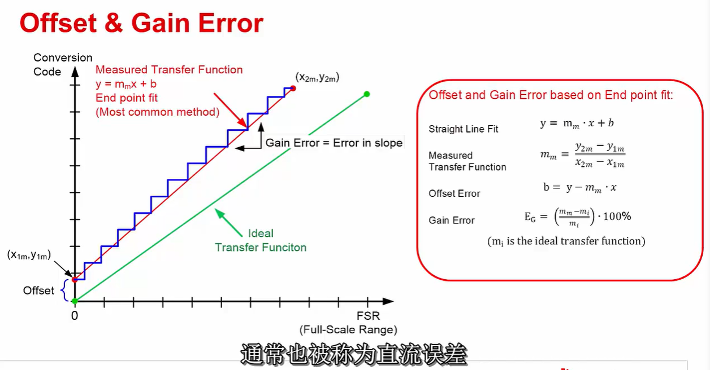
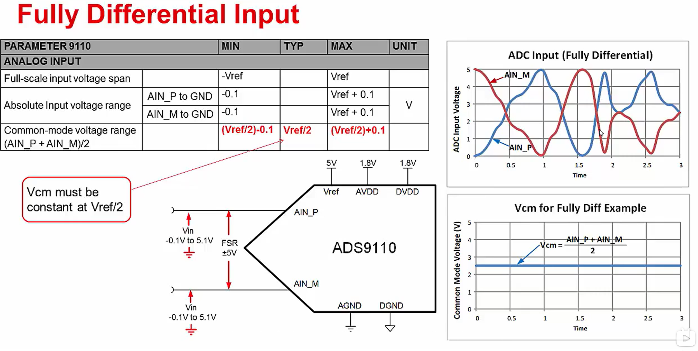

# DS详解ADC

模数转换器（ADC）是将连续的模拟信号（如电压、电流）转换为离散的数字信号（二进制码）的电子器件。它在数字系统中至关重要，因为现实世界的信息（声音、温度、光强、压力等）大多是模拟的，而处理器（如MCU、CPU）只能处理数字信息。

以下是ADC工作原理的详细解析，涵盖核心步骤、关键参数和常见类型：

## 一、 ADC转换的核心步骤

无论哪种类型的ADC，其转换过程都包含三个基本步骤：

1.  **采样 (Sampling):**
    *   **目的：** 在离散的时间点上“抓取”模拟信号的瞬时值。
    *   **原理：** 由采样时钟控制一个开关（通常由采样保持电路实现）。时钟信号到来时，开关闭合，让输入模拟信号通过并被“捕获”到一个电容器上；时钟信号结束时，开关断开，电容器保持住该时刻的电压值，直到下一次采样。
    *   **关键定理：奈奎斯特采样定理 (Nyquist-Shannon Sampling Theorem)**
        *   内容：为了能够无失真地重建原始模拟信号，采样频率 (`fs`) 必须**至少**是输入模拟信号最高频率分量 (`fmax`) 的**两倍**，即 `fs >= 2 * fmax`。
        *   意义：如果采样频率过低 (`fs < 2 * fmax`)，会发生**混叠 (Aliasing)**。高频信号会被错误地采样成低频信号，导致信息丢失和失真。在实际应用中，通常选择 `fs > 2 * fmax`（例如 2.5 到 5 倍）以提供余量，并使用**抗混叠滤波器 (Anti-Aliasing Filter)** 在采样前滤除高于 `fs/2` 的频率成分。

2.  **量化 (Quantization):**
    *   **目的：** 将采样得到的连续电压值映射到有限个离散的电平值上。
    *   **原理：**
        *   ADC有一个**满量程范围 (FSR - Full-Scale Range)**，即它能转换的最小输入电压 (`Vmin`, 通常是0V或负电压) 到最大输入电压 (`Vmax`) 的范围 (`FSR = Vmax - Vmin`)。
        *   这个范围被等分成 `2^N` 个**量化电平 (Quantization Levels)** 或**量化阶 (Quantization Steps)**，其中 `N` 是ADC的**分辨率 (Resolution)**, 单位是**位 (bits)**。
        *   **量化步长 (Quantization Step Size) / 最低有效位电压 (LSB - Least Significant Bit Voltage):** 这是相邻两个量化电平之间的电压差，是ADC能分辨的最小电压变化量。
            `LSB = FSR / (2^N)`
        *   每个采样点保持的电压值 (`Vsample`) 会被“四舍五入”到最接近的量化电平上。这个过程引入了不可避免的误差，称为**量化误差 (Quantization Error)**。
    *   **量化误差：**
        *   量化误差是采样电压与其对应的量化电平之间的差值。
        *   理想情况下，量化误差的范围是 `-LSB/2` 到 `+LSB/2`。
        *   它是ADC固有的非线性误差，限制了转换的精度和信噪比。提高分辨率 `N` 可以减小 LSB 和量化误差。

3.  **编码 (Encoding):**
    *   **目的：** 将量化后的离散电平值转换为对应的 `N` 位二进制数字代码。
    *   **原理：** 每个量化电平对应一个唯一的 `N` 位二进制数（码字）。
        *   最常见的是**自然二进制码 (Natural Binary Code)**。例如：
            *   最低量化电平 (接近 `Vmin`) -> `000...0`
            *   中间量化电平 (接近 `(Vmax + Vmin)/2`) -> `100...0`
            *   最高量化电平 (接近 `Vmax`) -> `111...1`
        *   其他编码方式如**二进制补码 (Two's Complement)**（用于有符号信号）有时也会使用。

## 二、 ADC的关键性能参数

1.  **分辨率 (Resolution - N bits):**
    *   表示ADC输出数字代码的位数 (`N`)。
    *   定义了量化电平的数量 (`2^N`)。
    *   决定了理论上ADC能分辨的最小电压变化 (`LSB`)。
    *   **常见值：** 8位、10位、12位、14位、16位、18位、24位等。位数越高，分辨率越高，理论上精度也越高。

2.  **采样率 (Sampling Rate - fs):**
    *   每秒进行采样（并完成转换）的次数，单位是**样本每秒 (Samples per second - SPS)** 或赫兹 (Hz)。
    *   决定了ADC能处理信号的最高频率（根据奈奎斯特定理，`fmax < fs/2`）。
    *   高速ADC可达 GSPS (Giga Samples Per Second) 级别。

3.  **量化误差 (Quantization Error):**
    *   如前所述，是采样值与量化值之间的固有误差，最大为 ±1/2 LSB。

4.  **微分非线性 (DNL - Differential Non-Linearity):**
    *   衡量ADC实际的量化步长与理想的1 LSB步长之间的偏差。
    *   理想情况下，相邻码字转换点之间的电压差应为1 LSB。
    *   DNL > 0 表示步长大于1 LSB，可能导致某些码字缺失（非单调性）。
    *   DNL < 0 表示步长小于1 LSB。
    *   通常用 LSB 为单位表示（如 ±0.5 LSB）。

5.  **积分非线性 (INL - Integral Non-Linearity):**
    *   衡量ADC实际的转换特性曲线与一条理想直线（通常连接零点和满量程点）之间的最大偏差。
    *   反映了整体转换的线性度。
    *   也通常用 LSB 为单位表示（如 ±2 LSB）。

6.  **偏移误差 (Offset Error):**
    *   实际转换特性曲线第一个码字转换点（例如从 0 到 1）的电压与理想转换点（通常是 `Vmin + 0.5 LSB`）之间的电压差。
    *   可以理解为整个曲线的水平平移。

7.  **增益误差 (Gain Error):**
    *   实际转换特性曲线最后一个码字转换点（例如从 `2^N-2` 到 `2^N-1`）的电压与理想转换点（通常是 `Vmax - 0.5 LSB`）之间的电压差，在消除了偏移误差后计算。
    *   可以理解为曲线斜率的偏差（水平轴固定）。

8.  **信噪比 (SNR - Signal-to-Noise Ratio):**
    *   在满量程正弦波输入下，输出信号有效值与所有噪声（包括量化噪声、热噪声等）有效值之比，通常用分贝 (dB) 表示。
    *   理想ADC的SNR主要由量化噪声决定：`SNR ≈ 6.02 * N + 1.76 dB`。实际ADC的SNR低于此值。（N为ADC位数，实际测量值通常低3-10dB）

9.  **有效位数 (ENOB - Effective Number of Bits):**
    *   根据实际测量的SNR计算出的ADC的有效分辨率。
    *   `ENOB = (SNR_measured - 1.76) / 6.02`
    *   综合考虑了量化噪声、热噪声、失真等所有非理想因素导致的性能下降，比标称分辨率更能反映实际精度。

10. **总谐波失真 (THD - Total Harmonic Distortion):**
    *   输出信号中谐波分量（频率为输入信号频率整数倍的分量）的总有效值与基波分量有效值之比，用dB表示。越低越好。

11. **无杂散动态范围 (SFDR - Spurious-Free Dynamic Range):**
    *   输出信号中基波分量有效值与最大杂散分量（可以是谐波或非谐波）有效值之比，用dB表示。衡量ADC在大信号存在时分辨小信号的能力。

12. **功耗 (Power Consumption):**
    *   非常重要的实际参数，尤其对便携式和嵌入式设备。

## 三、 常见的ADC类型及其工作原理

1.  **逐次逼近型ADC (SAR ADC - Successive Approximation Register ADC):**
    *   **原理：** 利用一个高速比较器和一个内部DAC（数模转换器），采用二分搜索法逐位确定数字码。
        1.  采样保持电路捕获输入电压 (`Vin`)。
        2.  置最高有效位 (MSB) 为 `1`，其余位为 `0`。内部DAC输出对应电压 (`Vdac = Vref/2`)。
        3.  比较器比较 `Vin` 和 `Vdac`：
            *   若 `Vin > Vdac`, 则保留MSB为 `1`。
            *   若 `Vin < Vdac`, 则置MSB为 `0`。
        4.  置下一位为 `1`，根据上一步结果更新DAC输出（例如，如果MSB保留`1`，则 `Vdac = 3Vref/4`；如果MSB置`0`，则 `Vdac = Vref/4`）。
        5.  再次比较 `Vin` 和 `Vdac`，确定该位的值。
        6.  重复步骤4-5，直到确定最低有效位 (LSB)。
    *   **特点：** 中等速度（kSPS 到 MSPS）、中等分辨率（8-18位）、功耗和尺寸适中、易于集成。**最常见**的ADC类型之一。

2.  **Σ-Δ型ADC (Sigma-Delta ADC / Delta-Sigma ADC / Oversampling ADC):**
    *   **原理：** 基于过采样、噪声整形和数字滤波。
        1.  **过采样 (Oversampling):** 以远高于奈奎斯特频率（通常高几十到几百倍）的速率采样输入信号。
        2.  **Σ-Δ调制器 (Modulator):** 核心是一个积分器和比较器构成的反馈回路。
            *   积分器累加输入信号 (`Vin`) 与1位DAC反馈信号 (`Vfb`) 的差值。
            *   比较器将积分器输出量化为1位（`1` 或 `0`）数据流。
            *   1位DAC根据比较器输出产生 `Vfb`（通常是 `+Vref` 或 `-Vref`）。
            *   该1位数据流的平均值代表 `Vin`。**噪声整形**特性将大部分量化噪声推向高频区域。
        3.  **数字抽取滤波器 (Decimation Filter):** 对高速1位数据流进行低通滤波（去除高频噪声）和降采样（降低数据速率），输出高分辨率（如16、24位）的多位数字码。
    *   **特点：** **非常高分辨率**（16-24+位）、**高精度**、低中速（SPS 到 kSPS）、**抗噪能力强**、需要复杂数字滤波器。广泛用于音频、传感器测量（温度、压力、称重）等需要高精度的场合。

3.  **流水线型ADC (Pipeline ADC):**
    *   **原理：** 将转换过程分成多个级联的流水线级（Stage），每级处理几位。
        1.  每级包含一个子ADC（通常是低分辨率的Flash ADC）、一个子DAC和一个减法器/放大器（残差放大器）。
        2.  第一级对输入电压 (`Vin`) 采样，子ADC进行粗量化（如3位）。
        3.  子DAC将粗量化的结果转换回模拟电压。
        4.  减法器计算输入电压与子DAC输出的差值（称为**残差电压**）。
        5.  残差放大器将残差电压放大（通常放大 `2^M` 倍，`M` 是该级处理的位数）。
        6.  放大后的残差电压送到下一级进行更精细的量化。
        7.  各级同时工作（流水线并行）。第一级处理新样本时，第二级处理上一个样本的残差，以此类推。最终通过数字误差校正逻辑组合各级的输出得到完整的高分辨率数字码。
    *   **特点：** **高速**（MSPS 到 GSPS）、中等分辨率（8-14位）、功耗相对较高、结构复杂。常用于通信、视频采集等高速领域。

4.  **闪存型ADC (Flash ADC / Parallel ADC):**
    *   **原理：** 速度最快的ADC类型，通过大量比较器并行工作实现一次转换。
        1.  使用 `2^N - 1` 个比较器（对于 `N` 位分辨率）。
        2.  输入电压 (`Vin`) 同时连接到所有比较器的同相输入端。
        3.  每个比较器的反相输入端连接到一个由电阻分压网络产生的、间隔为 `1 LSB` 的参考电压（例如，第一个比较器连 `Vref/8`，第二个连 `2Vref/8`，...，第七个连 `7Vref/8` 对于3位ADC）。
        4.  所有比较器同时比较 `Vin` 和各自的参考电压。`Vin` 大于参考电压的比较器输出 `1`，否则输出 `0`。
        5.  比较器输出的 `2^N - 1` 位“温度计码”通过一个**优先编码器 (Priority Encoder)** 转换为 `N` 位二进制码。
    *   **特点：** **超高速**（GSPS 级别）、**低分辨率**（通常 ≤ 8位）、**功耗巨大**、**芯片面积大**（所需比较器数量随位数指数增长）。用于超高速应用如示波器、雷达、高速数据采集卡。

5.  **双积分型ADC (Dual-Slope / Multi-Slope Integrating ADC):**
    *   **原理：** 基于对输入电压和参考电压在固定时间内进行积分并测量积分时间。
        1.  **固定时间正向积分：** 开关将未知输入电压 (`Vin`) 连接到积分器输入端，积分器在固定时间 `T1` 内对 `Vin` 积分，输出电压线性上升至 `Vint` (`Vint ∝ Vin * T1`)。
        2.  **反向积分至零：** 开关切换到已知的相反极性的参考电压 (`-Vref`)。积分器开始反向积分（放电），同时计数器开始计数。
        3.  **测量时间：** 当积分器输出电压回到零时，比较器翻转，停止计数。计数器的计数值 `T2` 与 `Vint` 成正比，因此也与 `Vin` 成正比 (`Vin ∝ Vref * (T2 / T1)`)。
    *   **特点：** **高精度**、**高抗噪性**（尤其对工频干扰）、**速度慢**、**分辨率高**（容易做到16位以上）、对外部元件（积分电容、参考源）精度要求高。常用于数字万用表 (DMM)、精密测量仪器。

## 四、 ADC选型考虑因素

选择ADC时需权衡以下因素：
*   **所需分辨率 (N bits)**
*   **所需采样率 (fs)**
*   **输入信号带宽 / 最高频率 (fmax)**
*   **精度要求 (INL, DNL, Offset, Gain Error, ENOB)**
*   **动态性能要求 (SNR, THD, SFDR)** - 尤其对音频、通信应用
*   **输入电压范围 (FSR)**
*   **输入阻抗**
*   **功耗限制**
*   **成本**
*   **接口类型 (并行, SPI, I2C, JESD204B等)**
*   **集成度 (是否需要集成PGA, MUX, 参考源等)**

## 总结

ADC是现代数字系统的关键接口，其核心任务是将连续变化的模拟世界信息转换为计算机可处理的离散数字信息。理解采样、量化、编码三个基本步骤，以及分辨率、采样率、量化误差、非线性度、动态性能等关键参数，是掌握ADC原理和应用的基础。不同类型的ADC（如SAR, Σ-Δ, 流水线, 闪存, 双积分）各有其独特的优缺点和适用场景，工程师需要根据具体的应用需求（速度、精度、功耗、成本）做出最合适的选择。

# 直流参数

## 输入电容

SAR型ADC的输入采样保持电容通常在规格书中会给出，这里展示的是ADS9110的例子。当进行采样时，输入电容为60pF，当处于保持模式时，输入电容为4pF。左图展示了SAR型ADC的简化模型，以便我们理解什么是采样模式和保持模式。在保持模式下，输入电容等于输入二极管结构的寄生电容，通常为4pF。右图展示了一个更加详尽的输入结构。包括了输入二极管，电阻，电容，和开关。

## 输入漏电流

流入流出ADC输入端的直流电流，这个电流由期间内部ESD保护和其他寄生参数引入。在进行建模分析时，可以把他看成一个直流电流源加载到ADC的两个输入端口。通常是$uA$和$nA$级。输入漏电流类似于运放的输入偏置电流，需要注意的时电流的流向可以是任意方向的。这里的一个例子展示了漏电流时如何流进各个阻抗形成误差电压的，可以看出在这个例子中，每个输入端口均引入了一个$10uV$的误差电压。相应的输入端的漏电流为1$uA$。但是一般而言，它的大小和和极性可能是不同的，这个取决于不同的器件。通常，规格书中给出的时典型值。但是实际中要比给出的值大很多。一般对于最大值的估计我们可以使用3倍的标准差来计算。

## 输入阻抗

很多情况下，数据转换器的输入阻抗是一个动态阻抗。动态阻抗是由输入漏电流和输入电容开关充放电的结果。然而一些数据转换器中有一个固定阻抗增益放大器，放大器的固定输入阻抗来自于器增益设置电阻，输入阻抗可以用于计算输入漏电流。  当输入漏电流流经电阻时会产生误差。这里给出的是ADS8681的例子。当输入10V信号时，计算输出漏电流的计算结果。这里在这个例子中，1000ohm的阻抗也会产生增益误差。因此为了减小误差，建议尽可能降低前端阻抗。

## 参考电压范围

大多数规格书中将它定义为一个特定的参考电压值。通常这个电压作为此转换器最常用的参考电压。在参考输入电压范围内使用任何其他参考电压值，器件的性能与指定的电压值是相同的。在某些情况下，数据表中的曲线可以更换的说明参数是如何受不同参考电压影响的。这里给出了ADS9110的一个例子，在这个数据表中给出了2.5V~5V这个指定的参考范围。在数据表的上面指出的所有参数都是在参考电压为5V的情况下测得的。这里呈现了几组曲线可以让我们更好地了解不同参考电压是如何影响器件的关键参数的。

## 参考电流

SAR型ADC的输入参考段连接到了一组开关电容上。在转换周期时，开关电容连接到了比较电路与参考电压比较进行快速充放电。对于转换周期中，输入参考电流最大的值，最为内部电容充电的起始位。这个表展示的时ADS8881的例子，可以看出在整个转换周期中它的典型电流值是$300uA$。这里的典型值指的是平均电流，因为实际最大电流值可达到$10mA$。同时还需要注意的是加入整个转换周期为100ns，可能到达峰值之前的时间就有十几ns。一般情况下我们会在输入电容端放置一个较大的滤波电容，以来满足电流的快速瞬态响应。同时参考段也会提供一个平均电流来补充电容器之间的快速变化。一般情况下瞬变的时间相对较短，所以在ADC的参考端会需要一个叫跨你的宽带缓冲区。一般的规格书中还会提供参考输入端的解耦电容器。

## 差分非线性

差分非线性使用案例测量实际代码宽度和理想宽度之间的差值，从下图红圈中可以看出，一些代码的宽度要比理想宽度长或者短。同时下图左侧公式为差分非线性的计算公式。这个计算公式是一个相对误差计算公式。

在某些情况下，当动态非线性很大时，会导致完全跳过代码的转化，如下图所示，通常称为缺失代码。缺失代码时很多电子系统中非常严重的问题。因此，现在大多数的ADC都会设计和测试这个参数以保证他不会有这个问题。在实际应用中，规格书通常会提供一个无缺失代码，以说明这颗器件不会丢失代码。

可以通过查阅以下参数确定ADC的差分非线性。

## 积分非线性

积分非线性时用来测量ADC传递函数与拟合直线的比较。为了消除增益和偏移误差，我们通常将实际ADC传递函数的两个端点进行拟合，在这个例子中，绿色的线就表示拟合直线。对于一个理想的线性ADC，它的拟合直线是处于传递函数的中间的，然而在这个情况下可以看出，被测的函数，即为蓝色这条线，它偏离了线性拟合，所以具有一个正的积分非线性。与差分非线性相同，积分非线性也可以表示在ADC的输出代码上，可以用LSB来表示，也可以用满量程的百分比来表示。

这里显示的是积分非线性在数据表中的示例以及它典型的积分非线性图。在数据表中可以看出ADS9110它的积分非线性均小于$\pm1.5$个LSB。下面的图表示的是ADS9110的积分非线性与输出代码的一个典型非线性图。它是以LSB为单位进行表示的。

# 直流参数(Offset & Gain Error)&交流参数

## 失调误差(Offset Error)和增益误差(Gain Error)

失调误差和增益误差的基本计算方法如下图所示。AD转换是一个非线性的过程，在计算中最常用的就是线性端点的拟合。选择ADC的起始点和终止点拟合参数，拟合曲线为$y=m_mx+b$。斜率可以通过任意两点的坐标确定。失调误差就是当$x=0$时，$y$轴的截距。增益误差时理论斜率和实际斜率的差值百分比。失调误差和增益误差通常也被称为直流误差。

## 失调电压受电源电压和共模电压的影响

## 共模抑制比(CMRR)

**共模输入电压**：两个输入端的平均值。

**共模噪声：** 同时出现在信号线（正端和负端）与系统地线（GND）之间的、幅度和相位相同的干扰电压。常见来源包括：

- 50/60 Hz 工频干扰（来自电源线）
- 电磁干扰（EMI）
- 接地环路中的电势差

**共模抑制比(CMRR)定义：**

- CMRR 衡量 ADC 抑制同时作用于其**两个差分输入端（IN+, IN-）** 的**相同信号（共模信号）** 的能力。
- 它表示 ADC 对**差分输入信号**的增益（Ad）与对**共模输入信号**的增益（Acm）之比的绝对值，通常用**分贝（dB）** 表示。
- **公式：**
  `CMRR (dB) = 20 * log₁₀(| Ad / Acm |)`
  - 其中：
    - `Ad` = 差分电压增益（理想情况下是ADC的传递函数增益，通常为1或一个系数）
    - `Acm` = 共模电压增益（理想情况下应为0）

**物理意义：**

- 一个具有高CMRR的ADC意味着，当共模噪声施加到两个输入端时，它对ADC输出码的影响非常小。
- **例如：** 一个ADC的CMRR为100 dB。
  - 如果在其输入端施加一个1V峰峰值的共模噪声信号（例如50Hz工频干扰），那么（在差分电压增益为1的理想条件下）该噪声在ADC输出端等效的**差分误差电压**仅为：
    `V_error_diff = V_cm / (10^(CMRR/20)) = 1V / (10^(100/20)) = 1V / 100,000 = 10 μV`
  - 这个10μV的等效差分误差电压会被ADC当作真实的输入信号进行转换，从而引入误差。

**为什么重要？**

- **抑制环境噪声：** 工业环境、医疗设备（ECG, EEG）、传感器远距离传输等场景普遍存在强共模噪声（尤其是工频干扰）。高CMRR是ADC在这些场景中精确工作的**必要条件**。
- **提高信噪比（SNR）：** 有效抑制共模噪声意味着输入信号中的有效差分信号成分更纯净，从而提高系统的整体SNR。
- **允许非理想接地：** 在高噪声或分布式系统中，系统地（GND）可能存在电位差。高CMRR允许ADC输入端相对于系统地有一定的共模电压范围（通常由参数 **`CMV` 或 `VCM`** 指定），只要在这个范围内，ADC仍能准确测量差分信号。

**影响因素：**

- **ADC前端设计：** 这是最关键的因素。采用**精密仪表放大器（INA）** 作为输入缓冲的ADC通常具有非常高的CMRR（>100 dB），因为INA的核心设计目标就是高CMRR。差分采样结构的设计对称性也直接影响CMRR。
- **外部电路匹配：** ADC外部连接到IN+和IN-的电阻、电容等元件的不匹配会**严重劣化**整体的系统CMRR。即使ADC本身的CMRR很高，外部电路的不匹配也会引入共模到差模的转换。
- **频率：** CMRR **不是**一个恒定值，它会**随着频率的增加而下降**。数据手册通常会提供CMRR随频率变化的曲线图。在高频时抑制共模噪声的能力会减弱。
- **共模电压范围：** CMRR通常在指定的共模电压范围内得到保证。接近该范围的极限时，CMRR可能会下降。

**数据手册中的体现：**

- 通常会在“电气特性”表中指定一个典型值（如最小值或典型值），单位是dB。
- 经常包含一幅图：`CMRR vs. Frequency`，展示CMRR随信号频率变化的趋势。

## 电源抑制比(PSRR)

**电源噪声：** 来自为ADC供电的电源轨（如VDD, AVDD, VREF）上的纹波、尖峰或漂移。常见来源包括：

- 开关电源的开关噪声
- 负载电流变化引起的电压波动
- 其他数字电路通过电源耦合的噪声

**电源抑制比(PSRR)定义：**

- PSRR 衡量 ADC 抑制其**供电电源引脚（如 VDD, AVDD, VREF+）** 上电压变化（噪声或纹波）的能力。
- 它表示 ADC 对**差分输入信号**的增益（Ad）与对**电源电压变化**的增益（Aps）之比的绝对值，通常用**分贝（dB）** 表示。
- **公式：**
  `PSRR (dB) = 20 * log₁₀(| Ad / Aps |)`
  - 其中：
    - `Ad` = 差分电压增益
    - `Aps` = 电源电压变化到输出变化的增益（理想情况下应为0）
- **更直观的等效定义：**
  `PSRR (dB) = 20 * log₁₀(ΔV_supply / ΔV_in_equiv)`
  - 其中：
    - `ΔV_supply` = 电源引脚上的电压变化量（纹波幅度）。
    - `ΔV_in_equiv` = 该电源变化在ADC输入端**等效引入的差分误差电压**。这个误差电压会被ADC误认为是真实的输入信号。

**物理意义：**

- 一个具有高PSRR的ADC意味着，电源上的噪声或波动对ADC输出码的影响非常小。
- **例如：** 一个ADC的PSRR为80 dB（在某个特定频率，如100kHz）。
  - 如果其电源引脚（如AVDD）上存在一个100mV峰峰值的开关噪声（100kHz）。
  - 那么该电源噪声在ADC输入端等效的**差分误差电压**为：
    `ΔV_in_equiv = ΔV_supply / (10^(PSRR/20)) = 100mV / (10^(80/20)) = 100mV / 10,000 = 10 μV`
  - 这个10μV的等效输入误差会叠加在真实信号上被转换，导致输出码的波动或偏移。

**为什么重要？**

- **抑制电源噪声：** 开关电源（SMPS）因其高效率被广泛使用，但其固有的开关纹波是ADC的主要噪声源之一。高PSRR能有效抑制这种纹波对转换精度的影响。
- **降低电源设计难度：** 高PSRR允许使用成本更低、噪声相对较高的电源（如未经严格滤波的SMPS），或者在同一个电源轨上放置更多的数字电路，而不会显著牺牲ADC的性能。
- **保证基准电压稳定性：** 对于使用外部基准电压源（VREF）的ADC，电源噪声耦合到基准源上会直接影响转换精度。高PSRR（特别是对VREF引脚）至关重要。
- **提高系统稳定性：** 减少电源噪声引起的输出波动，使系统更稳定可靠。

**影响因素：**

- **频率：** 这是**最显著**的影响因素。PSRR **随着频率的增加而急剧下降**。ADC可能在低频（DC或50/60Hz）有很高的PSRR（>100dB），但在开关电源的典型开关频率（如100kHz, 1MHz）时，PSRR可能下降到60dB甚至更低。数据手册必须提供PSRR的频率响应曲线。
- **电源引脚：** PSRR通常针对特定的电源引脚定义（如模拟电源AVDD、数字电源DVDD、基准源VREF）。不同引脚可能有不同的PSRR值。VREF引脚的PSRR通常要求最高。
- **ADC架构与内部设计：** 内部基准源电路、电源稳压器（LDO）、模拟电路（如运放、比较器）的PSRR、布局布线对称性等都会影响整体PSRR。Σ-Δ ADC通常因其过采样和数字滤波特性，在低频具有极高的PSRR。
- **旁路/去耦电容：** 尽管PSRR是ADC本身的特性，但**外部**在电源引脚到地之间正确放置高质量、低ESR/ESL的旁路电容（Bypass/Decoupling Capacitors）是**实现**高PSRR性能的**关键外部手段**。这些电容为高频噪声提供了低阻抗的本地回流路径，防止其进入ADC芯片内部。

**数据手册中的体现：**

- 通常会在“电气特性”表中指定一个或多个特定频率（如DC, 50/60Hz, 100kHz, 1MHz）下的值，单位是dB。
- **必定**包含一幅或多幅图：`PSRR vs. Frequency`，展示PSRR随电源噪声频率变化的曲线。这是选型时**必须仔细查看**的关键图表。曲线会清晰地显示在目标系统的电源噪声频率点上，ADC的PSRR表现如何。

## CMRR 与 PSRR 的对比总结

| 特性         | 共模抑制比 (CMRR)                        | 电源抑制比 (PSRR)                                      |
| :----------- | :--------------------------------------- | :----------------------------------------------------- |
| **抑制对象** | **差分输入端(IN+, IN-)**上的**相同信号** | **供电电源引脚(VDD, AVDD, VREF)**上的**电压变化/噪声** |
| **主要来源** | 工频干扰，EMI，地环路压差                | 开关电源纹波，负载瞬变，数字噪声耦合                   |
| **关键意义** | 在高噪声环境/非理想接地下的精确测量      | 容忍电源噪声，降低电源设计成本/复杂度                  |
| **单位**     | 分贝 (dB)                                | 分贝 (dB)                                              |
| **频率特性** | **随信号频率增加而下降**                 | **随噪声频率增加而急剧下降**(尤其重要)                 |
| **依赖外部** | 高度依赖**输入路径元件匹配**(电阻/电容)  | 高度依赖**电源引脚旁路电容**的设计与布局               |
| **数据手册** | 标称值 + `CMRR vs. Freq` 曲线            | 多频率点标称值 + **`PSRR vs. Freq` 曲线**(核心)        |
| **典型要求** | 精密测量(工业, 医疗)：>100 dB            | 使用SMPS时(100kHz-1MHz)：>60-80 dB较理想               |

## 信噪比(SNR)

信噪比是通过测量信号和噪声的电压值来确定的，通常也可以用分贝来表示。对于理想情况下，ADC的信噪比还可以通过第三个公式来计算。其中N是指ADC的位数。第三个公式只适用于只存在量化噪声这一种噪声源的理想ADC而言的。通常情况下我们计算出的信噪比都要比这个公式给出的值低很多。因为在实际中还存在其他的噪声源。

## 总谐波失真系数(THD)

**非线性度**：实际转换曲线与理想转换曲线的偏离程度

下图的例子中，实际转换曲线向左偏离了理想转换曲线，而且是非线性的。理想转换曲线是一条过零点的斜率为1的一条倾斜直线。而实际转换曲线斜率不唯一，导致输入输出之间产生了非线性。实际转换曲线下，输入输出的关系如右图所示。由图可知，输入电压较低时，输出与输入非常接近；但随着输入电压的增大，实际曲线逐渐偏离理想曲线，也就是说输入信号大时，实际的增益要比理想的大很多，这样就会把正弦波的上半周给拉长。**这种现象被称为谐波失真。**在频谱中会引入谐波。将时域信号经FFT得到频域信号可在频谱中观察谐波失真的效果。通常谐波是基波的整数倍。有时，区别奇次谐波和偶次谐波是非常重要的，因为不同的电流结构可能会产生不同的频率的谐波。如果数字信号能够无失真的还原输入信号，则不会有谐波产生。

### 计算公式

下图展示了THD(%)，THD(dB)，THD+N(dB)，SINAD(dB)信纳比的计算方式。

**信纳比(SINAD)**：是信噪比和失真的简写，等于THD+N的倒数。如果用dB作为单位表示的话，两者数字相同，符号不同。

信纳比和THD+N通常比信噪比和THD差。因为他们包括了两个噪声源。

# SAR ADC 输入结构

## 单端输入

单端输入的输入信号是相对于地来测量的。AD的正输入端连接到了待测信号，负输入端连接到了地。有的器件，地线和内部器件连接到了一起，只有一个输入端。需要注意的是，地线有非常严格的限制一般为$\pm100mV$。下方的这个波形展示了输入信号相对于地平面的计算公式。如果地上有一个小小的误差信号，它将会影响输入信号的大小。对于单端输入结构的ADC，它的输出代码是无符号的，因为它的所有输入信号都是正的。

## 伪差分输入

伪差分输入结构的输入信号是相对于满量程的一半来测量的。在这个例子中，满量程为$3V$，AD的负输入端连接到了满量程的一半，即$1.5V\pm100mV$，正输入端可以在负输入端的上下进行摆动，产生正负差分输入信号。这个例子中，当正输入端为3V时，差分输入电压为$3V-1.5V$，即$1.5V$。当正输入电压为0V时，差分输入电压为$0-1.5V$，即$-1.5V$。因此对于伪差分输入结构的ADC，它的输出数字代码是有符号的，因为它的所有输入信号存在正负两种情况。

## 全差分输入结构

**全差分输入结构是一种非常常见的结构，在精密SAR型ADC中应用很多**。需要注意的是共模电压是固定的，它等于满量程的一半。共模输入电压的精度是非常重要的一般允许误差范围是$\pm100mV$。对于全差分输入结构，可以看出信号总是关于共模电压对称的。在这个例子中，共模电压为$2.5V$，输出电压关于$2.5V$进行对称。后面我们会介绍如何使用运放将端端输入结构转化为差分输入结构。

## 真差分输入结构

真差分输入结构与全差分输入结构类似。最主要的区别在于真差分结构允许任意的共模电压范围，而全差分结构共模电压必须为满量程的一半。即两个输入电压是相互独立的，不需要两个输入信号关于共模电压对称。下图例子中使用的ADS8881是TI发布的第一颗真差分型ADC。

## SAR型ADC单极性(Unipolar)和双极性(Bipolar)的对比

单极性结构只允许正输入信号，而双极性允许正负两种输入。需要注意的是，这里的极性都是相对于地面来说的。

## SAR型ADC的内部结构

这里展示的是两种主要的输入阻抗结构，开关电容型和电阻型。

**开关电容型由开关和电容组成的采样保持电路构成**。一般情况下，采样和保持的时间非常短。这个例子中是300ns。所以需要一个外部的宽带放大器放置在输入端，以使输入信号在整个捕获周期内达到合适的精度。这个例子中使用的是一个20MHz的放大器。还需要注意的是这种结构的输入阻抗是RC构成的动态阻抗，而不是一个固定电阻。这种结构的ADC的输入范围等于参考电压。**运算放大器的选择和RC电路的设计是这类ADC使用时的一个难点。**我们将在单端驱动电路分析的章节讨论这个问题

**对于电阻型、高压型、PGA输入型ADC器件**。其内部集成了一个缓冲放大器或可编程放大器。通常来讲这个放大器应配置在差分结构中。使ADC的输入阻抗等于差分结构的输入电阻。这个例子中它的输入阻抗为$1M\Omega$。这种类型的输入结构比开关电容输入结构有一个非常重要的优点：**它内部集成了ADC驱动缓冲器，消除了对外部高速放大器的要求**。**另一个优点是输入范围可以大于参考电压**。此外这类结构的器件大多数将功能集中在了器件的内部，比如这个例子中集成了内部参考电压。

# 单端驱动电路分析

单端输入SAR型ADC的输入范围约束，有两个范围会经常看到。一个是满量程输入范围，另一个是绝对输入最大值。满量程范围和基准电压是相关的，对于ADS7042这颗器件。基准电压和AVDD是相同的，为3.3V。输入范围时正相端AIN_P减去负相端AIN_M，负相输入端的电压范围很窄，只有$\pm100mV$。改变负相输入端的电压，输入电压的范围会随之改变相应的值。所以对于这颗ADC来说，通常的输入范围是0~3.3V。绝对输入最大值代表的是可以加载到ADC输入端的最大电压以保证ADC不会被损坏。如果运放的供电电压超过了ADC的绝对输入最大值，是有可能损坏ADC的。

放大器的线性输出范围比ADC的满量程范围更窄，这会导致我们浪费了一些数据转换器的输入范围，如果要使用同样的放大器来实现满量程的ADC输入范围，可以调节放大器的供电电压来实现。例如将放大器的供电电压调整所谓-0.2V到3.5V，则放大器的线性输入范围变成-0.1V到3.4V。这个范围比ADC的量程稍宽一点，因此可以利用ADC的满量程。但是注意到改变放大器的供电电压不能超过ADC的绝对最大值。这里ADC的绝对最大值是-0.3V到3.6V，所以不会损坏ADC。

改变运放供电电压的方法可以解决范围的问题，但是需要增加额外的电源芯片，对于-0.2V这种不常规的电压，还需要额外的特殊器件。LM7795就是专门设计给这种应用场合的电荷泵用于产生小的负电压，由于是开关电容器件，所以需要考虑足够的滤波电容以降低噪声。

