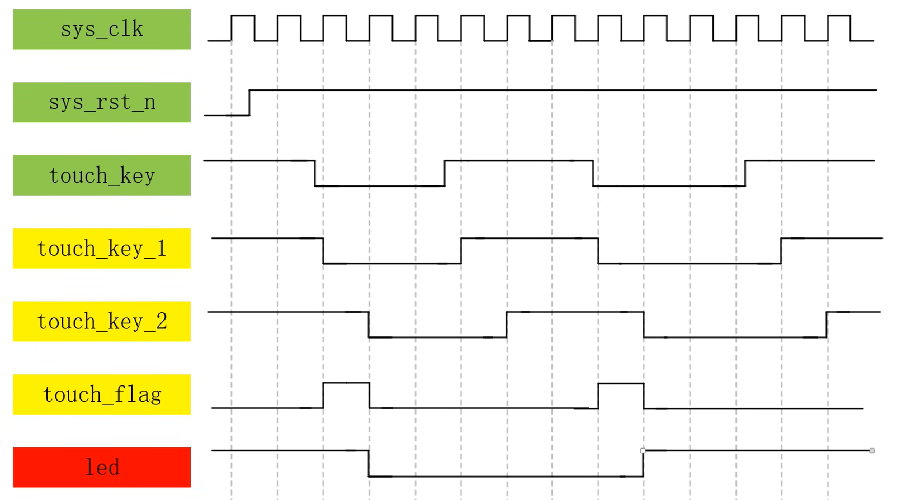

# 理解要点

**一个时钟周期各个数据只能变化一次，时钟周期是数据变化的最小时间单位。**

# 设计流程

1. 设计规划
   * 了解项目需求
   * 划分子功能模块
   * **确定各子功能模块的输入输出信号**
   * **确定各子功能模块之间的结构关系和信号传递**
2. 波形绘制
   * 具体了解子功能模块的模块功能
   * 绘制子功能模块的模块框图
   * **搞清楚如何通过输入信号得到我们想要的输出信号**
   * **绘制出功能实现的时序波形图**
3. 代码编写
4. 代码编译
5. 逻辑仿真
6. 波形对比
7. 绑定管脚
8. 分析综合，布局布线
9. 上板验证

# 点亮LED灯

led模块

```verilog
module  led
(
    input wire key_in,
    output wire led_out
);

assign led_out = key_in;

endmodule
```

仿真模块

```verilog
`timescale 1ns/1ns
module tb_led();

// wire  define
wire led_out;

// reg  define
reg key_in;


// 初始化输入信号
initial key_in <= 1'b0;

// kye_in:产生输入随机数，模拟按键的输入情况
always #10 key_in <= ($random) % 2;

// led模块实例化
led led_inst
(
    .key_in (key_in),   //input key_in
    .led_out(led_out)   //output led_out
);

endmodule
```

# 简单组合逻辑——多路选择器

使用 verilog 完成一个2路选择器

**mux2_1.v**

```verilog
module mux2_1(
    input wire in_1,    // input_1
    input wire in_2,    // input_2
    input wire sel,     // select_signal

    output reg out      // output
);
// 第一种实现方式, if-else
always @(sel, in_1, in_2) begin
    if (sel == 1'b1) begin
        out = in_1;
    end
    else begin
        out = in_2;
    end
end
// 第二种实现方式, case
always @(*) begin
    case(sel)
        1'b1 :
            out = in_1;
        1'b0 :
            out = in_2;
        default :
            out = in_1;
    endcase
end
// 第三种实现方式, 三元运算符 ? :
assign out = (sel == 1'b1) ? in_1 : in_2;

endmodule
```


**tb_mux2_1.v**

```verilog
`timescale 1ns/1ns

module tb_mux2_1();

reg in_1;
reg in_2;
reg sel;

wire out;

initial begin
    in_1 <= 1'b0;
    in_2 <= 1'b0;
    sel <= 1'b0;
end

always #10 in_1 <= {$random} % 2;
always #10 in_2 <= {$random} % 2;
always #10 sel <= {$random} % 2;

initial begin
    $timeformat(-9,0,"ns",6);
    $monitor("@time %t:in_1 = %b, in_2 = %b, sel = %b, out = %b", $time, in_1, in_2, sel, out);
end

mux2_1 mux2_1_inst(
    .in_1(in_1),   
    .in_2(in_2),
    .sel(sel),

    .out(out)
);

endmodule
```

# 简单组合逻辑——译码器

实现一个简单的三八译码器

**decoder.v**

```verilog
module decoder(
    input wire in_1,
    input wire in_2,
    input wire in_3,

    output reg [7:0] out
);

always @(*) begin
    case ({in_1, in_2, in_3}) 
        3'b000:
            out = 8'b0000_0001;
        3'b001:
            out = 8'b0000_0010;
        3'b010:
            out = 8'b0000_0100;
        3'b011:
            out = 8'b0000_1000;
        3'b100:
            out = 8'b0001_0000;
        3'b101:
            out = 8'b0010_0000;
        3'b110:
            out = 8'b0100_0000;
        3'b111:
            out = 8'b1000_0000;
        default:
            out = 8'b0000_0000;
    endcase
end

endmodule
```

**tb_decoder.v**

```verilog
`timescale 1ns/1ns

module tb_decoder ();

reg in_1;
reg in_2;
reg in_3;

wire [7:0] out;

initial begin
    in_1 <= 1'b0;
    in_2 <= 1'b0;
    in_3 <= 1'b0;
end

always #10 in_1 <= {$random} % 2;
always #10 in_2 <= {$random} % 2;
always #10 in_3 <= {$random} % 2;

initial begin
    $timeformat(-9, 0, "ns", 6);
    $monitor("@time %t: in_1 = %b, in_2 = %b, in_3 = %b, out = %b", $time, in_1, in_2, in_3, out);
end

decoder docoder_inst(
    .in_1(in_1),
    .in_2(in_2),
    .in_3(in_3),

    .out(out)
);

endmodule
```

# 简单组合逻辑——半加器

两个一位输入，产生结果位和进制位。

**half_adder.v**

```verilog
module half_adder (
    input wire in_1,
    input wire in_2,

    output wire sum,
    output wire count
);

assign {count, sum} = in_1 + in_2;
    
endmodule
```

**tb_half_adder.v**

```verilog
`timescale 1ns/1ns
module tb_half_adder ();

reg in_1;
reg in_2;

wire sum;
wire count;

initial begin
    in_1 <= 1'b0;
    in_2 <= 1'b0;
end

always #10 in_1 <= {$random} % 2;
always #10 in_2 <= {$random} % 2;

initial begin
    $timeformat(-9, 0, "ns", 6);
    $monitor("@time %t: in_1 = %b, in_2 = %b, sum = %b, count = %b.", $time, in_1, in_2, sum, count);
end

half_adder half_adder_inst (
    .in_1   (in_1),
    .in_2   (in_2),
    .sum    (sum),
    .count  (count)
);

endmodule
```

# 层次化设计

数字电路电根据模块层次不同有两种基本的结构设计方法：

* 自底向上(Bottom-Up)的设计方法
* 自顶向下(Top-Down)的设计方法。

# 避免latch产生

latch：锁存器。这是一种在异步电路系统中，对输入信号电平敏感的单元，用来存储信息。

锁存器在数据未锁存时，输入端的信号随输入端变化，就像信号通过一个缓冲器，一旦锁存信号有效，则数据被锁存输入信号不起作用。因此锁存器又称为透明锁存器，指的是不锁存时输出对于输入的信号是透明的。

异步电路：

​		异步电路主要是组合逻辑电路，用于产生FIFO或RAM的读写控制信号脉冲，但它同时也用在时序电路中，此时他没有统一的时钟，状态变化的时刻是不稳定的，通常输入信号只在处于稳点状态时才发生变化。

同步电路：

​		同步电路：同步电路是由时序电路(寄存器和各种触发器)和组合逻辑电路构成的电路，其所有操作都是在严格的时钟控制下完成的。这些时序电路共享同一个CLK，而所有的状态变化都是在时钟的上升沿（或下降沿）完成的。

​		**latch在异步电路中是十分有用的，而在同步电路中则会产生一些不好的效果。**

## latch在同步电路中的危害

* 对毛刺敏感
* 不能异步复位
* 复杂的静态时序分析
* 占用更多的逻辑资源
* 额外的延时

## 几种产生latch的情况

* 组合逻辑中的if-else条件分支语句缺少else语句
* 组合逻辑中case条件分支语句未完全列举，且缺少default语句
* 组合逻辑中输出变量赋值给自己

# 时序逻辑的开始——寄存器

寄存器具有存储功能，一般是由D触发器构成，由时钟脉冲控制，每个D触发器(D Flip Flop, DFF)能够存储一位二进制码。

D触发器的工作原理：在一个脉冲信号（一般为晶振产生的时钟脉冲）上升沿或者下降沿的作用下，将信号从输入端D送到输出端Q，如果时钟脉冲的边沿信号未出现，即使输入信号改变，输入信号仍然保持原值，且寄存器拥有复位清零的功能，其复位又分为同步复位和异步复位。

**同步复位**

* 复位信号来临时，等待时钟信号的下一个跳变沿（上升沿或者下降沿可自行选择），进行复位。
* 复位信号结束后，等待时钟信号的下一个跳变沿（上升沿或者下降沿可自行选择），恢复运行。

**异步复位**

* 复位信号来临时，立即复位。
* 复位信号结束后，等待时钟信号的下一个跳变沿（上升沿或者下降沿可自行选择），恢复运行。

**组合逻辑**

* 输入信号的毛刺将直接体现在输出信号中。
* 输入信号与输出信号在时间上是同步变化的。
  * 如果时钟和数据的时钟沿是对齐的，则默认当前时钟沿采集的到的数据，是当前时钟沿的输入数据的值。（有问题，怎么能采集时钟沿呢，尝试用无时序的逻辑电路去理解）

**时序逻辑**

* 能有效避免输入信号毛刺带来的干扰
  * 时序逻辑在时钟信号相邻的两个上升沿（或下降沿）对输入信号进行采样。这种特性使得某个时钟周期内的输出信号的值不变。若在单个时钟周期内输入信号出现信号毛刺，则这种毛刺不会对输出信号产生影响。
* 输出信号的变化会比输入信号的变化慢一个时钟周期
  * 如果时钟和数据的时钟沿是对齐的，则默认当前时钟沿采集到的输入数据，是当前时钟沿前一时刻的输入数据的值。
* 时序逻辑中赋值一定要使用非阻塞赋值。

## 代码实现

### 同步复位

```verilog
module flip_flop (
    input wire sys_clk, //50MHz
    input wire sys_rst_n,
    input wire key_in,

    output reg led_out 
); 

// 同步复位
always @(posedge sys_clk) begin
    if(sys_rst_n == 1'b0)
        led_out <= 1'b0;
    else
        led_out <= key_in;
end

endmodule
```

**result**


### 异步复位

```verilog
module flip_flop (
    input wire sys_clk, //50MHz
    input wire sys_rst_n,
    input wire key_in,

    output reg led_out 
); 

// 异步复位
always @(posedge sys_clk or negedge sys_rst_n) begin
    if(sys_rst_n == 1'b0)
        led_out <= 1'b0;
    else
        led_out <= key_in;
end

endmodule
```

**result**


## 结论

通过对比同步复位和异步复位的综合出的D触发器的RTL视图，可发现如果使用同步复位会比使用异步复位多出一个选择器的结构，这样会消耗更多的逻辑资源。

我们的FPGA芯片厂家Altera(已被Intel收购)推荐我们使用异步复位。

# 阻塞赋值和非阻塞赋值

## 阻塞赋值

​		阻塞赋值的赋值号用 “=” 表示，对应的电路结构往往与出发边沿没有关系，只与输入电平的变化有关系。它的操作可以认为是只有一个步骤的操作，即计算赋值号右边的语句并更新赋值号左边的语句，此时不允许有来自任何其他Verilog语句的干扰，知道现行的赋值完成，才允许下一条的赋值语句的执行。

​		串行块(begin-end)中，各条阻塞赋值语句将以它们在顺序块中的排列次序依次执行。

```verilog
// a = 1, b = 2, c = 3,
begin 
	a = b + 1;
    b = a + 2;
    c = a - 1;
end
```

以上述代码为例，begin-end块中的代码依次执行。此时其他语句不执行。

上述计算a, b, c的结果分别为3, 5, 4

## 非阻塞赋值

​		非阻塞赋值的赋值号用"<="表示，对应的电路结构往往与触发沿有关系，只有在作为触发沿的时刻才能进行非阻塞赋值。

​		它的操作可以看作是两个步骤的过程：在赋值开始时刻，计算赋值号右边的语句。在赋值结束时刻，更新赋值号左边的语句。

​		在计算非阻塞赋值语句赋值号右边的语句和更新赋值号左边的语句期间，允许其他的Verilog语句同时进行操作。

​		在begin-end串行块之间，多个非阻塞赋值语句是并行执行的。

​		非阻塞赋值只能用于对寄存器类型变量进行赋值，因此只能用于"initial"和"always"块中，不允许由于连续赋值"assign"。

```verilog
// a = 1, b = 2, c = 3
begin
    a <= b + 1;
    b <= a + 2;
    c <= a - 1;
end
```

上述计算a, b, c的结果分别为3, 3, 0

## 实验验证

### 阻塞赋值

**代码**

```verilog
module blocking (
    input wire sys_clk,
    input wire sys_rst_n,
    input wire [1:0] in,

    output reg [1:0] out

);

reg in_reg;

always @(posedge sys_clk or negedge sys_rst_n) begin
    if (sys_rst_n == 1'b0) begin
        in_reg = 2'b0;
        out = 2'b0;
    end
    else begin
        in_reg = in;
        out = in_reg;
    end
end

endmodule
```

**RTL综合结果**


**仿真波形**


中间变量`in_reg`在时钟变化时读到输入信号`in`的上一时刻的值，所以`in_reg`比`in`慢一个时钟周期。

而由于`out = in_reg`采用的是阻塞赋值，赋值过程中其他代码均被阻塞，所以`out`与`in_reg`同步变化。

猜想：由于阻塞赋值的过程中需要将其他代码进行阻塞，所以在高速时序逻辑电路中可能会出现问题。

### 非阻塞赋值

**代码**

```verilog
module blocking (
    input wire sys_clk,
    input wire sys_rst_n,
    input wire [1:0] in,

    output reg [1:0] out

);

reg [1:0] in_reg;

always @(posedge sys_clk or negedge sys_rst_n) begin
    if (sys_rst_n == 1'b0) begin
        in_reg <= 2'b0;
        out <= 2'b0;
    end
    else begin
        in_reg <= in;
        out <= in_reg;
    end
end

endmodule
```

**RTL综合效果**


**仿真波形**


中间变量`in_reg`在时钟跳变时读到输入信号`in`上一时刻的值，所以`in_reg`比`in`慢一个时钟周期。

而由于`out <= in_reg`采用的是非阻塞赋值，所以`out`会在下一个时钟周期完成变化为`in_reg`这一时钟周期的值。

理解：通过时钟的严格控制来使赋值这种行为变得可预测。不会在高速时序逻辑电路中出现难以预料的问题。

## 官方推荐

在设计组合逻辑电路时使用阻塞赋值，在设计时序逻辑电路时使用非阻塞赋值。

## 编写RTL代码时推荐的规范

* 编写**时序逻辑**时采用**非阻塞赋值**的方式
* 使用**always语句块**来编写**组合逻辑**时，要使用**阻塞赋值**的方式
  * **敏感列表**使用**电平触发**的方式
* **在一个always语句块中不要既使用阻塞赋值，又使用非阻塞赋值**
* **一个always语句块只对一个变量进行赋值，这样方便后期维护和修改**
* **不推荐使用锁存器**
  * 如果**非要使用锁存器**，请一定使用**非阻塞赋值**的方式
  * 使用非阻塞赋值实现时序逻辑，进而实现锁存器是最为安全的。

## 总结

要理解**赋值**和**采样**的**不同**，条件判断式中的条件相当于采样，即在时钟边沿条件变量的值被采样并与条件做对比，之所以条件中含有非阻塞变量时会延后一个周期，本质是被采样的reg变量在其他模块使用了非阻塞赋值，而非阻塞赋值完成有两个步骤，在某一个仿真节拍（不是一个仿真周期），被采样的还没有赋值完成（处在RHS的计算阶段），而采样时同时进行，这样，采样到的就是上一个周期的reg变量的值，虽然马上在边沿完成赋值，但采样已经结束，故在这个仿真周期结束时，被采样的完成赋值，但条件分支（含有被采样reg的判断表达式）下的变量赋值在下一个周期得到目标值，故而表现为相对被采样的变量的赋值，延后一个周期完成赋值。

同理，条件分支下含有多条非阻塞赋值语句时，理解也是一样：在同一个仿真节拍（RHS的计算），下一条非阻塞赋值的变量non2的右端得得到的是上一周期的前一非阻塞赋值的reg的值（non1），而在第二仿真节拍（赋值），non2和non1得到的值就不是一样的，故non2会表现的延后一个周期。

-->总结：非阻塞赋值延后一个周期3种情况

1、条件分支中变量（不管是外部输入还是本模块的非阻塞reg型）的边沿对齐时钟边沿时，采样采的是上一周期的值（历史值），故分支内的非阻塞赋值会延后一个周期。

2、凡是出现在同步时序always块中，条件分支中出现非阻塞变量或者与时钟边沿对齐的情况，采用非阻塞赋值会使变量赋值延后一个周期。

3、多条非阻塞赋值语句；

**参考博客：**https://blog.csdn.net/huigeyu/article/details/93741425

# 计数器

计数是一种最简单的基本运算，计数器就是实现这种运算的逻辑电路，计数器在数字系统中主要是对脉冲的个数进行计数，以实现测量、计数和控制的功能，同时兼有分频功能。

计数器在数字系统中应用广泛，如电子计算机的控制器中队指令地址进行计数，以便顺序取出下一条指令，在运算器中做乘法、除法运算时记下加法、减法次数，又如在数字仪器中对脉冲的计数等等。

## 直接实现计数器

**代码**

```verilog
module counter #(
    parameter CNT_MAX = 25'd24_999_999
) (
    input wire sys_clk,
    input wire sys_rst_n,

    output reg led_out
);
reg [24:0] cnt;

always @(posedge sys_clk or negedge sys_rst_n) begin
    if (sys_rst_n == 1'b0)
        cnt <= 25'd0;
    else if (cnt == CNT_MAX)
        cnt <= 25'd0;
    else
        cnt <= cnt + 25'd1;
end

always @(posedge sys_clk or negedge sys_rst_n) begin
    if (sys_rst_n == 1'b0)
        led_out <= 1'b1;
    else if (cnt == CNT_MAX)
        led_out <= ~led_out;
    else
        led_out <= led_out;
end

endmodule
```

**波形图**


## 引出脉冲标志信号实现计数器

**使用脉冲信号的好处**

* 可以使代码中if-else的条件更加清晰简洁
* 当在多处需要使用脉冲标志信号的地方，比全部写出逻辑关系更节省逻辑资源

脉冲标志信号在指示某些状态时是非常有用的，当以后在实现相对复杂的逻辑功能时。

**代码**

```verilog
module counter #(
    parameter CNT_MAX = 25'd24_999_999
) (
    input wire sys_clk,
    input wire sys_rst_n,

    output reg led_out
);
reg [24:0] cnt;
reg cnt_flag;

always @(posedge sys_clk or negedge sys_rst_n) begin
    if (sys_rst_n == 1'b0)
        cnt <= 1'b0;
    else if (cnt == CNT_MAX)
        cnt <= 1'b0;
    else
        cnt <= cnt + 25'd1;
end

always @(posedge sys_clk or negedge sys_rst_n) begin
    if (sys_rst_n == 1'b0)
        cnt_flag <= 1'b0;
    else if (cnt == CNT_MAX - 25'd1)
        cnt_flag <= 1'b1;
    else
        cnt_flag <= 1'b0;
end

always @(posedge sys_clk or negedge sys_rst_n) begin
    if (sys_rst_n == 1'b0)
        led_out <= 1'b1;
    else if (cnt_flag == 1'b1)
        led_out <= ~led_out;
    else
        led_out <= led_out;
end    

endmodule
```

**波形图**


# 分频器

时钟对于FPGA来说是非常重要的，但是板载晶振提供的时钟信号的频率对于FPGA来说是固定的。

分频器是数字系统设计中最常见的基本电路之一。所谓“分频”，就是把输入信号的频率变成成倍数地低于输入频率的输出信号。

分频器分为偶数分频器和奇数分频器，和计数器非常类似，有时候甚至可以说就是一个东西。

## 偶分频——以六分频为例

### Plan A——借鉴计数器闪灯的思想

**代码**

```verilog
module divider_six(
    input wire sys_clk,
    input wire sys_rst_n,

    output reg clk_out
);
parameter CNT_MAX = 2'd2;

reg [1:0] cnt;

always @(posedge sys_clk or negedge sys_rst_n) begin
    if (sys_rst_n == 1'b0)
        cnt <= 2'b0;
    else if (cnt == CNT_MAX)
        cnt <= 2'b0;
    else
        cnt <= cnt + 2'd1;  
end

always @(posedge sys_clk or negedge sys_rst_n) begin
    if (sys_rst_n == 1'b0)
        clk_out <= 1'b0;
    else if (cnt == CNT_MAX)
        clk_out <= ~clk_out;
    else
        clk_out <= clk_out;
end

endmodule
```

**上述代码存在的问题**

* 这种方法分频得到的时钟，表面上是对系统时钟进行了分频，产生了一个新的低频时钟，但实际上与真正的系统时钟还是有很大的区别的。
* 因为在FPGA中，凡是时钟信号都要连接到全局时钟网络，又称全局时钟树。它是FPGA厂商专为时钟路径而特殊设计的，它能够使时钟信号到达每个寄存器的时间都尽可能的相同，减少时序问题的产生。
* 而上述方式产生的低频信号并没有连接到全局时钟网络上。
* 但是外部晶振传入的时钟信号通过关键连接到了FPGA的专用时钟引脚上。自然就连接到了全局时钟网络上。
* 所以在系统时钟工作下的信号要比刚刚分频产生的时钟更容易在高速系统中保持稳定。

### 改进方法——Plan B——借鉴计数器的脉冲标志位的思想

可以考虑使用脉冲标志信号flag进行改进。

可以产生一个用于标记六分频的flag标志信号。这样每两个flag脉冲之间的频率就是对系统时钟的六分频。

**代码**

```verilog
module divider_six(
    input wire sys_clk,
    input wire sys_rst_n,

    output reg clk_flag
);
parameter CNT_MAX = 3'd5;

reg [2:0] cnt;

always @(posedge sys_clk or negedge sys_rst_n) begin
    if (sys_rst_n == 0)
        cnt <= 3'b0; 
    else if (cnt == CNT_MAX)
        cnt <= 0;
    else cnt <= cnt + 1'b1;
end

always @(posedge sys_clk or negedge sys_rst_n) begin
    if (sys_rst_n == 0)
        clk_flag <= 0;
    else if (cnt == CNT_MAX - 1'b1)
        clk_flag <= 1;
    else clk_flag <= 0;
end

endmodule
```

**波形图**


**改进之处**

两种分频方法在使用时有显著的区别。

Plan A 的使用：

```verilog
reg a;

always @(posedge clk_out or negedge sys_rst_n) begin
    if (sys_rst_n == 0)
        a <= 1'b0;
	else
        a <= a + 1'b1;
end
```

Plan B 的使用：

```verilog
always @(posedge sys_clk or negedge sys_rst_n) begin
    if (sys_rst_n == 1'b0)
        a <= 1'b0;
    else if (clk_flag == 1;b1)
        a <= a + 1'b1;
end
```

两种方法使用时的**显著区别**在于always语句中敏感列表的时钟信号的不同。

Plan A在使用时，敏感列表的时钟信号是`clk_out`。

Plan B在使用时，敏感列表的时钟信号是`sys_clk`。

`clk_out`是我们通过verilog语言分频实现的时钟，没有连接到全局时钟树，在高频电路中使用容易产生时序问题。

`sys_clk`是我们由晶振产生的系统时钟，连接在全局时钟树上，在高频电路中更容易保证时序的正确。

**所以在设计分频器时，推荐使用Plan B。**

## 奇分频——以五分频为例

### Plan A——采用或运算实现分频

**代码**

```verilog
/***********Plan A**********/
module divider_five(
    input wire sys_clk,
    input wire sys_rst_n,

    output wire clk_out
);
parameter CNT_MAX = 4;

reg [2:0] cnt;
reg clk_pos;
reg clk_neg;

always @(posedge sys_clk or negedge sys_rst_n) begin
    if (sys_rst_n == 1'b0)
        cnt <= 1'b0;
    else if (cnt == CNT_MAX)
        cnt <= 1'b0;
    else
        cnt <= cnt + 1'b1;
end

always @(posedge sys_clk or negedge sys_rst_n) begin
    if (sys_rst_n == 1'b0)
        clk_pos <= 1'b0;
    else
        case (cnt)
            3'd2: clk_pos <= 1'b1;
            3'd4: clk_pos <= 1'b0;
            default: clk_pos <= clk_pos;
        endcase
end

always @(negedge sys_clk or negedge sys_rst_n) begin
    if (sys_rst_n == 1'b0)
        clk_neg <= 1'b0;
    else
        case (cnt)
            3'd2: clk_neg <= 1'b1;
            3'd4: clk_neg <= 1'b0;
            default: clk_neg <= clk_neg;
        endcase
end

assign clk_out = (clk_neg | clk_pos);

endmodule
```

**波形图**


### Plan B——采用降频的手段

**代码**

```verilog
/**********Plan B************/
module divider_five(
    input wire sys_clk,
    input wire sys_rst_n,

    output reg clk_flag
);
parameter CNT_MAX = 4;

reg [2:0] cnt;

always @(posedge sys_clk or negedge sys_rst_n) begin
    if (sys_rst_n == 1'b0)
        cnt <= 3'b0;
    else if (cnt == CNT_MAX)
        cnt <= 3'b0;
    else
        cnt <= cnt + 3'd1;
end

always @(posedge sys_clk or negedge sys_rst_n) begin
    if (sys_rst_n == 1'b0)
        clk_flag <= 1'b0;
    else if (cnt == CNT_MAX - 3'b1)
        clk_flag <= 1'b1;
    else
        clk_flag <= 1'b0;
end

endmodule
```

**波形图**


# 按键消抖

常见的按键有自锁式按键和机械按键。

按键消抖主要针对的是机械弹性开关，当机械出点断开、闭合时，由于机械触点的弹性作用，一个按键开关在闭合时不会马上稳定地接通，在断开时也不会马上稳定的断开。


抖动时间的长短由按键的机械特性决定，一般为5ms~10ms。按键稳定闭合时间的长短则是由操作人员的按键动作决定的，一般为零点几秒至数秒。

按键抖动会引起一次按键被误读多次。为确保控制器对按键的一次闭合仅做一次处理，必须去除按键的抖动。在按键闭合稳定时读取按键的状态，并且必须判别到按键稳定释放再做处理。

## 硬件消抖

RS触发器或电容电路，详情可bing搜索。

## 软件消抖

**波形图**


**代码**

```verilog
module key_filter
#(
    parameter CNT_MAX = 20'd1_000_000
)
(
    input wire sys_clk,
    input wire sys_rst_n,
    input wire key_in,

    output reg key_flag
);
reg [19:0] cnt_20ms;

always @(posedge sys_clk or negedge sys_rst_n) begin
    if (sys_rst_n == 1'b0)
        cnt_20ms <= 20'b0;
    else if (key_in == 1'b1)
        cnt_20ms <= 20'd0;
    else if (cnt_20ms == CNT_MAX)
        cnt_20ms <= CNT_MAX;
    else
        cnt_20ms <= cnt_20ms + 20'd1;
end

always @(posedge sys_clk or negedge sys_rst_n) begin
    if (sys_rst_n == 1'b0)
        key_flag <= 1'b0;
    else if (cnt_20ms == CNT_MAX - 20'd1)
        key_flag <= 1'b1;
    else
        key_flag <= 1'b0;
end

endmodule
```

**仿真代码**

```verilog
module tb_key_filter();
reg sys_clk;
reg sys_rst_n;
reg key_in;
reg [7:0] tb_cnt;

wire key_flag;

initial begin
    sys_clk <= 1'b1;
    sys_rst_n <= 1'b0;
    #20 
    sys_rst_n <= 1'b1;
end

always #10 sys_clk = ~sys_clk;

always @(posedge sys_clk or negedge sys_rst_n) begin
    if (sys_rst_n == 1'b0)
        tb_cnt <= 8'b0;
    else if (tb_cnt == 8'd249)
        tb_cnt <= 8'd0;
    else
        tb_cnt <= tb_cnt + 1'd1;
end

always @(posedge sys_clk or negedge sys_rst_n) begin
    if (sys_rst_n == 0)
        key_in <= 1'b1;
    else if ((tb_cnt >= 8'd19 && tb_cnt <= 8'd49) || (tb_cnt >= 8'd149 && tb_cnt <= 8'd199))
        key_in <= {$random} % 2;
    else if (tb_cnt <= 8'd19 || tb_cnt >= 8'd199)
        key_in <= 1'b1;
    else
        key_in <= 1'b0;
end

key_filter #(
    .CNT_MAX   (20'd24)
)
key_filter_inst 
(
    .sys_clk   (sys_clk   ),
    .sys_rst_n (sys_rst_n ),
    .key_in    (key_in    ),
    .key_flag  (key_flag  )
);

endmodule
```

# 电容按键控制LED

控制目标：按一下点亮，按一下熄灭。

由于key和clk一起边沿会有亚稳态，所以touch_key_1和touch_key_2是通过电平检测差出边沿值的。



通过使用`touch_key_1`和`touch_key_2`两路信号进行组合逻辑产生`touch_flag`实现边沿检测。

**代码**

```verilog
module touch_key_ctrl_LED (
    input wire sys_clk,
    input wire sys_rst_n,
    input wire touch_key,
    
    output reg led
);
reg touch_key_1;
reg touch_key_2;
wire touch_flag;

always @(posedge sys_clk or negedge sys_rst_n) begin
    if (sys_rst_n == 1'b0) 
        touch_key_1 <= 1'b1;
    else
        touch_key_1 <= touch_key;
end

always @(posedge sys_clk or negedge sys_rst_n) begin
    if (sys_rst_n == 1'b0) 
        touch_key_2 <= 1'b1;
    else
        touch_key_2 <= touch_key_1;
end

// assign touch_flag = (touch_key_1 == 1'b0)&&(touch_key_2 == 1'b1);
assign touch_flag = (~touch_key_1) && (touch_key_2);

always @(posedge sys_clk or negedge sys_rst_n) begin
    if (sys_rst_n == 1'b0)
        led <= 1'b1;
    else if (touch_flag == 1'b1)
        led <= ~led;
    else
        led <= led;
end
    
endmodule
```

# 流水灯


# 状态机

状态机简写为FSM(Finite State Machine)，也称为**同步有限**状态机，我们一般简称为状态机。

同步：所有的状态跳转都是在时钟的作用下进行的。

有限：状态机中中天的个数是有限的。

状态机根据影响输出的原因分为两大类，即Moore型状态机和Mealy型状态机。
其共同点 是：状态的跳转都只和输入有关。区别主要是在输出的时候：若最后的输出只和当前状态有关而与输入无关则称为Moore型状态机；若最后的输出不仅和当前状态有关还和输入有关则称为Mealy型状态机。
状态机是时序逻辑电路中非常重要的一个应用，常在大型复杂的系统中使用较多。

## 状态机编码选取经验

| CPLD器件 |          |        |          | FPGA器件 |        |        |          |
| -------- | -------- | ------ | -------- | -------- | ------ | ------ | -------- |
| 低速系统 |          |        | 高速系统 | 低速系统 |        |        | 高速系统 |
| 状态个数 |          |        | 状态个数 | 状态个数 |        |        | 状态个数 |
| <4       | 4-24     | >24    | 所有状态 | <4       | 4-24   | >24    | 所有状态 |
| 独热码   | 二进制码 | 格雷码 | 独热码   | 二进制码 | 独热码 | 格雷码 | 独热码   |

## 编写代码思路

画出如下图的状态转移图。利用case语句和if-else语句描述不同输入条件下状态的转移和不同状态下不同输入条件下的输出。


# 静态数码管显示

[19. 数码管的静态显示 — [野火\]FPGA Verilog开发实战指南——基于Altera EP4CE10 征途Pro开发板 文档](https://doc.embedfire.com/fpga/altera/ep4ce10_pro/zh/latest/code/seg_static.html)

# 动态数码管显示

[20. 数码管的动态显示 — [野火\]FPGA Verilog开发实战指南——基于Altera EP4CE10 征途Pro开发板 文档](https://doc.embedfire.com/fpga/altera/ep4ce10_pro/zh/latest/code/seg_danamic.html)

# IP核

IP (Intellectual Property) 即知识产权。在半导体产一业将P核定义为“用千ASIC或FPGA中的预先设计好的电路功能模块”。简而言之，这里的IP即电路功能模块。

在数字电路中，将常用的且比较夏杂的功能模块设计成参数可修改的模块，让其他用户可以直接调用这些模块，这就是IP核。

常用的IP核如：FIFO，RAM，SDRAM ……

## IP核的存在形式

按照**产品交付方式**可分为软核、固核、硬核。

* HDL语言形式——软核（软IP）

  硬件描述语言；可进行参数调整，复用性强；布局、布线灵活；设计周期短，设计投入少

* 网表形式——固核

  完成了综合的功能块；可预布线特定信号或分配特定的布线资源。

* 版图形式——硬核

  硬核是完成提供设计的最终阶段产品——掩膜(Mask)；缺乏灵活性、可移植性差；更易于实现IP核的保护。

## IP核的缺点

* IP核往往不能跨平台使用
* IP核不透明，看不到内部核心代码
* 定制IP需额外收费

## Quartus II软件下IP核的调用

* Mega Wizard插件管理器
* SOPC构造器
* DSP构造器
* Qsys设计系统例化

## PLL IP核的调用

PLL (Phase Locked Loop, 即锁相环) 是最常用的IP核之一，通过锁相环可以对输入到FPGA的时钟信号进行任意分频、倍频、相位调整、占空比调整，从而输出一个期望时钟。

### **模拟锁相环与数字锁相环的比较**

| 特性             | 模拟锁相环（A-PLL）      | 数字锁相环（D-PLL）            |
| ---------------- | ------------------------ | ------------------------------ |
| **工作原理**     | 使用模拟电路进行反馈控制 | 使用数字信号处理进行反馈控制   |
| **响应速度**     | 快                       | 较慢                           |
| **精度与稳定性** | 受噪声、温度影响较大     | 精度高，稳定性好               |
| **集成度**       | 较低                     | 高                             |
| **适用领域**     | 模拟信号处理、频率合成等 | 数字通信、时钟恢复、频率合成等 |
| **实现难度**     | 较低                     | 较高                           |
| **抗干扰能力**   | 较差                     | 较强                           |

### **应用场景**

- **模拟锁相环**：通常用于传统的无线通信、频率合成、模拟调制解调等场合，特别适合需要快速响应且系统复杂度较低的场合。
- **数字锁相环**：主要应用于数字通信、数字频率合成、时钟恢复、数据同步等领域，适合现代数字系统，尤其是在对精度、稳定性要求较高的应用中。

## FIFO IP核的应用

​	FIFO (First In First Out, 即先入先出)，是一种数据缓冲器，用来实现数据先入先出的读写方式。

​	FIFO 存储器主要是作为缓存区使用，并主要应用在同步时钟系统和异步时钟系统中，在很多的设计中都会使用；如：多比特数据做跨时钟域处理，前后贷款不同步等都用到了FIFO。

​	FIFO 根据读写时钟是否相同，分为SCFIFO (同步FIFO) 和 DCFIFO (异步FIFO)。

# 串口UART简介

​	常用的低俗总线有三种：UART，SPI，I2C

​	通用异步收发传输器，英文全称Universal Asynchronous Receiver/Transmitter,  简称UART。
​	UART是一种通用的数据通信协议，也是异步串行通信口(串口)的总称，它在发送数据时将并行数据转换成串行数据来传输，在接收数据时将接收到的串行数据转换成并行数据。
​	包括RS232、RS499、RS423、RS422和RS485等接口标准规范和总线标准规范。
​	在目前的其它工业控制使用的串口通讯中，一般只使用RXD、TXD以及GND三条信号线，直接传输数据信号。而RTS、CTS、DSR、DTR及DCD信号都被裁剪掉了，如果您在前面被这些信号弄得晕头转向，那就直接忽略它们吧。

## RS232实现框图


## 数据接收思路

​	对于数据接收端rx，由于数据的变化和系统时钟是不同步的，所以需要通过`rx_reg <= rx;`的方式将数据存入`rx_reg`，从而完成数据变化与系统时钟边沿的同步，从而方便后续的处理。

​	使用寄存器同步之后，仍然会存在亚稳态的影响。


​	后续使用多级寄存器可以使得亚稳态的时间减小到一个时钟周期以内，从而使亚稳态对后续的影响可忽略不计。

​	单比特信号从低速时钟（域）到高速时钟（域）一般是打两拍（使用两级寄存器）进行亚稳态的消除。

​	单比特信号从高速时钟（域）到低速时钟（域）如果使用打拍的方式进行亚稳态的消除会出现数据的漏采。所以这种情况下往往使用脉冲同步的方式或握手信号的方式实现数据的同步。

​	多比特信号如果进行跨时钟域处理，一般需要进行格雷码的编码，然后进行打拍的处理。或使用FIFO、RAM来进行数据的同步。

参考博客：[【Chips】跨时钟域的亚稳态处理、为什么要打两拍不是打一拍、为什么打两拍能有效？_跨时钟域为什么打两拍-CSDN博客](https://blog.csdn.net/Hide_in_Code/article/details/126600563)

# I2C协议

I2C 通讯协议(Inter－Integrated Circuit)是由Philips公司开发的一种简单、双向二线制同步串行总线，只需要两根线即可在连接于总线上的器件之间传送信息。

## I2C物理层

I2C通讯设备之间的常用连接方式，具体见图 47‑1。

[](https://doc.embedfire.com/fpga/altera/ep4ce10_pro/zh/latest/_images/I2CEEP002.png)

图 47‑1 I2C通讯设备连接图

它的物理层有如下特点：

1. 它是一个支持多设备的总线。“总线”指多个设备共用的信号线。在一个I2C通讯总线中，可连接多个I2C通讯设备，支持多个通讯主机及多个通讯从机。
2. 一个I2C总线只使用两条总线线路，一条双向串行数据线(SDA) ，一条串行时钟线 (SCL)。数据线即用来表示数据，时钟线用于数据收发同步。
3. 每个连接到总线的设备都有一个独立的地址，主机可以利用这个地址进行不同设备之间的访问。
4. 总线通过上拉电阻接到电源。当I2C设备空闲时，会输出高阻态，而当所有设备都空闲，都输出高阻态时，由上拉电阻把总线拉成高电平。
5. 多个主机同时使用总线时，为了防止数据冲突，会利用仲裁方式决定由哪个设备占用总线。
6. 具有三种传输模式：标准模式传输速率为100kbit/s ，快速模式为400kbit/s ，高速模式下可达3.4Mbit/s，但目前大多I2C设备尚不支持高速模式。
7. 连接到相同总线的 IC 数量受到总线的最大电容 400pF 限制 。

## I2C协议层

在本小节中，我们对I2C协议的整体时序图、读写时序以及I2C设备的器件地址和存储地址做一下详细介绍。

### I2C整体时序图

I2C协议的整体时序图，具体见图 47‑2。

[](https://doc.embedfire.com/fpga/altera/ep4ce10_pro/zh/latest/_images/I2CEEP003.png)

图 47‑2 I2C协议整体时序图

由图可知，I2C协议整体时序图分为4个部分，图中标注的①②③④表示I2C协议的4个状态，分别为“总线空闲状态”、“起始信号”、“数据读/写状态”和“停止信号”，针对这4个状态，我们来做一下详细介绍。

1. 图中标注①表示“总线空闲状态”，在此状态下串口时钟信号SCL和串行数据信号SDA均保持高电平，此时无I2C设备工作。
2. 图中标注②表示“起始信号”，在I2C总线处于“空闲状态”时，SCL依旧保持高电平时， SDA 出现由高电平转为低电平的下降沿，产生一个起始信号，此时与总线相连的所有I2C设备在检测到起始信号后，均跳出空闲状态，等待控制字节的输入。
3. 图中标注③表示“数据读/写状态”，“数据读/写状态”时序图具体见图 47‑3。

[](https://doc.embedfire.com/fpga/altera/ep4ce10_pro/zh/latest/_images/I2CEEP004.png)

图 47‑3 数据读写时序图

I2C通讯设备的通讯模式是主从通讯模式，通讯双方有主从之分。

当主机向从机进行指令或数据的写入时，串行数据线SDA上的数据在串行时钟SCL为高电平时写入从机设备，每次只写入一位数据；串行数据线SDA中的数据在串行时钟SCL为低电平时进行数据更新，以保证在SCL为高电平时采集到SDA数据的稳定状态。

当一个完整字节的指令或数据传输完成，从机设备正确接收到指令或数据后，会通过拉低SDA为低电平，向主机设备发送单比特的应答信号，表示数据或指令写入成功。若从机正确应答，可以结束或开始下一字节数据或指令的传输，否则表明数据或指令写入失败，主机就可以决定是否放弃写入或者重新发起写入。

4. 图中标注④表示“停止信号”，完成数据读写后，串口时钟SCL保持高电平，当串口数据信号SDA产生一个由低电平转为高电平的上升沿时，产生一个停止信号，I2C总线跳转回“总线空闲状态”。

## I2C设备器件地址与存储地址

每个I2C设备在出厂前都被设置了器件地址，用户不可自主更改；器件地址一般位宽为7位，有的I2C设备的器件地址设置了全部位宽，例如后面章节要讲解的OV7725、OV5640摄像头；有的I2C设备的器件地址设置了部分位宽，例如本章节要使用的EEPROM存储芯片，它的器件地址只设置了高4位，剩下的低3位由 用户在设计硬件时自主设置。

FPGA开发板使用的是ATMEL公司生产的AT24C系列中的型号为AT24C64的EEPROM存储芯片。AT24C64存储容量为64Kbit，内部分成256页，每页32字节， 共有8192个字节，且其读写操作都是以字节为基本单位。 AT24C64 EEPROM存储芯片的器件地址包括厂商设置的高4位1010和用户需自主设置的低3位A0、A1、A2 。在硬件设计时，通过将芯片的A0、A1、A2这3个引脚分别连接到VCC或GND来实现器件地址低3位的设置，若3个引脚均连接到VCC，则设置后的器件地址为1010_111；若3个引脚均连接到GND，则设 置后的器件地址为1010_000。由于A0、A1、A2这3位只能组合出8种情况，所以一个主机最多只能连接8个AT24C64存储芯片。

在I2C主从设备通讯时，主机在发送了起始信号后，接着会向从机发送控制命令。控制命令长度为1个字节，它的高7位为上文讲解的I2C设备的器件地址，最低位为读写控制位。读写控制位为0时，表示主机要对从机进行数据写入操作；读写控制位为1时，表示主机要对从机进行数据读出操作。

## 基于I2C协议的EEPROM驱动控制


# 以太网

# 跨时钟域处理

多比特信号：异步FIFO

单比特信号：

* 高频采样低频：打两拍
* 低频采样高频：延长触发信号的保持时间为至少两个低频时钟周期


# 写代码思路

当使用always块对信号使用时序逻辑赋值时，建议遵守以下思路：

1. 从工作状态跳变到空闲状态的跳变（清零）逻辑赋值
2. 工作状态中的清零行为的赋值
3. 开始工作状态的赋值
4. 工作中状态的赋值
5. 非工作状态的赋值

Verilog语言中reg寄存器类型变量的两种应用思路

1. 变量不随时许改变，程序员有需要时自行改变。所以在大部分时间变量的内容是固定的，可以类似做储存某型内容的C语言变量用。
2. 变量随时许时刻变换，类似于数据流的概念。数据流往往内容庞大，FPGA若不使用内存则无法保存。此时往往按照时序将一个数据流截取出固定的小部分，使用reg储存成C变量的形式。此时reg变量功能与1相同。如网络传输中的目标IP地址、目标MAC地址等。而大部分数据流则被截取成数据流的形式，特点是一个时钟周期只能处理一个字节（或比特等固定长度单位）的数据，下一个时钟周期，这个数据将从FPGA中消失。