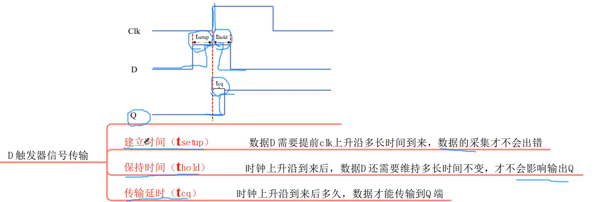
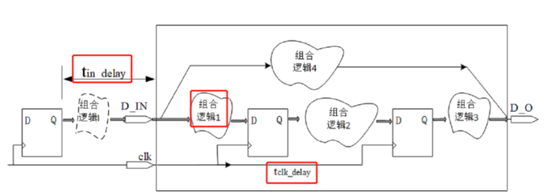

# 寄存器延迟

## D触发器信号传输为例，理解建立时间，保持时间，传输延迟的定义

建立时间($t_{setup}$)：数据D需要提前clk上升沿多长时间到来，数据的采集才不会出错

保持时间($t_{hold}$)：时钟上升沿到来后，数据D还需要维持多长时间不变，才不会影响输出Q

传输延迟($t_{cq}$)：时钟上升沿到来后多久，数据才能传输到Q端

## 以D触发器门级电路为例，理解建立时间，保持时间，传输延迟的由来及原因

D触发器的门级电路如上图所示。

当clk为低电平时，T1导通，T3关断，输入数据传输至M点。T4导通，形成锁存结构，维持输出数据Q不变。

当clk为高电平时，T2导通，形成锁存结构，锁存输入数据，M点数据保持不变。T3导通，M点数据输入到Q点

**建立时间($t_{setup}$)分析：**

clk上升沿到来前，输入数据必须送到P点（用于clk高电平时的锁存结构正常）。故clk上升沿到来前$t_{setup}$时间，输入数据必须送到D触发器输入端口（D点）。故

$t_{setup}=t_{I1}+t_{T1}+t_{I3}+t_{I2}$，即三个反相器和一个传输门的延时。

**保持时间($t_{hold}$)分析：**

clk上升沿到来后$t_{hold}$时间，T1门关断，D触发器进入锁存阶段。为保证正常锁存，则

$t_{hold}=t_{Iclk}+t_{T1close}-t_{I1}$

**传输时延($t_{cq}$)分析：**

clk上升沿到来，数据需经T3、I6传输到Q点。故

$t_{cq}=t_{T3}+t_{I6}$

# 建立时间、保持时间裕量分析

以两个D触发器中间放置一些组合逻辑电路为例

## 时钟无延迟

### 建立时间

建立时间的最大值是采样时钟上升沿前$t_{setupMax}$时间，数据相对于采样时钟上升沿保持不变的时间。

应是第一个D触发器的上升沿时间减去第二个D触发器上升沿的时间减去数据的延时。

故一个时钟周期内可用作建立时间的最大值为

$t_{setupMax}=t_{cycle}-t_{cq}-t_{logic}$

建立时间最小不应小于下一级D触发器所必须的建立时间$t_{setup}$

所以建立时间裕量为

$t_{setup\_slack}=t_{setupMax}-t_{setup}=t_{cycle}-t_{cq}-t_{logic}-t_{setup}$

### 保持时间

由于数据相对于采集端延迟的存在，采集端的信号延迟数据端$t_{cq}+t_{logic}$。即时钟上升沿到达采集端时，采集到的信号至少会保持$t_{cq}+t_{logic}$不变。

所以一个时钟周期内可用作保持时间的最大值为

$t_{holdMax}=t_{cq}+t_{logic}$

保持时间最小不应小于下一级D触发器所必须的保持时间$t_{hold}$

所以保持时间裕量为

$t_{hold\_slack}=t_{holdMax}-t_{hold}=t_{cq}+t_{logic}-t_{hold}$

## 时钟延迟——时钟正向延迟（重点）

### 建立时间

建立时间的最大值是采样时钟上升沿前$t_{setupMax}$时间，数据相对于采样时钟上升沿保持不变的时间。

应是第一个D触发器的上升沿时间减去第二个D触发器上升沿的时间减去数据的延时。

故一个时钟周期内可用作建立时间的最大值为

$t_{setupMax}=t_{cycle}+t_{clk\_delay}-t_{cq}-t_{logic}$

建立时间最小不应小于下一级D触发器所必须的建立时间$t_{setup}$

所以建立时间裕量为

$t_{setup\_slack}=t_{setupMax}-t_{setup}=t_{cycle}+t_{clk\_delay}-t_{cq}-t_{logic}-t_{setup}$

### 保持时间

由于数据相对于采集端延迟的存在，采集端的信号延迟数据端$t_{cq}+t_{logic}$。即时钟上升沿到达采集端时，由于时钟延时了$t_{clk\_delay}$到来，所以采集到的信号至少会保持$t_{cq}+t_{logic}-t_{clk\_delay}$不变。

所以一个时钟周期内可用作保持时间的最大值为

$t_{holdMax}=t_{cq}+t_{logic}-t_{clk\_delay}$

保持时间最小不应小于下一级D触发器所必须的保持时间$t_{hold}$

所以保持时间裕量为

$t_{hold\_slack}=t_{holdMax}-t_{hold}=t_{cq}+t_{logic}-t_{clk\_delay}-t_{hold}$

### 时钟存在抖动

时钟存在抖动，即时钟的上升沿存在$t_{jitter}$的不确定度。此时时钟的上升沿有可能在$t_{jitter}$的时间段内的某一时刻到来。所以建立时间裕量和保持时间裕量均应减去$t_{jitter}$。

所以建立时间裕量为

$t_{setup\_slack}=t_{setupMax}-t_{setup}=t_{cycle}+t_{clk\_delay}-t_{cq}-t_{logic}-t_{setup}-t_{jitter}$

保持时间裕量为

$t_{hold\_slack}=t_{holdMax}-t_{hold}=t_{cq}+t_{logic}-t_{clk\_delay}-t_{hold}-t_{jitter}$

在常见的低速情况下，抖动是可以忽略的，因为此时时钟的抖动很小，可以忽略不记。

## 时钟延迟——时钟正向延迟

时钟反向延迟可以认为看作是正向延迟了$-t_{clk\_delay}$，故

故一个时钟周期内可用作建立时间的最大值为

$t_{setupMax}=t_{cycle}-t_{clk\_delay}-t_{cq}-t_{logic}$

建立时间最小不应小于下一级D触发器所必须的建立时间$t_{setup}$

所以建立时间裕量为

$t_{setup\_slack}=t_{setupMax}-t_{setup}=t_{cycle}-t_{clk\_delay}-t_{cq}-t_{logic}-t_{setup}$

考虑时钟抖动，建立时间裕量为

$t_{setup\_slack}=t_{setupMax}-t_{setup}=t_{cycle}-t_{clk\_delay}-t_{cq}-t_{logic}-t_{setup}-t_{jitter}$

一个时钟周期内可用作保持时间的最大值为

$t_{holdMax}=t_{cq}+t_{logic}+t_{clk\_delay}$

保持时间最小不应小于下一级D触发器所必须的保持时间$t_{hold}$

所以保持时间裕量为

$t_{hold\_slack}=t_{holdMax}-t_{hold}=t_{cq}+t_{logic}+t_{clk\_delay}-t_{hold}$

考虑时钟抖动，保持时间裕量为

$t_{hold\_slack}=t_{holdMax}-t_{hold}=t_{cq}+t_{logic}+t_{clk\_delay}-t_{hold}-t_{jitter}$

# 基本同步时钟约束路径

根据建立时间裕量、保持时间裕量的分析，对FPGA的输入进行时序约束。

## 无输入输出时间延迟的数学模型

建立时间裕量，保持时间裕量分析

软件内部时序约束设置

## 仅输入时间延迟的数学模型

建立时间裕量，保持时间裕量分析

软件内部时序约束设置

## 仅输出时间延迟的数学模型

建立时间裕量，保持时间裕量分析

软件内部时序约束设置

## 输入、输出均有时间延迟的数学模型

建立时间裕量，保持时间裕量分析

软件内部时序约束设置

# 时序违例优化方法概述

