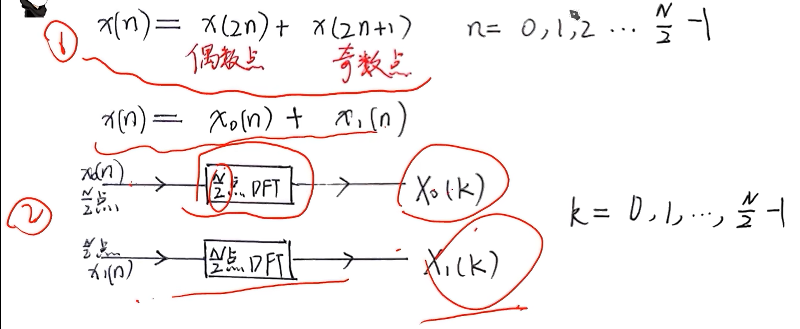
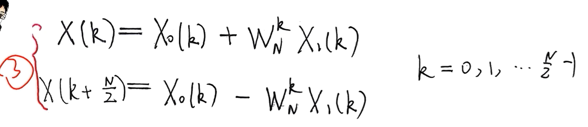
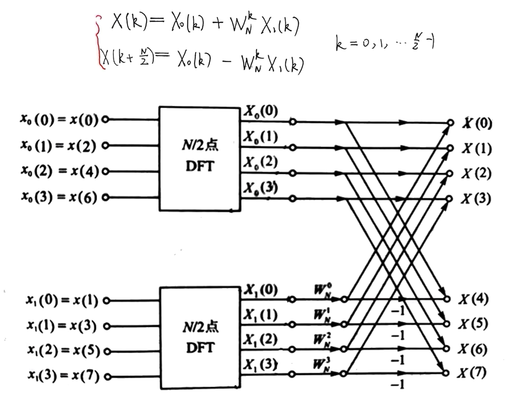
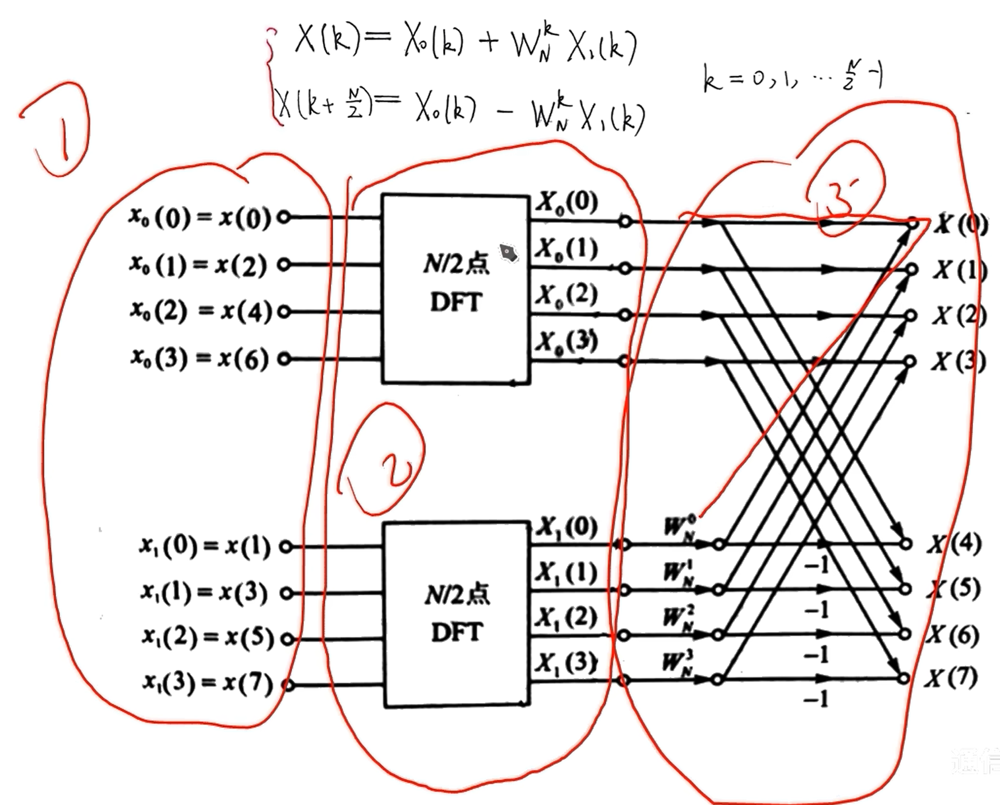
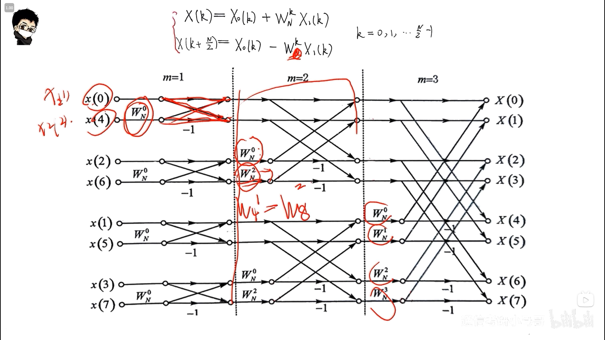

# 单光束三自由度FPGA程序

## 程序结构

1. MIPI的IP核接收相机数据
2. 对相机数据进行FFT
3. 根据FFT结果进行三点拟合，寻找峰值
4. 根据频率和组内的公式计算出对应的位移，俯仰角，偏摆角
5. 使用千兆以太网发送相机传输过来的数据。

## FFT代码问题整理

### FFT原理

[快速傅里叶变换(FFT)——有史以来最巧妙的算法？_哔哩哔哩_bilibili](https://www.bilibili.com/video/BV1za411F76U/?spm_id_from=333.337.search-card.all.click&vd_source=0c6e9aa27976c7e534f51b25bcdd53f0)

快速傅里叶变换


快速傅里叶逆变换


核心思想：

​	

1. 利用函数奇偶性，将$P(x)$这个函数分解成奇偶两部分。
2. 对$x$取$\pm$对，将方程组中所需要的的自变量$x$减少一半。出现递归中无法计算的问题
3. 为解决递归中无法计算的问题，使用复数。$x$使用1的n次单位复根。这样保证每次平方完，它们还是正负成对出现的。这个idea利用了单位复根的性质，是FFT的核心思想。
4. IFFT的算法与FFT一模一样，只是自变量$x$的取值需要变化一下。

思考

1. FFT如何在本例子中是将多项式表示方法中的系数表示转换成值表示的一种方法，又如何成为了DFT的一种快速运算方法？

   答：FFT的推导过程中，相当于在将问题转换为方程的表示形式下。将系数矩阵(范德蒙德矩阵)取一组特值，从而计算系数矩阵右乘自变量向量的运算结果。当这个系数矩阵写成DFT的系数矩阵的形式，即可用此方法(FFT)快速求解DFT。

### FFT步骤

[【数字信号处理考研】基2-DIT-FFT基于时间抽取的快速傅里叶变换算法-推导及蝶形图画法_哔哩哔哩_bilibili](https://www.bilibili.com/video/BV1re411D7X1/?spm_id_from=333.337.search-card.all.click&vd_source=0c6e9aa27976c7e534f51b25bcdd53f0)

#### 一次FFT步骤

对DFT拆分成奇偶两部分做一次FFT的步骤有如图所示以下3步。



以上三步可总结成如下的蝶形图的形式。





#### 逐次迭代




### DeepSeek FFT 代码

#### 设计概述

##### 关键特性
- 支持1024点FFT（可配置）
- 16位定点复数运算
- 全流水线架构，每时钟周期输出一个结果
- 支持连续数据流处理
- 可配置FFT/IFFT模式

##### 系统框图
```
        +----------------+       +------------+       +-----------------+
输入 --> | 数据重排       | ----> | 蝶形处理器 | ----> | 旋转因子乘法器 | --> 输出
        | (位反转)       |       | (多级)     |       +-----------------+
        +----------------+       +------------+             
                                 |        |
                                 |        v
                                 |   +-----------+
                                 +-- | 控制单元  | 
                                     +-----------+
```

#### Verilog实现

##### 顶层模块 (fft_top.v)
```verilog
module fft_top #(
    parameter N = 1024,            // FFT点数
    parameter LOGN = 10,           // log2(N)
    parameter DWIDTH = 16,         // 数据位宽
    parameter TWIDDLE_WIDTH = 16   // 旋转因子位宽
)(
    input wire clk,
    input wire reset,
    input wire start,
    input wire ifft_mode,          // 0=FFT, 1=IFFT
    input wire signed [DWIDTH-1:0] real_in,
    input wire signed [DWIDTH-1:0] imag_in,
    input wire valid_in,
    
    output wire signed [DWIDTH-1:0] real_out,
    output wire signed [DWIDTH-1:0] imag_out,
    output wire valid_out,
    output wire ready
);

    // 内部信号声明
    wire [LOGN-1:0] addr;
    wire signed [DWIDTH-1:0] br_real, br_imag;
    wire br_valid;
    wire signed [DWIDTH-1:0] bf_real, bf_imag;
    wire bf_valid;
    wire signed [TWIDDLE_WIDTH-1:0] tw_real, tw_imag;
    
    // 数据重排（位反转）
    bit_reversal #(.N(N), .LOGN(LOGN), .DWIDTH(DWIDTH)) u_bit_rev (
        .clk(clk),
        .reset(reset),
        .real_in(real_in),
        .imag_in(imag_in),
        .valid_in(valid_in),
        .real_out(br_real),
        .imag_out(br_imag),
        .valid_out(br_valid),
        .addr(addr)
    );
    
    // 蝶形处理器
    butterfly_processor #(.N(N), .LOGN(LOGN), .DWIDTH(DWIDTH)) u_bf_processor (
        .clk(clk),
        .reset(reset),
        .real_in(br_real),
        .imag_in(br_imag),
        .valid_in(br_valid),
        .real_out(bf_real),
        .imag_out(bf_imag),
        .valid_out(bf_valid),
        .addr(addr)
    );
    
    // 旋转因子乘法器
    twiddle_multiplier #(.DWIDTH(DWIDTH), .TWIDDLE_WIDTH(TWIDDLE_WIDTH)) u_tw_mult (
        .clk(clk),
        .reset(reset),
        .real_in(bf_real),
        .imag_in(bf_imag),
        .valid_in(bf_valid),
        .tw_real(tw_real),
        .tw_imag(tw_imag),
        .ifft_mode(ifft_mode),
        .real_out(real_out),
        .imag_out(imag_out),
        .valid_out(valid_out)
    );
    
    // 控制单元
    fft_control #(.N(N), .LOGN(LOGN)) u_control (
        .clk(clk),
        .reset(reset),
        .start(start),
        .valid_in(valid_in),
        .addr(addr),
        .tw_real(tw_real),
        .tw_imag(tw_imag),
        .ready(ready)
    );

endmodule
```

##### 位反转模块 (bit_reversal.v)
```verilog
module bit_reversal #(
    parameter N = 1024,
    parameter LOGN = 10,
    parameter DWIDTH = 16
)(
    input wire clk,
    input wire reset,
    input wire signed [DWIDTH-1:0] real_in,
    input wire signed [DWIDTH-1:0] imag_in,
    input wire valid_in,
    
    output reg signed [DWIDTH-1:0] real_out,
    output reg signed [DWIDTH-1:0] imag_out,
    output reg valid_out,
    output reg [LOGN-1:0] addr
);

    // 位反转函数
    function [LOGN-1:0] reverse_bits;
        input [LOGN-1:0] data;
        integer i;
        begin
            for(i = 0; i < LOGN; i = i+1)
                reverse_bits[i] = data[LOGN-1-i];
        end
    endfunction

    reg [LOGN-1:0] count = 0;
    reg [LOGN-1:0] rev_count;
    
    always @(posedge clk) begin
        if(reset) begin
            count <= 0;
            valid_out <= 0;
        end else if(valid_in) begin
            // 计算位反转地址
            rev_count = reverse_bits(count);
            
            // 输出位反转后的数据
            real_out <= real_in;
            imag_out <= imag_in;
            addr <= rev_count;
            valid_out <= 1;
            
            // 更新计数器
            count <= (count == N-1) ? 0 : count + 1;
        end else begin
            valid_out <= 0;
        end
    end

endmodule
```

##### 蝶形处理器 (butterfly_processor.v)
```verilog
module butterfly_processor #(
    parameter N = 1024,
    parameter LOGN = 10,
    parameter DWIDTH = 16
)(
    input wire clk,
    input wire reset,
    input wire signed [DWIDTH-1:0] real_in,
    input wire signed [DWIDTH-1:0] imag_in,
    input wire valid_in,
    input wire [LOGN-1:0] addr,
    
    output reg signed [DWIDTH-1:0] real_out,
    output reg signed [DWIDTH-1:0] imag_out,
    output reg valid_out
);

    // 蝶形运算寄存器组
    reg signed [DWIDTH-1:0] real_ram [0:N-1];
    reg signed [DWIDTH-1:0] imag_ram [0:N-1];
    
    // 流水线寄存器
    reg [LOGN-1:0] stage = 0;
    reg [LOGN-1:0] bf_count = 0;
    reg processing = 0;
    
    // 蝶形运算函数
    task butterfly;
        input signed [DWIDTH-1:0] a_real, a_imag;
        input signed [DWIDTH-1:0] b_real, b_imag;
        output signed [DWIDTH-1:0] A_real, A_imag;
        output signed [DWIDTH-1:0] B_real, B_imag;
        begin
            // A = a + b
            A_real = a_real + b_real;
            A_imag = a_imag + b_imag;
            
            // B = a - b
            B_real = a_real - b_real;
            B_imag = a_imag - b_imag;
        end
    endtask
    
    always @(posedge clk) begin
        if(reset) begin
            stage <= 0;
            bf_count <= 0;
            processing <= 0;
            valid_out <= 0;
        end else begin
            if(valid_in && !processing) begin
                // 初始数据写入
                real_ram[addr] <= real_in;
                imag_ram[addr] <= imag_in;
                
                if(addr == N-1) begin
                    processing <= 1;
                    stage <= 0;
                    bf_count <= 0;
                end
                valid_out <= 0;
            end else if(processing) begin
                // 蝶形运算处理
                integer idx1, idx2;
                reg [LOGN-1:0] group_size, group, offset;
                reg signed [DWIDTH-1:0] a_real, a_imag;
                reg signed [DWIDTH-1:0] b_real, b_imag;
                reg signed [DWIDTH-1:0] A_real, A_imag;
                reg signed [DWIDTH-1:0] B_real, B_imag;
                
                // 计算数据索引
                group_size = 1 << (stage + 1);
                group = bf_count >> stage;
                offset = bf_count & ((1 << stage) - 1);
                
                idx1 = (group << (stage + 1)) | offset;
                idx2 = idx1 | (1 << stage);
                
                // 从RAM读取数据
                a_real = real_ram[idx1];
                a_imag = imag_ram[idx1];
                b_real = real_ram[idx2];
                b_imag = imag_ram[idx2];
                
                // 执行蝶形运算
                butterfly(a_real, a_imag, b_real, b_imag, 
                         A_real, A_imag, B_real, B_imag);
                
                // 结果写回RAM
                real_ram[idx1] <= A_real;
                imag_ram[idx1] <= A_imag;
                real_ram[idx2] <= B_real;
                imag_ram[idx2] <= B_imag;
                
                // 更新计数器和状态
                if(bf_count == N/2 - 1) begin
                    bf_count <= 0;
                    if(stage == LOGN - 1) begin
                        // 所有级完成
                        processing <= 0;
                        valid_out <= 1;
                        real_out <= A_real;
                        imag_out <= A_imag;
                    end else begin
                        stage <= stage + 1;
                    end
                end else begin
                    bf_count <= bf_count + 1;
                end
                
                // 最后一级输出
                if(stage == LOGN - 1 && bf_count < N/2 - 1) begin
                    valid_out <= 1;
                    real_out <= A_real;
                    imag_out <= A_imag;
                end else if(stage == LOGN - 1 && bf_count == N/2 - 1) begin
                    // 最后一个输出
                    valid_out <= 1;
                end else begin
                    valid_out <= 0;
                end
            end else begin
                valid_out <= 0;
            end
        end
    end

endmodule
```

##### 旋转因子乘法器 (twiddle_multiplier.v)
```verilog
module twiddle_multiplier #(
    parameter DWIDTH = 16,
    parameter TWIDDLE_WIDTH = 16
)(
    input wire clk,
    input wire reset,
    input wire signed [DWIDTH-1:0] real_in,
    input wire signed [DWIDTH-1:0] imag_in,
    input wire valid_in,
    input wire signed [TWIDDLE_WIDTH-1:0] tw_real,
    input wire signed [TWIDDLE_WIDTH-1:0] tw_imag,
    input wire ifft_mode,
    
    output reg signed [DWIDTH-1:0] real_out,
    output reg signed [DWIDTH-1:0] imag_out,
    output reg valid_out
);

    // 复数乘法
    reg signed [DWIDTH+TWIDDLE_WIDTH-1:0] prod_real_real, prod_real_imag;
    reg signed [DWIDTH+TWIDDLE_WIDTH-1:0] prod_imag_real, prod_imag_imag;
    reg signed [DWIDTH-1:0] result_real, result_imag;
    
    always @(posedge clk) begin
        if(reset) begin
            real_out <= 0;
            imag_out <= 0;
            valid_out <= 0;
        end else if(valid_in) begin
            // 计算复数乘法: (a + jb) * (c + jd) = (ac - bd) + j(ad + bc)
            prod_real_real = real_in * tw_real;
            prod_real_imag = real_in * tw_imag;
            prod_imag_real = imag_in * tw_real;
            prod_imag_imag = imag_in * tw_imag;
            
            // 缩放和舍入（保留高16位）
            if(ifft_mode) begin
                // IFFT: 乘以共轭并缩放
                result_real = (prod_real_real + prod_imag_imag) >>> (TWIDDLE_WIDTH - 1);
                result_imag = (prod_real_imag - prod_imag_real) >>> (TWIDDLE_WIDTH - 1);
            end else begin
                // FFT: 正常乘法
                result_real = (prod_real_real - prod_imag_imag) >>> (TWIDDLE_WIDTH - 1);
                result_imag = (prod_real_imag + prod_imag_real) >>> (TWIDDLE_WIDTH - 1);
            end
            
            real_out <= result_real;
            imag_out <= result_imag;
            valid_out <= 1;
        end else begin
            valid_out <= 0;
        end
    end

endmodule
```

##### 控制单元 (fft_control.v)
```verilog
module fft_control #(
    parameter N = 1024,
    parameter LOGN = 10
)(
    input wire clk,
    input wire reset,
    input wire start,
    input wire valid_in,
    output reg [LOGN-1:0] addr,
    output reg signed [15:0] tw_real,
    output reg signed [15:0] tw_imag,
    output reg ready
);

    reg [LOGN-1:0] stage = 0;
    reg [LOGN-1:0] bf_count = 0;
    reg processing = 0;
    
    // 旋转因子ROM
    reg signed [15:0] twiddle_rom [0:N/2-1];
    initial begin
        // 初始化旋转因子ROM（实际实现中应从文件加载）
        integer k;
        real angle, pi = 3.141592653589793;
        for(k = 0; k < N/2; k = k+1) begin
            angle = -2.0 * pi * k / N;
            twiddle_rom[k] = $floor(32767.0 * $cos(angle)); // 实部
            // 虚部存储在相邻位置
            twiddle_rom[k+1] = $floor(32767.0 * $sin(angle));
        end
    end
    
    // 旋转因子地址计算
    wire [LOGN-1:0] twiddle_addr;
    assign twiddle_addr = bf_count << (LOGN - stage - 1);
    
    always @(posedge clk) begin
        if(reset) begin
            stage <= 0;
            bf_count <= 0;
            processing <= 0;
            ready <= 1;
            addr <= 0;
        end else if(start && ready) begin
            processing <= 1;
            stage <= 0;
            bf_count <= 0;
            ready <= 0;
        end else if(processing) begin
            // 计算旋转因子索引
            if(stage > 0) begin
                tw_real <= twiddle_rom[twiddle_addr];
                tw_imag <= twiddle_rom[twiddle_addr+1];
            end else begin
                // 第一级旋转因子为1
                tw_real <= 16'h7FFF; // 1.0 in Q15
                tw_imag <= 0;
            end
            
            // 更新计数器
            if(bf_count == N/2 - 1) begin
                bf_count <= 0;
                if(stage == LOGN - 1) begin
                    processing <= 0;
                    ready <= 1;
                end else begin
                    stage <= stage + 1;
                end
            end else begin
                bf_count <= bf_count + 1;
            end
            
            // 生成地址用于调试或外部访问
            addr <= bf_count;
        end
    end

endmodule
```

#### 设计说明

##### 关键设计特点

1. **流水线架构**：
   - 位反转重排 → 蝶形运算 → 旋转因子乘法
   - 每级处理延迟固定，支持连续数据流

2. **高效蝶形运算**：
   - 使用内存中计算(in-place computation)减少存储需求
   - 基2算法优化计算效率
   - 专用复数乘法器实现高效旋转因子乘法

3. **灵活配置**：
   - 支持FFT/IFFT模式切换
   - 可配置点数(64/256/1024等)
   - 可调数据精度(16/24/32位)

4. **资源优化**：
   - 使用单端口RAM减少资源占用
   - 旋转因子ROM压缩存储
   - 定点运算优化

##### 性能分析

1. **吞吐量**：
   - 每时钟周期处理一个复数样本
   - 1024点FFT延迟 ≈ 1024 + log₂(1024) = 1034周期

2. **资源消耗**（预估）：
   - 逻辑单元：~5K LE
   - 内存：1024×16位×2 = 32Kb (数据存储)
   - DSP单元：4-8个（复数乘法）

3. **精度**：
   - 16位定点运算
   - 信噪比(SNR) > 80dB（适当缩放输入）

#### 使用示例

```verilog
// 实例化1024点FFT处理器
fft_top #(
    .N(1024),
    .LOGN(10),
    .DWIDTH(16),
    .TWIDDLE_WIDTH(16)
) fft_processor (
    .clk(sys_clk),
    .reset(sys_rst),
    .start(fft_start),
    .ifft_mode(1'b0), // FFT模式
    .real_in(data_real),
    .imag_in(data_imag),
    .valid_in(data_valid),
    .real_out(fft_real),
    .imag_out(fft_imag),
    .valid_out(fft_valid),
    .ready(fft_ready)
);

// 输入数据时序
always @(posedge sys_clk) begin
    if(fft_ready && data_source_valid) begin
        data_real <= input_real;
        data_imag <= input_imag;
        data_valid <= 1'b1;
    end else begin
        data_valid <= 1'b0;
    end
end
```

#### 设计问题

1. 应在蝶形处理器的计算中融入旋转因子乘法器(复数乘法运算)，考虑将复数乘法运算定义成一个function而不是module。
2. 控制单元的旋转因子生成后的存储有问题。

#### 详细注释版

```verilog
// =============================================================================
// FFT处理器顶层模块
// 功能：实现基于基2按时间抽取(DIT)算法的FFT处理器
// 特点：1024点处理、16位定点复数、全流水线架构、支持FFT/IFFT模式切换
// =============================================================================
module fft_top #(
    parameter N = 1024,            // FFT点数
    parameter LOGN = 10,           // log2(N)，用于地址计算
    parameter DWIDTH = 16,         // 数据位宽（实部和虚部）
    parameter TWIDDLE_WIDTH = 16   // 旋转因子位宽
)(
    // 系统信号
    input wire clk,                // 系统时钟
    input wire reset,              // 同步复位信号（高有效）
    
    // 控制信号
    input wire start,              // FFT启动信号（高有效）
    input wire ifft_mode,          // 变换模式：0=FFT, 1=IFFT
    
    // 数据输入接口
    input wire signed [DWIDTH-1:0] real_in,  // 输入数据实部
    input wire signed [DWIDTH-1:0] imag_in,  // 输入数据虚部
    input wire valid_in,           // 输入数据有效标志
    
    // 数据输出接口
    output wire signed [DWIDTH-1:0] real_out, // 输出数据实部
    output wire signed [DWIDTH-1:0] imag_out, // 输出数据虚部
    output wire valid_out,         // 输出数据有效标志
    
    // 状态信号
    output wire ready              // FFT就绪信号（可接收新数据）
);

    // =========================================================================
    // 内部信号声明
    // =========================================================================
    wire [LOGN-1:0] addr;          // 地址总线（用于RAM和旋转因子ROM）
    
    // 位反转模块信号
    wire signed [DWIDTH-1:0] br_real, br_imag; // 位反转后数据
    wire br_valid;                  // 位反转数据有效标志
    
    // 蝶形处理器信号
    wire signed [DWIDTH-1:0] bf_real, bf_imag; // 蝶形运算后数据
    wire bf_valid;                  // 蝶形运算数据有效标志
    
    // 旋转因子信号
    wire signed [TWIDDLE_WIDTH-1:0] tw_real, tw_imag; // 旋转因子值
    
    // =========================================================================
    // 模块实例化
    // =========================================================================
    
    // 数据重排（位反转）模块
    bit_reversal #(.N(N), .LOGN(LOGN), .DWIDTH(DWIDTH)) u_bit_rev (
        .clk(clk),
        .reset(reset),
        .real_in(real_in),
        .imag_in(imag_in),
        .valid_in(valid_in),
        .real_out(br_real),
        .imag_out(br_imag),
        .valid_out(br_valid),
        .addr(addr)                // 输出位反转地址
    );
    
    // 蝶形运算处理器模块
    butterfly_processor #(.N(N), .LOGN(LOGN), .DWIDTH(DWIDTH)) u_bf_processor (
        .clk(clk),
        .reset(reset),
        .real_in(br_real),         // 来自位反转模块
        .imag_in(br_imag),
        .valid_in(br_valid),
        .real_out(bf_real),        // 输出到旋转因子乘法器
        .imag_out(bf_imag),
        .valid_out(bf_valid),
        .addr(addr)                // 地址用于索引RAM
    );
    
    // 旋转因子乘法器模块
    twiddle_multiplier #(.DWIDTH(DWIDTH), .TWIDDLE_WIDTH(TWIDDLE_WIDTH)) u_tw_mult (
        .clk(clk),
        .reset(reset),
        .real_in(bf_real),         // 来自蝶形处理器
        .imag_in(bf_imag),
        .valid_in(bf_valid),
        .tw_real(tw_real),         // 来自控制单元的旋转因子
        .tw_imag(tw_imag),
        .ifft_mode(ifft_mode),     // FFT/IFFT模式控制
        .real_out(real_out),       // 最终输出
        .imag_out(imag_out),
        .valid_out(valid_out)       // 输出有效标志
    );
    
    // 控制单元模块
    fft_control #(.N(N), .LOGN(LOGN)) u_control (
        .clk(clk),
        .reset(reset),
        .start(start),             // 启动信号
        .valid_in(valid_in),       // 输入有效用于时序控制
        .addr(addr),               // 地址总线
        .tw_real(tw_real),         // 旋转因子实部
        .tw_imag(tw_imag),         // 旋转因子虚部
        .ready(ready)              // 系统就绪信号
    );

endmodule

// =============================================================================
// 位反转重排模块
// 功能：将输入序列按二进制位反转顺序重新排列
// 原理：基2 DIT-FFT算法要求输入序列按位反转顺序排列
// =============================================================================
module bit_reversal #(
    parameter N = 1024,            // FFT点数
    parameter LOGN = 10,           // log2(N)
    parameter DWIDTH = 16           // 数据位宽
)(
    // 系统信号
    input wire clk,
    input wire reset,
    
    // 数据输入
    input wire signed [DWIDTH-1:0] real_in,
    input wire signed [DWIDTH-1:0] imag_in,
    input wire valid_in,           // 输入数据有效标志
    
    // 数据输出
    output reg signed [DWIDTH-1:0] real_out,
    output reg signed [DWIDTH-1:0] imag_out,
    output reg valid_out,          // 输出数据有效标志
    output reg [LOGN-1:0] addr     // 位反转地址输出
);

    // 位反转函数：计算输入数据的二进制位反转
    function [LOGN-1:0] reverse_bits;
        input [LOGN-1:0] data;     // 输入地址
        integer i;
        begin
            for(i = 0; i < LOGN; i = i+1)
                // 将输入数据的第i位映射到输出数据的第(LOGN-1-i)位
                reverse_bits[i] = data[LOGN-1-i];
        end
    endfunction

    // 内部寄存器
    reg [LOGN-1:0] count = 0;      // 输入数据计数器
    reg [LOGN-1:0] rev_count;      // 位反转后的地址

    // 主处理逻辑
    always @(posedge clk) begin
        if(reset) begin
            // 复位状态
            count <= 0;
            valid_out <= 0;
            addr <= 0;
        end else if(valid_in) begin
            // 计算当前计数器的位反转地址
            rev_count = reverse_bits(count);
            
            // 输出位反转后的数据（此处直接通过，实际存储由后续模块完成）
            real_out <= real_in;
            imag_out <= imag_in;
            addr <= rev_count;      // 输出位反转地址
            valid_out <= 1;         // 标记输出有效
            
            // 更新计数器：0到N-1循环
            count <= (count == N-1) ? 0 : count + 1;
        end else begin
            // 无有效输入时，输出无效
            valid_out <= 0;
        end
    end

endmodule

// =============================================================================
// 蝶形运算处理器模块
// 功能：执行FFT核心的蝶形运算
// 原理：使用基2按时间抽取(DIT)算法，原位计算减少存储需求
// =============================================================================
module butterfly_processor #(
    parameter N = 1024,            // FFT点数
    parameter LOGN = 10,           // log2(N)
    parameter DWIDTH = 16           // 数据位宽
)(
    // 系统信号
    input wire clk,
    input wire reset,
    
    // 数据输入（来自位反转模块）
    input wire signed [DWIDTH-1:0] real_in,
    input wire signed [DWIDTH-1:0] imag_in,
    input wire valid_in,           // 输入数据有效标志
    input wire [LOGN-1:0] addr,    // 位反转地址
    
    // 数据输出（到旋转因子乘法器）
    output reg signed [DWIDTH-1:0] real_out,
    output reg signed [DWIDTH-1:0] imag_out,
    output reg valid_out           // 输出数据有效标志
);

    // =========================================================================
    // 存储和状态寄存器
    // =========================================================================
    
    // 数据存储RAM：存储中间结果（复数：实部和虚部分开存储）
    reg signed [DWIDTH-1:0] real_ram [0:N-1];
    reg signed [DWIDTH-1:0] imag_ram [0:N-1];
    
    // 处理状态寄存器
    reg [LOGN-1:0] stage = 0;      // 当前处理阶段（0到log2(N)-1）
    reg [LOGN-1:0] bf_count = 0;   // 蝶形运算计数器
    reg processing = 0;            // 处理状态标志（1=正在处理）

    // =========================================================================
    // 蝶形运算任务定义
    // 功能：执行基本的蝶形运算
    // 输入：两个复数 a = (a_real, a_imag) 和 b = (b_real, b_imag)
    // 输出：两个复数 A = a + b 和 B = a - b
    // 说明：每个蝶形运算作为一组
    // 此模块存在的问题：
    // 1. 一个always时序块中混用时序逻辑和组合逻辑
    // 2. 输出逻辑不清晰
    // 解决方法：
    // 1. 将组合逻辑拿到always时序块外单独写成一个组合逻辑块
    // 2. 输出时的bf_count和stage在always时序块外拆开写
    // =========================================================================
    task butterfly;
        input signed [DWIDTH-1:0] a_real, a_imag;
        input signed [DWIDTH-1:0] b_real, b_imag;
        output signed [DWIDTH-1:0] A_real, A_imag;
        output signed [DWIDTH-1:0] B_real, B_imag;
        begin
            // 加法路径：A = a + b
            A_real = a_real + b_real;
            A_imag = a_imag + b_imag;
            
            // 减法路径：B = a - b（旋转因子乘法在后续模块完成）
            B_real = a_real - b_real;
            B_imag = a_imag - b_imag;
        end
    endtask
    
    // =========================================================================
    // 主处理逻辑
    // =========================================================================
    always @(posedge clk) begin
        if(reset) begin
            // 复位状态：初始化所有寄存器
            stage <= 0;
            bf_count <= 0;
            processing <= 0;
            valid_out <= 0;
        end else begin
            // 数据加载阶段：接收输入数据
            if(valid_in && !processing) begin
                // 将输入数据写入RAM（地址来自位反转模块）
                real_ram[addr] <= real_in;
                imag_ram[addr] <= imag_in;
                
                // 当接收到最后一个样本时，启动处理
                if(addr == N-1) begin
                    processing <= 1;      // 进入处理状态
                    stage <= 0;           // 从第0级开始
                    bf_count <= 0;        // 重置蝶形计数器
                end
                valid_out <= 0;           // 加载阶段无输出
                
            // 处理阶段：执行蝶形运算
            end else if(processing) begin
                // 变量声明
                integer idx1, idx2;       // 蝶形运算的两个索引
                reg [LOGN-1:0] group_size; // 当前级的分组大小
                reg [LOGN-1:0] group;     // 当前组号
                reg [LOGN-1:0] offset;    // 组内偏移
                
                // 计算当前级的数据索引
                group_size = 1 << (stage + 1); // 分组大小 = 2^(stage+1)
                group = bf_count >> stage;     // 组号 = bf_count / 2^stage
                offset = bf_count & ((1 << stage) - 1); // 偏移 = bf_count mod 2^stage
                
                // 计算蝶形运算的两个数据点索引
                idx1 = (group << (stage + 1)) | offset;      // 索引1 = group^(stage+1)+offset (group^(stage+1)为高位, offset为低位)
                idx2 = idx1 | (1 << stage);                  // 索引2（同组内对称点）, idx2 = ((1<<stage) + idx1) ((1<<stage)为高位, idx1为低位). eg: stage = 0, idx1 = 0, idx2 = 1; stage = 1, idx1 = 1, idx2 = 3; stage = 2, idx1 = 3, idx2 = 7;
                
                // 临时变量存储蝶形运算输入
                reg signed [DWIDTH-1:0] a_real, a_imag;
                reg signed [DWIDTH-1:0] b_real, b_imag;
                reg signed [DWIDTH-1:0] A_real, A_imag;
                reg signed [DWIDTH-1:0] B_real, B_imag;
                
                // 从RAM读取数据
                a_real = real_ram[idx1];
                a_imag = imag_ram[idx1];
                b_real = real_ram[idx2];
                b_imag = imag_ram[idx2];
                
                // 执行蝶形运算
                butterfly(a_real, a_imag, b_real, b_imag, 
                         A_real, A_imag, B_real, B_imag);
                
                // 结果写回RAM（原位计算）
                real_ram[idx1] <= A_real;
                imag_ram[idx1] <= A_imag;
                real_ram[idx2] <= B_real;
                imag_ram[idx2] <= B_imag;
                
                // 更新计数器和状态
                if(bf_count == N/2 - 1) begin
                    // 当前级所有蝶形运算完成
                    bf_count <= 0;        // 重置蝶形计数器
                    
                    if(stage == LOGN - 1) begin
                        // 所有级完成，结束处理
                        processing <= 0;
                        valid_out <= 1;    // 输出最后一个结果
                        real_out <= A_real;
                        imag_out <= A_imag;
                    end else begin
                        // 进入下一级
                        stage <= stage + 1;
                    end
                end else begin
                    // 继续当前级处理
                    bf_count <= bf_count + 1;
                end
                
                // 最后一级的输出处理
                if(stage == LOGN - 1) begin
                    if(bf_count < N/2 - 1) begin
                        // 输出当前结果（除最后一个外）
                        valid_out <= 1;
                        real_out <= A_real;
                        imag_out <= A_imag;
                    end else if(bf_count == N/2 - 1) begin
                        // 输出最后一个结果
                        valid_out <= 1;
                    end
                end else begin
                    // 非最后级无输出
                    valid_out <= 0;
                end
            end else begin
                // 非处理状态无输出
                valid_out <= 0;
            end
        end
    end

endmodule

// =============================================================================
// 旋转因子乘法器模块
// 功能：执行复数乘法（数据与旋转因子相乘）
// 原理：FFT的核心运算之一，实现频域旋转
// =============================================================================
module twiddle_multiplier #(
    parameter DWIDTH = 16,         // 数据位宽
    parameter TWIDDLE_WIDTH = 16   // 旋转因子位宽
)(
    // 系统信号
    input wire clk,
    input wire reset,
    
    // 数据输入（来自蝶形处理器）
    input wire signed [DWIDTH-1:0] real_in,
    input wire signed [DWIDTH-1:0] imag_in,
    input wire valid_in,           // 输入数据有效标志
    
    // 旋转因子输入（来自控制单元）
    input wire signed [TWIDDLE_WIDTH-1:0] tw_real, // 旋转因子实部
    input wire signed [TWIDDLE_WIDTH-1:0] tw_imag, // 旋转因子虚部
    
    // 模式控制
    input wire ifft_mode,          // 0=FFT, 1=IFFT
    
    // 数据输出
    output reg signed [DWIDTH-1:0] real_out,
    output reg signed [DWIDTH-1:0] imag_out,
    output reg valid_out           // 输出数据有效标志
);

    // =========================================================================
    // 内部计算寄存器
    // =========================================================================
    
    // 部分积寄存器（防止溢出，使用更大位宽）
    reg signed [DWIDTH+TWIDDLE_WIDTH-1:0] prod_real_real; // (real_in * tw_real)
    reg signed [DWIDTH+TWIDDLE_WIDTH-1:0] prod_real_imag; // (real_in * tw_imag)
    reg signed [DWIDTH+TWIDDLE_WIDTH-1:0] prod_imag_real; // (imag_in * tw_real)
    reg signed [DWIDTH+TWIDDLE_WIDTH-1:0] prod_imag_imag; // (imag_in * tw_imag)
    
    // 结果寄存器（舍入后）
    reg signed [DWIDTH-1:0] result_real, result_imag;

    // =========================================================================
    // 主处理逻辑
    // =========================================================================
    always @(posedge clk) begin
        if(reset) begin
            // 复位状态
            real_out <= 0;
            imag_out <= 0;
            valid_out <= 0;
        end else if(valid_in) begin
            // 计算四个部分积（复数乘法分解）
            prod_real_real = real_in * tw_real;  // 实部 * 实部
            prod_real_imag = real_in * tw_imag;  // 实部 * 虚部
            prod_imag_real = imag_in * tw_real;  // 虚部 * 实部
            prod_imag_imag = imag_in * tw_imag;  // 虚部 * 虚部
            
            // 根据模式组合结果
            if(ifft_mode) begin
                // IFFT模式：乘以旋转因子的共轭并缩放
                // 结果 = (real_in*tw_real + imag_in*tw_imag) + j(imag_in*tw_real - real_in*tw_imag)
                result_real = (prod_real_real + prod_imag_imag) >>> (TWIDDLE_WIDTH - 1);
                result_imag = (prod_imag_real - prod_real_imag) >>> (TWIDDLE_WIDTH - 1);
            end else begin
                // FFT模式：正常复数乘法
                // 结果 = (real_in*tw_real - imag_in*tw_imag) + j(real_in*tw_imag + imag_in*tw_real)
                result_real = (prod_real_real - prod_imag_imag) >>> (TWIDDLE_WIDTH - 1);
                result_imag = (prod_real_imag + prod_imag_real) >>> (TWIDDLE_WIDTH - 1);
            end
            
            // 输出结果
            real_out <= result_real;
            imag_out <= result_imag;
            valid_out <= 1;  // 标记输出有效
        end else begin
            // 无有效输入时，输出无效
            valid_out <= 0;
        end
    end

endmodule

// =============================================================================
// 控制单元模块
// 功能：管理FFT处理流程，生成旋转因子地址
// 原理：根据当前处理阶段和蝶形运算计数计算旋转因子索引
// =============================================================================
module fft_control #(
    parameter N = 1024,            // FFT点数
    parameter LOGN = 10            // log2(N)
)(
    // 系统信号
    input wire clk,
    input wire reset,
    
    // 控制信号
    input wire start,              // FFT启动信号
    input wire valid_in,           // 输入有效（用于时序控制）
    
    // 地址总线
    output reg [LOGN-1:0] addr,    // 地址输出（用于调试）
    
    // 旋转因子输出
    output reg signed [15:0] tw_real, // 旋转因子实部
    output reg signed [15:0] tw_imag, // 旋转因子虚部
    
    // 状态输出
    output reg ready               // 系统就绪信号
);

    // =========================================================================
    // 内部状态寄存器
    // =========================================================================
    reg [LOGN-1:0] stage = 0;      // 当前处理阶段
    reg [LOGN-1:0] bf_count = 0;   // 蝶形运算计数器
    reg processing = 0;            // 处理状态标志

    // =========================================================================
    // 旋转因子ROM定义
    // 存储预计算的旋转因子（复数）
    // =========================================================================
    reg signed [15:0] twiddle_rom [0:N-1]; // 旋转因子存储器
    
    // ROM初始化（实际实现中应从文件加载）
    initial begin
        integer k;
        real angle, pi = 3.141592653589793;
        for(k = 0; k < N; k = k+2) begin
            // 计算角度：θ = -2πk/N
            angle = -2.0 * pi * (k/2) / N;
            
            // 实部 = cos(θ)，使用Q15格式（1位符号+15位小数）
            twiddle_rom[k] = $floor(32767.0 * $cos(angle));
            
            // 虚部 = sin(θ)，存储在相邻位置
            twiddle_rom[k+1] = $floor(32767.0 * $sin(angle));
        end
    end
    
    // =========================================================================
    // 旋转因子地址计算
    // 公式：第s级的旋转因子索引 = bf_count * 2^{log2(N)-s-1}
    // =========================================================================
    wire [LOGN-1:0] twiddle_addr;  // 旋转因子ROM地址
    assign twiddle_addr = bf_count << (LOGN - stage - 1);

    // =========================================================================
    // 主控制逻辑
    // =========================================================================
    always @(posedge clk) begin
        if(reset) begin
            // 复位状态
            stage <= 0;
            bf_count <= 0;
            processing <= 0;
            ready <= 1;            // 复位后系统就绪
            addr <= 0;
            tw_real <= 16'h7FFF;   // 复位旋转因子为1.0
            tw_imag <= 0;
        end else if(start && ready) begin
            // 启动FFT处理
            processing <= 1;       // 进入处理状态
            stage <= 0;            // 从第0级开始
            bf_count <= 0;         // 重置蝶形计数器
            ready <= 0;            // 系统忙
        end else if(processing) begin
            // 旋转因子查找
            if(stage > 0) begin
                // 第1级及以上：从ROM获取旋转因子
                tw_real <= twiddle_rom[twiddle_addr];
                tw_imag <= twiddle_rom[twiddle_addr+1];
            end else begin
                // 第0级：旋转因子为1（无需乘法）
                tw_real <= 16'h7FFF; // 1.0 in Q15 (32767)
                tw_imag <= 0;
            end
            
            // 更新计数器
            if(bf_count == N/2 - 1) begin
                // 当前级完成
                bf_count <= 0;      // 重置蝶形计数器
                
                if(stage == LOGN - 1) begin
                    // 所有级完成
                    processing <= 0; // 结束处理
                    ready <= 1;      // 系统就绪
                end else begin
                    // 进入下一级
                    stage <= stage + 1;
                end
            end else begin
                // 继续当前级处理
                bf_count <= bf_count + 1;
            end
            
            // 输出当前地址（用于调试）
            addr <= bf_count;
        end
    end

endmodule
```


### DeepSeek FFT代码解释

#### FFT算法回顾（基2 DIT-FFT）

FFT算法的核心思想是将N点DFT分解为多个小规模DFT，利用旋转因子的对称性和周期性减少计算量。基2按时间抽取(DIT)算法流程：

1. **位反转重排**：输入序列按二进制位反转排序
2. **多级蝶形运算**：log₂N级运算，每级N/2个蝶形运算
3. **旋转因子乘法**：蝶形运算的减法路径乘以旋转因子
4. **输出**：得到频域结果（自然顺序）

#### 模块功能详解

##### 1. 位反转重排模块 (bit_reversal.v)

**作用**：
- 解决DIT-FFT算法的输入顺序要求
- 将自然顺序输入转换为位反转顺序
- 为后续蝶形运算准备数据

**FFT原理**：
在基2 DIT-FFT中，每一次分解都将序列按奇偶分开，导致最终输入序列的下标是原序列下标的二进制位反转。例如8点FFT：
```
原始索引：0(000), 1(001), 2(010), 3(011), 4(100), 5(101), 6(110), 7(111)
位反转换：0(000), 4(100), 2(010), 6(110), 1(001), 5(101), 3(011), 7(111)
```

**代码实现关键**：
```verilog
// 位反转函数
function [LOGN-1:0] reverse_bits;
    input [LOGN-1:0] data;
    integer i;
    begin
        for(i = 0; i < LOGN; i = i+1)
            reverse_bits[i] = data[LOGN-1-i];
    end
endfunction

// 在时钟驱动下计算位反转地址
always @(posedge clk) begin
    if(valid_in) begin
        rev_count = reverse_bits(count); // 计算反转地址
        addr <= rev_count; // 输出反转地址
        count <= (count == N-1) ? 0 : count + 1;
    end
end
```

**设计特点**：
- 流水线处理：每个时钟周期处理一个样本
- 原位计算：直接输出重排后的数据流
- 低延迟：仅需1个时钟周期完成地址计算

#### 2. 蝶形处理器 (butterfly_processor.v)

**作用**：

- 执行FFT核心计算：蝶形运算
- 实现多级流水线处理
- 管理中间结果存储

**FFT原理**：
蝶形运算是FFT的基本计算单元：
```
A = a + b * W
B = a - b * W
```
但在实际硬件实现中，通常分解为：
1. 加法路径：A = a + b
2. 减法路径：B = a - b (后续再乘旋转因子)

**代码实现关键**：
```verilog
// 蝶形运算任务定义
task butterfly;
    input signed [DWIDTH-1:0] a_real, a_imag;
    input signed [DWIDTH-1:0] b_real, b_imag;
    output signed [DWIDTH-1:0] A_real, A_imag;
    output signed [DWIDTH-1:0] B_real, B_imag;
    begin
        A_real = a_real + b_real; // 加法路径
        A_imag = a_imag + b_imag;
        B_real = a_real - b_real; // 减法路径
        B_imag = a_imag - b_imag;
    end
endtask

// 多级处理控制
always @(posedge clk) begin
    // 计算数据索引
    group_size = 1 << (stage + 1);
    group = bf_count >> stage;
    offset = bf_count & ((1 << stage) - 1);
    idx1 = (group << (stage + 1)) | offset;
    idx2 = idx1 | (1 << stage);
    
    // 执行蝶形运算
    butterfly(real_ram[idx1], imag_ram[idx1], 
             real_ram[idx2], imag_ram[idx2],
             A_real, A_imag, B_real, B_imag);
    
    // 存储结果
    real_ram[idx1] <= A_real;
    imag_ram[idx1] <= A_imag;
    real_ram[idx2] <= B_real;
    imag_ram[idx2] <= B_imag;
end
```

**设计特点**：
- 原位计算：节省存储资源（仅需单组RAM）
- 多级流水：log₂N级处理，每级N/2个蝶形运算
- 高效存储访问：通过地址生成器优化RAM访问模式
- 可扩展性：通过stage计数器控制处理级数

#### 3. 旋转因子乘法器 (twiddle_multiplier.v)

**作用**：
- 完成蝶形运算中的复数乘法
- 支持FFT/IFFT模式切换
- 处理定点数精度和溢出

**FFT原理**：
旋转因子W_N^k = e^{-j2πk/N} = cos(θ) - jsin(θ)，其中θ = 2πk/N
乘法公式：
```
(real_in + j*imag_in) * (tw_real + j*tw_imag) 
= (real_in*tw_real - imag_in*tw_imag) 
+ j*(real_in*tw_imag + imag_in*tw_real)
```

**代码实现关键**：
```verilog
always @(posedge clk) begin
    if(valid_in) begin
        // 部分积计算
        prod_real_real = real_in * tw_real;
        prod_real_imag = real_in * tw_imag;
        prod_imag_real = imag_in * tw_real;
        prod_imag_imag = imag_in * tw_imag;
        
        // FFT模式
        if(!ifft_mode) begin
            result_real = (prod_real_real - prod_imag_imag) >>> (TWIDDLE_WIDTH - 1);
            result_imag = (prod_real_imag + prod_imag_real) >>> (TWIDDLE_WIDTH - 1);
        end 
        // IFFT模式（使用共轭）
        else begin
            result_real = (prod_real_real + prod_imag_imag) >>> (TWIDDLE_WIDTH - 1);
            result_imag = (prod_imag_real - prod_real_imag) >>> (TWIDDLE_WIDTH - 1);
        end
    end
end
```

**设计特点**：
- 并行计算：四个乘法器同时工作
- 精度处理：移位操作保持定点数精度
- 模式切换：FFT/IFFT通过共轭操作实现
- 流水线设计：每个时钟完成一次复数乘法

#### 4. 控制单元 (fft_control.v)

**作用**：
- 生成旋转因子地址
- 管理FFT处理流程
- 协调各模块时序
- 提供系统状态信号

**FFT原理**：
旋转因子地址计算：
第s级（0 ≤ s < log₂N）的旋转因子索引为：
k = (bf_count mod 2^s) * 2^{log₂N - s - 1}

例如1024点FFT（log₂N=10）：
- 第0级：k = (bf_count mod 1) * 512 = 0
- 第1级：k = (bf_count mod 2) * 256
- ...
- 第9级：k = (bf_count mod 512) * 1

**代码实现关键**：
```verilog
// 旋转因子地址计算
wire [LOGN-1:0] twiddle_addr;
assign twiddle_addr = bf_count << (LOGN - stage - 1);

// 状态机控制
always @(posedge clk) begin
    if(processing) begin
        // 旋转因子查找
        tw_real <= twiddle_rom[twiddle_addr];
        tw_imag <= twiddle_rom[twiddle_addr+1];
        
        // 更新计数器
        if(bf_count == N/2 - 1) begin
            if(stage == LOGN - 1) 
                processing <= 0; // 处理完成
            else
                stage <= stage + 1; // 下一级
        end
    end
end
```

**设计特点**：
- 旋转因子ROM：预计算存储，减少实时计算开销
- 高效地址生成：使用移位而非乘法
- 状态管理：清晰的处理流程控制
- 时序协调：确保数据与旋转因子同步

#### 完整数据流分析

以1024点FFT为例（流水线模式）：

1. **输入阶段（1024周期）**
   - 位反转模块接收自然顺序输入
   - 实时计算位反转地址
   - 输出重排后的数据流

2. **蝶形处理阶段（10级×512周期）**
   - 每级处理：
     * 读取RAM中的两个数据
     * 执行蝶形运算（加法和减法）
     * 结果写回RAM（原位计算）
   - 控制单元提供旋转因子地址
   - 旋转因子乘法器处理减法路径

3. **输出阶段（1024周期）**
   - 顺序读出最终结果
   - 必要时进行缩放（IFFT模式）
   - 输出自然顺序的频域数据

**性能特点**：
- 总延迟：1024（输入） + 10×512（处理） + 1024（输出） = 7168周期
- 吞吐量：每1024周期处理一帧
- 流水线优化：可设计为连续处理，每帧间隔1024周期

#### 设计优化策略

1. **存储优化**
   - 使用双端口RAM：同时读写提高吞吐量
   - 旋转因子压缩：利用对称性（W^{k+N/2} = -W^k）
   - 块浮点：动态缩放减少位宽

2. **计算优化**
   - 复数乘法器复用：时间共享硬件资源
   - 并行蝶形单元：多处理单元加速
   - 流水线重定时：平衡各级延迟

3. **系统集成**
   - 直接内存访问（DMA）：高效数据搬运
   - 可配置点数：支持不同规模FFT
   - 自动缩放控制：防止溢出

4. **精度增强**
   - 保护位：增加内部计算位宽
   - 舍入控制：可配置舍入模式
   - 误差补偿：旋转因子误差校正

通过调整参数（点数、位宽、流水线级数），可在性能、资源和功耗之间取得平衡，满足不同应用需求。

这个设计完整实现了基2 DIT-FFT算法，通过模块化设计平衡了性能与资源消耗，是数字信号处理系统的核心组件。

### 个人理解 TODO

[7.5 Verilog FFT 设计 | 菜鸟教程](https://www.runoob.com/w3cnote/verilog-fft.html)

## 以太网问题整理

### 以太网数据帧格式

不同的协议层对数据包有不同的称谓，在传输层叫做段（segment），在网络层主教座数据包（datagram）,在链路层叫做帧（frame）。数据封装称帧后发到传输介质上，到达目的主机后每层协议再剥掉相应的首部，最后将应用层数据交给应用程序处理。

FCS校验使用CRC校验的方式进行计算。


### 模块实现思路

使用Verilog实现千兆以太网（1 Gbps）是一个复杂的任务，通常涉及与物理层芯片（PHY）的协同工作，并需要深入理解以太网协议（尤其是IEEE 802.3标准）和数字逻辑设计。以下是实现的核心思路、关键模块和注意事项：

#### **核心思路：**

1.  **分层实现：**
    *   **MAC (Media Access Control) 子层 (Verilog 核心)：** 这是你在FPGA/ASIC中用Verilog实现的主要部分。负责帧的组装/解析、地址识别、错误检测（CRC）、流量控制（可选）、与上层（如CPU或DMA控制器）的接口。
    *   **PHY (Physical Layer) 芯片 (外部器件)：** 负责实际的信号调制解调、线路编码（如8B/10B for SGMII）、时钟恢复、物理介质连接（RJ45/SFP等）。FPGA通过标准接口（如GMII, RGMII, SGMII）与PHY芯片连接。**你通常不需要用Verilog实现PHY功能。**

2.  **接口选择：** FPGA与PHY之间的接口是关键：
    *   **GMII (Gigabit Media Independent Interface)：** 标准接口，8位数据位宽，125 MHz时钟。数据速率 = 8 bits * 125 MHz = 1000 Mbps。时钟由PHY提供。
    *   **RGMII (Reduced GMII)：** 更常用的接口，减少引脚数。4位数据位宽，双沿采样（DDR），125 MHz时钟（上升沿和下降沿都采样）。数据速率 = 4 bits * 2 (DDR) * 125 MHz = 1000 Mbps。需要DDR输入/输出寄存器（IDDR/ODDR）。
    *   **SGMII (Serial GMII)：** 串行接口，通常通过FPGA的Gigabit Transceiver (如Xilinx的GTX/GTH/GTY 或 Intel的Transceiver) 实现。速率是1.25 Gbps（包含8B/10B编码开销）。更高速率（10G+）的基础。

#### **Verilog 实现核心模块 (MAC 层)：**

1.  **顶层模块 (Ethernet_MAC_Top):**
    *   实例化发送模块 (`tx_path`)、接收模块 (`rx_path`)、时钟管理模块（如需要）、PHY接口模块（处理GMII/RGMII/SGMIO逻辑）、控制/状态寄存器（CSR）模块（可选，用于配置和状态监控）。
    *   提供与上层逻辑（如CPU或数据引擎）的接口（如AXI-Stream, Avalon-ST, FIFO接口）。

2.  **发送路径 (tx_path):**
    *   **用户接口 (如 AXIS Slave)：** 接收来自上层的数据包（目的MAC、源MAC、类型/长度、有效载荷）。处理背压（Backpressure）。
    *   **帧组装 (Frame Assembly)：**
        *   添加 **前导码 (Preamble)** 和 **帧起始定界符 (SFD)**：通常是固定的 `8'h55 8'h55 8'h55 8'h55 8'h55 8'h55 8'h55 8'hd5`。
        *   添加 **目的MAC地址 (6字节)** 和 **源MAC地址 (6字节)**。
        *   添加 **长度/类型字段 (2字节)**。
        *   添加 **数据/有效载荷 (46-1500字节)**：如果上层数据不足46字节，需要添加 **填充 (Padding)** 到46字节。
        *   计算并添加 **帧校验序列 (FCS / CRC32)**：对整个帧（从目的MAC到填充结束）计算CRC32（多项式 `0x04C11DB7`，初始值 `0xFFFFFFFF`，输入输出需反转）。可以使用查找表（LUT）或线性反馈移位寄存器（LFSR）在流水线上实时计算。
    *   **IFG (Inter-Frame Gap) 控制：** 在帧之间插入最小12字节（96 bit times）的空闲时间。
    *   **PHY 接口逻辑 (如 GMII_TX)：**
        *   将组装好的帧数据（包括控制信号如 `tx_en`）按照GMII/RGMII时序要求输出。
        *   对于RGMII，需要使用 `ODDR` 原语将4位数据在125MHz时钟的双边沿输出，并生成 `tx_ctl` 信号（`tx_en` XOR `tx_er`）。
        *   处理PHY的流控信号（如 `pause`，如果支持）。

3.  **接收路径 (rx_path):**
    *   **PHY 接口逻辑 (如 GMII_RX)：**
        *   按照GMII/RGMII时序要求接收来自PHY的数据和控制信号（`rx_dv`, `rx_er`）。
        *   对于RGMII，需要使用 `IDDR` 原语在125MHz时钟的双边沿采样4位数据和 `rx_ctl` 信号，并解出 `rx_dv` 和 `rx_er`。需要处理时钟/数据偏移（Skew）。
    *   **帧同步与定界：**
        *   检测 **前导码** 和 **SFD** (`8'hd5`) 来确定帧的开始。丢弃前导码。
    *   **帧解析 (Frame Parsing)：**
        *   提取 **目的MAC地址 (6字节)**。
        *   提取 **源MAC地址 (6字节)**。
        *   提取 **长度/类型字段 (2字节)**。
        *   根据长度/类型字段确定 **数据/有效载荷** 的长度。
        *   接收并存储 **数据/有效载荷**。
        *   接收 **帧校验序列 (FCS / CRC32) (4字节)**。
    *   **CRC 校验 (Error Detection)：**
        *   对接收到的帧（从目的MAC到FCS之前的最后一个字节）实时计算CRC32（使用与发送端相同的算法和多项式）。
        *   将计算得到的CRC32值与接收到的FCS值进行比较。
        *   如果CRC错误或检测到 `rx_er` 信号，则标记该帧为无效。
    *   **帧过滤 (Frame Filtering - 可选但推荐)：**
        *   检查目的MAC地址：是否匹配本机MAC地址、广播地址(`FF:FF:FF:FF:FF:FF`)或本机已加入的组播地址？不匹配的帧可以丢弃（节省上层带宽）。
    *   **用户接口 (如 AXIS Master)：** 将解析后的有效帧（目的MAC、源MAC、类型/长度、有效载荷、帧状态 - 有效/错误）发送给上层逻辑。需要处理上层背压。

4.  **控制/状态寄存器 (CSR - Control and Status Registers) 模块 (可选但实用):**
    *   提供软件（CPU）可访问的寄存器，用于：
        *   配置：本机MAC地址、使能发送/接收、设置流控参数、使能混杂模式（接收所有帧）等。
        *   状态：发送/接收状态、错误计数器（CRC错误、对齐错误、FIFO溢出等）、链路状态（通常从PHY读取）。
    *   通常通过简单的总线接口（如APB, AXI-Lite）或直接寄存器访问实现。

5.  **FIFOs/Buffers:**
    *   **TX FIFO:** 位于用户接口和帧组装逻辑之间，用于缓冲待发送的数据包，吸收上层数据突发。
    *   **RX FIFO:** 位于帧解析逻辑和用户接口之间，用于缓冲接收到的有效帧，吸收上层处理延迟。
    *   选择合适的FIFO深度对性能和避免溢出至关重要。考虑最大帧大小（~1522字节 + 前导/SFD）和链路速率。

#### **关键考虑因素与难点：**

1.  **时序与时钟：**
    *   **125 MHz 时钟域：** GMII/RGMII工作在125MHz。确保你的逻辑满足该频率下的时序收敛。使用流水线设计。
    *   **跨时钟域 (CDC)：** 用户接口时钟 (`user_clk`) 通常与125MHz (`eth_clk`) 不同。MAC地址配置、状态读取、数据包传递都需要进行可靠的CDC处理（FIFO、握手、脉冲同步器）。
    *   **RGMII 时钟/数据偏移：** RGMII接口需要仔细处理时钟和数据/控制信号之间的PCB走线延迟匹配。FPGA内部的IDDR/ODDR和IO约束（如 `set_input_delay`/`set_output_delay`）必须正确设置。

2.  **CRC32 实现：**
    *   需要在发送和接收路径上高效、低延迟地实时计算CRC32。LFSR是最常用的方法。注意位序（LSB first vs MSB first）和多项式约定（IEEE 802.3要求特定形式）。优化实现以匹配125MHz的吞吐量。

3.  **资源消耗：**
    *   FIFO（特别是用于存储完整帧的FIFO）会消耗大量Block RAM (BRAM)。
    *   CRC32计算逻辑。
    *   状态机和控制逻辑。
    *   确保设计在目标FPGA器件的资源范围内。

4.  **PHY 初始化和管理：**
    *   PHY芯片通常需要通过 **MDIO (Management Data Input/Output)** / **MIIM (MII Management)** 接口进行配置（复位、设置工作模式、自协商、读取链路状态和诊断信息）。
    *   需要在Verilog中实现一个简单的MDIO Master控制器（状态机）。

5.  **验证：**
    *   **仿真：** 使用SystemVerilog/UVM或类似方法搭建强大的测试平台（Testbench）。测试用例应覆盖：各种长度帧（最小46B，最大1522B）、错误帧（CRC错、短帧）、广播/组播/单播帧、背压情况、IFG、流控（pause帧）等。
    *   **回环测试：**
        *   **内部回环 (Loopback)：** 将MAC的TX直接连接到MAC的RX（在FPGA内部），绕过PHY。验证基本功能。
        *   **外部回环 (Loopback)：** 通过网线连接FPGA板载PHY和自己的端口，或连接到另一个设备/测试仪。需要PHY支持回环模式。
    *   **使用网络测试仪：** Ixia, Spirent, 或开源工具如 `scapy`/`tcpreplay` 生成流量，使用Wireshark捕获分析。

#### **开发流程建议：**

1.  **明确需求：** 接口类型（RGMII最常见）？需要哪些功能（基本收发、流控、VLAN、时间戳等）？目标FPGA平台？
2.  **选择参考：** 研究Xilinx的Tri-Mode Ethernet MAC (TEMAC) / AXI Ethernet Subsystem 或 Intel (Altera) 的LL Ethernet MAC IP核的文档（即使你不用它们）。开源项目（如Verilog Ethernet）也是很好的学习资源。
3.  **模块化设计：** 清晰划分发送路径、接收路径、接口逻辑、控制逻辑、FIFO。
4.  **自底向上或自顶向下实现：** 从一个关键小模块（如CRC32计算器）开始验证，或者先搭建好顶层结构和接口。
5.  **仿真优先：** 在RTL级进行彻底仿真，覆盖所有关键场景和边界条件。
6.  **约束与综合：** 编写精确的时序约束（`.xdc` 或 `.sdc`），特别是针对RGMII接口。运行综合和布局布线，解决时序违例。
7.  **板级测试：** 下载到FPGA开发板，连接PHY和网络。从简单的回环测试开始，逐步进行实际网络通信测试。使用示波器/逻辑分析仪（特别是对RGMII信号）和软件抓包工具（Wireshark）进行调试。

### 使用RGMII进行千兆以太网传输时的双边沿采样设计要点

在Verilog中实现双边沿采样（即在时钟的上升沿和下降沿都采样数据）时，需要特别注意以下关键问题：

---

#### **1. 综合可行性**
- **标准触发器限制**：FPGA/ASIC中的物理触发器通常只支持**单一时钟边沿**（上升沿或下降沿）。直接在同一个`always`块中使用`@(posedge clk or negedge clk)`会导致综合错误。
- **解决方案**：
  - 使用**两个独立的always块**（一个用`posedge`，一个用`negedge`）。
  - 调用FPGA厂商提供的**专用DDR原语**（如Xilinx的`IDDR`或Intel的`DDIO`）。

---

#### **2. 时序约束**
- **双倍数据速率要求**：数据必须在**半个时钟周期**内满足建立时间（Setup Time）和保持时间（Hold Time）。
  ```verilog
  always @(posedge clk) begin  // 上升沿采样
      data_rise <= din;
  end
  
  always @(negedge clk) begin  // 下降沿采样
      data_fall <= din;
  end
  ```
- **约束挑战**：需对时钟的**两个边沿**分别约束，工具可能难以满足时序。

---

#### **3. 数据对齐**
- **输入数据相位**：数据必须与时钟边沿中心对齐（例如DDR接口中的"眼图中心"）。
- **时钟抖动敏感**：双边沿采样对时钟抖动（Jitter）的容忍度更低。

---

#### **4. 避免功能错误**
- **竞争风险**：若在同一个`always`块中混合双边沿，会导致仿真与综合不匹配：
  ```verilog
  // 错误示例！可能通过仿真但无法综合
  always @(posedge clk or negedge clk) begin
      data <= din; 
  end
  ```
- **正确写法**：分离逻辑到两个块中，并用寄存器暂存结果：
  ```verilog
  reg data_rise, data_fall;
  
  always @(posedge clk) data_rise <= din;
  always @(negedge clk) data_fall <= din;
  
  assign dout = (clk) ? data_rise : data_fall; // 组合逻辑输出
  ```

---

#### **5. 时钟域问题**
- **跨时钟域同步**：双边沿采样本质是**两个时钟域**（上升沿域和下降沿域）。若后续逻辑工作在单边沿，需要同步机制（如FIFO或握手）。

---

#### **6. 使用专用原语（推荐！）**
- **FPGA原语优势**：直接调用厂商提供的DDR触发器，可保证时序、避免设计风险。
  - **Xilinx IDDR**：
    ```verilog
    IDDR #(
      .DDR_CLK_EDGE("OPPOSITE_EDGE") // 模式选择
    ) iddr_inst (
      .Q1(data_rise),  // 上升沿数据
      .Q2(data_fall),  // 下降沿数据
      .C(clk),         // 时钟
      .D(din)          // 输入
    );
    ```
  - **Intel DDIO**：
    ```verilog
    ddio_in ddio_inst (
      .datain    (din),
      .clk       (clk),
      .dataout_h (data_rise), // 上升沿数据
      .dataout_l (data_fall)  // 下降沿数据
    );
    ```

---

#### **7. 仿真与测试**
- **测试平台**：需在仿真中覆盖**时钟两个边沿的数据变化**，验证时序。
- **静态时序分析（STA）**：必须针对上升沿和下降沿分别检查路径。

---

#### **总结：最佳实践**
1. **避免直接编码双边沿触发器**，除非使用厂商原语。
2. **分离为两个单边沿`always`块**并严格约束时序。
3. **优先使用FPGA的DDR原语**（如`IDDR`/`DDIO`），确保可靠性和性能。
4. **详细注释设计**，明确双边沿采样的意图和风险。

> ⚠️ 注意：双边沿采样通常用于高速接口（如DDR内存、千兆以太网），普通逻辑设计应避免使用，优先考虑单边沿设计以降低复杂度。

### 双边沿采样时序约束要点

当分离为两个单边沿`always`块实现双边沿采样时，严格的时序约束至关重要。以下是完整的约束方法和实践指南：

#### 时序约束的核心挑战

| 约束类型     | 上升沿路径   | 下降沿路径       | 关键差异             |
| ------------ | ------------ | ---------------- | -------------------- |
| 建立时间     | 整个时钟周期 | **半个时钟周期** | 下降沿路径要求更严格 |
| 保持时间     | 整个时钟周期 | **半个时钟周期** | 下降沿路径要求更严格 |
| 数据有效窗口 | 较宽         | **很窄**         | 下降沿路径容错性低   |

#### 完整约束方法（Vivado示例）

##### 1. 基础时钟定义
```tcl
# 定义主时钟（假设100MHz，周期10ns）
create_clock -name sys_clk -period 10.000 [get_ports clk]
```

##### 2. 输入延迟约束（关键！）
```tcl
# 设置输入端口约束（din为输入数据端口）
set_input_delay -clock sys_clk -max 3.000 [get_ports din]  # 最大延迟
set_input_delay -clock sys_clk -min 1.000 [get_ports din]  # 最小延迟
```

##### 3. 专用下降沿路径约束
```tcl
# 创建虚拟时钟处理下降沿路径
create_clock -name sys_clk_fall -period 10.000 -waveform {5 10} [get_ports clk]

# 对下降沿寄存器设置特定约束
set_input_delay -clock sys_clk_fall -max 1.500 [get_ports din]  # 更严格的最大延迟
set_input_delay -clock sys_clk_fall -min 0.500 [get_ports din]  # 更严格的最小延迟
```

##### 4. 多周期路径设置
```tcl
# 告诉工具下降沿路径只有半个周期的时间
set_multicycle_path -setup -end -from [get_clocks sys_clk] -to [get_clocks sys_clk_fall] 1
set_multicycle_path -hold -end -from [get_clocks sys_clk] -to [get_clocks sys_clk_fall] 0
```

##### 5. 输出约束（如有输出）
```tcl
set_output_delay -clock sys_clk -max 4.000 [get_ports dout]
set_output_delay -clock sys_clk -min 0.500 [get_ports dout]
```

#### 完整Verilog示例代码

```verilog
module dual_edge_sampler (
    input  wire clk,    // 系统时钟
    input  wire rst_n,  // 复位（低有效）
    input  wire din,    // 输入数据
    output wire dout    // 输出数据
);

// 上升沿采样寄存器
reg data_rise;
always @(posedge clk or negedge rst_n) begin
    if (!rst_n) 
        data_rise <= 1'b0;
    else 
        data_rise <= din;
end

// 下降沿采样寄存器
reg data_fall;
always @(negedge clk or negedge rst_n) begin
    if (!rst_n) 
        data_fall <= 1'b0;
    else 
        data_fall <= din;
end

// 数据选择器（根据当前时钟电平输出）
assign dout = clk ? data_rise : data_fall;

endmodule
```

#### 时序约束要点详解

##### 1. 建立时间约束（Setup Time）
- **下降沿路径**只有**半个时钟周期**满足建立时间
- 100MHz时钟示例：
  - 上升沿路径：10ns时间窗口
  - 下降沿路径：仅5ns时间窗口
- 约束策略：
  ```tcl
  set_max_delay -from [get_pins din] -to [get_pins data_fall_reg/D] 5.000 -datapath_only
  ```

##### 2. 保持时间约束（Hold Time）
- 下降沿路径的保持时间要求更严格
- 约束策略：
  ```tcl
  set_min_delay -from [get_pins din] -to [get_pins data_fall_reg/D] 0.200 -datapath_only
  ```

##### 3. 时钟不确定性设置
```tcl
# 增加时钟抖动约束
set_clock_uncertainty -setup 0.150 [get_clocks sys_clk]
set_clock_uncertainty -hold 0.100 [get_clocks sys_clk]

# 对下降沿路径使用更严格的约束
set_clock_uncertainty -setup 0.100 [get_clocks sys_clk_fall]
set_clock_uncertainty -hold 0.075 [get_clocks sys_clk_fall]
```

#### 最佳实践与调试技巧

1. **专用时钟约束组**
   ```tcl
   group_path -name rise_path -from [get_clocks sys_clk]
   group_path -name fall_path -from [get_clocks sys_clk_fall] -critical_range 0.5
   ```

2. **时序例外报告**
   ```tcl
   report_timing -setup -fall_from [get_clocks sys_clk] -to [get_cells data_fall_reg*]
   report_timing -hold -rise_from [get_clocks sys_clk] -to [get_cells data_fall_reg*]
   ```

3. **物理布局约束**
   ```tcl
   # 确保上升沿和下降沿触发器物理位置靠近
   set_property PACKAGE_PIN F5 [get_ports din]
   set_property IOSTANDARD LVCMOS33 [get_ports din]
   ```

4. **时序裕量检查**
   - 确保下降沿路径有至少0.5ns的正裕量
   - 特别关注高温/低压条件下的时序

#### 替代方案：使用厂商原语（推荐）

```verilog
// Xilinx IDDR原语示例
IDDR #(
    .DDR_CLK_EDGE("OPPOSITE_EDGE"),
    .INIT_Q1(1'b0),
    .INIT_Q2(1'b0),
    .SRTYPE("SYNC")
) iddr_inst (
    .Q1(data_rise),  // 上升沿数据
    .Q2(data_fall),  // 下降沿数据
    .C(clk),         // 时钟
    .CE(1'b1),       // 时钟使能
    .D(din),         // 输入数据
    .R(1'b0),        // 复位
    .S(1'b0)         // 置位
);
```

**使用原语的优势：**
1. 厂商已预定义所有时序约束
2. 专用硬件路径保证性能
3. 避免手动约束错误
4. 支持更高速率（DDR3/DDR4等）

#### 总结：双边沿采样约束要点

1. **分离约束**：对上升沿和下降沿路径分别约束
2. **严格限制**：下降沿路径按半个周期约束
3. **输入延迟**：设置精确的max/min输入延迟
4. **时钟建模**：使用虚拟时钟或时钟组
5. **时序例外**：正确设置多周期路径
6. **物理实现**：确保相关元件布局靠近
7. **厂商原语**：优先使用IDDR/DDIO等专用元件

> 📌 **关键提示**：在100MHz以上设计中，强烈建议使用FPGA厂商提供的专用DDR原语，它们经过硅验证且包含预定义的时序约束，可显著降低设计风险。

# 四通道三自由度FPGA程序

## 程序结构

1. 31阶FIR滤波器
2. 寻找最值和平均值
3. 直流偏置矫正+不等幅矫正(寻找最值并交叉相乘)
4. 非正交矫正(相加相减)(未来可用最小二乘矫正)
5. 不等幅矫正
6. cordic计算两路之间的角度，即相位
7. 相位解缠
8. 相位进FIFO
9. 串口低速读取FIFO中的数据并发送