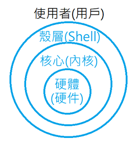
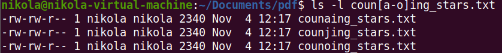
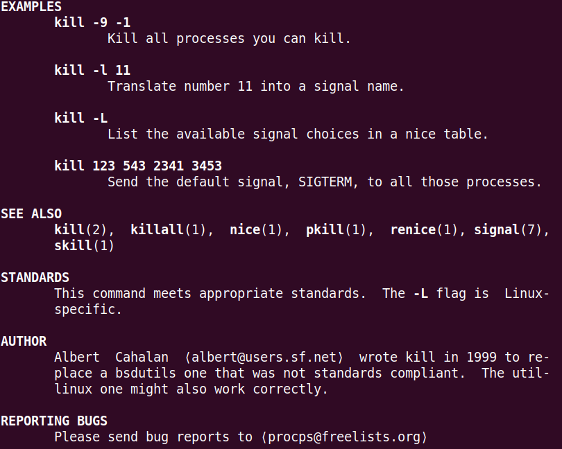

# Linux 理论知识

## Linux 四个组成部分

### 1.Linux kernel 内核

### 2.GNU 工具

GNU：/gənu:/

GNU's Not Unix!

### 3.GUI Desktop 环境

### 4. application 应用

## GNU Linux

GNU 是一种协议许可证，通过遵守GNU的协议，完成共享软件的自由。（相当于一种实现软件自由行业的行业规范）

## Linux 四个组成部分的关系


## Linux内核功能：

### 1.硬件设备

### 2.软件程序（系统）——>操作软件

### 3.系统内存管理

### 4.文件管理 

#### 保存文件、删除文件、修改文件……

## 文件系统——进行文件管理的软件系统

### 读取文件、写入文件的标准

### 不同的文件的不同的读写标准造成了不同的文件系统

### 就像是英雄联盟不同的英雄有不同的出装套路


### NTFS文件系统支持Microsoft的文件系统，不是Linux的文件系统


**第四代扩展文件系统**（英语：Fourth extended filesystem，缩写为**ext4**）是[Linux](https://zh.wikipedia.org/wiki/Linux)系统下的[日志文件系统](https://zh.wikipedia.org/wiki/日誌檔案系統)，是[ext3](https://zh.wikipedia.org/wiki/Ext3)文件系统的后继版本。——摘录自维基百科

[ext4 - 维基百科，自由的百科全书 (wikipedia.org)](https://zh.wikipedia.org/wiki/Ext4)


### Windows FAT32 U盘，不支持上传4GB以上的文件。这就是FAT32的文件系统的特点。

### 不同于Windows往往使用NTFS文件系统，Linux往往在不同的功能使用时使用不同的文件系统。如上图中的vfat文件系统就是Linux系统启动时引导分区使用的文件系统。不同于Windows使用多个盘符来构建文件分区，Linux直接列出不同的文件分区。

## GNU

### Unix上具有的一些软件，Linux内核本身没有，所以GNU他们模仿Unix为Linux写了一些必要的软件

### 1.GNU核心：

#### 原本在Unix上的一些命令，被模仿（移植）到了Unix上。

#### 供Linux使用的这套工具：coreutilities 软件包

#### （1）用来处理文件的工具

#### （2）用来操作文本的工具

#### （3）用来管理进程的工具

#### （4）最重要的工具之一——shell（一个终端）

### 2.shell



[壳层 - 维基百科，自由的百科全书 (wikipedia.org)](https://zh.wikipedia.org/wiki/殼層)

### Shell在计算机科学中指“为用户提供用户界面”的软件。通常将shell分为两类：命令行与图形界面。命令行壳层提供一个[命令行界面](https://zh.wikipedia.org/wiki/命令行界面)（CLI）；而图形壳层提供一个[图形用户界面](https://zh.wikipedia.org/wiki/圖形使用者介面)（GUI）。

### 通常情况下 Linux shell-> CLI Command Line Interface

### CLI shell

#### bash shell 基础的shell（最初的，最常用的shell）

#### 除此之外还有很多第三方的shell，功能更加强大

#### 比如最常见的第三方shell：zsh 

#### 在MacOS上面就是很多程序员会使用zsh

#### 再比如：ash、korn、tcsh

#### zsh包括了ash、korn、tcsh，功能强大

#### 在zsh的基础上，又衍生出了oh-my-zsh这种为zsh提供各种主题和插件的功能强大的项目

### Linux GUI的历史

Linux桌面环境大致分为四种

#### 1.X Windows 最早的模仿Windows的一种Linux GUI

在此基础上衍生出了后三种

#### 2.KDE 一种桌面的设计风格、设计理念、Windows就使用了这种方式。

KDE有开始菜单，有应用栏、能最小化程序。


#### 3.GNOME

red hat 使用了这种桌面布局


#### 4.Unity 基于GNOME专门为Ubuntu开发的，并非一个桌面套件

# Linux Bash shell使用知识

## 1. 命令终端提示

`nikola@nikola-virtual-machine:~$`

用户名@计算机名:当前文件夹$

~ 用户home目录

$ 等待用户输入

## 2.查询Linux指令用法

`man` 相关指令

eg：`man ls`

查询`ls`指令的所有用法

`ls -a`


`.` 同级目录

`..` 上级目录

`.bash_history`白色的隐藏文件

`.config`蓝色的隐藏文件夹

[Linux命令搜索引擎 命令，Linux Linux命令搜索引擎 命令详解：最专业的Linux命令大全，内容包含Linux命令手册、详解、学习，值得收藏的Linux命令速查手册。 - Linux 命令搜索引擎 (wangchujiang.com)](https://wangchujiang.com/linux-command/#!kw=ls)

### `ls`命令  常用实例

```shell
$ ls       # 仅列出当前目录可见文件
$ ls -l    # 列出当前目录可见文件详细信息，可简写为ll，最常用
$ ls -hl   # 列出详细信息并以可读大小显示文件大小
$ ls -al   # 列出所有文件（包括隐藏）的详细信息
$ ls --human-readable --size -1 -S --classify # 按文件大小排序
$ du -sh * | sort -h # 按文件大小排序(同上)```
```

## 3.Linux根目录

Windows中是按照磁盘符号进行管理的。在Windows中，分盘的这个概念就是分的盘符。Windows根据盘符进行文件的管理。

盘符：路径
D:\Clash.for.Windows-0.20.23-win\Clash for Windows.exe

### Linux一切皆文件

Linux 权限太高了

.bashrc——bash shell的配置文件，随意更改后会导致bash shell无法运行。

`nikola@nikola-virtual-machine:~$`

`~` Linux中的用户文件夹

`cd..` 进入上一层目录

`cd /` 进入Linux根目录

\ 反斜线 Windows

/ 正斜线 Linux

`/` Linux中的Linux根目录，最终的目录（最爸爸的那个）（比用户目录`~`高两层）


 `/bin` 二进制文件目录 GNU工具 ls等自带的命令。二级制文件已经编译好的二进制文件，可以直接运行，不能编辑了。存放许多用户机的GNU工具。自带的系统的工具

`/cdrom` 光盘文件

`/etc` 系统配置文件目录，可类比Windows中的注册表以及其他的配置文件

`/home`  主目录，显示所有的用户目录

`/lib` library 库目录 存放一些系统应用程序的库文件，比如安装软件时的依赖环境。`/lib64`和`/lib32`就是32位和64位依赖环境不同的库目录

`/lost+found` 突发情况导致的文件丢失可能能在这里找回

`/mnt` 挂载目录，U盘。挂载——外在的设备和电脑进行连接


由于只挂载了一个硬盘，所以只有一个`hgfs`

`/proc` 虚拟文件系统（伪文件系统）

`/run` 运行目录（软件运行时使用，比如在Linux desktop中运行一个firefox，就可能会放在`/run`下面）

`/snap`ubuntu特有的，与沙盒有关

`/tmp` 临时目录（temp）用于存放临时文件

`/var` 可变目录 经常会变化的一些文件会放进这里面 eg：日志log


`/boot` 启动目录

`/dev` 设备目录 创建一些设备节点 在Windows中查看设备使用设备管理器，在Linux中查看设备使用`/dev`，与硬件有关

`/media` 媒体目录 外部挂载的一些媒体设备目录

`/opt` 可选目录 经常存放一些第三方的软件包和数据

`/root` root用户的主目录 管理员（Linux中的管理员和普通用户分开处理，保障系统安全，Linux中的管理员可以对Linux中的所有文件进行任何操作，eg：删库跑路）
```sudo rm -rf/*``` 使用管理员身份删库跑路。**删库跑路，牢底坐穿**

`/sbin` 系统二级制目录，GNU高级管理员使用的命令工具

`/srv` 服务目录 本地服务

`/usr` 用户目录。当前用户的个人目录。类比于Windows的用户目录，以及软件安装时仅为当前用户安装。
`/usr/bin`大量的普通用户使用的GNU工具等。以及该用户自己安装的软件服务。eg：gcc、python等。 

##  4.FHS 

文件系统层级标准，不仅是Ubuntu，CentOS，Kali等大量的Linux系统使用了这种文件系统层级来进行系统文件的分区管理。

## 5.cd 命令 切换用户当前工作目录

`cd [-L|[-P [-e]]] [dir]`

- 切换工作目录至`dir`。其中`dir`的表示法可以是绝对路径或相对路径。
- 若参数`dir`省略，则默认为使用者的shell变量`HOME`。
- 如果`dir`指定为`~`时表示为使用者的shell变量`HOME`，`.`表示当前目录，`..`表示当前目录的上一级目录。
- 环境变量`CDPATH`是由冒号分割的一到多个目录，你可以将常去的目录的上一级加入到`CDPATH`以便方便访问它们；如果`dir`以`/`开头那么`CDPATH`不会被使用。
- 当`shopt`选项`cdable_vars`打开时，如果`dir`在`CDPATH`及当前目录下均不存在，那么会把它当作变量，读取它的值作为要进入的目录。

### `cd`命令 常用实例

```shell
cd    # 进入用户主目录；
cd /  # 进入根目录
cd ~  # 进入用户主目录；
cd ..  # 返回上级目录（若当前目录为“/“，则执行完后还在“/"；".."为上级目录的意思）；
cd ../..  # 返回上两级目录；
cd !$  # 把上个命令的参数作为cd参数使用。
cd -  # 返回上一次使用的目录
```

`pwd` 输出当前目录

## 6.Linux上Ctrl+C的用法

Linux中，Ctrl+C会打断正在执行的命令。如下图所示，下图为在Linux上ping www.baidu.com的命令，中间使用了Ctrl+C进行打断。


若要在Linux上使用复制粘贴功能，快捷键为：复制——Ctrl+Shift+C，粘贴——Ctrl+Shift+V。

在Linux终端中，没有撤销功能，也没有Ctrl+Z的快捷键。已经输入并执行的命令无法撤销。

在文本编辑中，可以进行文字输入操作的撤销，具体快捷键在使用Vim的章节进行记录。

## 7.Linux上的路径

### Linux下的绝对路径


### Linux下的相对路径


`.` 单点符 当前文件夹

`..`双点符 当前目录的父目录

## 8.过滤用法 以`ls`为例 

### 1.文件扩展匹配符

`ls -l fhs-2.3_*_*.pdf` * 表示任意单个或多个字符。进行过滤。


`ls -l fhs-2.3_c?py_?.pdf` ?表示任意单个字符。进行过滤。


### 2.元字符通配符匹配

`ls -l coun[a-k]ing_stars.txt` [a-k]表示在a-k的子母中进行筛选


`ls -l coun[a-o]ing_stars.txt` [a-o]表示在a-o的子母中进行筛选



`ls -l coun[!-o]ing_stars.txt` [!a-o]表示在a-o的子母中进行筛选后取反（补集）


`cd ../doc/ && ll -F` 两个命令的叠加先进行&&前面的命令，后进行&&后面的命令


## 9.touch命令

### 功能：

1. 把已存在的文件的时间更新为系统当前时间（默认方式），他们的数据将原封不动的保留下来；

   

2. 创建新的空文件。

### 语法：

`touch (选项)(参数)`

### 选项

```shell
-a：或--time=atime或--time=access或--time=use  只更改存取时间；
-c：或--no-create  不建立任何文件；
-d：<时间日期> 使用指定的日期时间，而非现在的时间；
-f：此参数将忽略不予处理，仅负责解决BSD版本touch指令的兼容性问题；
-m：或--time=mtime或--time=modify  只更该变动时间；
-r：<参考文件或目录>  把指定文件或目录的日期时间，统统设成和参考文件或目录的日期时间相同；
-t：<日期时间>  使用指定的日期时间，而非现在的时间；
--help：在线帮助；
--version：显示版本信息。
```

### 参数

文件：指定要设置时间属性的文件列表。

### 实例

`touch ex2` 在当前目录下建立一个空文件ex2，利用`ls -l`命令可以发现文件ex2的大小为0，表示它是空文件。

批量创建文件：

`touch file{1..5}.txt`

创建`job1.md`文件，并写入`job1`

`echo "job1" > job1.md`

## 10.cp命令

### 功能

将源文件或目录复制到目标文件或目录中

### 补充说明

**cp命令** 用来将一个或多个源文件或者目录复制到指定的目标文件或目录。它可以将单个源文件复制成一个指定文件名的具体的文件或一个已经存在的目录下。cp命令还支持同时复制多个文件，当一次复制多个文件时，目标文件参数必须是一个已经存在的目录，否则将出现错误。

**cp命令** 默认复制会在不提示的情况下覆盖原有相同名称的目标文件，所以使用时一定要使用`cp -i` 命令在覆盖既有文件之前先询问 用户。**强制要求**

### 选项

```shell
-a：此参数的效果和同时指定"-dpR"参数相同；
-d：当复制符号连接时，把目标文件或目录也建立为符号连接，并指向与源文件或目录连接的原始文件或目录；
-f：强行复制文件或目录，不论目标文件或目录是否已存在；
-i：覆盖既有文件之前先询问用户；
-l：对源文件建立硬连接，而非复制文件；
-p：保留源文件或目录的属性；
-R/r：递归处理，将指定目录下的所有文件与子目录一并处理；
-s：对源文件建立符号连接，而非复制文件；
-u：使用这项参数后只会在源文件的更改时间较目标文件更新时或是名称相互对应的目标文件并不存在时，才复制文件；
-S：在备份文件时，用指定的后缀“SUFFIX”代替文件的默认后缀；
-b：覆盖已存在的文件目标前将目标文件备份；
-v：详细显示命令执行的操作。
```

### 参数

* 源文件：指定源文件列表。默认情况下，cp命令不能复制目录，如果要复制目录，必须使用`-R`选项
* 目标文件：指定目标文件。当“源文件”为多个文件时，要求“目标文件”为指定的目录。
* 注：源文件的和目标文件使用绝对路径或者相对路径均可。

`cp -i -r` 命令的应用实例


## 11.Linux中的快捷键小技巧

### 1.Tab

在打出1-3个字母后，用Tab进行补全，防止照着输入抄错

### 2.Ctrl+←或Ctrl+→

Ctrl+←或Ctrl+→ 可以跳单词，这个单词往往以符号进行分割。这也是为什么C语言文件常常使用下划线命名法。`hello_world.c`

### 3.Ctrl+A

跳到命令的开头

### 4.Ctrl+E

跳到命令的结尾

### 5.Ctrl+L

跳一大段空白

### 6.Ctrl+B

鼠标回退一格

### 7.Ctrl+H

相当于退格键Backspace

### 8.Ctrl+T

将光标前面的字母与光标上的字母交换，并将光标后移一位。

### 9.Ctrl+U

删除光标前方的全部命令，光标移动到最后，可删除一整行命令。

### 10.Ctrl+R

搜索之前使用过的命令

### 11.Ctrl+K

将光标后面的命令内容全部删除

### 12.Ctrl+P

↑ 回滚之前使用过的命令

### 13.Ctrl+N

↓ 下找之前使用过的命令

## 12.Linux中的`.lnk`文件

**.lnk** 链接文件

在Widonws中只有符号链接（快捷方式）一种用法

Linux文件系统中，有所谓的链接(link)，我们可以将其视为档案的别名，而链接又可分为两种 : 硬链接(hard link)与软链接(symbolic link)，硬链接的意思是一个档案可以有多个名称，而软链接的方式则是产生一个特殊的档案，该档案的内容是指向另一个档案的位置。硬链接是存在同一个文件系统中，而软链接却可以跨越不同的文件系统。

不论是硬链接或软链接都不会将原本的档案复制一份，只会占用非常少量的磁碟空间。

在Linux中，**.lnk**链接文件分为两种用法

1. 符号链接（国内又称为软链接）(symbolic link)——快捷方式

   **使用前提：**源文件/文件夹必须是存在的

2. 硬链接(hard link)

   本质上来说是创建副本，只能在同一个储存介质（硬盘）中创建

   **使用前提：**源文件/文件夹必须是存在的


如下图所示，若`cp`一个符号链接文件，则复制后产生的这个符号链接文件不会指向源文件，这是很危险的。


### ln命令

#### 功能

用来为文件创建链接

#### 补充说明

**ln命令** 用来为文件创建链接，链接类型分为硬链接和符号链接两种，默认的链接类型是硬链接。如果要创建符号链接必须使用`-s`选项。

**注意**：符号链接文件不是一个独立的文件，它的许多属性依赖于源文件，所以给符号链接设置存取权限是没有意义的。

#### 语法

```shell
ln [选项]... [-T] 目标 链接名	(第一种格式)
ln [选项]... 目标			  (第二种格式)
ln [选项]... 目标... 目录		 (第三种格式)
ln [选项]... -t 目录 目标...	 (第四种格式)
```

#### 选项

```shell
--backup[=CONTROL]      # 为每个已存在的目标文件创建备份文件
-b                      # 类似--backup，但不接受任何参数
-d, -F, --directory         # 创建指向目录的硬链接(只适用于超级用户)
-f, --force                 # 强行删除任何已存在的目标文件
-i, --interactive           # 覆盖既有文件之前先询问用户
-L, --logical               # 取消引用作为符号链接的目标
-n, --no-dereference        # 把符号链接的目的目录视为一般文件
-P, --physical              # 直接将硬链接到符号链接
-r, --relative              # 创建相对于链接位置的符号链接
-s, --symbolic              # 对源文件建立符号链接，而非硬链接
-S, --suffix=SUFFIX         # 用"-b"参数备份目标文件后，备份文件的字尾会被加上一个备份字符串，预设的备份字符串是符号“~”，用户可通过“-S”参数来改变它
-t, --target-directory=DIRECTORY # 指定要在其中创建链接的DIRECTORY
-T, --no-target-directory   # 将“LINK_NAME”视为常规文件
-v, --verbose               # 打印每个链接文件的名称
--help      # 显示此帮助信息并退出
--version   # 显示版本信息并退出
```

**参数**

* 源文件：指定链接的源文件。如果`-s`选项创建符号链接，则“源文件”可以是文件或者目录。创建硬链接时，则“源文件”参数只能是文件。
* 目标文件：指定源文件的目标链接文件。

```shell
none, off       # 不进行备份(即使使用了--backup 选项)
numbered, t     # 备份文件加上数字进行排序
existing, nil   # 若有数字的备份文件已经存在则使用数字，否则使用普通方式备份
simple, never   # 永远使用普通方式备份
```

#### 实例

将目录`/usr/mengqc/mub1` 下的文件 m2.c 链接到目录 `/usr/liu` 下的文件 a2.c

```shell
cd /usr/mengqc
ln mub1/m2.c /usr/liu/a2.c
```

在执行ln命令之前，目录`/usr/liu`中不存在a2.c文件。执行ln之后，在`/usr/liu`目录中才有a2.c这一项，表明m2.c和a2.c链接起来（注意，二者在物理上是同一文件），利用`ls -l`命令可以看到链接数的变化。

**创建软链接**

在目录`/usr/liu`下建立一个符号链接文件abc，使它指向目录`/usr/mengqc/mub1`

```shell
ln -s /usr/mengqc/mub1 /usr/liu/abc
```

执行该命令后，`/usr/mengqc/mub1`代表的路径将存放在名为`/usr/liu/abc`的文件中。

**创建硬链接**

给文件创建硬链接，为 `log2022.log` 创建硬链接 `ln2022`，`log2022.log` 与 `ln2022` 的各项属性相同

```shell
ln log2022.log ln2022
```

输出：

```
[root@localhost test]# ll
lrwxrwxrwx 1 root root     11 12-07 16:01 link2013 -> log2022.log
-rw-r--r-- 1 root bin      61 11-13 06:03 log2022.log
[root@localhost test]# ln log2022.log ln2022
[root@localhost test]# ll
lrwxrwxrwx 1 root root     11 12-07 16:01 link2013 -> log2022.log
-rw-r--r-- 2 root bin      61 11-13 06:03 ln2022
-rw-r--r-- 2 root bin      61 11-13 06:03 log2022.log
```

### 扩展知识

Linux具有为一个文件起多个名字的功能，称为链接。被链接的文件可以存放在相同的目录下，但是必须有不同的文件名，而不用在硬盘上为同样的数据重复备份。另外，被链接的文件也可以有相同的文件名，但是存放在不同的目录下，这样只要对一个目录下的该文件进行修改，就可以完成对所有目录下同名链接文件的修改。对于某个文件的各链接文件，我们可以给它们指定不同的存取权限，以控制对信息的共享和增强安全性。

文件链接有两种形式，即硬链接和符号链接。

ln功能说明：是为某一个文件在另外一个位置建立一个同步的链接，当我们需要在不同的目录，用到相同的文件时，我们不需要在每一个需要的目录下都放一个必须相同的文件，我们只要在某个固定的目录，放上该文件，然后在其它的目录下用ln命令链接（link）它就可以，不必重复的占用磁盘空间。

> ⚠️ ln命令会保持每一处链接文件的同步性，也就是说，不论你改动了哪一处，其它的文件都会发生相同的变化。

### 软链接：

1. 软链接，以路径的形式存在。类似于Windows操作系统中的快捷方式
2. 软链接可以 跨文件系统 ，硬链接不可以
3. 软链接可以对一个不存在的文件名进行链接
4. 软链接可以对目录进行链接

### 硬链接

建立硬链接时，在另外的目录或本目录中增加目标文件的一个目录项，这样，一个文件就登记在多个目录中。如下所示的m2.c文件就在目录mub1和liu中都建立了目录项。

1. 硬链接，以文件副本的形式存在。但不占用实际空间。
2. 不允许给目录创建硬链接
3. 硬链接只有在同一个文件系统中才能创建

```shell
ls -ailR
.:
total 16
922730 drwxr-xr-x  4 root root 4096 Jun 17 11:18 .
393217 drwxrwxrwt. 9 root root 4096 Jun 17 11:19 ..
922733 drwxr-xr-x  2 root root 4096 Jun 17 11:18 liu
922731 -rw-r--r--  3 root root    0 Jun 17 11:18 m2.c
922732 drwxr-xr-x  2 root root 4096 Jun 17 11:18 mub1

./liu:
total 8
922733 drwxr-xr-x 2 root root 4096 Jun 17 11:18 .
922730 drwxr-xr-x 4 root root 4096 Jun 17 11:18 ..
922731 -rw-r--r-- 3 root root    0 Jun 17 11:18 m2.c

./mub1:
total 8
922732 drwxr-xr-x 2 root root 4096 Jun 17 11:18 .
922730 drwxr-xr-x 4 root root 4096 Jun 17 11:18 ..
922731 -rw-r--r-- 3 root root    0 Jun 17 11:18 m2.c
```

创建硬链接后，己经存在的文件的索引节点号（inode）会被多个目录文件项使用。一个文件的硬链接数可以在目录的长列表格式的第二列中看到，无额外链接的文件的链接数为1。

在默认情况下，ln命令创建硬链接。ln命令会增加链接数，rm命令会减少链接数。一个文件除非链接数为0，否则不会从文件系统中被物理地删除。

对硬链接有如下限制：

- 不能对目录文件做硬链接。
- 不能在不同的文件系统之间做硬链接。就是说，链接文件和被链接文件必须位于同一个文件系统中。

### 符号链接(软连接)

符号链接也称为软链接，是将一个路径名链接到一个文件。这些文件是一种特别类型的文件。事实上，它只是一个文本文件（如下所示的abc文件），其中包含它提供链接的另一个文件的路径名，如虚线箭头所示。另一个文件是实际包含所有数据的文件。所有读、写文件内容的命令被用于符号链接时，将沿着链接方向前进来访问实际的文件。

```shell
$ ls -il
total 0
922736 lrwxrwxrwx 1 root root 5 Jun 17 11:27 abc -> a.txt
922735 -rw-r--r-- 1 root root 0 Jun 17 11:27 a.txt
```

与硬链接不同的是，符号链接确实是一个新文件，当然它具有不同的索引节点号；而硬链接并没有建立新文件。

符号链接没有硬链接的限制，可以对目录文件做符号链接，也可以在不同文件系统之间做符号链接。

用`ln -s`命令建立符号链接时，源文件最好用绝对路径名。这样可以在任何工作目录下进行符号链接。而当源文件用相对路径时，如果当前的工作路径与要创建的符号链接文件所在路径不同，就不能进行链接。

符号链接保持了链接与源文件或目录之间的区别：

- 删除源文件或目录，只删除了数据，不会删除链接。一旦以同样文件名创建了源文件，链接将继续指向该文件的新数据。
- 在目录长列表中，符号链接作为一种特殊的文件类型显示出来，其第一个字母是l。
- 符号链接的大小是其链接文件的路径名中的字节数。
- 当用`ls -l`命令列出文件时，可以看到符号链接名后有一个箭头指向源文件或目录，例如`lrwxrwxrwx … 14 jun 20 10:20 /etc/motd->/original_file`其中，表示“文件大小”的数字“14”恰好说明源文件名`original_file`由14个字符构成。

## 13.mv命令


### 功能

用来移动或重命名文件

### 语法

```shell
mv(选项)(参数)
```

### 实例

将目录`/usr/men`中的所有文件移到当前目录（用`.`表示）中：

```shell
mv /usr/men/* .
```

移动文件

```shell
mv file_1.txt /home/office/
```

移动多个文件

```shell
mv file_2.txt file_3.txt file_4.txt /home/office/
mv *.txt /home/office/
```

移动目录

```shell
mv directory_1/ /home/office/
```

重命名文件或目录

```shell
mv file_1.txt file_2.txt # 将文件file_1.txt改名为file_2.txt
```

重命名目录

```shell
mv directory_1/ directory_2/
```

打印移动信息

```shell
mv -v *.txt /home/office
```

提示是否覆盖文件

```shell
mv -i file_1.txt /home/office
```

源文件比目标文件新时才执行更新

```shell
mv -uv *.txt /home/office
```

不要覆盖任何已存在的文件

```shell
mv -vn *.txt /home/office
```

复制时创建备份

```shell
mv -bv *.txt /home/office
```

无条件覆盖已经存在的文件

```shell
mv -f *.txt /home/office
```

## 14.rm命令（rm -rf属于极度危险的命令）

### 功能

用于删除给定的文件和目录

### 补充说明

**rm命令**可以删除一个目录中的一个或多个文件或目录，也可以将某个目录及其下属的所有文件及其子目录均删除掉。对于链接文件，只是删除整个链接文件，而原有文件保持不变。

**注意：**使用rm命令要格外小心。因为一旦删除了一个文件，就无法再恢复它。所以再删除文件之前，最好再看一下文件的内容，确定是否真要删除。rm命令可以用-i选项，这个选项在使用文件扩展名字符删除多个文件时特别有用。使用这个选项，系统会要求你逐一确定是否要删除。这时，必须输入y并按Enter键，才能删除文件。如果仅按Enter键或其他字符，文件不会被删除。

### 语法

```shell
rm (选项)(参数)
```

### 选项

```shell
-d：直接把欲删除的目录的硬连接数据删除成0，删除该目录；
-f：强制删除文件或目录；
-i：删除已有文件或目录之前先询问用户；
-r或-R：递归处理，将指定目录下的所有文件与子目录一并处理；
--preserve-root：不对根目录进行递归操作；
-v：显示指令的详细执行过程。
```

### 参数

文件：指定被删除的文件列表，如果参数中含有目录，则必须加上`-r`或者`-R`选项。

### 绝对要求

能使用参数`-i`的时候，一定要使用`-i`。能不用`-f`的时候绝不用`-f`。

## 15.目录（文件夹）之间的关系——重中之重

### mkdir命令

#### 功能：

创建新的文件夹

#### 补充说明

**mkdir命令**用来创建目录。该命令创建由dirname命名的目录。如果在目录名的前面没有加任何路径名，则在当前目录下创建由dirname指定的目录；如果给出了一个已经存在的路径，将会在该目录下创建一个指定的目录。在创建目录时，硬保证新建的目录与它所在目录下的文件没有重名。

**注意：**在创建文件时，不要把所有的文件都存放在主目录中，可以创建子目录，通过它们来更有效地组织文件。最好采用前后一致的命名方式来区分文件和目录。例如，目录名可以以大写字母开头，这样，在目录列表中目录名就出现在前面。

在一个子目录中给应包含类型相似或用途相近的文件。例如，应建立一个子目录，它包含所有的数据库文件，另有一个子目录应包含电子表格文件，还有一个子目录应包含文字处理文档，等等。目录也是文件，他们和普通文件一样遵循相同的命名规则，并且利用全路径可以唯一地指定一个目录。

#### 语法

`mkdir(选项)(参数)`

#### 选项

```shell
-Z: 设置安全上下文，当使用SELinux时有效；
-m<目标属性>或--mode<目标属性>建立目录的同时设置目录的权限
-p或--parents 若所要建立目录的上层目录目前尚未建立，则会一并建立上层目录；
--version 显示版本信息。
```

#### 参数

目录：指定要创立的目录列表，多个目录之间用空格隔开。

#### 实例

在目录`usr/meng`

### rmdir

#### 功能：

删除空目录。实在是不好用，完全不如`rm -ir python`强大。

## 16.查看文件类型

利用`file`命令去查看文件类型。如下图所示，在Linux中，.txt文件被保存为ASCII text文件，与Windows中的txt文件不同。


## 17.查看文件(相当于Windows上用记事本打开)

### `cat`命令

查看文件，但由于sever中没有滚轮，所以在sever中只能查看一些比较短的文件。

### `more`命令 

文件内容，每次显示一屏

##### 补充说明

**more命令** 是一个基于vi编辑器的文本过滤器，他以全屏幕的方式按页显示文本文件内容，支持vi中关键字定位操作。more名单中内置了若干快捷键，常用的有H（获得帮助信息），Enter（向下翻滚一行），空格（向下滚动一屏）Q（推出命令）。

该命令一次显示一屏文本，满屏后停下来，并且在屏幕的地步出现一个提示信息，给出至今已显示的该文件的百分比：--More--（XX％）可以用下列不同的方法对提示做出回答:

* 按`space`键：显示文本的下一屏内容。
* 按`Enter`键：只显示文本的下一行内容。
* 按斜线符`|`：接着输入一个模式，可以在文本中寻找下一个相匹配的模式。
* 按H键：显示帮助屏，该屏上有相关的帮助信息。
* 按B键：显示上一屏内容。
* 按Q键：推出more命令。

#### 语法

```shell
more(语法)(参数)
```

#### 选项

```shell
-<数字>：指定每屏显示的行数；
-d:显示“[press space to continue 'q' to quit.]”和"[Press 'h' for instructions]";
-c:不进行滚屏操作。每次刷新这个屏幕；
-s:将多个空行压缩成一行显示；
-u:禁止下划线；
+<数字>:从指定数字的行开始显示。
```

#### 参数

文件：指定分页显示内容的文件。

#### 实例

显示文件file的内容，但在显示之前先清屏，并且在屏幕的最下方显示完成的百分比。

```shell
more -dc file
```

显示文件file的内容，每10行显示一次，而且在显示之前先清屏。

```shell
more -c -10 file
```

### less

分屏上下翻页浏览文件内容

#### 补充说明

**less命令** 的作用与more十分相似，都可以用来浏览文字档案的内容，不同的时less命令允许用户向前或向后浏览文件，而more命令只能向前浏览。用less命令显示文件时，用PageUp键向上翻页，用PageDown键向下翻页。要推出less程序，应按Q键。

#### 语法

```shell
less(选项)(参数)
```

#### 选项

```shell
-e: 文件内容显示完毕后，自动推出；
-f: 强制显示文件；
-g: 不加亮显示搜索到的所有关键词，仅显示当前显示的关键字，以提高显示速度；
-l: 搜索时忽略大小写的差异；
-N: 每一行行首显示行号；
-s: 将连续多个空行压缩成一行显示；
-S; 在单行显示较长的内容，而不换行；
-x<数字>: 将TAB字符显示为指定个数的空格字符。
```

#### 参数

文件：指定要分屏显示内容的文件。

#### 实例

```shell
sudo less /var/log/shadowsocks.log

/字符串: 向下搜索"字符串"的功能
?字符串: 向上搜索"字符串"的功能
n: 继续向后搜索
N: 向前搜索
b: 向后翻一页
d: 向后翻半页
u: 向前滚动半页
y: 向前滚动一行
Q: 推出less 命令
空格键: 滚动一页
回车键: 滚动一行
[pagedown]: 向下翻动一页
[pageup]: 向上翻动一页
G: 移动到最后一行
g: 移动到第一行
```

更多时候，我们可以用vim查看并编辑文件，所以上述三个命令并不常用。

### head

显示文件的开头部分。

#### 概要

```shell
head [OPTION]... [FILE]...
```

#### 主要用途

- 在未指定行数时默认显示前10行。
- 处理多个文件时会在各个文件之前附加含有文件名的行。
- 当没有文件或文件为`-`时，读取标准输入。

#### 选项

```shell
-c, --bytes=[-]NUM       显示前NUM字节；如果NUM前有"-"，那么会打印除了文件末尾的NUM字节以外的其他内容。
-n, --lines=[-]NUM       显示前NUM行而不是默认的10行；如果NUM前有"-"，那么会打印除了文件末尾的NUM行以外的其他行。
-q, --quiet, --silent    不打印文件名行。
-v, --verbose            总是打印文件名行。
-z, --zero-terminated    行终止符为NUL而不是换行符。
--help                   显示帮助信息并退出。
--version                显示版本信息并退出。

NUM可以有一个乘数后缀：
b 512
kB 1000
k 1024
MB 1000*1000
M 1024*1024
GB 1000*1000*1000
G 1024*1024*1024
T、P、E、Z、Y等以此类推。

也可以使用二进制前缀：
KiB=K
MiB=M
以此类推。
```

#### 参数

FILE（可选）：要处理的文件，可以为一或多个。

#### 返回值

返回0表示成功，返回非0值表示失败。

#### 例子

```shell
# 查看历史文件的前6行：
[user2@pc ~]$ head -n 6 ~/.bash_history
#1575425555
cd ~
#1575425558
ls -lh
#1575425562
vi ~/Desktop/ZhuangZhu-74.txt
# 查看多个文件：
[user2@pc ~]$ head -n ~/.bash_history ~/.bashrc
==> /allhome/user2/.bash_history <==
#1575425555
cd ~
#1575425558
ls -lh
#1575425562
vi ~/Desktop/ZhuangZhu-74.txt
#1575425566
uptime
#1575425570
find ~/ -maxdepth 3 -name 'test.sh' -exec lh {} \;

==> /allhome/user2/.bashrc <==
# .bashrc

# forbid use Ctrl+D to exit shell.
set -o ignoreeof

# Source global definitions.
if [ -f /etc/bashrc ]; then
        . /etc/bashrc
fi
```

#### 注意

1. 该命令是`GNU coreutils`包中的命令，相关的帮助信息请查看`man -s 1 head`，`info coreutils 'head invocation'`。

### head

显示文件的开头部分。

#### 概要

```shell
head [OPTION]... [FILE]...
```

#### 主要用途

- 在未指定行数时默认显示前10行。
- 处理多个文件时会在各个文件之前附加含有文件名的行。
- 当没有文件或文件为`-`时，读取标准输入。

#### 选项

```shell
-c, --bytes=[-]NUM       显示前NUM字节；如果NUM前有"-"，那么会打印除了文件末尾的NUM字节以外的其他内容。
-n, --lines=[-]NUM       显示前NUM行而不是默认的10行；如果NUM前有"-"，那么会打印除了文件末尾的NUM行以外的其他行。
-q, --quiet, --silent    不打印文件名行。
-v, --verbose            总是打印文件名行。
-z, --zero-terminated    行终止符为NUL而不是换行符。
--help                   显示帮助信息并退出。
--version                显示版本信息并退出。

NUM可以有一个乘数后缀：
b 512
kB 1000
k 1024
MB 1000*1000
M 1024*1024
GB 1000*1000*1000
G 1024*1024*1024
T、P、E、Z、Y等以此类推。

也可以使用二进制前缀：
KiB=K
MiB=M
以此类推。
```

#### 参数

FILE（可选）：要处理的文件，可以为一或多个。

#### 返回值

返回0表示成功，返回非0值表示失败。

#### 例子

```shell
# 查看历史文件的前6行：
[user2@pc ~]$ head -n 6 ~/.bash_history
#1575425555
cd ~
#1575425558
ls -lh
#1575425562
vi ~/Desktop/ZhuangZhu-74.txt
# 查看多个文件：
[user2@pc ~]$ head -n ~/.bash_history ~/.bashrc
==> /allhome/user2/.bash_history <==
#1575425555
cd ~
#1575425558
ls -lh
#1575425562
vi ~/Desktop/ZhuangZhu-74.txt
#1575425566
uptime
#1575425570
find ~/ -maxdepth 3 -name 'test.sh' -exec lh {} \;

==> /allhome/user2/.bashrc <==
# .bashrc

# forbid use Ctrl+D to exit shell.
set -o ignoreeof

# Source global definitions.
if [ -f /etc/bashrc ]; then
        . /etc/bashrc
fi
```

#### 注意

1. 该命令是`GNU coreutils`包中的命令，相关的帮助信息请查看`man -s 1 head`，`info coreutils 'head invocation'`。

# Linux系统shell

## Linux任务管理器

### `top`命令

**top命令** 用于显示或管理执行中的程序。可以实时动态地查看系统的整体运行情况，是一个综合了多方信息监测系统性能和运行信息的实用工具。通过top命令所提供的互动式界面，用热键可以管理。


### `ps`命令(超级复杂)

**`ps`命令** 用于报告当前系统的进程状态。可以搭配kill指令随时中断、删除不必要的程序。ps命令是最基本同时也是非常强大的进程查看命令，使用该命令可以确定有哪些进程正在运行和运行的状态、进程是否结束、进程有没有僵死、哪些进程占用了过多的资源等等，总之大部分信息都是可以通过执行该命令得到的。


**`ps`命令** 是Linux中最复杂的命令之一。`man ps`的命令说明超过1400行。有超过3个版本以上。

#### 常用实例

```shell
ps axo pid,comm,pcpu # 查看进程的PID、名称以及CPU 占用率
ps aux | sort -rnk 4 # 按内存资源的使用量对进程进行排序
ps aux | sort -nk 3  # 按 CPU 资源的使用量对进程进行排序
ps -A # 显示所有进程信息
ps -u root # 显示指定用户信息
ps -efL # 查看线程数
ps -e -o "%C : %p :%z : %a"|sort -k5 -nr # 查看进程并按内存使用大小排列
ps -ef # 显示所有进程信息，连同命令行
ps -ef | grep ssh # ps 与grep 常用组合用法，查找特定进程
ps -C nginx # 通过名字或命令搜索进程
ps aux --sort=-pcpu,+pmem # CPU或者内存进行排序,-降序，+升序
ps -f --forest -C nginx # 用树的风格显示进程的层次关系
ps -o pid,uname,comm -C nginx # 显示一个父进程的子进程
ps -e -o pid,uname=USERNAME,pcpu=CPU_USAGE,pmem,comm # 重定义标签
ps -e -o pid,comm,etime # 显示进程运行的时间
ps -aux | grep named # 查看named进程详细信息
ps -o command -p 91730 | sed -n 2p # 通过进程id获取服务名称
```

将目前属于您自己这次登入的 PID 与相关信息列示出来

```shell
ps -l
#  UID   PID  PPID        F CPU PRI NI       SZ    RSS WCHAN     S             ADDR TTY           TIME CMD
#  501   566   559     4006   0  31  0  4317620    228 -      Ss                  0 ttys001    0:00.05 /App...cOS/iTerm2 --server /usr/bin/login -fpl kenny /Ap...s/MacOS/iTerm2 --launch_shel
#  501   592   577     4006   0  31  0  4297048     52 -      S                   0 ttys001    0:00.63 -zsh
```

### `kill`命令

#### 功能

发送信号到进程。可分为bash内建命令和GNU coreutils中的命令。

#### 语法

```shell
kill [-s <信息名称或编号>][程序]　或　kill [-l <信息编号>]
```

kill 可将指定的信息送至程序。预设的信息为 SIGTERM(15)，可将指定程序终止。若仍无法终止该程序，可使用 SIGKILL(9) 信息尝试强制删除程序。程序或工作的编号可利用 ps 指令或 jobs 指令查看。

#### bash内建命令

##### 概要

```shell
kill [-s sigspec | -n signum | -sigspec] pid | jobspec ...
kill -l [sigspec]
```

##### 主要用途

* 发送信号到作业或进程（可以为多个）。
* 列出信号

##### 选项

```shell
-s sig	# 信号名称
-n sig	# 信号名称对应的数字。
-l		# 列出信号名称。如果在该选项后提供了数字那么假设它是信号
-L		# 等价于-l选项
```

##### 参数

pid: 进程ID

jobspec: 作业标识符

##### 返回值

返回状态为成功。除非给出了非法选项，执行出现错误。

##### 例子

```shell
[user2@pc] kill -l 9
KILL

# 列出所有信号名称：
[user2@pc] kill -l
 1) SIGHUP       2) SIGINT       3) SIGQUIT      4) SIGILL
 5) SIGTRAP      6) SIGABRT      7) SIGBUS       8) SIGFPE
 9) SIGKILL     10) SIGUSR1     11) SIGSEGV     12) SIGUSR2
13) SIGPIPE     14) SIGALRM     15) SIGTERM     16) SIGSTKFLT
17) SIGCHLD     18) SIGCONT     19) SIGSTOP     20) SIGTSTP
21) SIGTTIN     22) SIGTTOU     23) SIGURG      24) SIGXCPU
25) SIGXFSZ     26) SIGVTALRM   27) SIGPROF     28) SIGWINCH
29) SIGIO       30) SIGPWR      31) SIGSYS      34) SIGRTMIN
35) SIGRTMIN+1  36) SIGRTMIN+2  37) SIGRTMIN+3  38) SIGRTMIN+4
39) SIGRTMIN+5  40) SIGRTMIN+6  41) SIGRTMIN+7  42) SIGRTMIN+8
43) SIGRTMIN+9  44) SIGRTMIN+10 45) SIGRTMIN+11 46) SIGRTMIN+12
47) SIGRTMIN+13 48) SIGRTMIN+14 49) SIGRTMIN+15 50) SIGRTMAX-14
51) SIGRTMAX-13 52) SIGRTMAX-12 53) SIGRTMAX-11 54) SIGRTMAX-10
55) SIGRTMAX-9  56) SIGRTMAX-8  57) SIGRTMAX-7  58) SIGRTMAX-6
59) SIGRTMAX-5  60) SIGRTMAX-4  61) SIGRTMAX-3  62) SIGRTMAX-2
63) SIGRTMAX-1  64) SIGRTMAX

# 下面是常用的信号。
# 只有第9种信号(SIGKILL)才可以无条件终止进程，其他信号进程都有权利忽略。

HUP     1    终端挂断
INT     2    中断（同 Ctrl + C）
QUIT    3    退出（同 Ctrl + \）
KILL    9    强制终止
TERM   15    终止
CONT   18    继续（与STOP相反，fg/bg命令）
STOP   19    暂停（同 Ctrl + Z）
```

#### `man kill`原英文注解




##### 阅读Tips：

<pid>: 由尖括号包起来的参数是必选项。

```
bold text          type exactly as shown.
italic text        replace with appropriate argument.
[-abc]             any or all arguments within [ ] are optional.
-a|-b              options delimited by | cannot be used together.
argument ...       argument is repeatable.
[expression] ...   entire expression within [ ] is repeatable.
```

粗体文本类型与所示完全相同。
斜体文本替换为适当的参数。
[-abc] [ ] 内的任何或所有参数都是可选的。
-a|-b 选项由 | 分隔 不能一起使用。
论证...论证是可重复的。
[表达式] ... [ ] 内的整个表达式是可重复的。

## 挂载

 **挂载**（mounting）是指由操作系统使一个存储设备（诸如硬盘、CD-ROM或共享资源）上的电脑文件和目录可供用户通过计算机的文件系统访问的一个过程。

一般来说，当计算机关机时，每个已挂载存储都将经历一次卸载，以确保所有排队的数据被写入，并保证介质上文件系统结构的完整性。

Ubuntu上的外接U盘、硬盘等存储设备挂载在/media/目录下

### `fdisk`命令

查看磁盘使用情况和磁盘分区

#### 补充说明

**fdisk命令** 用于观察硬盘实体使用情况，也可对硬盘分区。它采用传统的问答式界面，而非类似DOS fdisk的cfdisk互动式操作界面，因此在使用上较为不便，但功能却丝毫不打折扣。

#### 语法

```shell
fdisk [选项] <磁盘>
fidik [选项] -l [<磁盘>...]
```

#### 选项

```shell
选项:
 -b, --sectors-size <大小>     显示扇区计数和大小
 -B, --protect-boot            创建新标签时不要擦除 bootbits
 -c, --compatibility[=<模式>]  模式，为“dos”或“nondos”(默认)
 -L, --color[=<时机>]          彩色输出（auto, always 或 never）默认启用颜色
 -l, --list                    显示分区并退出
 -x, --list-details            类似 --list 但提供更多细节
 -n, --noauto-pt               不要在空设备上创建默认分区表
 -o, --output <列表>           输出列
 -t, --type <类型>             只识别指定的分区表类型
 -u, --units[=<单位>]          显示单位，“cylinders”柱面或“sectors”扇区(默认)
 -s, --getsz                   以 512-字节扇区显示设备大小[已废弃]
      -b, --bytes                   以字节为单位而非易读的格式来打印 SIZE
      --lock[=<模式>]           使用独占设备锁（yes、no 或 nonblock）
 -w, --wipe <模式>             擦除签名（auto, always 或 never）
 -W, --wipe-partitions <模式>  擦除新分区的签名(auto, always 或 never)

 -C, --cylinders <数字>        指定柱面数
 -H, --heads <数字>            指定磁头数
 -S, --sectors <数字>          指定每条磁道的扇区数

 -h, --help                    显示此帮助
 -V, --version                 显示版本
```

实例过于复杂，可参考下面的网页链接。

[fdisk 命令，Linux fdisk 命令详解：查看磁盘使用情况和磁盘分区 - Linux 命令搜索引擎 (wangchujiang.com)](https://wangchujiang.com/linux-command/c/fdisk.html)

### ```mount```命令

用于挂载Linux系统外的文件

#### 补充说明

**mount命令** Linux mount命令式经常会使用到的命令，它用于挂载Linux系统外的文件。如果通过webdav协议挂载网络磁盘，需要运行指令`apt install davfs2`安装必要的组件。

#### 语法

```shell
mount [-hV]
mount -a [-fFnrsvw] [-t vfstype]
mount [-fnrsvw] [-o options [,...]] device | dir
mount [-fnrsvw] [-t vfstype] [-o options] device dir
```

#### 选项

```shell
-V：显示程序版本
-h：显示辅助讯息
-v：显示较讯息，通常和 -f 用来除错。
-a：将 /etc/fstab 中定义的所有档案系统挂上。
-F：这个命令通常和 -a 一起使用，它会为每一个 mount 的动作产生一个行程负责执行。在系统需要挂上大量 NFS 档案系统时可以加快挂上的动作。
-f：通常用在除错的用途。它会使 mount 并不执行实际挂上的动作，而是模拟整个挂上的过程。通常会和 -v 一起使用。
-n：一般而言，mount 在挂上后会在 /etc/mtab 中写入一笔资料。但在系统中没有可写入档案系统存在的情况下可以用这个选项取消这个动作。
-s-r：等于 -o ro
-w：等于 -o rw
-L：将含有特定标签的硬盘分割挂上。
-U：将档案分割序号为 的档案系统挂下。-L 和 -U 必须在/proc/partition 这种档案存在时才有意义。
-t：指定档案系统的型态，通常不必指定。mount 会自动选择正确的型态。
-o async：打开非同步模式，所有的档案读写动作都会用非同步模式执行。
-o sync：在同步模式下执行。
-o atime、-o noatime：当 atime 打开时，系统会在每次读取档案时更新档案的『上一次调用时间』。当我们使用 flash 档案系统时可能会选项把这个选项关闭以减少写入的次数。
-o auto、-o noauto：打开/关闭自动挂上模式。
-o defaults:使用预设的选项 rw, suid, dev, exec, auto, nouser, and async.
-o dev、-o nodev-o exec、-o noexec允许执行档被执行。
-o suid、-o nosuid：允许执行档在 root 权限下执行。
-o user、-o nouser：使用者可以执行 mount/umount 的动作。
-o remount：将一个已经挂下的档案系统重新用不同的方式挂上。例如原先是唯读的系统，现在用可读写的模式重新挂上。
-o ro：用唯读模式挂上。
-o rw：用可读写模式挂上。
-o loop=：使用 loop 模式用来将一个档案当成硬盘分割挂上系统。
```

#### 实例1

将`/dev/hda1`挂载在`/mnt`之下。

```shell
mount /dev/hda1/ /mnt
```

将`/dev/hda1`用只读模式挂载在`/mnt`/之下。

```shell
mount -o ro /dev/hda1 /mnt
```

将`/tmp/image.iso`这个光碟的`image`档使用`loop`模式挂载在`/mnt/cdrom`之下。用这种方法可以将一般网络上可以找到的`Linux`光碟ISO档在不烧录成光碟的情况下检视其内容。

```shell
mount -o loop /tmp/image.iso /mnt/cdrom
```

loop挂载的原理可查看此链接：[关于loop设备挂载_挂载loop-CSDN博客](https://blog.csdn.net/shengxia1999/article/details/52081286)

#### 实例2

通过webdav协议挂载网络硬盘

将`https://your.webdav.link.here`的网络存储以网络磁盘的形式挂载到系统路径`/path/to/mount`

```shell
mount -t davfs https//your.webdav.link.here /path/to/mount
```

[Linux通过安装davfs2来挂载webdav网盘 - Rat's Blog (moerats.com)](https://www.moerats.com/archives/317/)

[davfs2 - Wikipedia](https://en.wikipedia.org/wiki/Davfs2)

#### 实例3

挂载Android系统system分区到`/dev/loopX`，在知道文件格式的情况下，可以用-t来指定文件格式，比如ext4。

```shell
mount -t ext4 /dev/loopX /mnt/system
```

### `df`命令

显示磁盘的相关信息

#### 补充说明

**df命令** 用于显示磁盘分区上的可使用的磁盘空间。默认显示单位为KB。可以利用该命令来获取硬盘被占用了多少空间，目前还剩下多少空间等信息。

#### 语法

```shell
df(选项)(参数)
```

#### 选项（用的不多）

各种选项用的不多

`-h`比较常用

```shell
-a或--all：包含全部的文件系统；
--block-size=<区块大小>：以指定的区块大小来显示区块数目；
-h或--human-readable：以可读性较高的方式来显示信息；
-H或--si：与-h参数相同，但在计算时是以1000 Bytes为换算单位而非1024 Bytes；
-i或--inodes：显示inode的信息；
-k或--kilobytes：指定区块大小为1024字节；
-l或--local：仅显示本地端的文件系统；
-m或--megabytes：指定区块大小为1048576字节；
--no-sync：在取得磁盘使用信息前，不要执行sync指令，此为预设值；
-P或--portability：使用POSIX的输出格式；
--sync：在取得磁盘使用信息前，先执行sync指令；
-t<文件系统类型>或--type=<文件系统类型>：仅显示指定文件系统类型的磁盘信息；
-T或--print-type：显示文件系统的类型；
-x<文件系统类型>或--exclude-type=<文件系统类型>：不要显示指定文件系统类型的磁盘信息；
--help：显示帮助；
--version：显示版本信息。
```

#### 参数

文件：指定文件系统上的文件。

#### 大小格式

显示值以`--block -size`和`DF_BLOCK_SIZE`，`BLOCK_SIZE`和`BLOCKSIZE`环境变量中的第一个可用`SIZE`为单位。否则，单位默认为`1024`个字节（如果设置`POSIXLY_CORRECT`则为`512`）。

SIZE是一个整数和可选单位（例如：10M是10 * 1024 * 1024）。单位是K，M，G，T，P，E，Z，Y（1024的幂）或KB，MB，...（1000的幂）。

#### 实例

查看系统磁盘设备，默认是KB为单位：

```shell
[root@LinServ-1 ~]# df
文件系统               1K-块        已用     可用 已用% 挂载点
/dev/sda2            146294492  28244432 110498708  21% /
/dev/sda1              1019208     62360    904240   7% /boot
tmpfs                  1032204         0   1032204   0% /dev/shm
/dev/sdb1            2884284108 218826068 2518944764   8% /data1
```

使用`-h`选项以KB以上的单位来显示，可读性高：

```shell
[root@LinServ-1 ~]# df -h
文件系统              容量  已用 可用 已用% 挂载点
/dev/sda2             140G   27G  106G  21% /
/dev/sda1             996M   61M  884M   7% /boot
tmpfs                1009M     0 1009M   0% /dev/shm
/dev/sdb1             2.7T  209G  2.4T   8% /data1
```

查看全部文件系统：

```shell
[root@LinServ-1 ~]# df -a
文件系统               1K-块        已用     可用 已用% 挂载点
/dev/sda2            146294492  28244432 110498708  21% /
proc                         0         0         0   -  /proc
sysfs                        0         0         0   -  /sys
devpts                       0         0         0   -  /dev/pts
/dev/sda1              1019208     62360    904240   7% /boot
tmpfs                  1032204         0   1032204   0% /dev/shm
/dev/sdb1            2884284108 218826068 2518944764   8% /data1
none                         0         0         0   -  /proc/sys/fs/binfmt_misc
```

显示`public`目录中的可用空间量，如以下输出中所示：

```shell
df public
# Filesystem     1K-blocks     Used Available Use% Mounted on
# /dev/loop0      18761008 15246924   2554392  86% /d Avail
```

### `du`命令

显示每个文件和目录的磁盘使用空间

#### 补充说明

**du命令** 也是查看使用空间的，但是与df命令不同的是Linux du命令是对文件和目录磁盘使用的空间的查看，还是和df命令有一些区别的。

#### 语法

```shell
du [选项][文件]
```

#### 选项（用的不多）

各种选项用的不多

`-h`比较常用

```shell
-a, --all                              显示目录中个别文件的大小。
-B, --block-size=大小                  使用指定字节数的块
-b, --bytes                            显示目录或文件大小时，以byte为单位。
-c, --total                            除了显示个别目录或文件的大小外，同时也显示所有目录或文件的总和。
-D, --dereference-args                 显示指定符号链接的源文件大小。
-H, --si                               与-h参数相同，但是K，M，G是以1000为换算单位。
-h, --human-readable                   以K，M，G为单位，提高信息的可读性。
-k, --kilobytes                        以KB(1024bytes)为单位输出。
-l, --count-links                      重复计算硬件链接的文件。
-m, --megabytes                        以MB为单位输出。
-L<符号链接>, --dereference<符号链接>  显示选项中所指定符号链接的源文件大小。
-P, --no-dereference                   不跟随任何符号链接(默认)
-0, --null                             将每个空行视作0 字节而非换行符
-S, --separate-dirs                    显示个别目录的大小时，并不含其子目录的大小。
-s, --summarize                        仅显示总计，只列出最后加总的值。
-x, --one-file-xystem                  以一开始处理时的文件系统为准，若遇上其它不同的文件系统目录则略过。
-X<文件>, --exclude-from=<文件>        在<文件>指定目录或文件。
--apparent-size                        显示表面用量，而并非是磁盘用量；虽然表面用量通常会小一些，但有时它会因为稀疏文件间的"洞"、内部碎片、非直接引用的块等原因而变大。
--files0-from=F                        计算文件F中以NUL结尾的文件名对应占用的磁盘空间如果F的值是"-"，则从标准输入读入文件名
--exclude=<目录或文件>                 略过指定的目录或文件。
--max-depth=N                          显示目录总计(与--all 一起使用计算文件)当N为指定数值时计算深度为N，等于0时等同--summarize
--si                                   类似-h，但在计算时使用1000 为基底而非1024
--time                                 显示目录或该目录子目录下所有文件的最后修改时间
--time=WORD                            显示WORD时间，而非修改时间：atime，access，use，ctime 或status
--time-style=样式                      按照指定样式显示时间(样式解释规则同"date"命令)：full-iso，long-iso，iso，+FORMAT
--help                                 显示此帮助信息并退出
--version                              显示版本信息并退出
```

#### 参数

设备文件：指定要进行分区或者显示分区的硬盘设备文件。

## `sort`文件排序命令

对文本文件中所有行进行排序。

以下内容摘录自`man sort`命令。

```shell
NAME
	sort - sprt lines of text files
SYNOPSIS
	sort [OPTION]... [FILE]...
	sort [OPTION]... --files0-from=F
DESCRIPTION
	Write sorted concatenation of all FILE(s) to standard output.
	With no FILE or when FILE is -, read standard input.
	Mandatory arguments to long options are mandatory for short options too. Ordering options:
	-b, --ignore-leading-blanks
			ignore leading blanks
	-d, --dictionary-order
			consider only blanks and alphanumeric characters
	-f, --ignore-case
			fold lower case to upper case characters
	-g, --general-numeric-sort
			compare according to general nuimerical value
	-i, --ignore-nonprinting
			consder only printable characters
	-M, --month-sort
			compare (unknown) < 'JAN' < ... < 'DEC'
	-h, --human-numeric-sort
			compare human readable numbers (e.g., 2K 1G)
	-n, --numeric-sort
			compare according to string numerical value
	-R, --random-sort
			shuffle, but group identical keys. See shuf(1)
	--random-source=FILE
			get random bytes from FILE
	-r, --reverse
			reverse the result of comparisons
	--sort=WORD
			sprt according to WORD: general-numeric -g, human-numeric -h, month -M, numeric -n, random -R, version -V
	-V --version-sort
			natural sort of (version) numbers within text
	Other options:
	...
```

## `grep`搜索命令(可使用正则表达式进行匹配)

### 常用实例

在demo.c文件中找出所有的Hello

```shell
grep Hello demo.c
```

## `tar`打包压缩命令(可单独打包，也可打包压缩，也可解包解压缩)

### 功能

将多个文件一起保存至一个单独的磁带或磁盘归档，并能从归档中单独还原所需文件。

### 补充说明

**tar命令** 可以为Linux的文件和目录创建档案。利用tar，可以为某一特定文件创建档案（备份文件），也可以在档案中改变文件，或者向档案中加入新的文件。tar最初被用来在磁带上创建档案，现在，用户可以在任何设备上创建档案。利用tar命令，可以把一大堆的文件和目录全部打包成一个文件，这对于备份文件或将几个文件组合成为一个文件以便于网络传输是非常有用的。

首先要弄清两个概念：打包和压缩。打包是指将一大堆文件或目录变成一个总的文件；压缩则是将一个大的文件通过一些压缩算法变成一个小文件。

为什么要区分这两个概念呢？这源于Linux中的很多压缩程序只能针对一个文件进行压缩，这样当你想要压缩一大堆文件时，需要先将这一大堆文件先打成一个包（tar命令），然后再用压缩程序进行压缩（gzip bzip2命令）。

### 语法

```shell
tar [选项...] [FILE]...
```

### 选项

```shell
-A, --catenate, --concatenate   追加 tar 文件至归档
-c, --create               创建一个新归档
-d, --diff, --compare      找出归档和文件系统的差异
    --delete               从归档(非磁带！)中删除
-r, --append               追加文件至归档结尾
-t, --list                 列出归档内容
    --test-label           测试归档卷标并退出
-u, --update               仅追加比归档中副本更新的文件
-x, --extract, --get       从归档中解出文件

操作修饰符:

      --check-device         当创建增量归档时检查设备号(默认)
  -g, --listed-incremental=FILE   处理新式的 GNU 格式的增量备份
  -G, --incremental          处理老式的 GNU 格式的增量备份
      --ignore-failed-read
                             当遇上不可读文件时不要以非零值退出
      --level=NUMBER         所创建的增量列表归档的输出级别
  -n, --seek                 归档可检索
      --no-check-device      当创建增量归档时不要检查设备号
      --no-seek              归档不可检索
      --occurrence[=NUMBER]  仅处理归档中每个文件的第 NUMBER
                             个事件；仅当与以下子命令 --delete,
                             --diff, --extract 或是 --list
                             中的一个联合使用时，此选项才有效。而且不管文件列表是以命令行形式给出或是通过
                             -T 选项指定的；NUMBER 值默认为 1
      --sparse-version=MAJOR[.MINOR]
                             设置所用的离散格式版本(隐含
                             --sparse)
  -S, --sparse               高效处理离散文件

 重写控制:

  -k, --keep-old-files       don't replace existing files when extracting,
                             treat them as errors
      --keep-directory-symlink   preserve existing symlinks to directories when
                             extracting
      --keep-newer-files
                             不要替换比归档中副本更新的已存在的文件
      --no-overwrite-dir     保留已存在目录的元数据
      --overwrite            解压时重写存在的文件
      --overwrite-dir        解压时重写已存在目录的元数据(默认)

      --recursive-unlink     解压目录之前先清除目录层次
      --remove-files         在添加文件至归档后删除它们
      --skip-old-files       don't replace existing files when extracting,
                             silently skip over them
  -U, --unlink-first         在解压要重写的文件之前先删除它们
  -W, --verify               在写入以后尝试校验归档

 选择输出流:

      --ignore-command-error 忽略子进程的退出代码
      --no-ignore-command-error
                             将子进程的非零退出代码认为发生错误
  -O, --to-stdout            解压文件至标准输出
      --to-command=COMMAND
                             将解压的文件通过管道传送至另一个程序

 操作文件属性:

      --atime-preserve[=METHOD]
                             在输出的文件上保留访问时间，要么通过在读取(默认
                             METHOD=‘replace’)后还原时间，要不就不要在第一次(METHOD=‘system’)设置时间
      --delay-directory-restore
                             直到解压结束才设置修改时间和所解目录的权限
      --group=名称         强制将 NAME
                             作为所添加的文件的组所有者
      --mode=CHANGES         强制将所添加的文件(符号)更改为权限
                             CHANGES
      --mtime=DATE-OR-FILE   从 DATE-OR-FILE 中为添加的文件设置
                             mtime
  -m, --touch                不要解压文件的修改时间
      --no-delay-directory-restore
                             取消 --delay-directory-restore 选项的效果
      --no-same-owner
                             将文件解压为您所有(普通用户默认此项)
      --no-same-permissions
                             从归档中解压权限时使用用户的掩码位(默认为普通用户服务)
      --numeric-owner        总是以数字代表用户/组的名称
      --owner=名称         强制将 NAME
                             作为所添加的文件的所有者
  -p, --preserve-permissions, --same-permissions
                             解压文件权限信息(默认只为超级用户服务)
      --preserve             与 -p 和 -s 一样
      --same-owner
                             尝试解压时保持所有者关系一致(超级用户默认此项)
  -s, --preserve-order, --same-order
                             member arguments are listed in the same order as
                             the files in the archive

 Handling of extended file attributes:

      --acls                 Enable the POSIX ACLs support
      --no-acls              Disable the POSIX ACLs support
      --no-selinux           Disable the SELinux context support
      --no-xattrs            Disable extended attributes support
      --selinux              Enable the SELinux context support
      --xattrs               Enable extended attributes support
      --xattrs-exclude=MASK  specify the exclude pattern for xattr keys
      --xattrs-include=MASK  specify the include pattern for xattr keys

 设备选择和切换:

  -f, --file=ARCHIVE         使用归档文件或 ARCHIVE 设备
      --force-local
                             即使归档文件存在副本还是把它认为是本地归档
  -F, --info-script=名称, --new-volume-script=名称
                             在每卷磁带最后运行脚本(隐含 -M)
  -L, --tape-length=NUMBER   写入 NUMBER × 1024 字节后更换磁带
  -M, --multi-volume         创建/列出/解压多卷归档文件
      --rmt-command=COMMAND  使用指定的 rmt COMMAND 代替 rmt
      --rsh-command=COMMAND  使用远程 COMMAND 代替 rsh
      --volno-file=FILE      使用/更新 FILE 中的卷数

 设备分块:

  -b, --blocking-factor=BLOCKS   每个记录 BLOCKS x 512 字节
  -B, --read-full-records    读取时重新分块(只对 4.2BSD 管道有效)
  -i, --ignore-zeros         忽略归档中的零字节块(即文件结尾)
      --record-size=NUMBER   每个记录的字节数 NUMBER，乘以 512

 选择归档格式:

  -H, --format=FORMAT        创建指定格式的归档

 FORMAT 是以下格式中的一种:

    gnu                      GNU tar 1.13.x 格式
    oldgnu                   GNU 格式 as per tar <= 1.12
    pax                      POSIX 1003.1-2001 (pax) 格式
    posix                    等同于 pax
    ustar                    POSIX 1003.1-1988 (ustar) 格式
    v7                       old V7 tar 格式

      --old-archive, --portability
                             等同于 --format=v7
      --pax-option=关键字[[:]=值][,关键字[[:]=值]]...
                             控制 pax 关键字
      --posix                等同于 --format=posix
  -V, --label=TEXT           创建带有卷名 TEXT
                             的归档；在列出/解压时，使用 TEXT
                             作为卷名的模式串

 压缩选项:

  -a, --auto-compress        使用归档后缀名来决定压缩程序
  -I, --use-compress-program=PROG
                             通过 PROG 过滤(必须是能接受 -d
                             选项的程序)
  -j, --bzip2                通过 bzip2 过滤归档
  -J, --xz                   通过 xz 过滤归档
      --lzip                 通过 lzip 过滤归档
      --lzma                 通过 lzma 过滤归档
      --lzop
      --no-auto-compress     不使用归档后缀名来决定压缩程序
  -z, --gzip, --gunzip, --ungzip   通过 gzip 过滤归档
  -Z, --compress, --uncompress   通过 compress 过滤归档

 本地文件选择:

      --add-file=FILE        添加指定的 FILE 至归档(如果名字以 -
                             开始会很有用的)
      --backup[=CONTROL]     在删除前备份，选择 CONTROL 版本
  -C, --directory=DIR        改变至目录 DIR
      --exclude=PATTERN      排除以 PATTERN 指定的文件
      --exclude-backups      排除备份和锁文件
      --exclude-caches       除标识文件本身外，排除包含
                             CACHEDIR.TAG 的目录中的内容
      --exclude-caches-all   排除包含 CACHEDIR.TAG 的目录
      --exclude-caches-under 排除包含 CACHEDIR.TAG 的目录中所有内容

      --exclude-tag=FILE     除 FILE 自身外，排除包含 FILE
                             的目录中的内容
      --exclude-tag-all=FILE 排除包含 FILE 的目录
      --exclude-tag-under=FILE   排除包含 FILE 的目录中的所有内容
      --exclude-vcs          排除版本控制系统目录
  -h, --dereference
                             跟踪符号链接；将它们所指向的文件归档并输出
      --hard-dereference
                             跟踪硬链接；将它们所指向的文件归档并输出
  -K, --starting-file=MEMBER-NAME
                             begin at member MEMBER-NAME when reading the
                             archive
      --newer-mtime=DATE     当只有数据改变时比较数据和时间
      --no-null              禁用上一次的效果 --null 选项
      --no-recursion         避免目录中的自动降级
      --no-unquote           不以 -T 读取的文件名作为引用结束
      --null                 -T 读取以空终止的名字，-C 禁用
  -N, --newer=DATE-OR-FILE, --after-date=DATE-OR-FILE
                             只保存比 DATE-OR-FILE 更新的文件
      --one-file-system      创建归档时保存在本地文件系统中
  -P, --absolute-names       不要从文件名中清除引导符‘/’
      --recursion            目录递归(默认)
      --suffix=STRING        在删除前备份，除非被环境变量
                             SIMPLE_BACKUP_SUFFIX
                             覆盖，否则覆盖常用后缀(‘’)
  -T, --files-from=FILE      从 FILE
                             中获取文件名来解压或创建文件
      --unquote              以 -T
                             读取的文件名作为引用结束(默认)
  -X, --exclude-from=FILE    排除 FILE 中列出的模式串

 文件名变换:

      --strip-components=NUMBER   解压时从文件名中清除 NUMBER
                             个引导部分
      --transform=EXPRESSION, --xform=EXPRESSION
                             使用 sed 代替 EXPRESSION
                             来进行文件名变换

 文件名匹配选项(同时影响排除和包括模式串):

      --anchored             模式串匹配文件名头部
      --ignore-case          忽略大小写
      --no-anchored          模式串匹配任意‘/’后字符(默认对
                             exclusion 有效)
      --no-ignore-case       匹配大小写(默认)
      --no-wildcards         逐字匹配字符串
      --no-wildcards-match-slash   通配符不匹配‘/’
      --wildcards            use wildcards (default)
      --wildcards-match-slash
                             通配符匹配‘/’(默认对排除操作有效)

 提示性输出:

      --checkpoint[=NUMBER]  每隔 NUMBER
                             个记录显示进度信息(默认为 10 个)
      --checkpoint-action=ACTION   在每个检查点上执行 ACTION
      --full-time            print file time to its full resolution
      --index-file=FILE      将详细输出发送至 FILE
  -l, --check-links
                             只要不是所有链接都被输出就打印信息
      --no-quote-chars=STRING   禁用来自 STRING 的字符引用
      --quote-chars=STRING   来自 STRING 的额外的引用字符
      --quoting-style=STYLE  设置名称引用风格；有效的 STYLE
                             值请参阅以下说明
  -R, --block-number         每个信息都显示归档内的块数
      --show-defaults        显示 tar 默认选项
      --show-omitted-dirs
                             列表或解压时，列出每个不匹配查找标准的目录
      --show-transformed-names, --show-stored-names
                             显示变换后的文件名或归档名
      --totals[=SIGNAL]      处理归档后打印出总字节数；当此
                             SIGNAL 被触发时带参数 -
                             打印总字节数；允许的信号为:
                             SIGHUP，SIGQUIT，SIGINT，SIGUSR1 和
                             SIGUSR2；同时也接受不带 SIG
                             前缀的信号名称
      --utc                  以 UTC 格式打印文件修改时间
  -v, --verbose              详细地列出处理的文件
      --warning=KEYWORD      警告控制:
  -w, --interactive, --confirmation
                             每次操作都要求确认

 兼容性选项:

  -o                         创建归档时，相当于
                             --old-archive；展开归档时，相当于
                             --no-same-owner

 其它选项:

  -?, --help                 显示此帮助列表
      --restrict             禁用某些潜在的有危险的选项
      --usage                显示简短的用法说明
      --version              打印程序版本

长选项和相应短选项具有相同的强制参数或可选参数。

除非以 --suffix 或 SIMPLE_BACKUP_SUFFIX
设置备份后缀，否则备份后缀就是“~”。
可以用 --backup 或 VERSION_CONTROL 设置版本控制，可能的值为：

  none, off	   从不做备份
  t, numbered     进行编号备份
  nil, existing
如果编号备份存在则进行编号备份，否则进行简单备份
  never, simple   总是使用简单备份

--quoting-style 选项的有效参数为:

  literal
  shell
  shell-always
  c
  c-maybe
  escape
  locale
  clocale

此 tar 默认为:
--format=gnu -f- -b20 --quoting-style=escape --rmt-command=/etc/rmt
--rsh-command=/usr/bin/ssh
```

### 参数

文件或目录：指定要打包的文件或目录列表。

### 实例

将`/home/vivek/bin/`目录打包，并使用gzip算法压缩。保存为`/tmp/bin-backup.tar.gz`文件。

```shell
tar zcvf /tmp/bin-backup.tar.gz /home/vivek/bin/
```

```shell
- z：有gzip属性的
- j：有bz2属性的
- Z：有compress属性的
- v：显示所有过程
- O：将文件解开到标准输出
```

下面的参数-f是必须的

-f：使用档案名字，切记，这个参数是最后一个参数，后面只能接档案名。

```shell
tar -cf all.tar *.jpg
# 这条命令是将所有.jpg的文件打成一个名为all.tar的包。-c是表示产生新的包，-f指定包的文件名。

tar -rf all.tar *.gif
# 这条命令是将所有.gif的文件增加到all.tar的包里面去。-r是表示增加文件的意思。

tar -uf all.tar logo.gif
# 这条命令是更新原来tar包all.tar中logo.gif文件，-u是表示更新文件的意思。

tar -tf all.tar
# 这条命令是列出all.tar包中所有文件，-t是列出文件的意思
```

```shell
tar -cf archive.tar foo bar  # 从文件 foo 和 bar 创建归档文件 archive.tar。
tar -tvf archive.tar         # 详细列举归档文件 archive.tar 中的所有文件。
tar -xf archive.tar          # 展开归档文件 archive.tar 中的所有文件。
```

#### zip格式

压缩： zip -r [目标文件名].zip [原文件/目录名]
解压： unzip [原文件名].zip
注：-r参数代表递归

#### tar格式（该格式仅仅打包，不压缩）

打包：tar -cvf [目标文件名].tar [原文件名/目录名]
解包：tar -xvf [原文件名].tar
注：c参数代表create（创建），x参数代表extract（解包），v参数代表verbose（详细信息），f参数代表filename（文件名），所以f后必须接文件名。

#### tar.gz格式

方式一：利用前面已经打包好的tar文件，直接用压缩命令。

压缩：gzip [原文件名].tar
解压：gunzip [原文件名].tar.gz

方式二：一次性打包并压缩、解压并解包

打包并压缩： tar -zcvf [目标文件名].tar.gz [原文件名/目录名]
解压并解包： tar -zxvf [原文件名].tar.gz
注：z代表用gzip算法来压缩/解压。

#### tar.bz2格式

方式一：利用已经打包好的tar文件，直接执行压缩命令：

压缩：bzip2 [原文件名].tar
解压：bunzip2 [原文件名].tar.bz2
方式二：一次性打包并压缩、解压并解包

打包并压缩： tar -jcvf [目标文件名].tar.bz2 [原文件名/目录名]
解压并解包： tar -jxvf [原文件名].tar.bz2
注：小写j代表用bzip2算法来压缩/解压。

#### tar.xz格式

方式一：利用已经打包好的tar文件，直接用压缩命令：

压缩：xz [原文件名].tar
解压：unxz [原文件名].tar.xz
方式二：一次性打包并压缩、解压并解包

打包并压缩： tar -Jcvf [目标文件名].tar.xz [原文件名/目录名]
解压并解包： tar -Jxvf [原文件名].tar.xz
注：大写J代表用xz算法来压缩/解压。

#### tar.Z格式（已过时）

方式一：利用已经打包好的tar文件，直接用压缩命令：

压缩：compress [原文件名].tar
解压：uncompress [原文件名].tar.Z
方式二：一次性打包并压缩、解压并解包

打包并压缩： tar -Zcvf [目标文件名].tar.Z [原文件名/目录名]
解压并解包： tar -Zxvf [原文件名].tar.Z
注：大写Z代表用ncompress算法来压缩/解压。另，ncompress是早期Unix系统的压缩格式，但由于ncompress的压缩率太低，现已过时。

#### jar格式

压缩：jar -cvf [目标文件名].jar [原文件名/目录名]
解压：jar -xvf [原文件名].jar

注：如果是打包的是Java类库，并且该类库中存在主类，那么需要写一个META-INF/MANIFEST.MF配置文件，内容如下：

```shell
Manifest-Version: 1.0
Created-By: 1.6.0_27 (Sun Microsystems Inc.)
Main-class: the_name_of_the_main_class_should_be_put_here
```

然后用如下命令打包：

jar -cvfm [目标文件名].jar META-INF/MANIFEST.MF [原文件名/目录名]
这样以后就能用“java -jar [文件名].jar”命令直接运行主类中的public static void main方法了。

#### 7z格式

压缩：7z a [目标文件名].7z [原文件名/目录名]
解压：7z x [原文件名].7z
注：这个7z解压命令支持rar格式，即：

7z x [原文件名].rar

#### 其它例子

##### 将文件全部打包成tar包：

```shell
tar -cvf log.tar log2012.log    仅打包，不压缩！
tar -zcvf log.tar.gz log2012.log   打包后，以 gzip 压缩
tar -jcvf log.tar.bz2 log2012.log  打包后，以 bzip2 压缩
```

在选项`f`之后的文件档名是自己取的，我们习惯上都用 .tar 来作为辨识。 如果加`z`选项，则以.tar.gz或.tgz来代表gzip压缩过的tar包；如果加`j`选项，则以.tar.bz2来作为tar包名。

##### 解压目录

参数--strip-components NUMBER，在提取时从文件名中删除NUMBER个前导组件，如要去除前二层，参数为--strip-components 2

```shell
tar -xvf portal-web-v2.0.0.tar --strip-components 1  -C 指定目录
```

示例

```shell
tar -xvf xxx.tar.gz -C /usr/src/a
/usr/src/a/xxxxx/src/opp/b.txt
tar -xvf xxx.tar.gz -strip-components=1 -C /usr/src/a
/usr/src/a/src/opp/b.txt
```

##### 查阅上述tar包内有哪些文件 ：

```shell
tar -ztvf log.tar.gz
```

由于我们使用 gzip 压缩的log.tar.gz，所以要查阅log.tar.gz包内的文件时，就得要加上`z`这个选项了。

##### 将tar包解压缩 ：

```shell
tar -zxvf /opt/soft/test/log.tar.gz
```

在预设的情况下，我们可以将压缩档在任何地方解开的

##### 只将tar内的部分文件解压出来 ：

```shell
tar -zxvf /opt/soft/test/log30.tar.gz log2013.log
```

我可以透过`tar -ztvf`来查阅 tar 包内的文件名称，如果单只要一个文件，就可以透过这个方式来解压部分文件！

##### 文件备份下来，并且保存其权限 ：

```shell
tar -zcvpf log31.tar.gz log2014.log log2015.log log2016.log
```

这个`-p`的属性是很重要的，尤其是当您要保留原本文件的属性时。

##### 在文件夹当中，比某个日期新的文件才备份 ：

```shell
tar -N "2012/11/13" -zcvf log17.tar.gz test
```

##### 备份文件夹内容是排除部分文件：

```shell
tar --exclude scf/service -zcvf scf.tar.gz scf/*
```

##### 打包文件之后删除源文件：

```shell
tar -cvf test.tar test --remove-files
```

##### 其实最简单的使用 tar 就只要记忆底下的方式即可：

```shell
压　缩：tar -jcv -f filename.tar.bz2 要被压缩的文件或目录名称
查　询：tar -jtv -f filename.tar.bz2
解压缩：tar -jxv -f filename.tar.bz2 -C 欲解压缩的目录
```

### 其实最简单的使用 tar 就只要记忆底下的方式即可：

```shell
压　缩：tar -jcv -f filename.tar.bz2 要被压缩的文件或目录名称
查　询：tar -jtv -f filename.tar.bz2
解压缩：tar -jxv -f filename.tar.bz2 -C 欲解压缩的目录
```

# 父子shell

## 父子shell关系示意


其中PPID表示父进程的PID，比如PID为4503的bash的PPID为4496表示它由PID为4496的bash产生得到

利用`ps --forest`命令可分层更好的产看各个进程之间的从属（ 产生）关系。


## 分号在命令中的作用

### 命令列表


### 进程列表


```shell
命令列表 pwd; ls # 不能放到后台进程
进程列表 (pwd; ls) # 子shell运行结束会返回到父shell，尽管与命令命令列表看起来相似
进程分组 {pwd; ls} 不会启动子shell，像命令列表一样，只是给命令进行了分组

# shell 子进程：($BASH_SUBSHELL环境变量)
ls; echo $BASH_SUBSHELL; (pwd; echo $BASH_SUBSHELL; (ls; echo $BASH_SUBSHELL))
# $BASH_SUBSHELL回显的值
0 # 根shell
1 # 子shell
2 # 第二层子shell
```

* 进程列表会生成一个子shell来执行对应的命令，借助环境变量`$BASH_SUBSHELL`来查看是否存在子shell

## sleep和jobs

### 后台模式

后台模式会进入任务列表`jobs`

```shell
sleep 300&
jobs
jobs -l
ps -f 
ps --forest
```


* 子shell被sleep暂停，不执行sleep的下一条指令，当sleep被kill时，sleep下一条指令被执行，子shell进程运行结束。


## 协程


## 协程、后台模式、进程列表异同

**协程**可以同时做两件事，它在后台生成一个子shell，并在这个子shell中执行命令。

**后台模式**中运行命令可以在处理命令的同时让出CLI，以供他用。

**进程列表**是运行在子shell中的一条或多条命令。

注: 目前看来协程和进程列表作用相同，利用子shell执行命令，然后会在任务列表增加任务

## 外部命令、内建命令

* 衍生`forking` 当外部命令执行时，会创建一个子进程。

```shell
# 外部命令
# 寻找外部命令的位置 
which ps
# 查看命令类型 外部命令或内建命令 有些命令echo、pwd有多种实现，它们既有内建命令也有外部命令
type ps
type -a ps # 显示所有位置

# 内建命令
type -a echo # 同时有内建和外部命令，优先使用内建
echo is a shell builtin
echo is /usr/bin/echo
echo is /bin/echo
```

## history

1. `!!` 快速重复执行上条指令
2. `![line_num]`
3. `history -a`将当前终端的历史记录行添加到历史记录文件
4. `history -w` 将当前历史记录列表附加到历史记录文件中并且附加它们到历史列表中

## alias

创建别名

```shell
alias li='ls -li'
```

将`ls -li`命令的别名命名为`li`，后续未关闭shell时可使用`li`来代替`ls -li`

退出shell后就会失效

# 环境变量

环境变量的定义：[环境变量 - 维基百科，自由的百科全书 (wikipedia.org)](https://zh.wikipedia.org/wiki/环境变量)

Linux环境变量分为系统变量和用户变量，用户变量又分为局部变量和全局变量

## 局部变量

局部变量的定义


局部变量只能在定义这个局部变量的bash shell中使用。如果退出这个shell或者换一个shell则无法使用。

**注意：企业要求局部变量一定要小写，如果大写将发生灾难，会被误认为是全局变量**

## 全局变量

全局变量的定义


在当前shell中定义的全局变量的可以在当前shell的子shell中使用， 而不能在当前shell的父shell中使用。如果退出这个shell或者换一个shell则无法使用。

在当前shell中定义的全局变量若被在当前shell的子shell中执行`unset`删除操作，只会导致这个全局变量在子shell中无法使用，而不会导致这个全局变量在当前shell中无法使用。

环境变量的`unset`删除操作 


## 开机的时候默认执行环境变量

### bash shell的几种登录情况

1. 登录bash shell
2. 非登录就打开shell
3. 运行脚本非交互shell

配置文件：通过修改配置文件来配置环境变量

~/.bashrc

~/.bash_profile

~/.profile

~/.bash_login

# 安装软件

## PMS 包管理系统

Long long ago, it is difficult to install application on Linux. To work this out, package management system PMS was invented.

包管理系统 PMS

负责管理：软件安装，更新，卸载。。。

不同的Linux发行版的包管理系统还没有统一。

不同的包管理系统的命令不同。

## 工具依赖

LOL wegame

QQ空间，QQ

工具依赖问题在早期的Linux系统上是不能处理的，安装软件时不会提醒安装相应的依赖的软件。而PMS的出现可以解决工具依赖问题。

常用的PMS系统有以下两种

### dpkg: package management system for Debian

常用命令：

```shell
apt-get
apt-cache
apt-file
```

```shell
apt install 
apt remove
apt update
apt upgrade
```

### rpm

```shell
yum install xxxxx
```

###  Homebrew(苹果电脑 OS X)

```shell
brew install xxxxx
```

## 安装第三方软件

若Linux发行版的PMS中没有某个我们想要的软件，那么应该怎么安装呢？

或者这个软件可能是开源的

对于开源软件，应根据开源的帮助文档进行安装。

下面以安装GitHub上的thefuck项目为例

#### OS X

```shell
brew install thefuck
```

#### Ubuntu  / Mint 

```shell
sudo apt update
sudo apt install python-dev python3-pip python3-setuptools
sudo pip3 install thefuck
```

#### FreeBSD

```shell
pkg install thefuck
```

#### ChromeOS

```shell
crew install thefuck
```

#### Other systems

```shell
pip install thefuck
```

# 用户和权限

## 含义和作用

id 身份证

用户id UID 数字

为了保护系统的安全性，不能给用户最高权限。

root权限至高无上。

系统账户：有些软件需要单独的账户去运行它


Linux为了保护系统的安全性，创建了多个系统账户防止root权限控制了所有的命令，防止Linux的root用户一旦被黑掉，就会黑掉系统的所有操作。

系统账户的UID小于500

```shell
nikola:x:1000:1000:nikola,,,:/home/nikola:/bin/bash
```

用户名:密码（均显示为x）:UID:组ID:用户描述:用户主目录:用户默认shell

```shell
nikola:$6$HI74SM1sI47.6.h6$tpN86HnYlI.V5Kf6QjARJg6jRoankYwWQsSrFgajHthth0MWeh9v6688VG5EaLzYBniFOL0nRtIn3T6WV0zOd/:19660:0:99999:7:::
```

用户名:密码（加密形式）:上次修改密码的时间（距1970年还有多少天）:多少天之后能修改密码:多少天后必须修改密码:如果密码过期了，提前多少台你提醒用户更改密码:密码过期之后，多少天之后将用户禁用:禁用日期（距离1970年有多少天）:预留字段

## 用户的创建、更改、删除

### 创建

```shell
sudo useradd t1
```

需要使用管理员权限，会创建一个名为t1的用户，会默认创建一些文件，比如home目录下面的`.bash_history`、`.bahsh_logout`、`.bashrc`、`.profile`……

## 删除

```shell
sudo userdel t1
```

需要使用管理员权限，会删除名为t1的用户。

## 更改

```shell
usermod(选项)(参数)
```

命令过于强大，不好记

### passwd命令

用于让用户可以更改自己的密码

#### 补充说明

**passwd命令** 用于设置用户的认证信息，包括用户密码、密码过期时间等。系统管理者则能用它管理系统用户的密码。只有管理者可以指定用户名称，一般用户只能变更自己的密码。

#### 语法

```shell
passwd(选项)(参数)
```

#### 选项

```shell
-d: 删除密码，仅有系统管理者才能使用
-f: 强制执行
-k: 设置只有在密码过期失效后，方能更新
-i: 锁住密码
-s: 列出密码的相关信息，仅有系统管理者才能使用
-u: 解开已上锁的密码
```

#### 参数

用户名：需要设置密码的用户名

#### 知识扩展

与用户、组账户信息相关的文件

存放用户信息：

```shell
/etc/passwd
/etc/shadow
```

存放组信息：

```shell
/etc/group
/etc/gshadow
```

用户信息文件分析（每项用`:`隔开）

```shell
例如：jack:X:503:504:::/home/jack/:/bin/bash
jack　　# 用户名
X　　# 口令、密码(用X隐藏密码)
503　　# uid（0代表root、普通新建用户从500开始）
504　　# 组id
:　　# 描述
/home/jack/　　# 用户主目录
/bin/bash　　# 用户缺省Shell
```

组信息文件分析

```shell
例如：jack:$!$:???:13801:0:99999:7:*:*:
jack　　# 组名
$!$　　# 被加密的口令
13801　　# 创建日期与今天相隔的天数
0　　# 口令最短位数
99999　　# 用户口令
7　　# 到7天时提醒
*　　# 禁用天数
*　　# 过期天数
```

#### 实例

如果是普通用户执行passwd只能修改自己的密码。如果新建用户后，要为新用户创建密码，则用passwd用户名，注意要以root用户的权限来创建。

```shell
[root@localhost ~]# passwd linuxde     # 更改或创建linuxde用户的密码；
Changing password for user linuxde.
New UNIX password:           # 请输入新密码；
Retype new UNIX password:    # 再输入一次；
passwd: all authentication tokens updated successfully.  # 成功；
```

普通用户如果想更改自己的密码，直接运行passwd即可，比如当前操作的用户是linuxde。

```shell
[linuxde@localhost ~]$ passwd
Changing password for user linuxde.  # 更改linuxde用户的密码；
(current) UNIX password:    # 请输入当前密码；
New UNIX password:          # 请输入新密码；
Retype new UNIX password:   # 确认新密码；
passwd: all authentication tokens updated successfully.  # 更改成功；
```

比如我们让某个用户不能修改密码，可以用`-l`选项来锁定：

```shell
[root@localhost ~]# passwd -l linuxde     # 锁定用户linuxde不能更改密码；
Locking password for user linuxde.
passwd: Success            # 锁定成功；

[linuxde@localhost ~]# su linuxde    # 通过su切换到linuxde用户；
[linuxde@localhost ~]$ passwd       # linuxde来更改密码；
Changing password for user linuxde.
Changing password for linuxde
(current) UNIX password:           # 输入linuxde的当前密码；
passwd: Authentication token manipulation error      # 失败，不能更改密码；
```

再来一例：

```shell
[root@localhost ~]# passwd -d linuxde   # 清除linuxde用户密码；
Removing password for user linuxde.
passwd: Success                          # 清除成功；

[root@localhost ~]# passwd -S linuxde     # 查询linuxde用户密码状态；
Empty password.                          # 空密码，也就是没有密码；
```

注意：当我们清除一个用户的密码时，登录时就无需密码，这一点要加以注意。

### chpasswd命令

批量更新用户口令的工具

#### 补充说明

**chpasswd命令** 是批量更新用户口令的工具，是把一个文件内容重新定向添加到`/etc/shadow`中。

#### 语法

```shell
chpasswd(选项)
```

#### 选项

```shell
-e: 输入的密码是加密后的密文
-h: 显示帮助信息并退出
-m: 当被支持的密码未被加密时，使用MD5加密代替DES加密
```

#### 实例

先创建用户密码对应文件，格式为`username:password`，如`abc:abc123`，必须以这种格式来书写，并且不能有空行，保存成文本文件user.txt，然后执行chpassword命令：

```shell
chpasswd < user.txt
```

以上是运用chpasswd来批量修改密码。是linux系统管理中的捷径。

### chage 命令

修改账号和密码的有效期限

#### 补充说明

**chage命令** 是用来修改账号和密码的有效期限。

#### 语法

```shell
chage [选项] 用户名
```

#### 选项

```shell
-m: 密码可更改的最小天数，为零时代表任何时候都可以更改密码
-M: 密码保持有效的最大天数
-w: 用户密码到期前，提前收到警告信息的天数
-E: 账号到期的日期。过了这天，此账号将不可用。
-d: 上一次更改的日期。
-I: 停止时期。如果一个密码已过期这些天，那么此账号将不可用。
-l: 列出当前的设置。由非特权用户来确定他们的密码或账号合适过期。
```

#### 实例

可以编辑`/etc/login.defs`来设定几个参数，以后设置口令默认就按照参数设定为准：

```shell
PASS_MAX_DAYS	99999
PASS_MIN_DAYS	0
PASS_MIN_LEN	5
PASS_WARN_AGE	7
```

当然在`/etc/default/useradd`可以找到如下2个参数进行设置：

```shell
# useradd defaults file
GROUP=100
HOME=/home
INACTIVE=-1
EXPIRE=
SHELL=/bin/bash
SKEL=/etc/skel
CREATE_MAIL_SPOOL=yes
```

通过修改配置文件，能对之后新建用户起作用，而目前系统已经存在的用户，则直接用chage来配置。

可以设置一个服务器root账户密码策略信息如下：

```shell
chage -l root
最近一次密码密码修改时间		: 3月12, 2013
密码过期时间					: 从不
密码失效时间					: 从不
账户过期时间					: 从不
两次改变密码之间相距的最小天数	  : 0
两次改变密码之间相距的最大天数	  : 99999
在密码过期之前警告的天数		: 7
```

我可以通过如下命令修改我的密码过期时间：

```shell
chage -M 60 root
chage -l root

最近一次密码修改密码的时间		: 3月 12, 2013
密码过期时间					: 5月 11, 2013
密码失效时间					:从不
账户过期时间					:从不
两次改变密码之间相距的最小天数		: 0
两次改变密码之间相距的最大天数		: 60
在密码过期之前警告的天数		:9
```

## Linux 组

组设计的目的：共享资源（共用权限）

存在的问题是，不同的发行版在管理组的权限的方式上不相同。

某些发行版可能会将所有的用户放入同一个组中

某些发行版可能会把每个用户单独设置一个组。

Ubuntu发行版会为每一个用户单独创建一个与账户同名的组。

Ubuntu不会把所有的用户纳入到同一个组里面。需要开发者自己管理。 


上图中展示的分别是

```shell
nikola:x:1000:
组名:组密码:组ID(GID):组列表
```

### primary group 和 supplementary group

用户所在的群组可以有很多，可以指定其中一个为**主群组（primary group）**，剩下的都是**supplementary group**。主群组是 GUI登陆、打开命令行窗口、ssh登陆 以后的**默认登陆群组**。

### usermod 命令

用于修改用户的基本信息

#### 补充说明

**usermod命令** 用于修改用户的基本信息。usermod 命令不允许你改变正在线上的使用者帐号名称。当 usermod 命令用来改变user id，必须确认这名user没在电脑上执行任何程序。你需手动更改使用者的 crontab 档。也需手动更改使用者的 at 工作档。采用 NIS server 须在server上更动相关的NIS设定。

#### 语法

```shell
usermod(选项)(参数)
```

#### 选项

```shell
-c<备注>：修改用户帐号的备注文字；
-d<登入目录>：修改用户登入时的目录，只是修改/etc/passwd中用户的家目录配置信息，不会自动创建新的家目录，通常和-m一起使用；
-m<移动用户家目录>:移动用户家目录到新的位置，不能单独使用，一般与-d一起使用。
-e<有效期限>：修改帐号的有效期限；
-f<缓冲天数>：修改在密码过期后多少天即关闭该帐号；
-g<群组>：修改用户所属的群组；
-G<群组>；修改用户所属的附加群组；
-l<帐号名称>：修改用户帐号名称；
-L：锁定用户密码，使密码无效；
-s<shell>：修改用户登入后所使用的shell；
-u<uid>：修改用户ID；
-U:解除密码锁定。
```

#### 参数

登录名：指定要修改信息的用户登录名。

#### 实例

将 newuser2 添加到组 staff 中：

```shell
usermod -G staff newuser2
```

修改newuser的用户名为newuser1：

```shell
usermod -l newuser1 newuser
```

锁定账号newuser1：

```shell
usermod -L newuser1
```

解除对newuser1的锁定：

```shell
usermod -U newuser1
```

增加用户到用户组中:

```shell
apk add shadow # 安装 shadow 包, usermod 命令包含在 usermod 中
usermod -aG group user # 添加用户到用户组中
```

`-a` 参数表示附加，只和 `-G` 参数一同使用，表示将用户增加到组中。

修改用户home目录：

```shell
[root@node-1 ~]# useradd lutixiaya
[root@node-1 ~]# ls /home
lutixiaya
[root@node-1 ~]# usermod -md /data/new_home lutixiaya
[root@node-1 ~]# ls /home/
[root@node-1 ~]# ls /data/
new_home
```

### groupadd

用于创建一个新的工作组

#### 补充说明

**groupadd命令** 用于创建一个新的工作组，新工作组的信息将被添加到系统文件中。

#### 语法

```shell
groupadd(选项)(参数)
```

#### 选项

```shell
-g：指定新建工作组的id；
-r：创建系统工作组，系统工作组的组ID小于500；
-K：覆盖配置文件“/etc/login.defs”；
-o：允许添加组ID号不唯一的工作组。
```

#### 参数

组名：指定新建工作组的组名。

#### 实例

建立一个新组，并设置组ID加入系统：

```shell
groupadd -g 344 jsdigname
```

此时在`/etc/group`文件中产生一个组ID（GID）是344的项目。

```shell
groupadd group_fuck
```

此时在`etc/group`文件中产生一个名字是group_fuck的项目，GID由项目默认生成。

### groupdel

用于删除指定的工作组

#### 补充说明

**groupdel命令** 用于删除指定的工作组，本命令要修改的系统文件包括/ect/group和/ect/gshadow。若该群组中仍包括某些用户，则必须先删除这些用户后，方能删除群组。

#### 语法

```shell
groupdel(参数)
```

#### 参数

组：要删除的工作组名。

#### 实例

```shell
groupadd damon  //创建damon工作组
groupdel damon  //删除这个工作组
```

### groupmod

更改群组识别码或名称

#### 补充说明

**groupmod命令** 更改群组识别码或名称。需要更改群组的识别码或名称时，可用groupmod指令来完成这项工作。

#### 语法

```shell
groupmod(选项)(参数)
```

#### 选项

```shell
-g<群组识别码>：设置欲使用的群组识别码；
-o：重复使用群组识别码；
-n<新群组名称>：设置欲使用的群组名称。
```

#### 参数

组名：指定要修改的工作的组名。

# 文件权限

## Linux文件基本属性

Linux系统是一种典型的多用户系统，不同的用户处于不同的地位，拥有不同的权限。
为了保护系统的安全性，Linux系统对不同的用户访问同一文件（包括目录文件）的权限做了不同的规定。
在Linux中我们通常使用以下两个命令来修改文件或目录的所属用户与权限。

* chown(change owner):修改所属用户与组。
* chmod(change mode):修改用户的权限。

下图通过chown来授权用户，通过chmod为用户设置可以开门的权限。


在Linux中我们可以使用`ll`或者`ls -l`命令来显示一个文件的属性以及文件所属的用户和组。如：

```shell
nikola@nikola-virtual-machine:~$ ll
total 96
drwxr-xr-x 15 nikola nikola  4096 Nov  9 20:11 ./
drwxr-xr-x  3 root   root    4096 Oct 30 18:32 ../
-rw-------  1 nikola nikola 14144 Nov 21 17:05 .bash_history
-rw-r--r--  1 nikola nikola   220 Oct 30 18:32 .bash_logout
-rw-r--r--  1 nikola nikola  3771 Oct 30 18:32 .bashrc
drwx------ 13 nikola nikola  4096 Nov  4 13:42 .cache/
drwx------ 15 nikola nikola  4096 Nov  3 18:22 .config/
drwxr-xr-x  2 nikola nikola  4096 Nov  4 14:09 Desktop/
drwxr-xr-x  5 nikola nikola  4096 Nov 12 23:41 Documents/
drwxr-xr-x  3 nikola nikola  4096 Nov  5 12:34 Downloads/
drwx------  3 nikola nikola  4096 Oct 30 20:24 .gnupg/
-rw-------  1 nikola nikola    31 Nov  9 20:11 .lesshst
drwxr-xr-x  3 nikola nikola  4096 Oct 30 20:24 .local/
drwxr-xr-x  2 nikola nikola  4096 Oct 30 20:24 Music/
-rw-r--r--  1 nikola nikola   310 Oct 30 23:09 .pam_environment
drwxr-xr-x  2 nikola nikola  4096 Nov  9 16:37 Pictures/
-rw-r--r--  1 nikola nikola   807 Oct 30 18:32 .profile
drwxrwxr-x  7 nikola nikola  4096 Nov  7 16:33 Projects/
drwxr-xr-x  2 nikola nikola  4096 Oct 30 20:24 Public/
-rw-r--r--  1 nikola nikola     0 Oct 30 22:38 .sudo_as_admin_successful
drwxr-xr-x  2 nikola nikola  4096 Oct 30 20:24 Templates/
drwxr-xr-x  2 nikola nikola  4096 Oct 30 20:24 Videos/
```

实例中，Desktop文件的第一个属性用`d`表示。`d`在Linux中表示该文件是一个目录文件。
在Linux中第一个字符代表这个文件是目录、文件或链接文件等等。

* 当为`d`则是目录
* 当为`-`则是文件；
* 若是`l`则表示为链接文档(link file);
* 若是`b`则表示为装置文件里面的可供储存的接口设备（可随机存取装置）；
* 若是`c`则表示为装置文件里面的串行端口设备，例如键盘、鼠标（一次性读取设备）。

接下来的字符中，以三个为一组，且均为 `rwx` 的三个参数的组合。其中， `r` 代表可读(read)、 `w` 代表可写(write)、 `x` 代表可执行(execute)。 要注意的是，这三个权限的位置不会改变，如果没有权限，就会出现减号 `-` 而已。


每个文件的属性由左边第一部分的 10 个字符来确定（如下图）。


从左至右用 **0-9** 这些数字来表示。

第 **0** 位确定文件类型，第 **1-3** 位确定属主（该文件的所有者）拥有该文件的权限。

第**4-6**位确定属组（所有者的同组用户）拥有该文件的权限，第7-9位确定其他用户拥有该文件的权限。


其中，第 **1、4、7** 位表示读权限，如果用 **r** 字符表示，则有读权限，如果用 **-** 字符表示，则没有读权限；

第 **2、5、8** 位表示写权限，如果用 **w** 字符表示，则有写权限，如果用 **-** 字符表示没有写权限；第 **3、6、9** 位表示可执行权限，如果用 **x** 字符表示，则有执行权限，如果用 **-** 字符表示，则没有执行权限。

## Linux文件属主和属组

```shell
nikola@nikola-virtual-machine:~$ ll
total 96
drwxr-xr-x 15 nikola nikola  4096 Nov  9 20:11 ./
drwxr-xr-x  3 root   root    4096 Oct 30 18:32 ../
-rw-------  1 nikola nikola 14144 Nov 21 17:05 .bash_history
-rw-r--r--  1 nikola nikola   220 Oct 30 18:32 .bash_logout
-rw-r--r--  1 nikola nikola  3771 Oct 30 18:32 .bashrc
drwx------ 13 nikola nikola  4096 Nov  4 13:42 .cache/
drwx------ 15 nikola nikola  4096 Nov  3 18:22 .config/
drwxr-xr-x  2 nikola nikola  4096 Nov  4 14:09 Desktop/
drwxr-xr-x  5 nikola nikola  4096 Nov 12 23:41 Documents/
drwxr-xr-x  3 nikola nikola  4096 Nov  5 12:34 Downloads/
drwx------  3 nikola nikola  4096 Oct 30 20:24 .gnupg/
-rw-------  1 nikola nikola    31 Nov  9 20:11 .lesshst
drwxr-xr-x  3 nikola nikola  4096 Oct 30 20:24 .local/
drwxr-xr-x  2 nikola nikola  4096 Oct 30 20:24 Music/
-rw-r--r--  1 nikola nikola   310 Oct 30 23:09 .pam_environment
drwxr-xr-x  2 nikola nikola  4096 Nov  9 16:37 Pictures/
-rw-r--r--  1 nikola nikola   807 Oct 30 18:32 .profile
drwxrwxr-x  7 nikola nikola  4096 Nov  7 16:33 Projects/
drwxr-xr-x  2 nikola nikola  4096 Oct 30 20:24 Public/
-rw-r--r--  1 nikola nikola     0 Oct 30 22:38 .sudo_as_admin_successful
drwxr-xr-x  2 nikola nikola  4096 Oct 30 20:24 Templates/
drwxr-xr-x  2 nikola nikola  4096 Oct 30 20:24 Videos/
```

对于文件来说，它都有一个特定的所有者，也就是对该文件具有所有权的用户。

同时，在Linux系统中，用户是按组分类的，一个用户属于一个或多个组。

文件所有者以外的用户又可以分为文件所属组的同组用户和其他用户。

因此，Linux系统按文件所有者、文件所有者同组用户和其他用户来规定了不同的文件访问权限。

在以上实例中，mysql 文件是一个目录文件，属主和属组都为 mysql，属主有可读、可写、可执行的权限；与属主同组的其他用户有可读和可执行的权限；其他用户也有可读和可执行的权限。

对于 root 用户来说，一般情况下，文件的权限对其不起作用。

## 更改文件属性

### chgrp：更改文件所属组

#### 语法

```shell
chgrp [-R] 属组名 文件名
```

#### 参数选项

* -R：递归更改书记按所属组，就是在更改某个文件所属组的时候，如果加上`-R`参数，那么该目录下的所有文件的所属组都会更改。

### chown：更改文件所有者（owner），同时也可以更改文件所属组。

#### 语法

```shell
chown [-R] 所有者 文件名
chown [-R] 所有者:属组名 文件名
```

进入/root目录(~)将intall.log的拥有者改变为bin这个账号：

```shell
[root@www ~] cd ~
[root@www ~]# chown bin install.log
[root@www ~]# ls -l
-rw-r--r--  1 bin  users 68495 Jun 25 08:53 install.log
```

将intall.log的拥有者与群组改回为root：

```shell
[root@www ~]# chown root:root install.log
[root@www ~]# ls -l
-rw-r--r--  1 root root 68495 Jun 25 08:53 install.log
```

### chmod：更改文件的9个属性

Linux文件属性有两种设置方法，一种是数字，一种是符号。

Linux 文件的基本权限就有九个，分别是 **owner/group/others(拥有者/组/其他)** 三种身份各有自己的 **read/write/execute** 权限。

先复习一下刚刚上面提到的数据：文件的权限字符为： `-rwxrwxrwx` ， 这九个权限是三个三个一组的！其中，我们可以使用数字来代表各个权限，各权限的分数对照表如下：

* r:4

* w:2

* x:1

每种身份(owner/group/others)各自的三个权限(r/w/x)分数是需要累加的，例如当权限为： `-rwxrwx---` 分数则是：

* owner = rwx = 4+2+1 = 7
* group = rwx = 4+2+1 = 7
* others= --- = 0+0+0 = 0

所以等一下我们设定权限的变更时，该文件的权限数字就是 **770**。变更权限的指令 chmod 的语法是这样的：

```shell
 chmod [-R] xyz 文件或目录
```

选项与参数：

* **xyz**：就是刚刚提到的数字类型的权限属性，为**rwx**属性数值的相加。
* **-R**：进行递归（recusive）的持续变更，以及连同次目录下的所有文件都会变更

举例来说，如果要将**.bashrc**这个文件的所有权限都设定启用，那么命令如下：

```shell
[root@www ~]# ls -al .bashrc
-rw-r--r--  1 root root 395 Jul  4 11:45 .bashrc
[root@www ~]# chmod 777 .bashrc
[root@www ~]# ls -al .bashrc
-rwxrwxrwx  1 root root 395 Jul  4 11:45 .bashrc
```

#### 符号类型改变文件权限

还有一个改变权限的方法，从之前的介绍中我们可以发现，基本上就九个权限分别是：

* user：用户
* group：组
* others：其他

那么我们就可以使用**u**，**g**，**o**，来代表三种身份的权限。

此外，**a**则代表**all**，即全部的身份。读写的权限可以写成**r,w,x**，也就是可以使用下表的方式来看：

| chmod |  u   | +（加入） |  r   | 文件或目录 |
| :---: | :--: | :-------: | :--: | :--------: |
|       |  g   | -（除去） |  w   |            |
|       |  o   | =（设定） |  x   |            |
|       |  a   |           |      |            |

如果我们需要将文件权限设置为 **-rwxr-xr--** ，可以使用 **chmod u=rwx,g=rx,o=r 文件名** 来设定:

```shell
#  touch test1    // 创建 test1 文件
# ls -al test1    // 查看 test1 默认权限
-rw-r--r-- 1 root root 0 Nov 15 10:32 test1
# chmod u=rwx,g=rx,o=r  test1    // 修改 test1 权限
# ls -al test1
-rwxr-xr-- 1 root root 0 Nov 15 10:32 test1
```

而如果是要将权限去掉而不改变其他已存在的权限呢？例如要拿掉全部人的可执行权限，则：

```shell
#  chmod  a-x test1
# ls -al test1
-rw-r--r-- 1 root root 0 Nov 15 10:32 test1
```

# vim入门(vim中的快捷键区分大小写)

## vim安装

```shell
sudo apt install vim
```

## vim基本使用

:set number	临时显示行号

vim的使用中分为两个模式：普通模式、插入模式

### 普通模式

用于对文件进行操作，比如常见的保存，退出等操作。

使用命令进行这一系列的操作。

#### 命令操作

```shell
:wq		// 写入并退出(write quit)
:w		// 写入(保存)
:q		// 退出
:q!		// 强制退出(不保存)
```

#### 快捷键

**i**		在光标处进行插入字符。

**a**		在光标后插入字符。

**o**		Enter到下一行输入。

**x**		删除光标所在字符

**dd**		删除光标所在的一整行内容。

**u**		撤销。

**dw**		移除当前光标所在位置往后的单词。

**b**		光标跳跃至单词的首字母；向前跳跃单词（首字母）。

**e**		光标跳跃至单词的尾字母；向后跳跃单词（尾字母）。

**w**		向后跳跃单词(首字母）

**gg**		跳转到文档开头

**G**		跳转到文档结尾

**Shift+b**	大跳

**Shift+e**	大跳

**Shift+w**	大跳

### 插入模式

用于对文件的内容进行更改(文字区)。

### 流程

vim打开一个文件时， 默认是普通模式。

## 光标移动

普通模式下使用HJKL（左下上右）代替上下左右。


## 翻页

Ctrl+f	向下一页

Ctrl+b	向上一页

Ctrl+e	向下滚动

Ctrl+y	向上滚动

G(Shift+G)	光标移动到最后一行第一个字符

gg(小写)		光标移动到第一行第一个字符

## 跳跃行首行尾

Shift+6(^)	跳跃到本行的开头

Shift+4($)	跳跃到本行的结尾

## 替换字符

r	替换光标处的一个字符

R	替换光标后的所有字符，直到按Esc退出

## 大括号跳跃函数段落

## 复制粘贴

vim有自己的缓冲区用于记录剪切、复制、删除的内容。所以你会发现在vim中删除甚至相当于剪切的功能。

p	粘贴(paste)

yw	复制一个单词

y$	从当前开始复制到行末尾

## Visual模式(可视化模式)

v	进入可视化模式

在可视化模式中，使用hjkl操作进行选择

y	将选择的内容进行复制

p	将选择的内容进行粘贴

V	按行选择(进入可视化模式)

o	在选择的内容段的首尾进行跳跃

0	补全角落

vaw	快速选择单词

vab	快速选择两个小括号之间的内容

vaB	快速选择两个大括号之间的内容

va<	快速选择两个尖括号之间的内容

v<	取消缩进

v>	缩进

v~	大小写翻转

vU	全部大写

vu	全部小写

Ctrl+v	矩阵选择

## 查找替换

/const	查找const	按n(next)可以查找下一个

:s/let/const/g	将一整行的let替换成const

:%s/const/let/g	将文件中所有的const替换成let

:%s/const/let/gc	将文件中所有的const替换成let(挨个显示提示)

:set number	临时显示行号

:9,15s/const/let/g	将9行到15行的所有const替换成let

## Tips：普通模式千万别使用退格键(BackSpace)、Delete键（两个特殊的命令）

