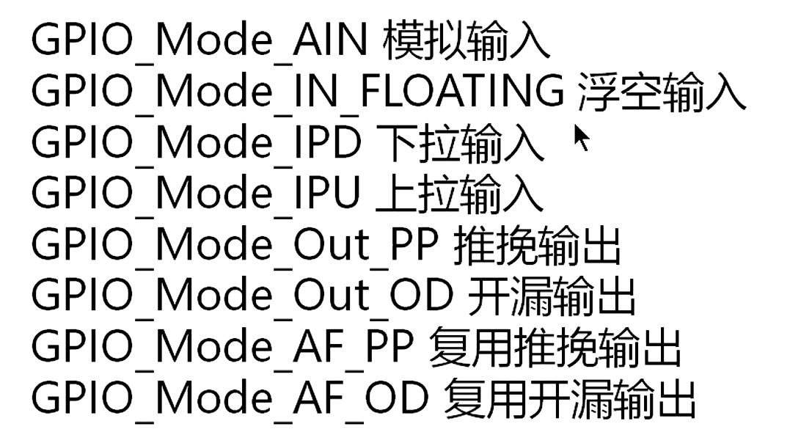
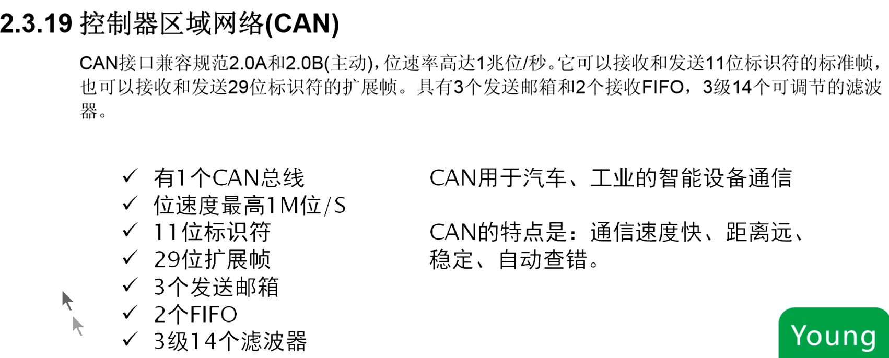
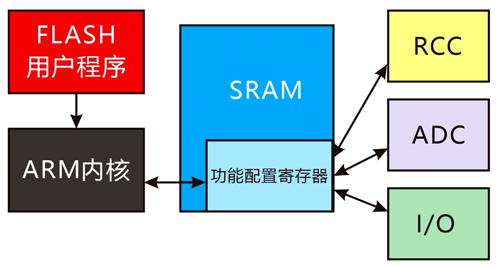
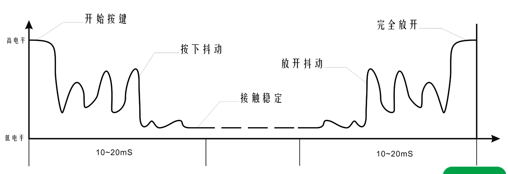

 嵌入式系统就是在成本和性能之间做出最优的选择

STM32芯片可以理解为一个需要外部更准确时钟系统和供电的一个小型集成电脑。STM32中集成了固定大小的RAM和FLASH，不可扩容

# RISC(精简指令集计算机)和CISC(复杂指令集计算机)的区别

RISC更倾向于单片机这种小型化微处理器控制设备；RISC更倾向于大型计算机电脑

RISC(精简指令集计算机)典型代表：x86

CISC(复杂指令集计算机)典型代表：ARM

参考：[精简指令集计算机 - 维基百科，自由的百科全书 (wikipedia.org)](https://zh.wikipedia.org/wiki/精简指令集计算机)

# ARM发展历史，型号分类


## 型号命名规则


需要理解的是：这个闪存储存器的容量是指STM32内部的FLASH容量，是不可变的。

# 数据手册阅读

手册的第一页一般会展示这个芯片的优势、功能、适用型号。


核心功能相当于人的心脏，缺一不可，核心功能越好，单片机的功能越强大。核心功能全系列单片机都相同，是每个系列单片机的最大特色。

重要功能是辅助性的，能帮助单片机更完善。每一款单片机的重要功能都不同，是每一款单片机的特色。用于协助核心完成一些核心不能达到的，帮助用户开发的功能。

通信功能是基于现有的成熟的通信协议帮助核心与外部期间进行通信，这种通信方式比开发者想出来的利用I/O口开发的通信方式要方便快捷的多。

附加功能是一些锦上添花的小功能。

## 不同型号的STM32速度对比


## SRAM和FLASH特性对比


SRAM的读取就是零等待周期读取。


## 时钟、复位和电源管理


如果需要生活中如石英钟一样的人类时钟，需要单片机有RTC振荡器。单片机中所说的时钟是产生固定脉冲基准的石英晶振或者内嵌的RC振荡器。

内嵌的高速RC振荡器给ARM内核使用，内嵌的低速时钟给RTC使用。

PLL是51单片机中没有的一个功能。

STM32自带的这个RTC振荡器只需要接一个外部晶振就可以工作了。

51单片机若要实现RTC(实时时钟)的功能，需要一个DS1302之类的RTC时钟芯片。

参考：[基础——内部RC振荡电路、外部晶振、RCC、RTC_单片机主晶振和rtc晶振的区别-CSDN博客](https://blog.csdn.net/wangguchao/article/details/104298840)


### RC振荡器示意电路


### 晶体振荡器示意电路


### 单片机时钟周期示意图

## 低功耗


 使用外部电源供电时，不需要考虑低功耗模式，只有在使用电池供电时，才需要考虑使用低功耗模式。


在待机模式下，由于SRAM中的所有内容全部消失，相当于所有程序全部终止。所以唤醒的方式必须是复位级别的。

## ADC

### 介绍


双采集和保持功能：双通道采集和保持功能。

可以通过ADC读取芯片内置的温度传感器的温度值，从而完成对芯片温度的监测功能。

### 概述


### 支持DMA的ADC


## DMA

### 介绍


### 概述


### 原理示意图


图中的红色线表示DMA传输，黑色线表示传统传输方式。

## I/O端口

### 介绍


其中绝大部分IO口都是多功能复用，如果IO口不够使用，可以使用外部的逻辑电路扩展IO口，当然也可以换引脚更多的STM32芯片。16个外部中断可以通过程序设置映射到任何一个IO端口上（这为硬件电路设计提供了便利，不需要再设计电路的时候考虑哪个端口需要中断，从而把它单独留出来）。

几乎所有容忍5v翻译不当，应该是**大部分兼容5v**。因为很多芯片都是用的TTL电平标准，所以兼容5v是很有必要的。

### 概述


多数的IO口都能与数字或模拟的复用外设共用（既能进行1，也能进行2，不同的时段下，进行1还是2由用户程序决定）


翻转速度：最快的高低电平之间的转换速度。

#### 输入输出模式



* 模拟输入：作为ADC输入，输入模拟量。引脚为高阻状态，不带电平。本身没有任何电压电流， 等着外部电流进来，读电压值（模拟信号）。只用在ADC输入。或若不想让此IO口影响外部电路状态，也可以设置成模拟输入。（why）
* 浮空输入：上拉电阻和下拉电阻都不加。引脚为高阻状态，不带电平。读数字信号
* 下拉输入：接（弱）下拉电阻输入。设置IO端口默认（什么都不接）状态为低电平。
* 上拉输入：接（弱）上拉电阻输入。设置IO端口默认（什么都不接）状态为高电平。一般情况下用这个比较多。
* 推挽输出：输出电流大。可以驱动一些mA级（根据电气特性，最高不超过灌电流20mA）电流的器件。一般情况下都使用推挽输出。因为推挽输出也可以达到输出电平的目的。
* 开漏输出：输出一个代表数字信号的电平。弱电流，电流驱动力差。没有上拉或下拉电阻。所以在需要上拉电阻或下拉电阻时，需要外接。一般很少用。
* 复用推挽输出：使用复用功能时设置。特性与推挽输出相同。
* 复用开漏输出：使用复用功能时设置。特性与开漏输出相同。

#### IO端口内部接口示意图


黄色三角为输入放大器（这个器件比较特殊。即使处于输出状态也可以读IO端口的电平，也就是说即使处于输出状态也会工作），绿色三角为输出放大器。两个电阻分别为上拉电阻和下拉电阻。

### 电气特性

#### 通用输入/输入特性


#### 输出驱动电流


**需要注意的是：<u>GPIO可吸收或输出输出电流为+/-8mA，但能吸收+20mA电流。也就是说灌电流能力比拉电流能力大得多，所以在驱动需要大电流的器件时，使用灌电流的方式。</u>**

#### 交流特性


### 引脚定义


由于封装的不同，并不是所有的GPIO端口都被列出来。


上图标注了所有的端口复用规则，带下划线的端口可以兼容5v电压，可以用来兼容一些TTL器件。

在设计电路时，要考虑功能的复用进行设计。

1. 与晶振有关的引脚一般连接晶振。
2. ADC复用的IO口最后考虑是否占用
3. SPI总线用的较少，可以占用1组。有时两组都可占用。
4. USART1的发送和接收端一般用于下载程序，不占用。
5. 高级定时器TIM1的引脚慎重占用（因为高级定时器只有一个）
6. BOOT0和BOOT1与启动模式有关，一般不占用。
7. 加粗的部分上电一瞬间为JTAG调试端口，需要人为修改成IO端口才能使用。
8. 可重定义的引脚的意思是指当一些端口的某些功能因引脚占用无法使用时，可以将这些功能重定义到其他的引脚上。例如CAN_RX和CAN_TX本来定义在32脚和33脚，通过重定义功能可以定义在5脚和6脚，或者重定义在45和46脚。

## 调试模式


arm内核自带的调试功能，不需要外配一个用于调试的电路模块。

SWD为串行单线调试方式，JTAG为并行多线调试方式。


## 定时器


### 通用定时器


### 高级控制定时器


### 看门狗定时器

看门狗分为独立的和窗口型两种


二者最主要的区别：[窗口看门狗和独立看门狗区别_为什么窗口看门狗的诊断覆盖率大于普通看门狗-CSDN博客](https://blog.csdn.net/CSDNmianfeixiazai001/article/details/79493899)

### 系统滴答定时器


[为什么windows不是实时操作系统_windows实时性不可控-CSDN博客](https://blog.csdn.net/qq_17259829/article/details/36936225)

[【000 操作系统】实时操作系统和分时操作系统的区别_实时操作和分时操作的区别-CSDN博客](https://blog.csdn.net/qq_41709234/article/details/131977849)

通过滴答定时器，可以编程设置处理每个任务固定的时间段。

在51单片机中，需要使用CPU产生时间计算，而在STM32中，可以使用滴答定时器来避免这种对CPU的消耗。


普通定时器一般在用户程序需要精准定时，或者PWM输出时使用。

高级定时器比普通定时器增强了电机控制的能力。

窗口看门狗可以作为普通定时器使用，也可以作为一个专用的看门狗定时器。

独立看门狗一般作为一个高稳定性(独立)的看门狗定时器。

## 通信接口

通信接口是单片机与外部设备通信的方式。

虽然IO接口可以模拟出一些通信接口的功能，但本质上他并不是通信的专用接口。

通信接口是主单片机与外部从设备的专用通信接口。


总线：一个主设备下面挂载多个从设备，通过一条通信线通信的方式。

只有一条连接线连接到一个设备，这种叫单线通信。一般对于单线通信进行称呼时，直接称呼为通信接口。

[通信类型介绍:同步通信、异步通信、并行通信、串行通信、单工、半双工、全双工 - 知乎 (zhihu.com)](https://zhuanlan.zhihu.com/p/376878483)

### I2C总线


最初，I2C总线的运行速度被限制在100 Kbit /s。随着时间的推移，对该规范进行了多次补充，现在有五种运行速度模式，如下表所示：

| **速度模式**        | **最高比特率（ bit/s）** | **备注**                       |
| ------------------- | ------------------------ | ------------------------------ |
| 标准模式（Sm）      | 100K                     | 双向传输，高速模式兼容低速模式 |
| 快速模式（Fm）      | 400K                     |                                |
| 快速模式增强（Fm+） | 1M                       |                                |
| 高速模式（HSm）     | 3.4M                     |                                |
| 超快速模式（UFm）   | 5M                       | 单向传输，不兼容其他模式       |

#### 连接示意图


板级总线：一般在板内部或板和板之间进行通信。

### USART


IrDA SIR ENDEC传输编解码是一种红外线的编解码方式、ISO7816是一种智能卡的通信协议。二者在实际使用时很少用到(用处不大)。

协议方式和通信接口：通信接口是物理上几个插针，每个插针负责什么功能。协议方式是一种如何应用通信接口的约定(规定)。

[什么是同步通信？什么是异步通信？两者的优缺点是什么？_什么是同步通信方式和异步通讯方式？它们各有何有缺点？-CSDN博客](https://blog.csdn.net/qq_33738357/article/details/134119159)

异步通信下，为保证双方的数据帧识别规则一致，需保证发送端和接受端的波特率统一。避免出现主机认为一个'1'的高电平时间需要达到10ns，从机认为一个'1'的高电平时间需要100ns。

而波特率由设备主时钟决定。当主机和从机的主频不同时，为实现相同的波特率，主机和从机在传输端口需要乘上不同的分频系数，从而达到相同的波特率。

同步通信下，为保证双方数据帧识别规则一致，在传输端口加上了一条时钟同步线，此时传输端口的时钟频率要统一。

二者的区别和特点详见：[异步通信和同步通信简单对比 - 知乎 (zhihu.com)](https://zhuanlan.zhihu.com/p/618626228)

#### 常用方式


一般PC机都会有RS232接口，可以通过这个接口将单片机和PC机进行通信。

参考链接：[RS232接口与RS485接口的区别 - 知乎 (zhihu.com)](https://zhuanlan.zhihu.com/p/228366239)

### SPI


SPI接口常用在高速的板级设备间通信。一些常见的显示屏都使用的是SPI接口。

#### 连接示意图


SPI协议中，每个从设备的CS线需要单独与单片机进行连接，不能并联，这是SPI与I2C通信的一个很重要的区别。I2C在完成与从设备进行通信时，采用的是先发送从设备地址，在进行通信的方式。(可以理解为通过门牌号找到通信对象的方式)。而SPI协议简单粗暴的给每个从设备一个专门的开关接口，从而完成主设备与从设备通信的开关。

SPI协议与I2C协议相比，显然的缺点是：SPI协议不能接过多的从设备，因为每个设备都需要单片机单独分配一根引脚控制从设备的开关。当然，这种浪费硬件资源带来的好处是：SPI协议相比I2C协议通信速度更快，通信更稳定。(因为取消了软件寻址的操作，所以加快了速度，同时避免了软件寻址的犯错)

### CAN总线(控制器区域网络)

传统的总线中，主设备和从设备的地位是出场固定的，一个机器集成上主设备的接口就是主设备，集成上从设备的接口就是从设备。而CAN总线与传统的总线所不同的是，CAN总线是一个网络，在网络当中，每一个设备既可以做主设备，也可以做从设备。



#### 连接示意图


一般情况下，CAN总线网络中的设备数量不会接太多，因为设备的数量越多，CAN总线的协议越复杂，速度也越慢。

CAN总线的设备是比较常见的，常见的比如楼宇控制系统中单元门下面呼叫的门铃、摄像头智能云台。

未来重点讲解

### USB(通用串行总线)


USB协议有主机控制器和设备控制器两种。主机控制器的地位相当于PC机(主设备)，可以外接鼠标键盘等多个USB外设，设备控制器的地位相当于外接鼠标、键盘(从设备)，用于连接主机控制器提供服务。

USB协议不是总线。主设备不能通过一组接口连接多个USB从设备。

#### 连接示意图

电脑端接出的5v需要通过稳压芯片转换成3.3v输出给STM32。

过于复杂，未来讲解例程和关键点。

## CRC校验


CRC校验用于检测FLASH在读写时是否出错。

### 工作原理示意图


## 芯片ID


如何查看芯片ID


也可以使用读取对应寄存器的方法查看芯片ID

芯片ID作用


## 数据手册首页没有提到的功能

### 嵌套的向量式中断控制器(NVIC)


中断：当单片机的内核在处理一些工作时，外部突如其来的工作打断当前的工作。

中断优先级：多个突发工作同时到来时，优先处理哪个。

NVIC控制所有的中断的顺序，相当于CPU的第一秘书。

### 外部中断/事件控制器(EXTI)


EXTI控制外部中断，也即是I/O口产生的中断，这些终端只是所有中断中的一部分。所有中断还包括比如定时器产生的中断，通信接口产生的中断等。所以EXTI相当于CPU的第二秘书。

### 时钟和启动


### 自举模式


用于下载程序

### STM32F103xx增强型模块框图


# STM32F103C8T6接口定义

## 洋桃一号开发板结构设计


## 单片机接口定义


对于GPIO，USART，ADC，定时器这一系列可以复用的功能，用户可以使用程序来控制使用什么功能。


BOOT0和BOOT1两个引脚决定了单片机以什么方式启动。

## 核心板接口定义


# 最小系统电路

单片机最小系统，就是保持单片机正常工作的最基本的、最必要的外围电路的部分。其中包括时钟电路、复位电路、电源电路。

最基本的功能：


其中，内核和存储器只需要供电就可以工作了。时钟有两种选择，第一种是内部的RC振荡器，第二种是外部的晶体振荡器。若采用外部的晶体振荡器(常用方式)，需要配备外部时钟电路。复位功能：STM32内部集成了自动复位功能(上电、断电时)，也可以外接复位电路(常配备)。电源管理：单片机供电的供电电源，包括逻辑(数字)电源和模拟电源。

## 最小系统电路原理图

### UART下载接口电路原理图


原理图的外接电路包括：电源管理电路、时钟电路、复位电路。

电源管理电路：3.3V的电源输入采用USB下载模块中提供的3.3V电源。实际上可以使用各种3.3V稳压电源的电路。图中**红色线**为正极输入，输入给单片机的3个逻辑电源输入引脚VDD_1、VDD_2、VDD_3，一个模拟电源输入引脚VDDA 。因为这个电路主要是用于教学，所以对ADC等模拟电路读取的模拟电压值没有一个精准的要求，所以模拟电源可以和逻辑电源公用（如果是在实际情况下对ADC的使用，则需要单独接相应的电压的VDDA）。图中**黑色线**为负极地线，连接单片机3个逻辑地VSS_1、VSS_2、VSS_3，一个模拟地VSSA。VBAT引脚为备用电源，可以使用一个3V的纽扣电池作为备用电源，纽扣电池的另一端接逻辑地。这个电池主要是给内部RTC（实时时钟）供电，如果不想使用RTC，也可以不连接。在单片机逻辑电源的部分，一共在正极和地之间并联了6个电容（位于图的右侧）：C6、C7、C8、C9、C10、C11；其中前五个是0.1u的104的电容，C11是一个电解电容。并联这些电容的目的是为了给电源滤波，让单片机有一个更稳定的没有工作噪声的工作环境。这些电容在电路设计的时候应该围绕着单片机的周围布线，以达到最佳的滤波效果。


时钟电路：**紫色线**的部分表示的是外部时钟电路。Y1的32.768KHz晶振用于供给RTC时钟，Y2的8MHz晶振用于供给系统时钟，如果两者想使用内部的RTC(RC)振荡器，那么都可以舍去（一般情况下保留）。C1和C2是Y1这个32.768KHz晶振的起振电容，是帮助晶振起振的，能供帮助晶振从断电进入正常工作状态。同理，C3和C4的作用也是一样的。不同的是，Y1晶振内部的匹配电容一般可以帮助它起针，所以C1和C2可以省去。但C3和C4一般不能省去，万不得已时可以省去C3，但不能省去C4。Tips：在实际设计中，一般4个电容均不舍去。Y1的晶振不可替换为其他频率的，Y2的晶振频率可从4-16MHz晶振中进行选择（数据手册中的规定，可以查到）。

复位电路：**绿色线**引出第七脚NRST为复位电路，K3为一个微动开关，对应着开发板上的复位按键，并联一个0.1u的电容，起到一个滤波的作用，能够硬件上一定程度消除按键抖动。同时上面连接了一个上拉的10k电阻，其实在单片机内部集成了这样的上拉电阻，实现NRST的引脚功能。为了形成一个的外部RC复位电路的结构并防止NRST引脚悬空，仍连接这样一个10k的上拉电阻。当K3没有按下，每次上电时，R1和C5他们形成一个RC复位电路。

[RC复位电路原理及其复位时间的计算_rc复位低电平有效-CSDN博客](https://blog.csdn.net/yundanfengqing_nuc/article/details/82782414)

正常情况下，单片机外部设计好了这三部分的电路结构就已经可以正常工作了。但是正常工作不是目的，我们还需要给单片机烧写程序，以及设计单片机的启动模式。所以我们还需要两部分电路。

第一部分就是给单片机写入程序的USART串口，也就是我们ISP功能使用的串口。STM32规定是使用USART这个串口给单片机烧写程序的。USART串口有两根数据线，一根接受，一根发送。串口下载，不仅需要连接两根收发线，还需要共地。也就是**USB转TTL电平的模块**的GND需要与单片机的GND相连。


有了这个部分，单片机就可以通过串口接受电脑烧写的程序了。但是单片机怎么知道什么时候需要接受串口的程序，什么时候需要自己运行程序呢？所以单片机就需要有一个启动模式的设置选项。这个选项就是第二部分启动模式的设置。

启动模式的设置是通过硬件的两个接口来实现的，他们是44脚的BOOT0和20脚的BOOT1，通过这两个引脚电平变化的组合，便能够决定单片机以什么方式启动，或是接受电脑端的程序，或是自己运行程序。BOOT0是一个独立的引脚，专门用来设置这两个模式的选择。而BOOT1是与PB2这个IO端口复用的。


所以K1和K2两个开关就是切换启动模式的。R2的10K下拉电阻是为了当K1断开时将K1的电阻值拉底。当K1导通时，BOOT0变成高电平。K2这一端，没有加上拉电阻或下拉电阻，是因为K2这一段本身是一个IO端口，如果加了上拉电阻或者下拉电阻，对于IO端口的使用会有影响。但单片机复位默认的情况是，PB2端口内部有一个上拉电阻，所以当K2断开时，PB2这个端口处在高电平，当K2闭合时，PB2这个端口接地，处于低电平也就是说，在每次单片机复位之前（上电之前），我们先要设置好K1和K2这两个开关，设置好启动模式。在洋桃1号开发板上，集成了一个自动下载器，所以更加方便。


# Keil工程结构

点开Target1，可以看见一个工程的全部文件夹。一个工程一般包含几个文件夹：CMSIS，Lib，Startup，User，Basic，Hardware。


CMSIS：内核驱动程序。包含了两个C语言文件，主要任务是ARM内核和单片机系统的基础文件，这两个文件由ST公司官方提供，一般不做修改。


Lib：内部功能的基本函数库。由ST公司官方提供。开发者需要根据自己编写的程序中涉及到什么功能，自己增减库文件。例如下图中的usart文件是使用usart串口时所需要的文件，如果不使用usart串口，则可以删除。


Startup：单片机启动文件。由汇编语言编写的，负责单片机的启动，因为单片机的内部结构十分复杂，所以启动必须使用效率更高的汇编语言。由ST公司官方提供，一般不做修改。


User：用户程序。`main.c`就是用户的主程序了。`stm32f10x_it.c`也是库文件中的一个。`stm32f10x_it.c`由ST公司官方提供，一般不做修改


Basic：内部功能的驱动程序。`delay.c`为由用户自己编写的延时函数。`sys.c`也是库文件中的一部分，由ST公司官方提供，一般不做修改。


Hardware：外部硬件的驱动程序。由用户自己编写（github上有成熟的大公司驱动可以直接拿来借鉴）。驱动程序的文件命名要有意义。`led.c`是led灯光的驱动，`key.c`是按键的驱动。


# 固件库的安装

固件库：ST公司为方便开发者使用，将一些通用的、常用的底层硬件的驱动程序，事先写好提供给开发者的库文件。

每个Keil工程文件中都包含一部分固件库文件。

用户程序操作硬件的原理如下图所示。用户程序是存放在Flash中的。被用户调用时，会被ARM内核读取，根据用户程序的内容，ARM内核会操作SRAM中的功能配置寄存器。功能配置寄存器是多组普通32位寄存器，它们的每一组、每一位都是由ST公司出场时设定好的功能位。他们的每一位置0或者置1都会对硬件的设置产生变化。



STM32硬件到软件的几个层次如下图所示。最基础的是硬件部分，硬件部分由功能配置寄存器来进行操作，底层驱动程序操作功能配置寄存器，用户应用程序操作底层驱动程序。用户需要编写的程序包括底层驱动程序和用户应用程序。用户应用程序时根据项目开发要求来编写的程序，底层驱动程序是将用户应用程序和功能配置寄存器之间做一个中转连接。最终达到用户应用程序操作硬件的效果。用于应用程序是根据开发项目要求所编写的不同的程序。底层驱动程序是STM32常用的、标准的一部分程序。安装的固件库就属于底层驱动程序。


回看时钟树时，发现各个图形上方的英文，如：PLLSRC、PLLMUL、SW……这些都是相应配置功能寄存器的名字。操作PLLSRC寄存器，就能切换时钟输入源；操作PLLMUL寄存器，就能切换倍频的倍数。框图当中所有操作硬件决定时钟频率的部分，都是由图中的寄存器操作的。


基于上面的原理，STM32单片机有3种编程方案，如下图所示。


STM32Cube是ST公司近年来主推的一款图形化编程软件。但万变不离其宗，寄存器操作和标准固件库的开发是帮助理解开发工作的根本。标准固件库的开发仍然是现行的主流开发方式。

# 核心板设计图解


* 主单片机：STM32F103C8T6
* 主晶振：8Mhz晶振。用于电路的时钟系统。
* 带继电器的电子开关：用来做整个电源的电气开关。
* ASP指示灯：显示ASP控制芯片的相应状态。
* MODE按键：用于控制ASP芯片相应的功能。
* LED1：用户LED灯1。
* LED2：用户LED灯2。


* FT232(或CH340)芯片：用于将USB接口转换为TTL电平的USART串口。用户可以通过这个串口来给单片机做ISP程序下载，也可以通过这个串口做电脑的应用开发。
* 3.3v稳压芯片(LM1117-3.3)：将USB的5v电压转换为3.3v电压，来给单片机以及单片机周边使用3.3v电压的元器件供电。
* ASP控制芯片：实现核心板单片机程序的自动下载。
* RTC晶振：32.768KHz晶振
* RC复位电路：单片机外部复位电路。
* RTC备用电池：3v纽扣电池。
* 无源蜂鸣器：单片机可以通过输出一个有频率的脉冲来控制这个蜂鸣器发出一定的声音。

# 程序设计

## 点亮LED灯

海创提示


### 寄存器方法程序设计思路(海创)

#### 寄存器操作

1. 打开对应端口的时钟

   ```c
   *(unsigned int*) 0x4002 1018 |= (1<<4);
   ```

2. 配置输出，确定输出模式

   ```c
   *(unsigned int*) 0x4001 1004 &= ~(0x0F<<(20));
   *(unsigned int*) 0x4001 1004 |= (1<<20);
   ```

   

3. 输出低电平

   ```c
   *(unsigned int*) 0x4001 100C &= ~(1<<13);	// 寄存器输出高电平方法
   *(unsigned int*) 0x4001 1004 |= (1<<13);	// 寄存器输出低电平方法
   ```

#### 将寄存器地址宏定义成名字增强可读性


```c
#define RCC_APB2ENR (*(unsigned int*)0x4002 1018)
#define GPIOC_CRH (*(unsigned int*)0x4001 1004)
#define RPIOC_ODR (*(unsigned int*)0x4001 100C)

RCC_APB2ENR |= (1<<4);
GPIOC_CRH &= ~(0x0F<<20);
GPIOC_CRH |= (1<<20);
GPIOC_ODR &= ~(1<<13);	// 输出低电平，点亮
GPIOC_ODR &= (1<<13);	// 输出高电平，熄灭
```

#### 通过定义基地址和偏移量定义寄存器地址，增强可读性

```c
/***************头文件stm32f10x.h**********************/
#ifndef STM32F10X_H
#define STM32F10X_H

#define PERIPH_BASE ((unsigned int) 0x4000 0000)
#define APB2PERIPH_BASE (PERIPH_BASE + 0x0001 0000)
#define AHBPERIPH_BASE (PERIPH_BASE + 0x0002 0000)

#define GPIOC_BASE (APB2PERIPH_BASE + 0x1000)
#define GPIOC_CRH *(unsigned int*)(GPIOC_BASE + 0x04)
#define GPIOC_IDR *(unsigned int*)(GPIOC_BASE + 0x08)
#define GPIOC_ODR *(unsigned int*)(GPIOC_BASE + 0x0C)

#define RCC_BASE (AHBPERIPH_BASE + 0x1000)
#define RCC_APB2ENR *(unsigned int*)(RCC_BASE + 0x18)

#endif
```


### 库函数方法程序设计(杜洋)

IO端口在使用之前必须要进行初始化，初始化的内容包括：

* 端口号是多少
* 端口是用来输入还是用来输出
* 输出的话，输出的速率是多大

IO端口的初始化使用IO端口的初始化结构体完成。


```c
/*
LED灯对应的单片机端口初始化的设计
*/

#define LEDPORT GPIOB   //定义IO接口
#define LED1 GPIO_PIN_0 //定义IO接口
#define LED2 GPIO_PIN_1 //定义IO接口

void LED_Init(){
    GPIO_InitTypeDef GPIO_InitStructure;	//定义一个GPIO初始化结构体
    	RCC_APB2PeriphClockCmd(RCC_APB2Periph_GPIOA|RCC_APB2Periph_GPIOB|RCC_APB2Periph_GIOC,ENABLE);	//开启APB2总线上的一些功能，这里开启的是GPIOA、GPIOB、GPIOC
    GPIO_InitStructure.GPIO_Pin = LED1 | LED2;	//选择初始化端口的端口号
    GPIO_InitStructure.GPIO_Mode = GPIO_Mode_Out_PP;	//选择初始化端口的工作模式	因为要使用大电流来驱动LED灯，所以使用推挽输出模式
    GPIO_InitSturcture.GPIO_Speed = GPIO_Speed_50MHz;	//选择IO端口的输出速度（输入不需要设置这个选项）（2/5/10MHz）（一般选用10MHz）
    GPIO_Init(LEDPORT, &GPIO_InitSturcture);	//将相应的设置写入IO端口的寄存器中
} 

/*
选择IO接口工作方式：
GPIO_Mode_AIN 模拟输入
GPIO_Mode_IN_FLOATING 浮空输入
GPIO_Mode_IPD 下拉输入
GPIO_Mode_IPU 上拉输入
GPIO_Mode_Out_PP 推挽输出
GPIO_Mode_Out_OD 开漏输出
GPIO_Mode_AF_PP 复用推挽输出
GPIO_Mode_AF_OD 复用开漏输出
*/
```

## LED灯闪烁

在点亮LED灯的基础上，让LED等延时一段时间关闭，再延时一段时间点亮。

延时：单片机空等待。

STM32的延时程序一般使用滴答定时器进行精准延时，比51单片机使用循环延时准确得多。

```c

/*
//杜洋工作室出品
//洋桃系列开发板应用程序
//关注微信公众号：洋桃电子
//洋桃开发板资料下载 www.DoYoung.net/YT 
//即可免费看所有教学视频，下载技术资料，技术疑难提问
//更多内容尽在 杜洋工作室主页 www.doyoung.net
*/

/*
《修改日志》
1-201708271933 加入了秒延时函数。
2-201712260223 加入延时前计数器值清0，解决连续用uS延时的BUG问题。


*/


#include "delay.h"


#define AHB_INPUT  72  //请按RCC中设置的AHB时钟频率填写到这里（单位MHz）


void delay_us(u32 uS){ //uS微秒级延时程序（参考值即是延时数，72MHz时最大值233015）	
	SysTick->LOAD=AHB_INPUT*uS;      //重装计数初值（当主频是72MHz，72次为1微秒）
	SysTick->VAL=0x00;        //清空定时器的计数器
	SysTick->CTRL=0x00000005;//时钟源HCLK，打开定时器
	while(!(SysTick->CTRL&0x00010000)); //等待计数到0
	SysTick->CTRL=0x00000004;//关闭定时器
}

void delay_ms(u16 ms){ //mS毫秒级延时程序（参考值即是延时数，最大值65535）	 		  	  
	while( ms-- != 0){
		delay_us(1000);	//调用1000微秒的延时
	}
}
 
void delay_s(u16 s){ //S秒级延时程序（参考值即是延时数，最大值65535）	 		  	  
	while( s-- != 0){
		delay_ms(1000);	//调用1000毫秒的延时
	}
} 

/*********************************************************************************************
 * 杜洋工作室 www.DoYoung.net
 * 洋桃电子 www.DoYoung.net/YT 
*********************************************************************************************/
```

此处的延时程序为了提高效率，采用了寄存器的编程方法。暂不需要掌握。**经过测试，延时程序的时间不能为0，会出错，实际产生的效果是无限延时（猜测可能是将定时器关闭导致的）。**

由于计时器的计时与系统时钟频率有关，所以必须要知道单片机系统时钟频率。

## LED呼吸灯

呼吸灯的效果是指LED灯由暗变亮，由亮变暗就像是呼吸一样的过程。

实现呼吸灯的原理要理解两个内容：视觉暂留效果和占空比调节灯的明暗。


视觉暂留：当周期缩短到一定程度时，LED灯在人眼中就是常亮的。

占空比调节LED明暗：当一个周期中的高电平占比越大，灯的亮度越亮。

```c
/*********************************************************************************************
 * 杜洋工作室 www.DoYoung.net
 * 洋桃电子 www.DoYoung.net/YT 
*********************************************************************************************/
/*

【变量定义】
u32     a; //定义32位无符号变量a
u16     a; //定义16位无符号变量a
u8     a; //定义8位无符号变量a
vu32     a; //定义易变的32位无符号变量a	易变型主要用在中断处理当中
vu16     a; //定义易变的 16位无符号变量a
vu8     a; //定义易变的 8位无符号变量a
uc32     a; //定义只读的32位无符号变量a	只读一般作为固定参数
uc16     a; //定义只读 的16位无符号变量a
uc8     a; //定义只读 的8位无符号变量a

#define ONE  1   //宏定义

delay_us(1); //延时1微秒
delay_ms(1); //延时1毫秒
delay_s(1); //延时1秒

*/
```

## 按键控制LED

按键控制LED的关键是考虑按键的抖动，这个抖动一般为10ms-20ms之间。编程时需要软件去抖。



```c
/*********************************************************************************************
模板制作：  杜洋工作室/洋桃电子
程序名：	按键控制LED程序
编写人：	杜洋	
编写时间：	2017年12月29日
硬件支持：	STM32F103C8   外部晶振8MHz RCC函数设置主频72MHz　  

修改日志：　　
1-	改写实例4
	
							
说明：
 # 本模板加载了STM32F103内部的RCC时钟设置，并加入了利用滴答定时器的延时函数。
 # 可根据自己的需要增加或删减。

*********************************************************************************************/
#include "stm32f10x.h" //STM32头文件
#include "sys.h"
#include "delay.h"
#include "led.h"

#include "key.h" 

int main(void) {
	u8 MENU;	//菜单选项，用于实例4
	RCC_Configuration();	//时钟初始化
	LED_Init();	//LED初始化
	KEY_Init();	//KEY初始化

	MENU = 0;	//菜单选项变量初始化

	while(1) {
		// 实例1：无锁存
		// if(!GPIO_ReadInputDataBit(KEYPORT, KEY1)) {	// 按键按下时
		// 	GPIO_WriteBit(LEDPORT, LED1, Bit_SET);	// LED灯点亮
		// } else {	// 按键断开时
		// 	GPIO_WriteBit(LEDPORT, LED1, Bit_RESET);// LED灯熄灭
		// }
		// 实例2：无锁存
		// GPIO_WriteBit(LEDPORT, LED1, (BitAction)(!GPIO_ReadInputDataBit(KEYPORT, KEY1)));//LED状态与按键状态相反
		// 实例3：有锁存
		// if(!GPIO_ReadInputDataBit(KEYPORT, KEY1)) {// 读按键接口电平
		// 	delay_ms(20);	// 延时，软件去抖
		// 	if(!GPIO_ReadInputDataBit(KEYPORT, KEY1)) {//读按键接口电平
		// 		GPIO_WriteBit(LEDPORT, LED1, (BitAction)(!GPIO_ReadInputDataBit(LEDPORT, LED1)));	// LED灯状态取反
		// 		while(!GPIO_ReadInputDataBit(KEYPORT, KEY1));	// 等待按键松开
		// 	}
		// }
		// 实例4：有锁存
		if(!GPIO_ReadInputDataBit(KEYPORT, KEY1)) {// 读按键接口电平
			delay_ms(20);	//延时，软件去抖
			if(!GPIO_ReadInputDataBit(KEYPORT, KEY1)) {//读按键接口电平
				GPIO_Write(LEDPORT, MENU);//采用二进制的方法记录LED点灯的顺序
				MENU++;
				if(MENU > 3) {// MENU>3时，清零
					MENU = 0;
				}
				while(!GPIO_ReadInputDataBit(KEYPORT, KEY1));
			}
		}
	}
}
/*********************************************************************************************
 * 杜洋工作室 www.DoYoung.net
 * 洋桃电子 www.DoYoung.net/YT 
*********************************************************************************************/
/*

【变量定义】
u32     a; //定义32位无符号变量a
u16     a; //定义16位无符号变量a
u8     a; //定义8位无符号变量a
vu32     a; //定义易变的32位无符号变量a
vu16     a; //定义易变的 16位无符号变量a
vu8     a; //定义易变的 8位无符号变量a
uc32     a; //定义只读的32位无符号变量a
uc16     a; //定义只读 的16位无符号变量a
uc8     a; //定义只读 的8位无符号变量a

#define ONE  1   //宏定义

delay_us(1); //延时1微秒
delay_ms(1); //延时1毫秒
delay_s(1); //延时1秒

*/
```

在设计按键有关函数时，若是无锁的按键功能，则可以不加按键去抖。若是有锁的按键功能，则必须加上按键去抖。

## FLASH读写程序

 FLASH读写程序的效果和按键控制LED程序的效果相同，只不过加入了在FLASH中保存断电前LED灯状态的功能。

```c
/********************************************
FLASH读写功能函数
*********************************************/
//FLASH写入数据
void FLASH_W(u32 add,u16 dat){ //参数1：32位FLASH地址。参数2：16位数据
//	 RCC_HSICmd(ENABLE); //打开HSI时钟（FLASH功能必须在外部高速时钟或内部高速时钟打开时才能使用，由于目前已经打开了外部告诉时钟，所以注释掉了打开内部高速时钟HSI的内容。）
	 FLASH_Unlock();  //解锁FLASH编程擦除控制器（FLASH存储器主要是用来存放下载的应用程序的，为了防止程序出错所对FLASH进行的错误操作，ST单片机为FLASH操作设置了一个操作锁定，每次操作之前只有先解锁才能进行操作。）
     FLASH_ClearFlag(FLASH_FLAG_BSY|FLASH_FLAG_EOP|FLASH_FLAG_PGERR|FLASH_FLAG_WRPRTERR);//清除标志位
     FLASH_ErasePage(add);     //擦除指定地址页
     FLASH_ProgramHalfWord(add,dat); //从指定页的addr地址开始写
     FLASH_ClearFlag(FLASH_FLAG_BSY|FLASH_FLAG_EOP|FLASH_FLAG_PGERR|FLASH_FLAG_WRPRTERR);//清除标志位
     FLASH_Lock();    //锁定FLASH编程擦除控制器
}

//FLASH读出数据
u16 FLASH_R(u32 add){ //参数1：32位读出FLASH地址。返回值：16位数据
	u16 a;
    a = *(u16*)(add);//从指定页的addr地址开始读
return a;
}
/*对于FLASH读取数据的函数，这里做一个理解补充。
STM32的FLASH地址是4个字节的32位地址，而C语言中的指针类型的数据长度也是4个字节的长度，所以在进行(u16*)add的强制数据类型转换时不会出错。所以可以将一个STM32的FLASH地址存储在一个u32的unsigned int类型的变量中，再通过强制类型转换转换为u16*的unsigned short*的指针类型（所有指针类型的长度都是相同的）。这里需要注意的是，指针类型的长度随着操作系统的不同而改变(但是C语言默认的好像还是4个字节)。然后通过*的操作取出指针指向的数据。指针的不同类型影响的是取地址后向后读取的字节个数，与指针本身的长度无关。
参考：https://www.cnblogs.com/downey-blog/p/10469977.html
*/
```

FLASH写入函数解读：FLASH单片机主要是用来存放下载的应用程序的，为了防止程序出错导致对FLASH进行错误操作，ST单片机为FLASH操作设置了一个错误锁定，每次操作之前只有先解锁才能进行操作。解锁之后是清除标志位；然后是擦除指定的页地址（这里需要说明的是，只要给出需要擦除的页地址范围当中的任何一个地址，固件库程序就能够识别你要擦除哪一页）；接着是调用固件库写入数据（这里需要明确写入的地址位置和对应的数据）；再次清除标志位；给FLASH上锁。

FLASH储存形式：FLASH


主储存区就是FLASH内部的存储空间，单片机内部的FLASH空间是用地址来划分的。每一个地址就是一个16位的存储空间，FLASH的起始地址是0x08000000，结束地址是0x0801FFFF。当然，储存地址的格式是随着单片机型号和内部FLASH储存容量大小的不同而不同的。FLASH由将一定数量的地址分成页，可以方便FLASH进行页删除。FLASH进行擦除的时候，会以整页的方式进行擦除。比如在0x08000000重新写入一个数据时，需要将0x08000000所在的第0页所有地址的内容全部擦除，再对0x08000000重新写入。这种操作比较繁琐，但是它是由FLASH的硬件特性所决定的，所以上面这个表格必须要熟悉。

需要注意的是：用户下载的应用程序是保存在FLASH的第0页并从头开始的，占用的大小与用户程序的大小有关。用户在FLASH中保存内容的地址需要注意不能和用户程序保存地址相冲突。一般来讲都会把用户存放的数据放在比较靠后的地址当中，所以在今后的项目开发当中，如果要使用FLASH存储用户数据，就需要考虑到用户程序所占用的空间大小。然后在用户程序没有涉及到的空白区域，来存储用户的数据。

在想写入大量数据的时候，可以采用数组或指针的方式，但由于涉及的知识比较多，我们暂时先不介绍。


如果需要高速运行时，FLASH的擦除会不会影响速度，需要考虑。

```c++
#include <iostream>
using namespace std;
int main()
{
    /*定义16格式的int型数一枚*/
    int a = 0x12345678;      //其二进制为 0001 0010 0011 0100 0101 0110 0111 1000 
 
    short tx = (short)a;    //取出int型四个字节的最后16位的值，不论大小端模式存储，都是0x5678 
    cout<<tx<<endl;
 
    short b = *(short*)&a; 
    cout<<b<<endl;  
    /*可见输出结果是一模一样的，对于 short tx = (short)a; 很简单就是取出低16位的值，对于short b = *(short*)&a，这里先讲述一下
    short*的含义，表面上看short*是short类型的指针，short占2个字节，short*在内存中存储时占据4个字节，short*，int*，char*的本质
    区别在于使用*时候，取出地址中所存储的值。
    
    因为short占2个字节，所以 *(short*)执行步骤是取出short*的值，这个值是占据32位的一个地址，在执行*操作，
    *是从地址中取值，由于是short*的指针，说明了从起始地址（基本单位为1字节）开始，依次取出2个字节中存储的值，即 short b = *(short*)&a; 是取出从低位地址开始连续两个字节的值，如果是小端模式，那么从起始地址中取出的值就是0x5678，根据打印结果我们发现我的这个测试机是小端模式，
    
    总结：short*是在*(short*) 时候，是取出连续两个字节中的值，那么*（char*)的时候，便是取出地址中的值，不用在连续移位取值了，因为char是1字节，
    *(int*)的时候，是从首地址开始取出连续int型占据字节个数的字节数的值 
    */
    
    /*读到这里可能很好奇大端和小端有什么区别呢，
    大端模式就是在内存中高位存储低位字节的数值，小端模式就是在内存中低位存储低位字节的内容
    
    这两句话似乎难于理解或者很容易混淆，所以在这里举个例子，
    因为 a = 0x12345678;32位，4个字节，
    
    那么在小端模式中，加入存储a的起始地址值为：0x2345FF01，那么小端模式中存放方式：
    内存地址      字节值
    0x2345FF01     0x78
    0x2345FF02     0x56
    0x2345FF03     0x34
    0x2345FF04     0x12
    
    所谓的低位存储低位数据的值，就是起始一个字节存储的数据是数据的低位字节的值，数据的低位字节是最右一字节的为最低位 
    
    那么在大端模式中，加入存储a的起始地址值为：0x2345FF01，那么大端模式中存放方式：
    内存地址      字节值
    0x2345FF01     0x12    //低位地址存贮了数据的最高字节位 
    0x2345FF02     0x34
    0x2345FF03     0x56
    0x2345FF04     0x78
    所谓的高位存储低位数据的值，就是最后一个字节存储的数据是数据的低位字节的值，数据的低位字节是最右一字节的为最低位 
    */
    
    /*
    所以 short b = *(short*)&a;
    执行步骤为：
    首先，取出存储a值的32位的地址，4个字节，
    其次，转换为short*， 
    再次，*在取出地址中的值，这个值是2从地址开始，读取2个字节的长度的数值，
    如果是大端模式，首地址是低位存的是高位的值，高位值为1234,如果是小端模式 
    即后两个字节的值，后两个字节为0x5678，可见结果我这里是小端模式，大家不妨一试 
    */ 
   
    /*最后我们再来看一个例子，打印出int型数据的每个字节的数值的地址*/
    int i;
   // int num = 0x12345678;
    char* ptr = (char*) &a;
    for (int i = 0 ; i < 4; i++)
    {
        printf("%p\t%x\n", ptr, *ptr);
        ptr++;
    }
    
    system("pause");
    return 0;
} 
```

## 无源蜂鸣器驱动


### 开发板无源蜂鸣器电路原理图


通过一个经典的三极管开关电路控制蜂鸣器上电或者断电。PB5为低电平时，三极管导通，蜂鸣器上电；PB5为高电平时，三极管断开，蜂鸣器断电。由于使用的是无源蜂鸣器，上电时若没有给定蜂鸣器驱动频率，蜂鸣器线圈会长时间通电发热，进而烧毁蜂鸣器。为了防止此事件的发生，PB5端口应长时间保持高电平。为了在软件设计上即使不使用无源蜂鸣器也要打开PB5端口，故在PB5端口出加上一上拉电阻，保证在不使用时，端口电平上拉，进而保护无源蜂鸣器。

### 程序设计

程序设计遵循的第一要义是要保证蜂鸣器控制端口初始化和程序结束时一定保持在高电平防止损坏蜂鸣器。

```c
void BUZZER_Init(void){ //蜂鸣器的接口初始化
	GPIO_InitTypeDef  GPIO_InitStructure; 	
    GPIO_InitStructure.GPIO_Pin = BUZZER; //选择端口号                        
    GPIO_InitStructure.GPIO_Mode = GPIO_Mode_Out_PP; //选择IO接口工作方式       
    GPIO_InitStructure.GPIO_Speed = GPIO_Speed_50MHz; //设置IO接口速度（2/10/50MHz）    
	GPIO_Init(BUZZERPORT, &GPIO_InitStructure);	
	
	GPIO_WriteBit(BUZZERPORT,BUZZER,(BitAction)(1)); //蜂鸣器接口输出高电平1		
}

void BUZZER_BEEP1(void){ //蜂鸣器响一声
	u16 i;
	for(i=0;i<200;i++){
		GPIO_WriteBit(BUZZERPORT,BUZZER,(BitAction)(0)); //蜂鸣器接口输出0
		delay_us(500); //延时		
		GPIO_WriteBit(BUZZERPORT,BUZZER,(BitAction)(1)); //蜂鸣器接口输出高电平1
		delay_us(500); //延时		
	}
}
```

```c
int main (void){//主程序
	u16 a; //定义变量
	//初始化程序
	RCC_Configuration(); //时钟设置
	LED_Init();//LED初始化
	KEY_Init();//按键初始化

	BUZZER_Init();//蜂鸣器初始化
//	BUZZER_BEEP1();//蜂鸣器音1
	MIDI_PLAY(); //播放MIDI音乐

    a = FLASH_R(FLASH_START_ADDR);//从指定页的地址读FLASH
	GPIO_Write(LEDPORT,a|0xfffc&GPIO_ReadOutputData(LEDPORT)); //直接数值操作将变量值写入LED（LED在GPIOB组的PB0和PB1上）


	//主循环
	while(1){

		//示例4：有锁存
		if(!GPIO_ReadInputDataBit(KEYPORT,KEY1)){ //读按键接口的电平
			delay_ms(20); //延时20ms去抖动
			if(!GPIO_ReadInputDataBit(KEYPORT,KEY1)){ //读按键接口的电平
				//在2个LED上显示二进制加法
				a++; //变量加1
				if(a>3){ //当变量大于3时清0
					a=0; 
				}
				GPIO_Write(LEDPORT,a|0xfffc&GPIO_ReadOutputData(LEDPORT)); //直接数值操作将变量值写入LED（LED在GPIOB组的PB0和PB1上）
/*注：与运算优先级较高，1&x=x, 0&x=0, 1|x=1, 0|x=x, 0xfffc&GIO_readOutputData(LEDPROT)相当于将PBPORT中高位不变，最后两位置零，a|上一步的结果相当于PBPORT中的高位不变，最后两位变为a的二进制，这样避免了将高位全部置为0。这种操作也可以借鉴到其他控制整组端口并当想要保持某些位（端口）不变时。这里使用这种方法是为了保证PB5的电平不变(默认使用之后会置为高电平防止烧坏蜂鸣器)（但实际上这里控制了除PB、PB1外的所有端口保持不变）。这种方法比用两个变量分别记忆LED灯的亮灭状态更能节约FLASH资源*/
				BUZZER_BEEP1();//蜂鸣器音1

				FLASH_W(FLASH_START_ADDR,a); //从指定页的地址写入FLASH
				while(!GPIO_ReadInputDataBit(KEYPORT,KEY1)); //等待按键松开 
			}
		}
	}
}
```

控制某些位输出1或0 的方法：


## MIDI音乐播放程序

### 概述


### 程序设计

```c
uc16 music1[78]={ //音乐1的数据表（奇数是音调，偶数是长度）
330,750,
440,375,
494,375,
523,750,
587,375,
659,375,
587,750,
494,375,
392,375,
440,1500,
330,750,
440,375,
494,375,
523,750,
587,375,
659,375,
587,750,
494,375,
392,375,
784,1500,
659,750,
698,375,
784,375,
880,750,
784,375,
698,375,
659,750,
587,750,
659,750,
523,375,
494,375,
440,750,
440,375,
494,375,
523,750,
523,750,
494,750,
392,750,
440,3000
};

void MIDI_PLAY(void){ //MIDI音乐
	u16 i,e;
	for(i=0;i<39;i++)
    {
		for(e=0;e<music1[i*2]*music1[i*2+1]/1000;e++)
        /* 以第一个音调为例：for循环一次时间为1/频率s，故完整循环频率次为1s。乘上长度750为750s，/1000之后则为750ms*/
        {
			GPIO_WriteBit(BUZZERPORT,BUZZER,(BitAction)(0)); //蜂鸣器接口输出0
			delay_us(500000/music1[i*2]); //延时		
			GPIO_WriteBit(BUZZERPORT,BUZZER,(BitAction)(1)); //蜂鸣器接口输出高电平1
			delay_us(500000/music1[i*2]); //延时	
		}	
	}
}
```

