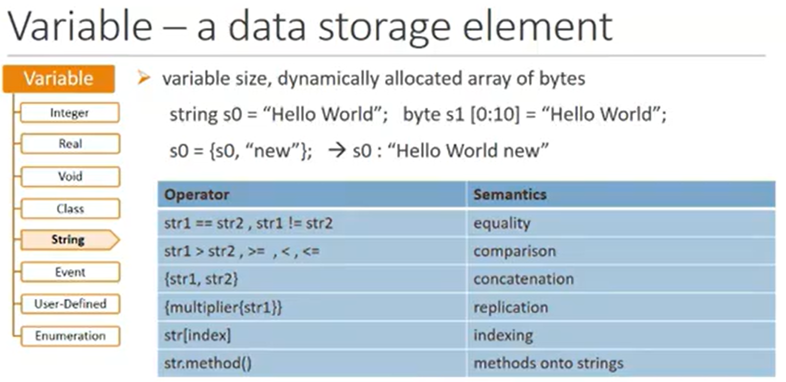

# How to verify ?


# Why System Verilog for Verification?


# System Verilog Features


# Basic types of System Verilog

[数据类型 | EasyFormal](https://easyformal.com/systemverilog/01.data-types/)

## Logic

* **logic** replaces **reg** of Verilog
* reg keyword gets confused with filpflop
  * user was not able to understand whether reg will derectly mapped with filp-flop, latch, or any other thing
  * But in System Verilog, user doesn't need to worry about that
* logic can be net or reg depending on usage
* logic is a 4 state data type

| 4-State value |               Represents               | Equivalent 2-State value |
| :-----------: | :------------------------------------: | :----------------------: |
|       0       |    logic zero or a false condition     |            0             |
|       1       |     logic one or a true condition      |            1             |
|       X       |    unknown logic value (don't care)    |            0             |
|       Z       | high-impedance state (open connection) |            0             |

**The advantage of having logic as data type is there is no need of port list rules.**

[SystemVerilog logic、wire、reg数据类型详解 - 知乎](https://zhuanlan.zhihu.com/p/38563777)

**SystemVerilog的logic类型**

SystemVerilog在Verilog基础上新增支持**logic**数据类型，**logic**是**reg**类型的改进，它既可被过程赋值也能被连续赋值，编译器可自动推断**logic**是**reg**还是**wire**。唯一的限制是**logic**只允许一个输入，不能被多重驱动，所以**inout**类型端口不能定义为**logic**。不过这个限制也带来了一个好处，由于大部分电路结构本就是单驱动，如果误接了多个驱动，使用**logic**在编译时会报错，帮助发现bug。所以单驱动时用**logic**，多驱动时用**wire**。

在[Jason的博客](https://link.zhihu.com/?target=http%3A//www.verilogpro.com/verilog-reg-verilog-wire-systemverilog-logic)评论中，Evan还提到一点**logic**和**wire**的区别。**wire**定义时赋值是连续赋值，而**logic**定义时赋值只是赋初值，并且赋初值是不能被综合的。

```verilog
wire mysignal0 = A & B;     // continuous assignment, AND gate
logic mysignal1 = A & B;    // not synthesizable, initializes mysignal1 to the value of A & B at time 0 and then makes no further changes to it.
logic mysignal2;
assign mysignal2 = A & B;   // Continuous assignment, AND gate
```

## Data Type Classification


## Groups of Data Object


## Net


个人理解，wire理解为导线，tri理解为三态导线，uwire理解为未连接的导线（只允许有一个驱动）。wor, trior分别是或门，三态或门；wand, triand分别是与门，三态与门。

multiple drivers多个驱动的意思是，对net类型的数据类型的数据进行多个逻辑驱动。例如：

```verilog
module abc ();
    wire a;
    wor b;
    wand c;
    tri data;
    logic bus0, bus1, s0, s1;
    
    // multiple drivers of a 
    assign a = bus0;
    assign a = bus1;
    
    // multiple drivers of b
    assign b = b0;
    assign b = b1;
    
    // multiple drivers of c
    assign c = b0;
    assign c = b1;
    
    // multiple drivers of data
    assign data = s0 ? bus0 : 1'bz;
    assign data = s1 ? bus0 : 1'bz;
    
    initial begin
        bus0 = 1'b1;
        bus1 = 1'b1;
        s0 = 1'b1;
        s1 = 1'b1;
        b0 = 1'b1;
        b1 = 1'b0;
        #1 $display{"a = %b, data = %b, b = %b, c = %b", a , data, b, c};
    end

endmodule
```

上述仿真文件的结果为

```shell
a = x, data = x, b = 1; c = 0;
```

根据仿真结果可知，当net类型出现multiple drivers的情况时，会按照上图的真值表进行输出。


在 SystemVerilog 中，**net 类型**（Net Types）用于建模物理信号线的行为，它们的值由驱动源决定（不能直接赋值，需通过连续赋值或模块端口驱动）。SystemVerilog 提供了多种 net 类型，每种类型对应不同的硬件行为和驱动冲突解决规则。以下是所有 **net 类型的详解**。

---

### **1. 基本 Net 类型**
#### **1.1 `wire`**
- **行为**：最常用的 net 类型，表示物理导线。
- **驱动冲突**：多个驱动源冲突时，结果为 `x`（未知态）。
- **默认值**：未驱动时为 `z`（高阻态）。
- **用途**：普通信号连接。
- **示例**：
  ```systemverilog
  wire a;
  assign a = b & c; // 通过连续赋值驱动
  ```

#### **1.2 `tri`**
- **行为**：与 `wire` 完全相同，仅用于提高代码可读性（表示三态信号）。
- **驱动冲突**：同 `wire`。
- **用途**：建模三态总线（但需配合三态驱动器使用）。
- **示例**：
  ```systemverilog
  tri [7:0] data_bus;
  assign data_bus = enable ? data : 'z;
  ```

---

### **2. 特殊驱动规则的 Net 类型**
#### **2.1 `wand`（Wired-AND）**
- **行为**：线与逻辑（所有驱动必须为 `1`，否则结果为 `0`）。
- **驱动冲突**：多个驱动源按逻辑与合并。
- **用途**：开漏输出（如 I²C 总线）。
- **示例**：
  
  ```systemverilog
  wand sda;
  assign sda = (enable1) ? 1'b0 : 1'bz; // 设备 1 驱动
  assign sda = (enable2) ? 1'b0 : 1'bz; // 设备 2 驱动
  ```

#### **2.2 `triand`**

- **行为**：与 `tri` 类似，但驱动冲突时按线与逻辑合并。

- **用途**：建模多驱动线或总线（类似 `wand`，但更明确三态特性）。

- **示例**：

  ```systemverilog
  trior [3:0] bus;
  assign bus = (drv1) ? 4'hF : 'z;
  assign bus = (drv2) ? 4'h3 : 'z; // 结果为 4'hF and 4'h3 = 4'h3
  ```

#### **2.3 `wor`（Wired-OR）**

- **行为**：线或逻辑（所有驱动必须为 `0`，否则结果为 `1`）。
- **驱动冲突**：多个驱动源按逻辑或合并。
- **用途**：线或总线（如中断信号）。
- **示例**：
  ```systemverilog
  wor interrupt;
  assign interrupt = (irq1) ? 1'b1 : 1'bz;
  assign interrupt = (irq2) ? 1'b1 : 1'bz;
  ```

#### **2.4 `trior`**
- **行为**：与 `tri` 类似，但驱动冲突时按线或逻辑合并。
- **用途**：建模多驱动线或总线（类似 `wor`，但更明确三态特性）。
- **示例**：
  
  ```systemverilog
  trior [3:0] bus;
  assign bus = (drv1) ? 4'hF : 'z;
  assign bus = (drv2) ? 4'h3 : 'z; // 结果为 4'hF | 4'h3 = 4'hF
  ```

---

### **3. 保持特性的 Net 类型**
#### **3.1 `trireg`**
- **行为**：当无驱动时，保持最后一次驱动的值（模拟电容特性）。
- **驱动冲突**：多个驱动源冲突时，结果为 `x`。
- **用途**：三态总线保持、模拟硬件电容效应。
- **示例**：
  ```systemverilog
  trireg [7:0] hold_bus;
  assign hold_bus = enable ? data : 'z; // 断开后保持 data 的值
  ```

---

### **4. 电源和地 Net 类型**
#### **4.1 `supply0`**
- **行为**：固定为逻辑 `0`（地）。
- **用途**：建模全局地信号。
- **示例**：
  ```systemverilog
  supply0 vss;
  ```

#### **4.2 `supply1`**
- **行为**：固定为逻辑 `1`（电源）。
- **用途**：建模全局电源信号。
- **示例**：
  ```systemverilog
  supply1 vdd;
  ```

---

### **5. 其他 Net 类型（组合逻辑）**
#### **5.1 `tri0`**
- **行为**：未驱动时默认为 `0`，驱动冲突时按 `wire` 规则处理。
- **用途**：模拟有下拉电阻的信号线。
- **示例**：
  ```systemverilog
  tri0 with_pull0;
  assign with_pull0 = (drv) ? 1'b1 : 'z; // 未驱动时为 0
  ```

#### **5.2 `tri1`**
- **行为**：未驱动时默认为 `1`，驱动冲突时按 `wire` 规则处理。
- **用途**：模拟有上拉电阻的信号线。
- **示例**：
  ```systemverilog
  tri1 with_pull1;
  assign with_pull1 = (drv) ? 1'b0 : 'z; // 未驱动时为 1
  ```

#### **5.3 `triz`**
- **行为**：与 `tri` 相同，仅用于提高代码可读性。
- **用途**：显式表示高阻态驱动。

#### **5.4 `uwire`（Unresolved Wire）**
- **行为**：不允许多个驱动源，否则报错。
- **用途**：确保信号线只有一个驱动源（提高设计安全性）。
- **示例**：
  ```systemverilog
  uwire single_drv;
  assign single_drv = a & b; // 必须唯一驱动
  ```

---

### **6. Net 类型对比表**
| Net 类型  | 初始值 | 无驱动时值 | 驱动冲突规则      | 可综合性 | 典型用途           |
| --------- | ------ | ---------- | ----------------- | -------- | ------------------ |
| `wire`    | `z`    | `z`        | 多驱动 → `x`      | ✔️        | 普通信号连接       |
| `tri`     | `z`    | `z`        | 同 `wire`         | ✔️        | 三态总线           |
| `wand`    | `z`    | `z`        | 线与（0 > z > 1） | ✔️        | 开漏总线（I²C）    |
| `wor`     | `z`    | `z`        | 线或（1 > z > 0） | ✔️        | 中断信号           |
| `trior`   | `z`    | `z`        | 线或              | ✖️        | 多驱动线或总线     |
| `triand`  | `z`    | `z`        | 线与              | ✔️(部分)  | 三态线与总线       |
| `trireg`  | `x`    | 保持最后值 | 多驱动 → `x`      | ✖️        | 电容保持、三态总线 |
| `supply0` | `0`    | `0`        | 固定值            | ✔️        | 地信号             |
| `supply1` | `1`    | `1`        | 固定值            | ✔️        | 电源信号           |
| `tri0`    | `0`    | `0`        | 多驱动 → `wire`   | ✔️        | 下拉电阻模拟       |
| `tri1`    | `1`    | `1`        | 多驱动 → `wire`   | ✔️        | 上拉电阻模拟       |
| `uwire`   | `z`    | `z`        | 不允许多驱动      | ✔️        | 单驱动信号线       |

---

### **7. 使用注意事项**
1. **可综合性**：
   - `trireg`、`trior` 等不可综合（仅用于仿真）。
   - `wire`、`tri`、`wand`、`wor` 等可综合（需符合综合工具支持）。

2. **驱动优先级**：
   
- `wand` 和 `wor` 的冲突解决规则依赖信号强度（如 `0` > `z` > `1`）。
  
3. **初始化**：
   - `trireg` 可通过 `initial` 块初始化：
     ```systemverilog
     initial begin
       r = 1'b1; // 初始化 trireg
     end
     ```

4. **避免混淆**：
   
   - `wire` 和 `reg` 是两种不同类型：`wire` 是 net 类型，`reg` 是变量类型（用于过程赋值）。

---

### **8. 总结**
SystemVerilog 的 net 类型覆盖了从简单信号线到复杂硬件行为的建模需求：
- **基础类型**：`wire`、`tri`。
- **特殊逻辑**：`wand`（线与）、`wor`（线或）。
- **保持特性**：`trireg`（电容保持）。
- **电源/地**：`supply0`、`supply1`。
- **安全设计**：`uwire`（单驱动检查）。

选择合适的 net 类型需根据设计需求（如三态、线与、保持特性）和综合工具的支持情况。在实际设计中，`wire` 是最常用的类型，而 `trireg` 和 `wand` 多用于仿真和验证场景。

## Variable -- a data storage 

### Integer


**Example 1 -- example of integer**

```systemverilog
module integer_example;
    shortint a;
    int b;
    longint c;
    byte d;
    logic [3:0] e;
    
    initial begin
        // 查看a, b, c, d, e的初始值(默认值)
        $display(a, b, c, d, e); 
    end
    
endmodule
```

**The result of Example 1** 


结果显示 `shortint`, `int`, `longint`, `byte`, `logic` 的初值(Default Value)分别是 0, 0, 0, x, x

### Real


**Example 2 -- example of  \$realtime vs ​\$time**

```systemverilog
`timescale 1ns/10ps
module realtime_example;
    logic value;
    
    initial begin
        $monitor("realtime = ", $realtime, "\t time = ", $time, "value = ", value);
		#1.55 value = 0;
        #1.55 value = 1;
    end
    
endmodule
```

**The result of Example 2** 


### Void


### Class


### String




**Example 3 -- example of  string**

```systemverilog
`timescale 1ns/10ps
module string_example;
	string s;
    initial begin
        s = "Hello";
        $display("%s \t %0d", s, s.len());
        s = {s, "World"};
        $display("%s \t %0d", s, s.len());
        s = s.toupper();
        $display("%s \t %0d", s, s.len());
    end
    
endmodule
```

**The result of Example 3**


### Event


**Example 4 -- example of  event**

```systemverilog
`timescale 1ns/10ps
module event_example;
	event a;
    logic b,c;
    
    initial begin
        b = 0;
        #10 b = 1;
        -> a;
    end
    
    initial begin
        c = 1;
        @(a) c = 0;
    end
    
    initial begin
        $monitor($time, "b = %b, c = %b", b, c); 
    end
    
endmodule
```

**The result of Example 4**


### User-Defined


Just like `typedef` in C.

### Enumeration


Just like `enum` in C.

**Example 5 -- example of  enum**

```systemverilog
`timescale 1ns/10ps
module enum_example;
    typedef enum {one, two, three} numbers;
    numbers n1;
    initial begin
        n1 = n1.first();
        while(1) begin
            $display("enum numbers:", n1.name());
            if (n1 == n1.last()) begin
                break;
            end
            n1 = n1.next;
        end
    end
endmodule
```

**The result of Example 5**


## Aggregate data types

### Structure

Mostly like structure in C.


以左下角的定义方式为例，说明结构体的定义方式。

* 若使用`typedef`则可以复用此结构体。

- `struct packed`: 定义一个 **打包结构体（packed struct）** 。这意味着它的成员是连续存储在内存中的，可以当作一个整体进行位操作。
- `signed`: 表示这个结构体中所有的字段都默认是有符号的（sign-extended），包括其整体类型和内部字段（如果它们是整数类型的话）。
- `bit [3:0] addr;`：一个 4 位宽的无符号 `bit` 类型字段（注意：`bit` 是无符号的，即使整个结构体是 `signed`，也不会改变这一点）。
- `int data;`：一个 32 位的整数字段（SystemVerilog 中 `int` 默认是 32 位有符号整数）。
- `} IR;`：声明一个名为 `IR` 的结构体变量。

Structure常被用于声明作为描述寄存器的值。例如：

**Example 1 -- example of  structure**

```systemverilog
typedef struct packed { //7.1
    logic [26:0]reserved;
    logic [4:0] CLKDIV;
}LCD CFG REG;

typedef struct packed { //7.2
    logic [7:0] HBP;
    logic [7:0] HFP;
    logic [7:0] HSW;
    logic [5:0] PPL;
    logic [1:0]reserved;
}LCD TIMT REG;

typedef struct packed { //7.3
    logic [7:0] VBP;
    logic [7:0] VFP;
    logic [5:0] VSW;
    logic [9:0] LPP;
} LCD_TIMV_REG;
```

### Union

- A single piece of storage that can be accessed using one of the named member data types.
- Just like union in C;


以左上角定义的联合为例，int类型的变量a和shortreal类型的变量b拥有相同的内存位置，即他们用同一块内存存储。

* `union`: 普通union不记录当前使用的是哪一个字段（即没有“标签”），用户必须自己记住当前使用的是哪个字段。修改一个字段会影响其他字段的值。可用于仿真和部分综合场景（取决于工具支持）。

- `packed union`: 被packed修饰的union意味着这个union内部的所有变量应该占据相同的内存大小。
- `tagged union`: 被tagged修饰的union意味着
  - 每个分支都有一个“标签”（如 `A`, `B`, `C`），表示当前使用的是哪一个字段；
  - 系统会自动记录当前使用的是哪个分支；
  - 支持模式匹配（pattern matching）操作，便于安全访问；
  - 更适合面向对象编程和测试平台建模；
  - ❗不可综合（仅用于仿真环境，如 UVM 测试平台）；

`tagged union`使用方式：

```systemverilog
// 定义
typedef union tagged {
    int     A;
    real    B;
    struct packed {
        logic valid;
        logic [7:0] data;
    } C;
} value_t;

// 赋值
value_t v;

v = value_t'(A: 42);
v = value_t'(B: 3.14);
v = value_t'(C: '{valid: 1'b1, data: 8'hFF});

// 访问+模式匹配判断
case (v)
    matches (A: ) : $display("int value = %0d", v.A);
    matches (B: ) : $display("real value = %f", v.B);
    matches (C: ) : $display("struct value: valid=%b, data=%h", v.C.valid, v.C.data);
    default       : $display("Unknown variant");
endcase
```

**普通 Union vs Tagged Union 对比表**

| 特性                                 | 普通 union               | tagged union     |
| ------------------------------------ | ------------------------ | ---------------- |
| 是否记录当前使用的字段               | ❌ 否                     | ✅ 是（通过标签） |
| 是否需要手动管理字段状态             | ✅ 是                     | ❌ 否             |
| 是否支持模式匹配（pattern matching） | ❌ 否                     | ✅ 是             |
| 是否可综合                           | ⚠️ 部分支持（视工具而定） | ❌ 否（仅限仿真） |
| 是否支持结构体、枚举等复杂类型       | ✅ 是                     | ✅ 是             |
| 是否适用于 RTL 设计                  | ⚠️ 有限                   | ❌ 否             |
| 是否适用于测试平台/UVM               | ✅ 是                     | ✅ 更推荐         |

**Example 2 -- example of  union**

```systemverilog
module tagged_union();
    typedef union tagged packed {
        bit [31:0] a1;
        int a2;
    } u;
    
    u u1;
    
    initial begin
        u1 = tagged a2 10;
        a = u1.a2;
        $dispaly("a = %0d", a);
    end
endmodule
```

**The result of Example 2**


### Arrays


右下角为System Verilog中常见的数组初始化的方式，其他几部分为数组常见的几种储存方式。

### Dynamic Array

* Unpacked array, whose size can be set/ change at runtime.
* declared by []
  * Ex. -  int a[];


**Example 3 -- example of  union**

```systemverilog
module dynamic_array();
    int a[];
    int b[4] = '{1,2,3,4};
    
    initial begin
        // 动态数组初始化并遍历展示值和size
        a = new [4];
        for (int i = 0; i < a.size; i++) begin
            $display("a[%0d] = %0d, size of a = %0d", i, a[i], a.size);
        end
        $display("\n\n\n");
        
        // 动态数组赋值为b的值并遍历展示值和size
        a = new[4](b);
        for (int i = 0; i < a.size; i++) begin
            $display("a[%0d] = %0d, size of a = %0d", i, a[i], a.size);
        end
        $display("\n\n\n");
        
        // 动态数组赋值扩容为8并遍历展示值和size
        a = new[8](a);
        for (int i = 0; i < a.size; i++) begin
            $display("a[%0d] = %0d, size of a = %0d", i, a[i], a.size);
        end
        $display("\n\n\n");
        
        // 动态数组删除并释放内存, 展示size
        a.delete();
        $display("size of array = %0d", a.size());
    end

endmodule
```

**The result of Example 3**


### Associative Array

我认为与dictionary(字典) in python 相同，与Hash Map(哈希表)有相似之处。

- 是一种键值对（key-value）形式的数组；
- 键（key）可以是任意类型（如 `int`, `bit [31:0]`, `string` 等）；
- 不需要预先分配大小，元素按需插入或删除；
- 类似于 C++ 的 `map` 或 Python 的 `dict`；

#### 🔧 示例

```systemverilog
int assoc_array[string];

initial begin
	assoc_array["apple"] = 10;
	assoc_array["banana"] = 20;
	$display("apple: %0d", assoc_array["apple"]);  // 输出 10

end
```

#### 🔍 特点

|            |                                       |
| ---------- | ------------------------------------- |
| 索引方式   | 非连续、任意类型的 key                |
| 内存分配   | 按需自动分配（稀疏存储）              |
| 数据存储   | 不连续，以 hash 表或树结构实现        |
| 是否可综合 | ❌ 否（仅限仿真环境）                  |
| 支持操作   | 插入、查找、删除、遍历                |
| 推荐用途   | 测试平台中用字符串/任意键快速查找数据 |

#### 🆚 Dynamic Array vs Associative Array 对比表

|                      |                      |                                    |
| -------------------- | -------------------- | ---------------------------------- |
| 索引类型             | 固定为整数（int）    | 任意类型（int, string, struct 等） |
| 存储方式             | 连续内存             | 稀疏存储（hash/map）               |
| 是否需要预分配       | ✅ 是（使用`new[]`）  | ❌ 否（自动按需分配）               |
| 是否支持随机访问     | ✅ 是                 | ✅ 是（通过 key）                   |
| 是否支持插入中间元素 | ❌ 否（必须重新分配） | ✅ 是                               |
| 是否可综合           | ❌ 否                 | ❌ 否                               |
| 是否适合查找         | ❌ 否（需遍历）       | ✅ 是（通过 key 快速查找）          |
| 内存效率             | 较高（连续）         | 较低（稀疏）                       |
| 推荐用途             | 存储有序、变长数据   | 存储无序、键值对数据               |

#### Frequently-used Methods of associative array


### Queue

- **Queue** 是一个带有 `$` 符号的特殊类型数组，表示为：`T queue[$];`
- 可以动态增长或缩小；
- 支持从队列的任意一端（头部或尾部）插入或删除元素；
- 类似于 C++ 的 `std::deque` 或 Python 的 `list`；

**📌 声明一个队列：**

```systemverilog
int q_ints[$];       // 整型队列
logic [7:0] bytes[$]; // 字节队列
string names[$];     // 字符串队列
```

------------------

**📌 添加元素到队列**

| 方法               | 描述               |
| ------------------ | ------------------ |
| `push_front(item)` | 在队列头部插入元素 |
| `push_back(item)`  | 在队列尾部插入元素 |

```systemverilog
q_ints.push_back(10);
q_ints.push_front(5);
```

此时队列内容是：`[5, 10]`

---

**📌 删除元素**

| 方法          | 描述                 |
| ------------- | -------------------- |
| `pop_front()` | 删除队列第一个元素   |
| `pop_back()`  | 删除队列最后一个元素 |

```systemverilog
q_ints.pop_front(); // 删除 5
q_ints.pop_back();  // 删除 10
```

---

**📌 其他常用操作**

| 操作     | 示例             | 描述                               |
| -------- | ---------------- | ---------------------------------- |
| 获取大小 | `q.size()`       | 返回当前队列中元素个数             |
| 访问元素 | `q[index]`       | 直接访问指定位置元素（不改变队列） |
| 清空队列 | `q.delete()`     | 删除所有元素                       |
| 赋值     | `q = '{1,2,3};`  | 使用 Array Literal 初始化          |
| 遍历     | `foreach (q[i])` | 遍历每个元素                       |

---

#### Queue 的存储机制与内存行为

##### 🔹 存储方式

- SystemVerilog 中的队列是 **仿真器内部实现的链式结构**；
- 不像固定数组那样占用连续内存；
- 实现上类似于链表或动态数组的混合体；
- 支持快速插入和删除操作；

##### ⚠️ 注意事项

- **不可综合**：仅用于仿真环境（如 UVM 测试平台）；
- **效率较高**：相比动态数组，在频繁插入/删除时性能更优；
- **没有索引越界检查**：需要自己保证访问合法性；

---

#### Queue 与 Dynamic Array / Associative Array 对比

| 特性              | Queue               | Dynamic Array        | Associative Array     |
| ----------------- | ------------------- | -------------------- | --------------------- |
| 是否可综合        | ❌ 否                | ❌ 否                 | ❌ 否                  |
| 索引方式          | 连续整数            | 连续整数             | 任意类型              |
| 插入/删除效率     | ✅ 高（尤其在头尾）  | ❌ 较低（需重新分配） | ✅ 高（按 key 查找）   |
| 内存分配          | 动态                | 显式 new[]           | 按需自动分配          |
| 推荐用途          | FIFO/LIFO、缓存数据 | 变长数据集合         | 快速查找（key-value） |
| 是否支持 push/pop | ✅ 是                | ❌ 否                 | ❌ 否                  |

---

#### Queue 的典型应用场景

##### ✅ 1. 数据缓存（Buffering）

在测试平台中模拟 FIFO 行为：

```systemverilog
class packet;
    int data;
endclass

packet pkt_q[$];

initial begin
    packet p;

    p = new();
    p.data = 10;
    pkt_q.push_back(p);

    $display("Data in queue: %0d", pkt_q[0].data);
end
```

---

##### ✅ 2. 消息队列（Message Queue）

用于组件之间通信，例如驱动器与监视器之间的事务传递。

```systemverilog
transaction_t trans_q[$];

task send_transaction(transaction_t t);
    trans_q.push_back(t);
endtask

function transaction_t get_transaction();
    if (trans_q.size() > 0)
        return trans_q.pop_front();
    else
        return null;
endfunction
```

---

##### ✅ 3. 日志记录 / 数据收集

在测试中记录多个事件：

```systemverilog
string log_queue[$];

task log(string msg);
    log_queue.push_back($sformatf("%t: %s", $time, msg));
endtask

initial begin
    log("Test started");
    log("Reset complete");
    log("Test done");

    foreach (log_queue[i])
        $display("%s", log_queue[i]);
end
```

---

##### ✅ 4. 实现栈（Stack）

通过 `push_back` 和 `pop_back` 可轻松实现 LIFO 行为：

```systemverilog
int stack[$];

stack.push_back(1);
stack.push_back(2);
$display("Pop: %0d", stack.pop_back());  // 输出 2
```

---

#### Queue 的限制

| 限制                 | 说明                             |
| -------------------- | -------------------------------- |
| 不可综合             | 只能在仿真中使用                 |
| 无边界检查           | 超出范围不会报错（可能导致崩溃） |
| 不能作为模块端口     | 不支持作为模块输入输出接口       |
| 不适合大规模数据处理 | 大量数据可能影响仿真性能         |

---

#### ✅ 总结

| 项目          | Queue                                                        |
| ------------- | ------------------------------------------------------------ |
| 类型          | 动态增长数组                                                 |
| 是否可综合    | ❌ 否                                                         |
| 插入/删除效率 | 高（尤其在头尾）                                             |
| 推荐用途      | 缓冲、FIFO、消息队列、日志记录等                             |
| 常用方法      | `push_back`, `push_front`, `pop_back`, `pop_front`, `size`, `delete` |
| 优势          | 简洁、灵活、易于管理变长数据流                               |

---

如果你正在编写测试平台、UVM 组件或事务模型，并考虑使用队列来管理数据流，欢迎贴出你的具体代码片段或需求，我可以帮你优化队列的使用方式并提供最佳实践建议。

## Constant/Parameter

- named data objects that never change.

There are two type of constants. 

- **parameter**: Elaboration-time constant.
- **const**: Run-time constant.

常见的常数的定义方式：

- `parameter logic flag = 1; ` 定义一个parameter，名字是flag，值是1。
- `module vector #(size = 1);` 定义一个module的参数parameter，名字是size，默认值是1
  - `vector v #(3);` 实例化一个vector的模块v，将v的参数size重写为3
- `const logic option = a.b.c;  // acts like a variable that cannot be written`
  - `a.b.c` ：这看起来像是一个层次化的引用，可能是：
    - 结构体成员访问（如 `a.b.c` 是某个结构体字段）
    - 或模块实例中的信号（如模块 `a` 中有一个子模块 `b`，其中又有信号 `c`）

## Scope & Lifetime (作用域和生命周期)

### Scope

**Just like C.**


### Lifetime


关于lifetime的理解：

* 外面的块是static/automatic，内部声明的variable默认就是static/automatic
* 所有的块及块内部的variable默认都是static，若想要automatic，需要显示声明。
* 个人怀疑Verilog的部分的特性默认都是static，方便硬件描述；C/C++的部分的特性默认都是automatic，方便测试验证。

## Casting (数据类型转换)


# Class & OOPs

[类和面向对象 | EasyFormal](https://easyformal.com/systemverilog/15.classes-and-oops/)

[什么是多态?为什么用多态?有什么好处?多态在什么地方用？ - 技术_菜鸟 - 博客园](https://www.cnblogs.com/hai-ping/articles/2807750.html)

## Class Basics


## Class Format


**Example 1 -- class Format**

```systemverilog
class home;
    bit light;
    int fan;
    logic door;
    const integer window = 1;
    
    function new();
        light = 0;
        fan = 0;
        door = x;
    endfunction
    
    task open_electricity();
    	light = 1;
        fan = 1;
    endtask
    
    function logic door_status();
        door_status = door;
    endfunction
    
endclass : home
```

在 **SystemVerilog** 中，`function` 和 `task` 都是类（class）中用来封装行为的子程序（subroutine），但它们有明显的区别和不同的使用场景。

---

## 🧠 一、基本区别总结

| 特性                           | `function`   | `task`                               |
| ------------------------------ | ------------ | ------------------------------------ |
| 是否允许延迟（如 `#10`）       | ❌ 不允许     | ✅ 允许                               |
| 是否可以调用 task              | ❌ 不允许     | ✅ 可以调用其他 task                  |
| 是否可以包含非阻塞赋值（`<=`） | ❌ 不建议     | ✅ 允许                               |
| 执行时间                       | 零仿真时间   | 可能消耗仿真时间                     |
| 返回值                         | ✅ 支持返回值 | ❌ 不支持直接返回值（可通过输出参数） |
| 调用方式                       | 同步调用     | 异步或同步调用                       |

---

## 📌 二、什么时候用 `function`？

### ✅ 使用场景：
- **不需要等待时间** 的操作。
- 纯逻辑计算、数据转换、状态查询等。
- 快速获取某个变量的值、判断条件、执行简单运算。

### 🔍 示例：

```systemverilog
function logic door_status();
    door_status = door;
endfunction
```

- 查询门的状态，不涉及时间延迟。
- 类似 getter 方法，适合用 `function`。

---

## ⏱️ 三、什么时候用 `task`？

### ✅ 使用场景：
- **需要时间延迟** 或 **异步操作** 的场合。
- 模拟真实硬件行为（如打开灯、启动电机、发送信号等）。
- 操作可能影响仿真时间线程。

### 🔍 示例：

```systemverilog
task open_electricity();
    light = 1;
    fan = 1;
endtask
```

- 虽然这里没有显式延迟，但如果将来想模拟“通电后设备需要一定时间启动”，就可以加延迟：

```systemverilog
task open_electricity();
    #10;         // 延迟 10 时间单位
    light = 1;
    fan = 1;
endtask
```

---

## 🧩 四、举个生活化的例子来理解：

想象你写一个智能家居系统：

- **Function：**
  - “告诉我客厅灯是否亮着？” → 瞬间回答，无需等待。
  - 就像一个“查询”或“计算”。

- **Task：**
  - “打开客厅的灯。” → 这是一个动作，可能涉及到物理过程（比如灯光渐亮），可以用延迟模拟这个过程。
  - 或者：“播放一首歌”，这需要时间才能完成。

---

## 🎯 总结一句话：

> **用 `function` 来做快速决策或返回值；用 `task` 来执行耗时操作或改变系统状态。**

---

如果你正在写一个类的方法，并且：

- ✅ 想要返回一个值 → 用 `function`
- ⏱️ 想要加入延迟（`#10`）、触发事件、改变状态 → 用 `task`
- 🔁 想调用另一个耗时的操作 → 用 `task`

---

如果你还想了解 `void function`、`ref` 参数、或者任务之间的并发控制（如 `fork...join`），也可以继续问我！

在 **SystemVerilog** 中，`function` 可以有返回值（return value），用于从函数中返回一个计算结果或状态信息。理解如何使用 `function` 的返回值对于编写清晰、高效的面向对象代码非常重要。

---

## `function`基本语法

```systemverilog
function [返回类型] 函数名();
    // 函数体
    函数名 = 值;  // 设置返回值
endfunction
```

或者（SystemVerilog 支持更现代的写法）：

```systemverilog
function return_type function_name(arguments);
    return value;
endfunction
```

> ⚠️ 注意：SystemVerilog 允许两种风格：
- 使用函数名作为返回变量（传统 Verilog 风格）
- 使用 `return` 语句（C/C++ 风格）

## Class Object

## Class Constructor

## Class v/s Structure

## Static Property

## Static Method

# 句柄vs指针

参考博客：

* [system verilog 句柄 ref参数传递 C语言指针_systemverilog ref-CSDN博客](https://blog.csdn.net/qq_40456702/article/details/126730545)

system verilog 句柄
sv对象的引用是采用对象句柄(object handle)，它与C指针概念接近，但又不完全相同

 句柄的基本功能跟指针一样，都是用来指向具体对象，及句柄本身的值就是对象所占内存空间的起始地址
 但句柄与指针相比，能力有限，区别主要体现在以下几方面


systemverilog 中的变量可以分为两种，一种普通变量类型，一种是句柄变量类型

内置类型，比如 int，bit，这些类型定义的变量都是普通变量
自定义的 class 通过 new 的方式定义的变量都是句柄变量
变量赋值

普通变量赋值，直接是拷贝值
句柄变量赋值，只是拷贝了句柄，使得两个句柄指向同一个空间
system verilog 没有拷贝构造函数，所以句柄变量拷贝的时候只是进行了句柄的拷贝，没有进行指向空间的拷贝。为了完成指向空间的拷贝，一般实现的方式是先 new 一块空间，让后调用 copy 函数，copy 函数实现了拷贝构造函数的功能。
