# UVM的基本概念

UVM -- Universal Verification Methodology -- 通用验证方法学

基于System Verilog

## UVM的特点

- 一个标准的验证平台的模板
- 一套完备的源码库
- 支持受约束随机激励的产生
- 支持覆盖率驱动的验证模式
- 代码可重用，平台可移植

## UVM提供的资源

UVM的基础是一个源码库，这个源码库为用户提供了各种资源

1. 编程指导
   * 理念
     * 可在同一个平台上进行多种验证
     * 由覆盖率驱动的验证
   * 功能
     * UVM factory
     * UVM TLM
     * 信息服务
     * Configuration机制
     * Phase
     * RAL
     * ……
2. 验证组件
   * uvm_component
   * uvm_driver
   * uvm_monitor
   * uvm_sequencer
   * uvm_agent
   * uvm_env
   * uvm_test
   * ……
3. 验证激励
   * uvm_sequence
   * uvm_sequence_item
   * ……
4. 通信机制
   * uvm\_*\_port
   * uvm\_*\_export
   * uvm\_*\_import

5. 宏
   * `uvm_info()
   * `uvm_component_utils()
   * `uvm_field_*()
   * ……

**UVM验证平台是一种可重用性极强的平台，每个基于UVM的验证平台结构大同小异**

## 典型的UVM平台结构

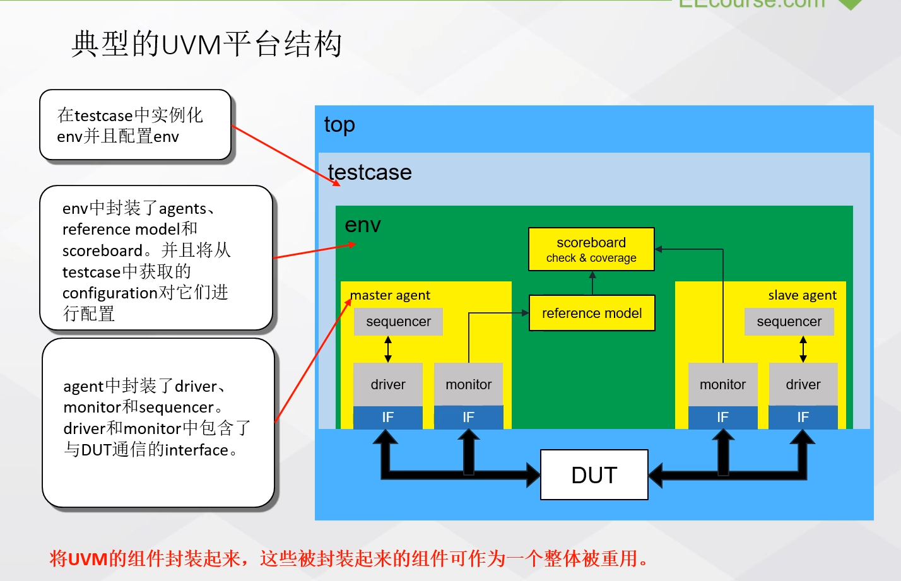

若搭建多个模块存在的UVM平台，则需要在各个模块中间加入passive agent。

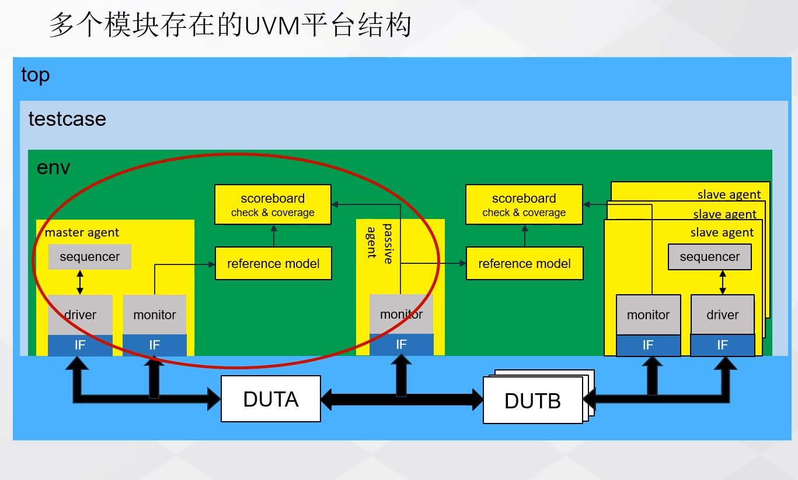

# 搭建一个简单的UVM平台

* **使用UVM的第一条原则是：验证平台中所有的组件应该派生自UVM中的类。**
* **请记住一点:所有派生自uvm_component及其派生类的类都应该使用uvm_component_utils宏注册。**(factory机制)
* **在UVM验证平台中,只  要一个类使用uvm_component_utils注册且此类被实例化了,那么这个类的main_phase就会自动被调用。**
* **无论传递给run_test的参数是什么,创建的实例的名字都为uvm_test_top。**

## UVM平台的主要组件


以测试单个模块搭建的UVM为例，介绍UVM平台的主要组件。

* driver - 将获取到的事务转化为pin级信号驱动DUT
* sequencer - 启动sequence产生事务，并将事务发送给driver
* monitor - 检测接口上的有效信号，并转化为事务，再发送到reference model进行分析。
* agent - 将sequencer, driver和monitor封装起来。agent中的driver和sequencer需要连接起来。
* reference model - 模拟DUT的功能行为，根据激励来产生结果，该结果被称为参考值或是期望值。master agent 中的monitor会将DUT的输入收集下来发送给reference model，作为reference model的输入。该结果会送入scoreboard中做比对。
* monitor - slave agent中的monitor往往是捕获DUT的输出信号并转化为事务的功能组件。一般情况下，因为slave agent不需要驱动DUT，所以说他只包含monitor而去除了driver以及sequencer。我们称这种只有monitor的agent为agent的passive模式
* scoreboard - 比较预期的结果于DUT的输出结果是否一致。它将会从两个地方获取数据，一个是参考模型发来的期望值，另一个是从slave agent发来的DUT的输出值。在scoreboard中对这两个值进行比较，由此来判断DUT的功能是否正确。同时可以将功能覆盖率嵌入到scoreboard中，由此实现覆盖率的收集。
* env- 可包含多个agent, reference model, scoreboard以及其他连接组件和配置组件。**需要注意的是**：一旦env完成，在后续的测试案例中，就不能对它进行更改。如果出现必须更改的情况，那么之前已经通过的测试案例需要重新执行。
* testcase - 测试案例。实例化env，配置env，启动测试平台。在一个测试项目当中，测试案例可以有很多，但是env只有一个，并且一旦确定就不能随意更改，对于整个平台的配置都是在测试案例中完成的。**因此在构建env的时候，需要事先定义好配置接口，使env具有可配置性。**

UVM不仅为验证工程师提供了测试平台的结构，而且在UVM的资源库当中，对于平台中的每一个组件都有一个对应的基类。验证工程师在搭建验证平台的时候，每一个组件需要从相应的基类进行扩展。下面来看一下UVM提供了哪些基类，以及这些基类和平台中的各个组件之间的关系。

* 构成平台的结构组件
  * uvm_component - 所有组件的基类
    * uvm_test - 对应着testcase测试案例。验证工程师的测试案例都是从这个基类扩展而来的。
    * uvm_env - 对应着env。平台的env需要从这个基类扩展。
    * uvm_scoreboard - 对应着scoreboard。平台的scoreboard需要从这个基类扩展
    * uvm_agent - 对应着agent。平台的agent需要从这个基类扩展
    * uvm_suquencer
    * uvm_monitor
    * uvm_driver

需要主要的是，UVM并未提供类似uvm_reference_model这样的基类。所以用户在编写例化自己的reference_model模块时，需要继承uvm_component这个基类加以扩展。

* 组件间的通信端口
  * uvm\_*\_port
  * uvm\_*\_import
  * uvm\_*\_export
  * uvm\_\*\_fifo\_\*
  * uvm\_\*\_fifo\_socket

如果将验证平台的组件比作工厂中流水线的设备，那么事务就是穿梭于这些设备之间的产品了。事务是组件的操作对象。UVM也对事务的建模提供了扩展。

* uvm_sequence_item - 对事务级的建模，需要从此类进行扩展
* uvm_sequence - 产生事务对象的事务发生器sequence，需要从uvm_sequence扩展

## 简化UVM平台

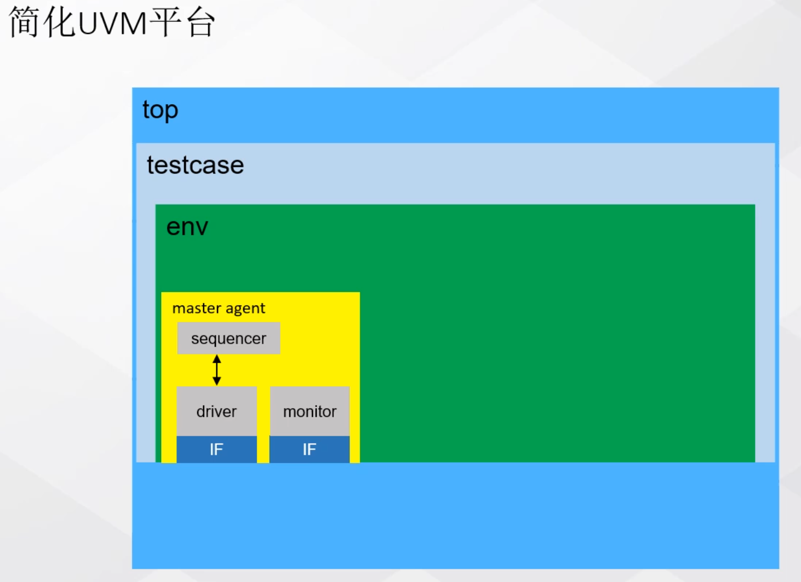

这个简化后的UVM平台的功能是

* 产生事务
* 将产生的事务发送到driver上面

## 创建transaction - 事务级建模

在UVM验证平台中，穿梭于各个组件之间的基本信息单元是一个被称为transaction的数据对象。也就是我们前面所说的事务对象。那么在本课程中，说**事务就是transaction**。

**定义transaction**

* 需要从uvm_sequence_item扩展
* 为了使transaction能够随机化，需要为每个成员指定为rand

```systemverilog
class my_transaction extends uvm_sequence_item;
    // 需要为激励成员指定rand属性使他们是随机的
    // 源地址
    rand bit [3:0] source_addr;
    // 目标地址
    rand bit [3:0] dest_addr;
    // 传输的数据
    rand reg [7:0] payload[$];
    
    // 使用UVM提供的宏，将自定义的事务类向UVM注册
    `uvm_object_utils_begin(my_transaction)
    	`uvm_field_int(source_addr, UVM_ALL_ON)
    	`uvm_field_int(dest_addr, UVM_ALL_ON)
    	`uvm_field_queue_int(payload, UVM_ALL_ON)
    `uvm_object_utils_end
    
    // 约束项，控制随即成员的随机范围
    constraint Limit{
        // 限制source_data的值只能在0~15之间随机
        source_addr inside {[0:15]};
        // 限制dest_data的值只能在0~15之间随机
        dest_addr inside {[0:15]};
        // 限制payload这个队列当中，最大的内容为4个，最小为2个
        payload.size() inside {[2:4]};
    }
    
    // 构造函数
    // 参数name是实例化时为该对象指定的名字
    fucntion new (string name = "my_transaction");
    	// 使用父类evm_sequence_item的构造函数进行实例化
    	super.new(name);
    endfunction
    
endclass
```

## 创建sequence - 事务发生器

当事务模型创建好之后，需要创建的对应的事务发生器，在UVM当中，这个事务发生器就是sequence。在平台的运行过程当中，只有启动了某个sequence，才会产生相应的事务对象。

创建对应的sequence需要注意以下几点：

* sequence需要从uvm_sequence扩展
* sequence控制并产生一系列transaction，并且可以控制事务何时产生，何时结束
* 一种sequence一般只用来产生一种类型的transaction
* sequence中最重要的部分就是body()任务。对事务的控制和事务的产生都是在这个body()任务中完成的。因此写好body()任务时关键。

当一个sequence被启动后，他会按照body()函数中的功能，依次产生多个相同类型的事务对象。

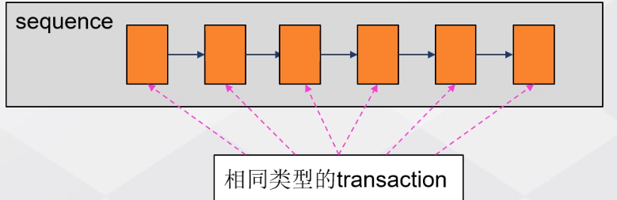

```systemverilog
// uvm_sequence是一个带有参数的基类，该参数是指定sequence所产生的事务类型
class my_sequence extends uvm_sequence #(my_transaction);
    
    // 使用uvm提供的宏将此sequence注册到UVM中
    `uvm_object_utils(my_sequence)
    
    // 构造函数
    function new(string name = "my_sequence");
        super.new(name);
    endfunction
    
    // body()任务是sequence中最重要的一个方法，它的作用是控制和产生transaction序列。需要验证工程师自己编写
    // 这里给出的例子十分简单，开始仿真，产生10个事务对象，停止仿真
    virtual task body();
        // 控制验证平台何时开始
        if (starting_phase != null)
            starting_hpase.raise_objection(this);
        
        // repeat这个宏语句10次，一共会产生10个transaction
        repeat(10)begin
            // UVM内建的宏，用来产生transaction。每调用一次产生一个transaction
            // 宏当中的参数req是指向产生事务对象的指针
            // 我们可通过req来访问产生的事务对象
            `uvm_do(req)
        end
        
        #100;
        // 控制验证平台何时结束
        if (starting_phase != null)
            starting_phase.drop_objection(this);
    endtask
        
```

**个人理解transaction是事务的最小单位，sequence是一系列transaction的组合（序列），sequencer用于控制何种条件下产生何种类型的sequence。（这里的何种类型的sequence是指：由多少数量、多少种类的transaction按照何种排列方式构成的sequence）**

## 创建sequencer

从UVM的平台结构的角度看，sequence_item和sequence并不属于结构的一部分。它们是流动在这些组件中的数据流。

uvm_sequencer的作用：

* 启动sequence - 一个sequnece不能自己启动其中的body()方法来产生事务对象。必须由一个与之相关联的sequencer来启动。
* 将sequence产生的item(transaction)发送到UVM的组件中（具体来说，就是发送到driver中）。

sequencer的功能大多数已经在UVM源码中实现，所以创建sequencer的工作是比较简单的。

在多数情况下，我们不需要从uvm_sequencer基类中扩展新功能，此时则不需要自定义一个新的子类继承uvm_sequencer。此时可以用typedef关键字来对uvm_sequencer进行重命名来以简化拼写。例如：

```systemverilog
typedef uvm_sequencer #(my_transaction) my_sequencer;
```

一个参数化的类，一般需要指定sequencer传递的transaction类型，表示一种sequencecr对应一种类型的transaction。

## 平台组件的重要属性 - phase机制

UVM平台中的所有组件都具有phase概念，它们由按照一定顺序执行的任务或函数组成。
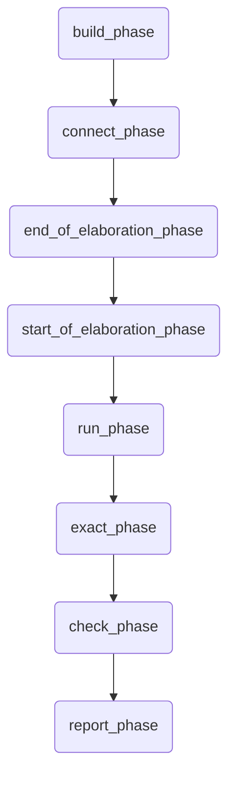

这些`*_phase`是组件中的任务或者函数，需要根据具体情况对它们进行重载。按照有图的顺序从上到下依次执行。

在这里做简单了解，后续会详细介绍。在这里需要了解phase的3点特性。

1. 这些phase存在于每一个组件当中，并且他们仅仅是任务或者函数。
2. 需要根据实际的情况对他们进行重载，以实现我们想要的功能。
3. 这些phase是按照UVM已经固定好的顺序自动执行的，不需要主动调用。

## 创建driver

diriver的主要职能有三个：

1. 从sequencer获取transaction
2. 将trancsaction分解为DUT可以接受的PIN级信号
3. 将转化后的PIN级信号按照DUT总线协议的方式驱动给DUT

```systemverilog
// 一个参数化的类，指定该driver所要处理的transaction的类型
class my_driver extends uvm_driver #(my_transaction);
    // 所有的平台组件注册使用的都是`uvm_component_utils宏
    // 其他的都是用uvm_object_utils宏
    // 这里是对my_driver进行平台组件的注册
    `uvm_component_utils(my_driver)
    
    // 使用父类构造函数作为此类的构造函数
    function new(string name = "my_drever", uvm_component parent);
        super.new(name, parent);        
    endfunction
    
    // run_phase()是driver的主要方法
    // driver在这个方法中完成从sequencer获取transaction、对transaction的分解和驱动DUT
    virtual task run_phase(uvm_phase phase);
    	// 死循环
        // 一般来说, driver是不停工作的, 所以使用死循环
        forever begin
            // 从sequencer中获取transaction  
            // req是一个指向my_tansaction类型的指针(ref), 这个语句每执行一次, req指向一个新的从sequencer中获取到的transaction
            seq_item_port_get_next_item(req);
            // 将获取的transaction打印出来
            `uvm_info("DRV_RUN_PHASE", req.sprint(), UVM_MEDIUM)
            // 等待100个时间单位
            #100;
            // 通知sequencer该事务已经处理完毕
            seq_item_port.item_done();
            
        end
            
    endtask
         
endclass
```

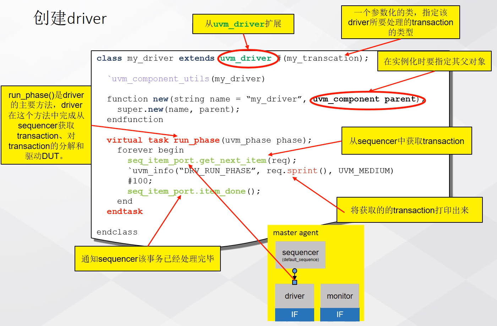

## 创建monitor

* monitor的主要功能是监视接口的信号，捕获接口上活动的事务，并且将pin级的信号事务转化为事务级的数据包，之后将这些数据包发送到analysis组件（包括reference model、scoreboard等）进行分析和产生报告。
* monitor通过TLM-port与其他组件相连。

```systemverilog
class my_monitor extends uvm_monitor;
    
    `uvm_component_utils(my_monitor)
    
    function new(string name = "", uvm_component parent);
        super.new(name, parent);
    endfunction
    
    // 每过100个时间单位，打印一条信息，没有监视接口信号，也没有其他组件进行联系
    virtual task run_phase(uvm_phase phase);
        forever begin
            `uvm_info("MON_RUN_PHASE", "Monitor run!", UVM_MDDIUM)
        end
    endtask
    
endclass
```

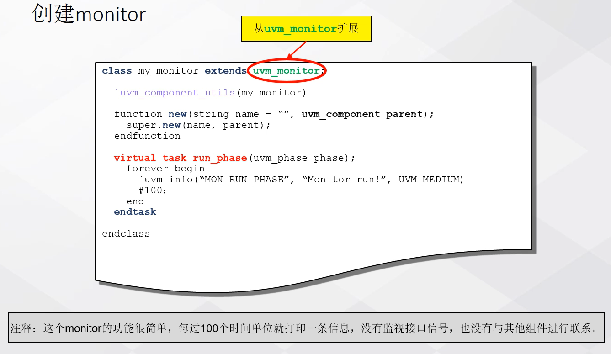

## 创建agent

* agent封装了sequencer、driver、monitor
* agent中需要实例化sequencer、driver和monitor对象并将sequencer和driver连接起来。
* gent有active和passive之分。passive模式的agent只包含monitor而没有sequencer和driver。

```systemverilog
class master_agent extends uvm_agent;
    // 在uvm中注册
    `uvm_component_utils(master_agent)
    
    // 自定义的 class 通过 new 的方式定义的变量都是句柄变量
    my_sequencer m_seqr;
    my_driver m_driv;
    my_monitor m_moni;
    
    // 使用父类构造函数作为此类的构造函数
    // - name: 实例化对象的名字
    // - parent: 实例化对象的父对象
    function new(string name = "", uvm_component parent);
        super.new(name, parent);
    endfunction
    
    // 一个用于创建和构造的phase
    // sequencer, driver, monitor都会在这里进行实例化
    virtual function void build_phase(uvm_phase phase);
        super.build_phase(phase);
        // 当为active模式时才创建sequencer和driver对象。is_active时agent内建的变量，默认值为UVM_ACTIVE
        if (is_active == UVM_ACTIVE) begin
            // 使用UVM的factory机制创建对象
            // 实例化对象的名字是my_seqr
            // 实例化对象的父对象是this - 这个用户自定义的agent
            m_seqr = my_sequencer::type_id::create("my_seqr", this);
        	m_driv = my_driver::type_id::create("m_driv", this);
        end
        m_moni = my_monitor::type_id::create("m_driv", this);
    endfunction
    
    // 一个用于连接的phase
    virtual function void connect_phase(uvm_phase phase);
        // 将driver的seq_item_port和sequencer的seq_item_export相连，以实现它们之间的transaction级通信，它在build_phase()之后执行
        if (is_active == UVM_ACTIVE) begin
            m_driv.seq_item_port.connect(m_seqr.seq_item_export); 
        end       
    endfunction
endclass
```

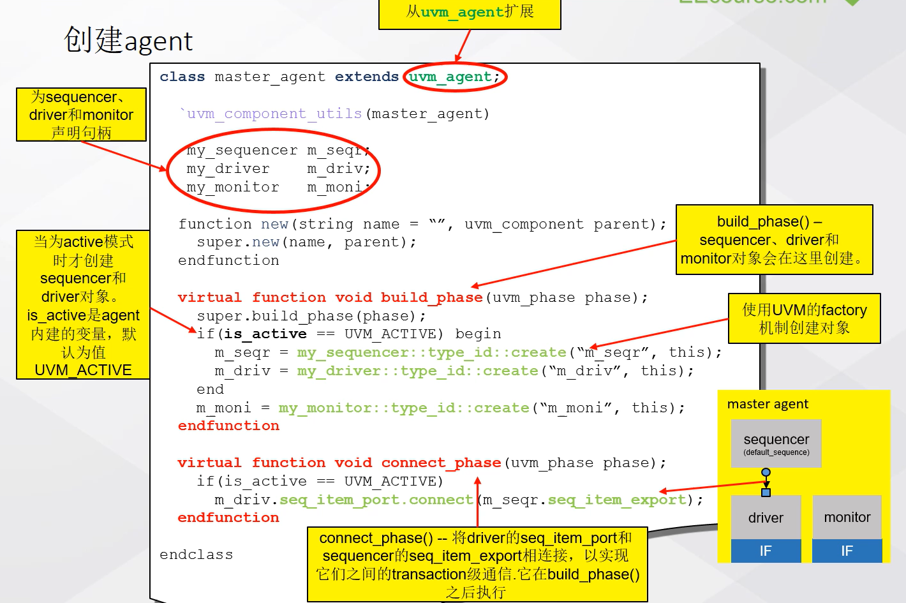

## 创建environment

* environment中封装了一个或多个agent、reference model、scoreboard以及其他组件。
* environment需要实例化agents、reference model、scoreboard以及其他组件并将这些组件相互连接。

```systemverilog
/**
* 此env为简化结构，省去了reference model和scoreboard等组件和连接
*/
class my_env extends uvm_env;
    
    `uvm_component_utils(my_env)
    
    master_agent m_agent;
    
    function new(string name = "", uvm_component parent);
        super.new(name, parent);
    endfunction
    
    virtual function void build_phase(uvm_phase phase);
        super.build_phase(phase);
        m_agent = master_agent::type_id::create("m_agnet", this);
    endfunction
    
endclass
```

## 创建testcase

在一个测试工程中，测试案例(testcase)会有很多个，不同的测试案例用来完成不同的测试工作。但env往往只有一个，并且一旦完成，在后续的测试过程中就不能再对齐进行改动。如果发现测试平台有问题，需要修复，那么之前完成的测试都需要再重新执行一遍。

* testcase中包含了env。它的作用是实例化并配置env。使env模拟不同的测试环境以及执行不同的测试行为。
* 配置需要启动的sequence

```systemverilog
class my_test extends uvm_test;
    
    // 在uvm中注册
    `uvm_component_utils(my_test)
    
    // 为env声明句柄
    my_env m_env;
    
    // 使用父类构造函数作为此类的构造函数
    function new(string name = "", uvm_component parent);
        super.new(name, parent);
    endfunction
    
    // 重载build_phase函数
    virtual function void build_phase(uvm_phase phase);
        // 执行父类build_phase函数
        super.build_phase(phase);
        // 使用uvm的factory机制实例化env
        m_env = m_env::type_id::create("m_env", this);
        
        /**
        * uvm_config_db是uvm内建的一个带参数的类
        * set是这个类当中的一个静态函数，功能是为一个指定的目标设置资源
        * 这个函数的使用过程中一共配置了4个参数，分别是:
        * this - 调用set的位置, this表示这个set函数是被用户正在定义的这个testcase所调用的
        * "*.m_seqr.run_phase" - 被配置变量的相对路径, *代表通配符
        * "default_sequence" - 目标变量的标识符
        * my_sequence::get_type() - 要启动的sequence的type(这里是my_transaction)
        * 这样设置后在仿真的run_phase阶段my_sequence就会被sequencer所启动
        * 经过这套语句之后，sequencer中的default_sequence指向了my_sequence
        * 在平台运行到run_phase的时候，sequencer就会将它启动起来
        * 这样driver就可以在run_phase阶段从sequencer那里获取该sequence所产生的事务对象了
        */
        // 使用uvm的config机制，为agent中的sequencer指定dufault_sequence
        uvm_config_db#(uvm_object_wrapper)::set(this, "*.m_seqr.run_phase", "default_sequence", my_sequence::get_type());        
    endfunction
    
    // 重载start_of_simulation_phase, 从之前的流程图来看, 这个phase位于run_phase之前, 所以它会先于run_phase执行
    virtual function void start_of_simulation_phase(uvm_phase phase);
        super.start_of_simulation_phase(phase);
        // 调用uvm内建的一个函数print_topology函数, 可以打印出当前测试平台的结构
        uvm_top.print_topology(uvm_default_tree_printer);
    endfunction
endclass
```

## 运行仿真

在学习SystemVerilog时知道，program可以用来启动仿真平台

```systemverilog
program automatic test;
    // 将uvm的相关库文件导入进来
    import uvm_pkg::*;
    // 包含uvm的宏文件
    `include "uvm_macros.svh"
    // 包含以上我们写的所有代码文件, 使用`include ""的方式包含进来
    
    initial begin
        // 调用uvm的全局任务run_test()来启动uvm验证平台
        run_test();
    end
    
endprogram
```

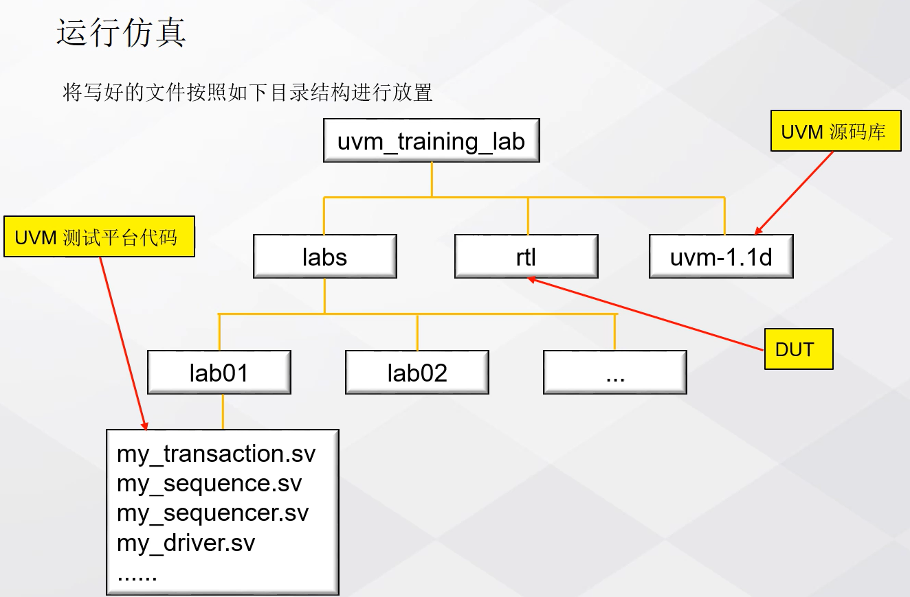

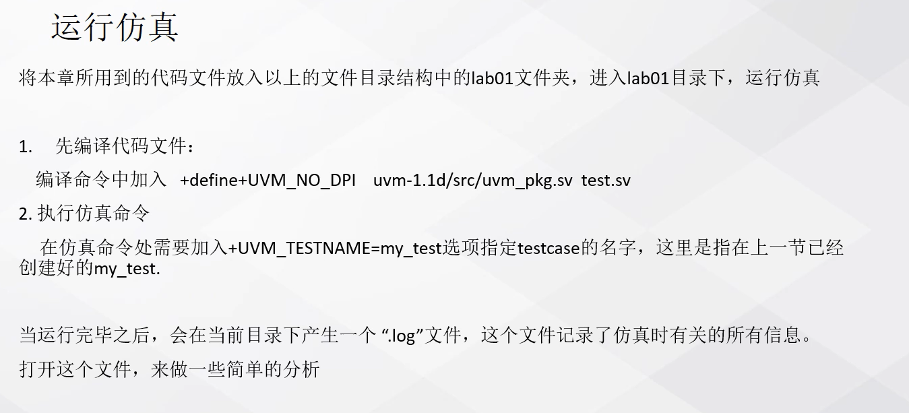

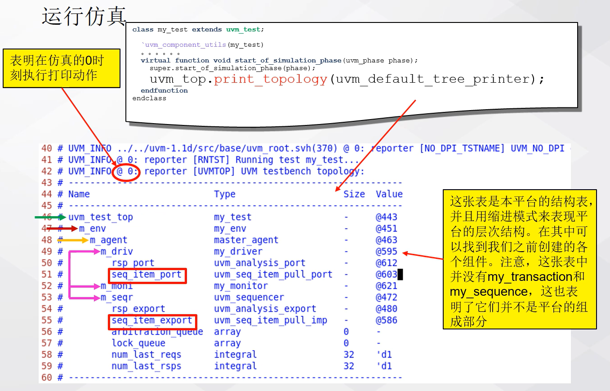

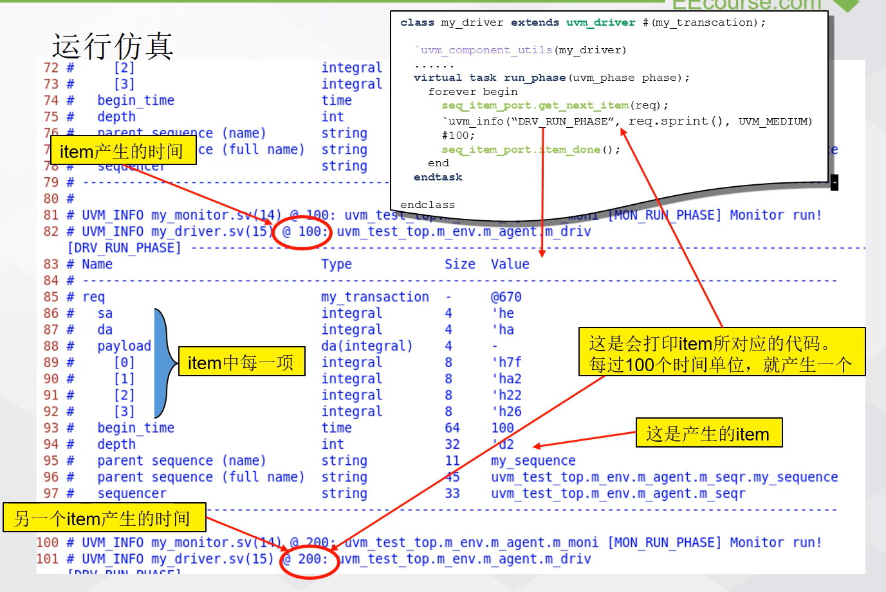