本笔记是参考Efinity官网的时钟收敛指南（下称之指南）进行制作。笔记目录与指南目录保持一致。

常见时钟术语中英文对照

| 中文术语 | 英文术语           |
| -------- | ------------------ |
| 时钟延迟 | clock latency      |
| 时钟偏移 | clock skew         |
| 时钟抖动 | clock jitter       |
| 时钟频率 | clock frequency    |
| 主时钟   | master clock       |
| 从时钟   | slave clock        |
| 同步时钟 | synchronous clock  |
| 异步时钟 | asynchronous clock |
| 时钟域   | clock domain       |

# 时序约束分类(from Qwen)

在数字集成电路（尤其是FPGA或ASIC）设计流程中，**时序收敛**（Timing Closure）是指设计满足所有时序约束要求的状态。为实现时序收敛，设计者需要施加一系列**时序约束**（Timing Constraints），这些约束用于指导综合、布局布线（P&R）等工具优化电路以满足性能目标。

用于时序收敛的约束一般可分为以下几类：

---

### 1. **时钟约束（Clock Constraints）**
这是最核心的一类约束，用于定义设计中的时钟信号特性。

- **主时钟定义（Primary Clock）**  
  ```tcl
  create_clock -name clk -period 10 [get_ports clk_in]
  ```
  指定顶层输入端口或内部节点的时钟周期、占空比、相位等。

- **生成时钟（Generated Clock）**  
  ```tcl
  create_generated_clock -name clk_div2 -source [get_pins clk_reg/Q] -divide_by 2 [get_pins clk_div_reg/Q]
  ```
  用于描述由主时钟通过分频、倍频（如PLL/DCM输出）或相移产生的衍生时钟。

- **虚拟时钟（Virtual Clock）**  
  用于建模与I/O相关的外部时钟（没有物理引脚连接），主要在输入/输出延迟约束中使用。

---

### 2. **输入/输出延迟约束（I/O Delay Constraints）**
用于描述芯片与外部器件之间的接口时序。

- **输入延迟（Input Delay）**  
  ```tcl
  set_input_delay -clock clk -max 2.0 [get_ports data_in]
  ```
  表示数据在时钟沿之后多长时间到达输入引脚（相对于时钟），用于建模外部建立时间要求。

- **输出延迟（Output Delay）**  
  ```tcl
  set_output_delay -clock clk -max 1.5 [get_ports data_out]
  ```
  表示数据必须在时钟沿之前多久稳定在输出引脚上，用于满足外部器件的建立时间。

> 通常结合 `-min`/`-max` 同时约束建立（setup）和保持（hold）时间。

---

### 3. **时序例外约束（Timing Exceptions）**
用于处理非标准路径（如异步路径、多周期路径等），防止工具对这些路径做不必要的优化或报错。

- **多周期路径（Multicycle Path）**  
  ```tcl
  set_multicycle_path 2 -setup -from [get_pins src_reg/Q] -to [get_pins dst_reg/D]
  set_multicycle_path 1 -hold -from ... -to ...
  ```
  指定某条路径的数据允许在多个时钟周期后才被采样，常用于控制信号（如使能、复位）或低速数据通路。

- **假路径（False Path）**  
  ```tcl
  set_false_path -from [get_pins async_reset] -to [all_registers]
  ```
  告诉工具忽略该路径的时序分析（如异步复位、测试模式信号、跨异步时钟域路径）。

- **最大/最小延迟约束（Max/Min Delay）**  
  ```tcl
  set_max_delay 8 -from A -to B
  set_min_delay 1 -from A -to B
  ```
  用于覆盖默认时钟驱动的时序分析，常用于跨时钟域（CDC）或自定义路径。

---

### 4. **时钟不确定性与时钟延迟（Clock Uncertainty & Latency）**
用于建模时钟网络的理想与实际偏差。

- **时钟不确定性（Clock Uncertainty）**  
  ```tcl
  set_clock_uncertainty 0.3 -setup [get_clocks clk]
  ```
  模拟时钟抖动（jitter）或PVT变化带来的时钟沿不确定性，用于收紧建立/保持时间裕量。

- **时钟延迟（Clock Latency）**  
  ```tcl
  set_clock_latency 1.2 -source [get_clocks clk]   # 源延迟（预布局）
  set_clock_latency 0.8 [get_clocks clk]           # 网络延迟（布局后可由工具计算）
  ```
  描述时钟从源到寄存器时钟引脚的延迟。

> 在先进工艺中，这些通常由工具自动建模（如CTS后），但在早期或FPGA中可能需手动指定。

---

### 5. **时钟组（Clock Groups）**
用于明确指定哪些时钟之间是异步的或物理互斥的。

- **异步时钟组（Asynchronous Clock Groups）**  
  ```tcl
  set_clock_groups -asynchronous -group [get_clocks clk_a] -group [get_clocks clk_b]
  ```
  告诉工具这些时钟域之间无需进行跨时钟域时序分析（前提是设计者已通过同步器等手段处理CDC）。

- **互斥时钟组（Exclusive Clock Groups）**  
  用于多路复用时钟（如两个时钟不会同时有效），避免工具对不可能同时激活的路径做时序分析。

---

### 总结表

| 约束类别          | 作用                             | 示例命令                |
| ----------------- | -------------------------------- | ----------------------- |
| 时钟约束          | 定义时钟特性                     | `create_clock`          |
| I/O 延迟约束      | 约束芯片与外部接口时序           | `set_input_delay`       |
| 时序例外          | 处理特殊路径（多周期、假路径等） | `set_multicycle_path`   |
| 时钟不确定性/延迟 | 建模时钟抖动与网络延迟           | `set_clock_uncertainty` |
| 时钟组            | 明确时钟间关系（异步/互斥）      | `set_clock_groups`      |

---

### 补充说明
- **SDC**（Synopsys Design Constraints）是业界标准的时序约束格式，上述命令大多属于SDC语法。
- 在FPGA设计中（如Xilinx Vivado 或 Intel Quartus），虽语法略有差异，但约束分类逻辑一致。
- 错误或缺失的约束是时序收敛失败的常见原因，务必确保约束完整、准确、无冲突。

# Constraining Clocks (时钟约束)

当编译一个SDC文件(efinity的时钟约束文件)时，首要的任务时定义Verilog设计中的时钟和它们的关系。你应该设置约束来定义时钟和它们之间的关系。然后，你可以根据需要针对每个时钟限制其IO管脚。这章随后的小节解释了定义时钟及其关系背后的理论。

## Defining Clocks (定义时钟)

时钟源可以来自于 interface blocks，比如PLL或是晶振；或者也可以通过GPIO引脚来源于你的电路板。你应该使用`create_clock`和`create_generated_clock`这两个约束语句来定义和识别时钟。

---

**Example: Define a Clock**

This constraint creates a clock, clk1, with a period of 10ns:

```sdc
create_clock -period 10 -name clk1 [get_ports clk1]
```

---

**Example: Define a Clock with a Wave form**

This example defines a clock with a 10 ns period and 50/50 duty cycle, but the first rising clock edge is phase shifted 25% to start at 2.5ns.

```sdc
create_clock -period 10.00 -waveform {2.50 7.50} -name clk1 [get_ports clk1]
```

---

`create_generated_clock`约束定义了内部生成的时钟(如门控时钟)与其源时钟之间的关系。此约束仅支持`divide_by`, `multiply_by`, `duty_cycle`, `inverted`选项。

---

**Example: Creating Clocks**

这个例子显示了基本时钟`clk`和内部生成时钟`clkdiv2`的约束。

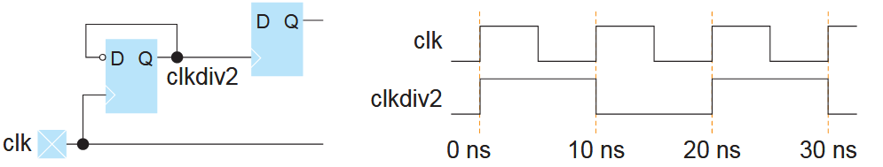

```sdc
create_clock -name clk -period 10 [get_ports clk]
create_generated_clock -source clk -divide_by 2 clkdiv2
```

---

Virtual clocks (虚拟时钟) 是不分配到时钟节点的时钟。虚拟时钟用于表示off-chip clocks (不连接到FPGA内部的时钟)。使用`set_input_delay`和`set_output_delay`来约束虚拟时钟。

### Using the `create_clock` Constraint

手册中这部分详述了Efinity软件的interface的任意接口都可作为一个时钟源(PLL, GPIOs, MIPI RX Lane, MIPI RX/TX PHY, and JTAG)。并举例说明了Interface Designer 自动生成的 \<*project*\>**.pt.sdc**中，对于不同的时钟源自动生成的约束的区别。可以作为参考。

### Using the `create_generated_clock` Constraint

Interface Designer 并不会对generated clocks (内部生成的时钟)创建 SDC 约束。通常，设计者会在内核中使用Verilog代码对时钟进行分频，这种分频后的时钟就属于 generated clock 的一种。设计者需要对这些时钟添加约束。

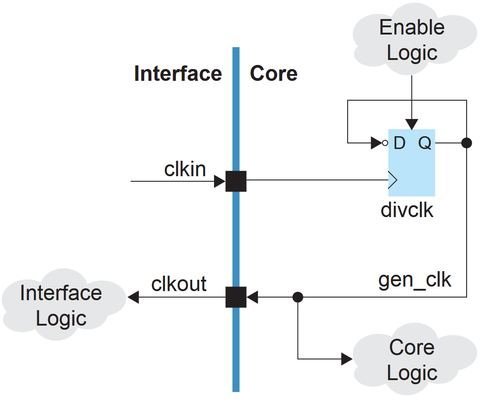

---

**SDC Commands**

```sdc
create_clock -period 10 -name clk0 [get_ports clkin]
create_generated_clock -source [get_ports clkin] -divide_by 2 [get_pins divclk|Q] -name gen_clk0
```

---

### Virtual Clocks

虚拟时钟用于建模电路板上片外(未接入FPGA)的时钟源。由于FPGA使用（输入或输出）了与该时钟源同步的数据，但未使用（输入或输出）此时钟，故需要对该时钟在FPGA内部建模，这种模型即是虚拟时钟。在你的SDC文件中，你应该使用一个虚拟时钟作为输入输出延迟的参考时钟来替代电路板上的时钟。虚拟时钟提供了一个干净的接口时钟，意味着你不必担心板上的波形偏移。此外，虚拟时钟可以防止时序分析使用过于严格和不切合实际的要求来处理I/O路径。

下图展示了一个使用`set_input_delay`命令约束的虚拟时钟。晶振驱动了时钟焊盘`clk_in`和一个额外的片外的D触发器。从晶振到core上的`clk_in`焊盘的路径是通过interface的。Interface Designer 可以对这个路径添加额外的时钟延迟和时钟不确定性。为了对`data_in`焊盘去除所有额外的时钟延迟和时钟不确定性，你需要使用一个虚拟时钟。

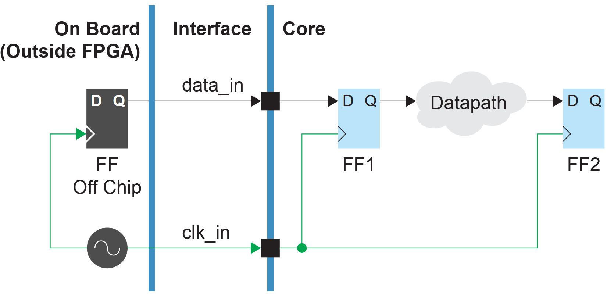

---

**SCD Commands**

```sdc
create_clock -period 40 -name clk_in [get_ports clk_in]
create_clock -period 40 -name virtual_clk
set_input_delay -clock virtual_clk -max 0.3 [get_ports data_in]
set_input_delay -clock virtual_clk _min 0.1 [get_porst data_in]
```

---

请注意，虚拟时钟具有与`clk_in`相同的周期和特征，但它没有一个引用 netlist (网表) 中 net (网络)、port (端口) 或 pin (引脚)的 clock target (时钟目标)。Efinity 软件会为虚拟时钟显示一个的信息消息。

下图展示了如何使用一个通过`set_output_delay`命令约束的虚拟时钟。

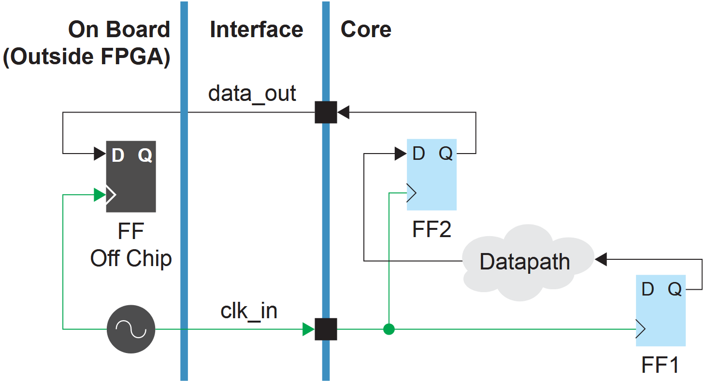

---

**SDC Commands**

```sdc
create_clock -period 40 -name clk_in [get_ports clk_in]
creter_clock -period 40 -name virtual_clk
set_output_delay -clock virtual_clk -max 0.4 [get_ports data_out]
set_output_delay -clock virtual_clk -min 0.3 [get_ports data_out]
```

---

---

**Note: **在你的SDC文件中，将virtual clock (虚拟时钟)和 core clock (核心时钟)放在同一个 clock group (时钟组)中，以保证他们是 related (相关的)。In your SDC file, put the virtual clock and core clock in the same clock group so they are related.The software can then analyze the transfers from `virtual_clk` to/from `clk_in`. See **Clock Relationships**

---

## Clock Latency (时钟延迟)

源时钟延迟表示从板上时钟源到FPGA中的全局时钟树所需的时间。这个延迟包括：电路板延迟、缓冲器延迟和任何的PLL延迟（包括PLL补偿延迟，该延迟为负）。

大多数情况下你不需要使用`set_clock_latency`。不过，当您想要将外部信号限制到内核寄存器以捕获传输到FPGA的时钟信号的延迟效应时，这是必须的。

你需要基于GPIO延迟，PLL延迟和所有的电路板延迟来计算此延迟。

### GPIO Clock Latency

### PLL Local Feedback Clock Latency

### PLL Core Feedback Clock Latency

### PLL External Feedback Clock Latency

## Clock Relationships (时钟关系)

默认情况下，Efinity® 软件假定所有时钟都是相关的，它会分析所有时钟域之间的时序并优化所有可能的路径。

如果为两个时钟设置约束，并且不切断它们之间的路径，则软件会尝试在它们之间找到最严格的时钟到时钟延迟要求。如果定时器在 1,000 个时钟周期后找不到两个时钟的公共时钟周期，则确定它们 *non_expandable* (不可扩展)。定时器为这些时钟提供 0.01 ns 的默认约束。如果要覆盖此默认值，请使用`set_max_dela`或`set_min_delay`约束。

### Setting Constraints for Unrelated Clocks

第一步是分析您的设计，以确定哪些时钟是相关的，哪些不是。然后，您可以使用以下约束其中之一：

* `set_clock_groups` —— 当您想要指定时钟之间的双向约束时使用。通常，这是最简单的方法，也是 Efinity® 定时器分析速度最快的方法。(See **set_clock_groups Constraint**.)
* `set_false_path` —— 当您想要具体说明哪些时钟与哪些端点连接时使用。此约束是单向的，因此您需要指定两个约束，每个方向一个。(See **set_false_path Constraint**.)通常，当您想要指示其中一个时钟域中时序端点子集的 timing exceptings (时序例外)时，可以使用这些约束。

### Using the set_clock_groups Constraint

使用此约束来定义时钟和您定义的生成时钟之间的关系。通常，只有来自同一源的时钟才相互关联。例如，来自同一PLL的时钟输出或来自单个时钟引脚的时钟输出。任何其他时钟都应指定为不相关。

Unrelated clock groups can be exclusive or asynchronous.

* Exclusive clock groups do not operate at the same time as each other.
* Asynchronous clock groups have no timing relationship between them, for example, clocks driven from two independent PLLs.

使用 `-exclusive` 或 `-asynchronous` 参数选项来定义如何对待时钟组。Efinity® 软件对待两种选项的方式是相同的，但是一些第三方EDA工具使用上述两种约束参数来检查跨时钟域的逻辑是否正确。因此最好在参数约束时根据时钟的关系选择正确的约束参数。

为了说明如何使用`set_clock_groups`设置约束，请考虑具有四个时钟（clk1、clk2、clk3 和 clk4）的设计。设计分析后，确定 clk1 和 clk2 彼此相关，而 clk3 和 clk4 与所有其他 clk4 无关。有两种使用`set_clock_groups`约束的方法，这两种方法都是正确的。

---

**Example: Use a Single Constraint**

The first method is to define the clocks and groups with a single constraint:

```sdc
set_clock_groups -exclusive -group {clk1 clk2} -group {clk3} -group {clk4}
```

---

此约束定义了时钟 clk1、clk2、clk3 和 clk4 之间的关系。如果稍后添加一个额外的时钟 clk5，并且不更新约束，则软件会假定 clk5 与所有其他时钟同步。

---

**Example: Use Separate Constraints**

The second method is to use separate constraints for each group:

```sdc
set_clock_groups -exclusive -group {clk1 clk2}
set_clock_groups -exclusive -group {clk3}
set_clock_groups -exclusive -group {clk4}
```

---

在这种情况下，每个set_clock_groups约束仅指定一个组，这告诉软件给定组中的时钟与所有其他组是异步的。使用此方法，如果稍后添加 clk5，软件会将其视为与 clk1、clk2、clk3 和 clk4 异步。

如果您忘记时钟或稍后添加时钟，使用第二种方法可能很诱人。但是，无论您选择哪种方法，Efinix 都建议您在设计中***始终包含每个时钟的约束***，并在添加时钟时更新 SDC 文件。

### Using the set_false_path Constraint

`set_false_path`约束可让您在设置时钟约束时更加具体。此约束允许您切断起点 （*from*） 和终点 （*to*） 之间的连接。frmo 和 to 可以是 registers (寄存器)、I/O 或 clocks (时钟)。

以下约束切断从 clk1 到 clk2 的连接：

```sdc
set_false_path -from clk1 -to clk2
```

但请记住，这只会切断一个方向的连接。要指定 clk1 和 clk2 之间没有关系，还需要使用以下约束：

```sdc
set_false_path -from clk2 -to clk1
```

---

**Example: Using set_false_path Constraints**

我们假设的四时钟设计所需的约束的完整示例是：

```sdc
set_false_path -from clk1 -to clk3 
set_false_path -from clk1 -to clk4 
set_false_path -from clk2 -to clk3 
set_false_path -from clk2 -to clk4 
set_false_path -from clk3 -to clk1 
set_false_path -from clk3 -to clk2 
set_false_path -from clk3 -to clk4 
set_false_path -from clk4 -to clk1 
set_false_path -from clk4 -to clk2 
set_false_path -from clk4 -to clk3
```

---

When you want to cut paths between clock domains, as in this simple example, Efinix recommends that you use `set_clock_groups` instead of `set_false_path`. The `set_false_path` constraint becomes more useful when you want to specify exceptions for registers or I/O, or if you want to cut only one direction of a clock domain pair.

---

**Example:  Cut Path to a Port or Pin**

To cut only the path from clk1 to a port named testout:

```sdc
set_false_path -from clk1 -to [get_ports testout]
```

To cut only the path from clk1 to a pin named testout:

```sdc
set_false_path -from clk1 -to [get_pins instance|testout]
```

---

### Clock Synchronizers (时钟同步器)

如果您有异步时钟组并希望在它们之间传输数据，则需要添加 synchronizing registers (同步寄存器)（also known as synchronizers (同步器)）。同步器是接收时钟域中的寄存器链，用于从发送时钟域捕获数据。Synchronizers 用于防止亚稳态事件传播到接收时钟域。

To designate a register as a synchronizer, use the `async_reg` synthesis attribute (综合参数).

When `async_reg` is `true`, synthesis does not perform optimization to reduce, merge, or duplicate these registers. During place and route, the software keeps these registers close together to improve synchronization between asynchronous clock domains.

***Verilog HDL:***

```sdc
(* async_reg = "true" *) reg [1:0] x;
```

***VHDL:***

```sdc
attribute async_reg: boolean;
attribute async_reg of x : signal is true;
```

### Metastable Synchronizer Circuit

This example shows a synchronizer, which is a circuit that stabilizes an input signal that may produce a metastable output. If possible, the registers in a synchronization chain need to be placed close to each other. **Efinix recommends that you use the `async_reg` synthesis attribute for synchronizer registers.**

In the following figure, <u>*FF1*</u> and <u>*FF2*</u> should be close together. Use the `async_reg` synthesis attribute for the *<u>FF1</u>* and *<u>FF2</u>* registers in the RTL netlist., which tells the software to keep those registers close together during place-and-route.

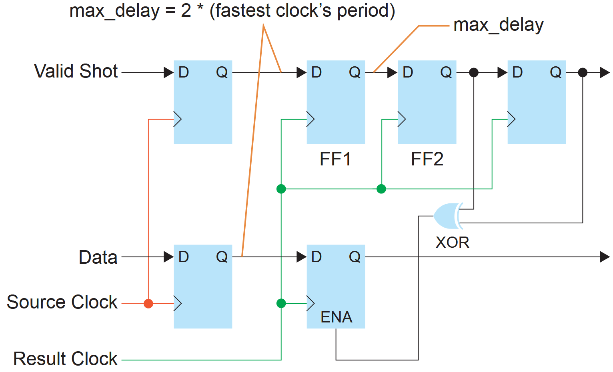

## How to Set Clock Uncertainty

Trion®, Topaz, and Titanium FPGAs have a default clock uncertainty for setup and hold analysis. You can view the clock uncertainty in the Static Timing Analysis Report (\<*project name*\>**.timing.rpt**). If the you have not set the uncertainty, the report uses the default value. For example, the T8 has 140 ps for setup and 50 ps for hold. You can modify these defaults by including the `set_clock_uncertainty` command in your SDC file.

One reason to add uncertainty is to account for the quality of the clock that feeds into the FPGA, or because you want the design to have more margin. However, keep in mind that clock uncertainty comes from the timing slack reported for your design, so increasing the uncertainty makes it harder to meet timing.

---

**Example: Add 60 ps Clock Uncertainty**

You want to add 60 ps to the default uncertainty for `clk` for T8 design. Add this command to your SDC file:

```sdc
set_clock_uncertainty -to clk -setup -0.06
```

The Efinity® software uses 200 ps of clock uncertainty for setup analysis.

---

See **set_clock_uncertainty Constraint** for details. 

# Constraining I/O

As discussed earlier , you need to constrain the connections from the interface to the core. All connections between the core and interface are considered to be I/O for timing analysis.

If a given interface block is synchronizing the connnection to the core, the Interface Designer SDC template includes the `set_input_delay` and `set_output_delay` SDC constraints that you need to use. When it is not synchronized, you need to add external board delays to the values the Interface Designer shows.

---

**Notes: **For Trion®, Topaz, and Titanium FPGAs, most interface connections are synchronous. The exceptions are GPIO blocks in bypass mode and LVDS blocks in x1 bypass mode.

---

Constrain I/O pins to be timing-equivalent to a register that is clockd with the real or virtual clock you defined. The use the **set_input_delay and set_output_delay** constraints.

---

**Example: Constraining I/O Pins**

In this example, *sysclk* is a virtual clock.

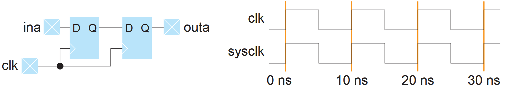

Use these constaints to define the clock and set the delays for pins:

```sdc
create_clock -name clk -period 10 [get_ports clk]
create_clock -name sysclk -period 10
set_input_delay -clock sysclk -max 2.4 [get_ports ina]
set_output_delay -clock sysclk -max 1.2 [get_ports outa]
```

---

## Constraining Synchronous Inputs and Outputs

Synchronous inputs and outputs are interface signals that are connected to synchronous elements in the FPGA's periphery. Because the Interface Designer knows how the clock and data signals are connected to the synchronous elements, the software can automtically  determine the precise delays for the `set_input_delay` and `set_output_delay` constraints. These delays are provided in the \<*project name*\>**.pt.sdc** file. When the Efinity software generates the constraints for synchronized output and input pins, it creates a `set_output_delay` or `set_input_delay` that captures the delay values of hte synchronous element and the core clock delay of the FPGA.

When the Efinity software models the timing, the minimum and maximum refer to different timing corners (fast corner and slow corner), not the minimum/maximum potential delay in one timing corner.

#### Understanding Input Delay Values

The following figure shows an example of a peripheral register, clock, clock-to-output delay, and data path.

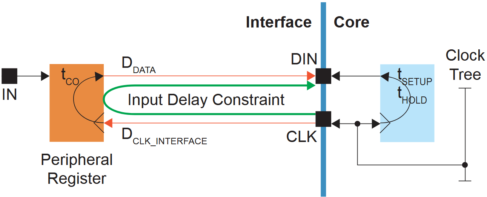

* $t_{CO}$ is the peripheral register's clock-to-output delay.
* $D_{DATA}$ is the delay from the peripheral register to the core.
* $D_{CLK\_INTERFACE}$ is the clock delay to the peripheral register.

So the equations for the output delay are:

Maximum input delay = $D_{DATA}(max)+t_{CO}+D_{CLK\_INTERFACE}(max)$

Minimum input delay = $D_{DATA}(min)+t_{CO}+D_{CLK\_INTERFACE}(min)$

The generated constraint has the `-reference_pin` option, which lets the software automatically calculate the core clock network delay.

#### Understanding Input Delay Values

The following figure shows an example of a peripheral register, clock, setup/hold, and data path.

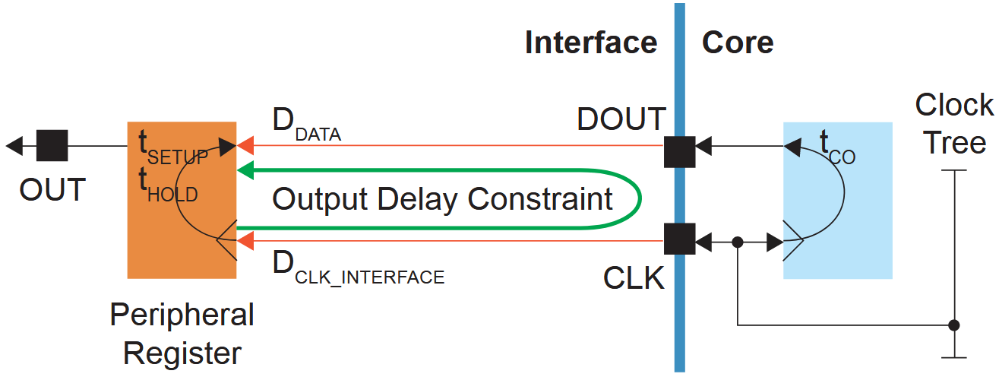

* $t_{SETUP}$ is the peripheral register's setup requirement.
* $t_{HOLD}$ is the peripheral register's hold requirement.
* $D_{DATA}$ is the delay from the core to the peripheral register.
* $D_{CLK\_INTERFACE}$ is the clock delay to the peripheral register.

So the equations for the output delay are:

Maximum output delay (setup) = $D_{DATA}(max)+t_{setup}-D_{CLK\_INTERFACE}(max)$

Maximum output delay (setup) = $D_{DATA}(min)-t_{hold}-D_{CLK\_INTERFACE}(min)$

---

**Think and Guess**

分析Peripheral Register 的 setup slack 和 hold slack
这个equations 的最大值是分析setup slack时数据相对于时钟的等效delay，最小值是分析hold slack时数据相对于时钟的等效delay

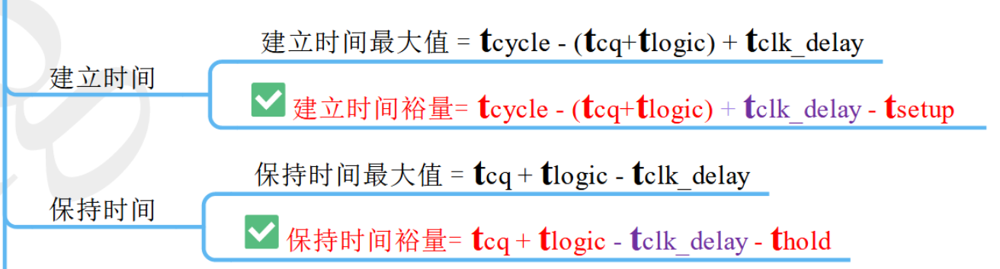

---

The generated constraint has the -reference_pin option, which lets the software automatically calculate the core clock network delay.

#### Set Constraints

To set a constraint for synchronous inputs and outputs in your constraints file:

1. Go ot **Result > Interface **in the Efinity® dashboard.
2. Double-click \<*project name*\>**.pt.sdc** to open the report.
3. Copy the `set_input_delay` and `set_output_delay` constraints and paste them into your constraints file.

---

**Example: set_output_delay Constraints**

```sdc
set_output_delay -clock Clk -reference_pin [get_ports {Clk~CLKOUT~14~1}] -max 0.287 [get_ports {memWrite}]
set_output_delay -clock Clk -reference_pin [get_ports {Clk~CLKOUT~14~1}] -min 0.161 [get_ports {MemWrite}]
```

---

## Constraining Unsynchronized Inputs an Outputs

Unsynchronized inputs and outputs are simple GPIO blocks in bypass mode or LVDS blocks in x1 btpassmode. For these blocks, you need to factor in any external board delays when calculating the `-min` and `max` values for the input and output delays.

For blocks in bypass mode, the constraint clock is external to the FPGA

* A *receive* clock is generated outside of the FPGA and is passed to the FPGA through a GPIO pin.
* A *forward* clock is generated by the FPGA and sent off chip through a GPIO pin in clock out mode.

Both receive and forward clocks synchronize the signal off chip.

For unsynchronized input or output signals, the GPIO block bypasses the register. *GPIO_IN* represents a combinational delay from the pad through the I/O buffer. *GPIO_OUT* represents a combinational delay to the pad through the I/O buffer from either the output or output enable signals.

The general procedure for constraining unsynchronized inputs and outputs is:

1. Determine which mode you are constraining (input receive, input forward, output receive, or output forward).
2. Find the mininum (fast) and maximum (slow) timing values in the Interface Designer refort file \<*design name*\>**.pt_timing.rpt**.
3. Use formulas (provided in later sections) to calculate the delay.
4. Add the constraint to your SDC file.

#### Receive Clock

A receive clock is passed to the FPGA design by configuring a GPIO in input mode and setting the connection type to GCLK or RCLK. *GPIO_In_CLK* represents the combinational delay from the pad through the I/O buffer to the global clock tree.

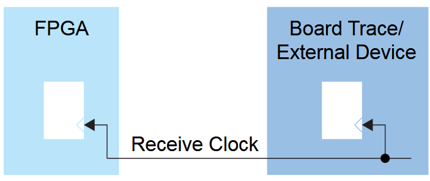

#### Forward Clock Using GPIO clkout Mode

A forward clock is generate by the FPGA design and sent off chip by configuring a GPIO in **clkout** mode. *GPIO_CLK_OUT* represents the combinational delay through the FPGA clock tree and the I/O buffer to the pad.

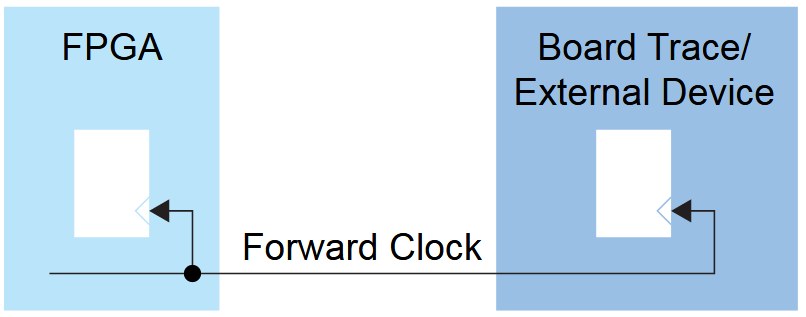

#### Forward Clock Using GPIO in output Mode

Sometimes the clock generated by the FPGA is only used in the external system and is not a clock in the FPGA design. In the case, you use a regular GPIO block in **output** mode to forward the clock off chip.

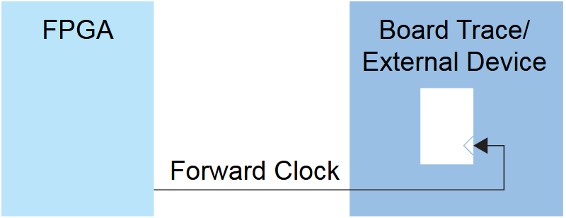

### Input Receive Clock Delay

This example shows how to set constraints for an input receive clock.

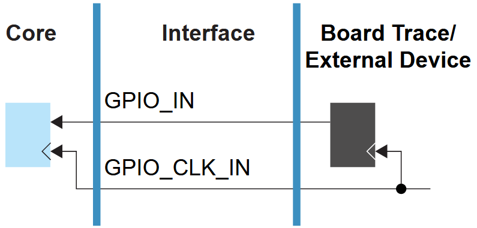

The SDC constraint formulas for the receive clock delay are:

```sdc
set_input_delay -clock <clock> -max <max calculation> <ports>
set_input_delay -clock <clock> -min <min calculation> <ports>
```

The equations are:

\<*max calculation*\> = \<*max board constraint*\> + $GPIO\_IN_{max}$

\<*min calculation*\> = \<*min board constraint*\> + $GPIO\_IN_{min}$

The following example shows how to calculate the delays and set the constraints.

---

**Example: Constraining Input Receive Clock**

You want to constrain the *din* input with respect to clock *clkin* with a max board constraint of 4ns and a min board constraint of 2ns. The non-registered GPIO configuration data from the Interface Designer timing report file is:

```sdc
Non-registered GPIO Configuration: 
===================================
+---------------+----------+-------------+----------+----------+ 
| Instance Name | Pin Name | Parameter   | Max (ns) | Min (ns) | 
+---------------+----------+-------------+----------+----------+ 
|     clkin     |  clkin   | GPIO_CLK_IN |  1.954   |  0.526   | 
| 	   din      |   din    |   GPIO_IN   |  1.954   |  0.526   | 
|      dout     |   dout   |   GPIO_OUT  |  4.246   |  1.081   | 
+---------------+----------+-------------+----------+----------+
```

The equations are:

\<*max calculation*\> = 4 + 1.954 = 5.954

\<*min calculation*\> = 2 + 0.526 = 2.526

The resulting constraints are:

```sdc
set_input_delay -clock clkin -max 5.954 din
set_input_delay -clock clkin -min 2.526 din
```

---

**Notes:** The *GPIO_CLK_IN* delay is accounted for in the *set_clock_latency* constraint. Therefore, you do not need to include it in the calculation for *set_input_delay*. Refer to ***Clock Latency***.

### Output Receive Clock Delay

This example shows how to set constraints for an output receive clock.

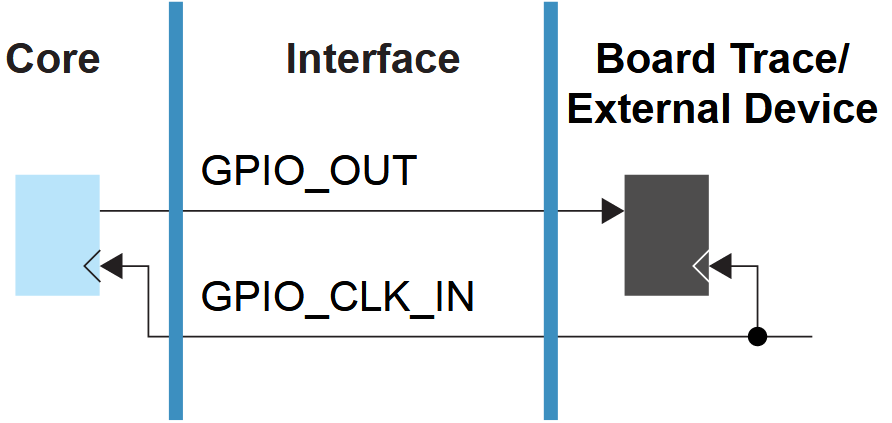

The SDC constraint formulas for the receive clock delay are:

```sdc
set_output_delay -clock <clock> -max <max calculation> <ports>
set_output_delay -clock <clock> -min <min calculation> <ports>
```

The equations are:

\<*max calculation*\> = \<*max board constraint*\> + $GPIO\_OUT_{max}$

\<*min calculation*\> = \<*min board constraint*\> + $GPIO\_OUT_{min}$

The following example shows how to calculate the delays and set the constraints.

---

**Example: Constraining Output Receive Clock**

You want to constrain the *dout* output with respect to clock *clkin* with a max board constraint of 4ns and a min board constraint of 2ns. The non-registered GPIO configuration data from the Interface Design report file is:

```sdc
Non-registered GPIO Configuration: 
===================================
+---------------+----------+-------------+----------+----------+ 
| Instance Name | Pin Name | Parameter   | Max (ns) | Min (ns) | 
+---------------+----------+-------------+----------+----------+ 
|     clkin     |  clkin   | GPIO_CLK_IN |  1.954   |  0.526   | 
| 	   din      |   din    |   GPIO_IN   |  1.954   |  0.526   | 
|      dout     |   dout   |   GPIO_OUT  |  4.246   |  1.081   | 
+---------------+----------+-------------+----------+----------+
```

The equations are:

\<*max calculation*\> = 4 + 4.246 = 8.246

\<*min calculation*\> = 2 + 1.081 = 3.081

The resulting constraints are:

```sdc
set_output_delay -clock clkin -max 8.246 dout
set_output_delay -clock clkin -min 3.081 dout
```

---

---

**Note:** The *GPIO_CLK_IN* delay is accounted for in the *set_clock_latency* constraint. Therefore, you do not need to include it in the calculation for *set_output_delay*. Refer to ***Clock Latency***.

---

### Input Forward Clock Delay (GPIO clkout)

This example shows how to set constraints for an input forward clock.

---

**Warning:** Most designs do not need to use this method. For high-performance designs, you should use the GPIO registers and fllow the instructions in ***Constraining Synchronnous Inputs and Outouts***.

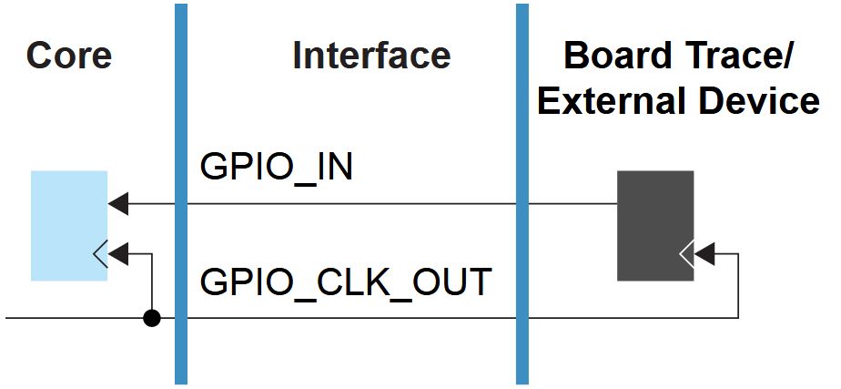

The SDC constraint formulas for the forward clock delay are:

```sdc
set_input_delay -clock <clock> -reference_pin <clkout interface name> \ -max <max calculation> <ports>
set_input_delay -clock <clock> -reference_pin <clkout interface name> -min <min calculation> <ports>
```

#### Reference Pin

With forward clocks, you use the *-reference_pin* option to include the clock latency delay in the I/O constraint. The *-reference_pin* pin target is a clkout pad that the software automatically adds to the netlist. The \<project\>**.pt_timing.rpt** file shows the reference pin name.

Calculate the min and max constraints using the following equations:

\< *max calculation* \> = \< *max board constraint* \> + $GPIO\_IN_{max}$ + $GPIO\_LCK\_OUT_{max}$

\< *min calculation* \> = \< *min board constraint* \> + $GPIO\_IN_{min}$ + $GPIO\_LCK\_OUT_{min}$

The following example shows how to calculate the delays and set the constraints.

---

**Example: Constraining Input Forward Clock**

You want to constrain the *i* input with respect to clock *clk_fwd* with a max board constraint of 2ns and a min board constraint of 2ns. The non-registered GPIO configuration data from \<*project*\>**.pt_timing.rpt** file is:

```sdc
Clkout GPIO Configuration: 
===========================  
+---------------+-----------+--------------+----------+----------+--------------------+ 
| Instance Name | Clock Pin |   Parameter  | Max (ns) | Min (ns) | Reference Pin Name | 
+---------------+-----------+--------------+----------+----------+--------------------+ 
|    clk_fwd    |    clk    | GPIO_CLK_OUT |   2.205  |  1.470   |  clk~CLKOUT~219~1  | 
+---------------+-----------+--------------+----------+----------+--------------------+  Non-registered HSIO GPIO Configuration: 
========================================  
+---------------+----------+-------------+----------+----------+ 
| Instance Name | Pin Name |  Parameter  | Max (ns) | Min (ns) | 
+---------------+----------+-------------+----------+----------+ 
|      clk      |    clk   | GPIO_CLK_IN |   0.828  |   0.552  | 
|       i       |     i    |   GPIO_IN   |   0.828  |   0.552  | 
|       o       |     o    |   GPIO_OUT  |   2.205  |   1.470  | 
+---------------+----------+-------------+----------+----------+
```

The equations are:

\<*max calculation*\> = 2 + 0.828 + 2.205 = 5.033

\<*min calculation*\> = 2 + 0.552 + 1.470 = 4.022

The resulting constraints are:

```sdc
set_input_delay -clock clk -reference_pin clk~CLKOUT~219~1 -max 5.033 [get_ports {i}] set_input_delay -clock clk -reference_pin clk~CLKOUT~219~1 -min 4.022 [get_ports {i}]
```

### Input Forward Clock Delay (GPIO output)

### Output Forward Clock Delay (GPIO output)

# Timing Exceptions

Timing exceptions are constraints that override the default behavior between clocks. These constraints are:

* `set_false_path` —— Cuts the path between the source and destination.
* `set_max_delay`, `set_min_delay` —— Overrides the required time needed from the source to the destination for the specified paths.
* `set_multicycle_path` —— Changes the clock edges used for the required timing calculation from the source to the destination.

---

**Tip: ** Refer to ***Example: Clock-to-Clock Path with Control*** for an example to use.

When working with exceptions, if the same path has more than one exception, the constraints are prioritized in the following order:

* `set_clock_groups`
* `set_false_path`
* `set_max_delay` and `set_min_delay`
* `set_multicycle_path`

## Example: Clock-to-Clock Path with Control

The following figure shows a use case in which a specific clock-to-clock path in a design can have special control logic. The path from *FF1* to *FF2* can have a different timing exception compared to other clock-to-clock paths in the design. You define these timing exceptions with `set_false_path`, `set)max)delay`, `set_min_delay`, or `set_multicycle_path` SDC commands.

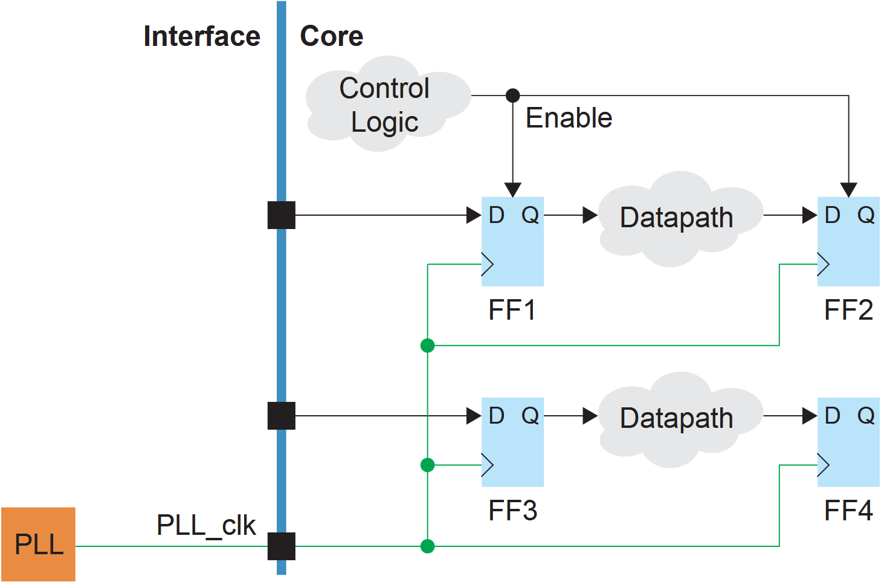

## Understanding False Paths

You use the `set_false_path` constraint to tell the timing analyzer not to analyze (that is, to cut) a path. For example, a clock may only toggle some of the time, and you do not want software to try to optimize timing for it.

You can cut paths between entire clock domains or individual points on the timing graph. If you want to completely cut the path between two clock domains, you should instead use the `set_clock_groups` constraint.

## Understanding Min and Max Delays

The `set_min_delay` and `set_max_delay` constraints override the timing requirements derived from your clock constraints. These settings tighten or relax the timing requirements for the paths. For example, you could use these constraints to try to minimize skew within a bus of signals.

---

**Important: Using `set_min_delay` and `set_max_delay` is very risky way to close timing because you can mask real setup and hold time violations unintentionally.** If you use `set_max_delay` or `set_min_delay` to override the default clock-to-clock constraint calculated by the software, the software honors your input and does not give any errors. However, the issue would likely appear on your board as a setup or hold violation. This method is especially riky when used with beneficial skew.

#### Asynchronous Paths

The `set_max_delay` and `set_min_delay` SDC commands support setting a combinational delay on an asynchronous between ports. This path does not associate with any clock. See the following Figure. Clock latency and clock uncertainty are not considered for asynchronous data paths.

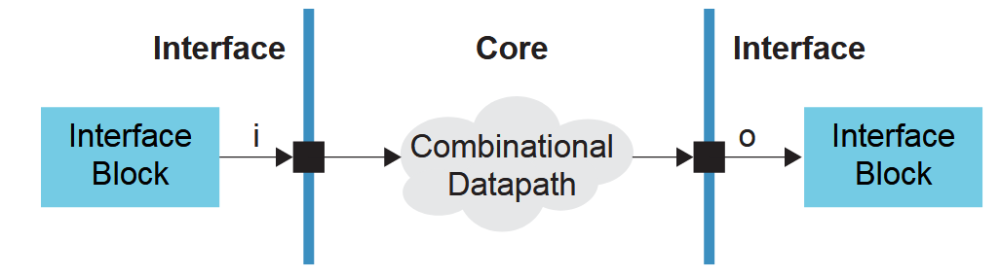

The constraints that represent this example are:

```sdc
set_max_delay -from i to o <max delay>
set_min_delay -from i to o <min delay>
```

#### Synchronous Paths

If you specify a maximum delay or a minimum delay for synchronous ports, you must also specify the clock domains for both *-from* and *-to* ports. In the following example, the input and output ports of the core are connected to flipflops in the interface and special enable logic controls the clock relationship.

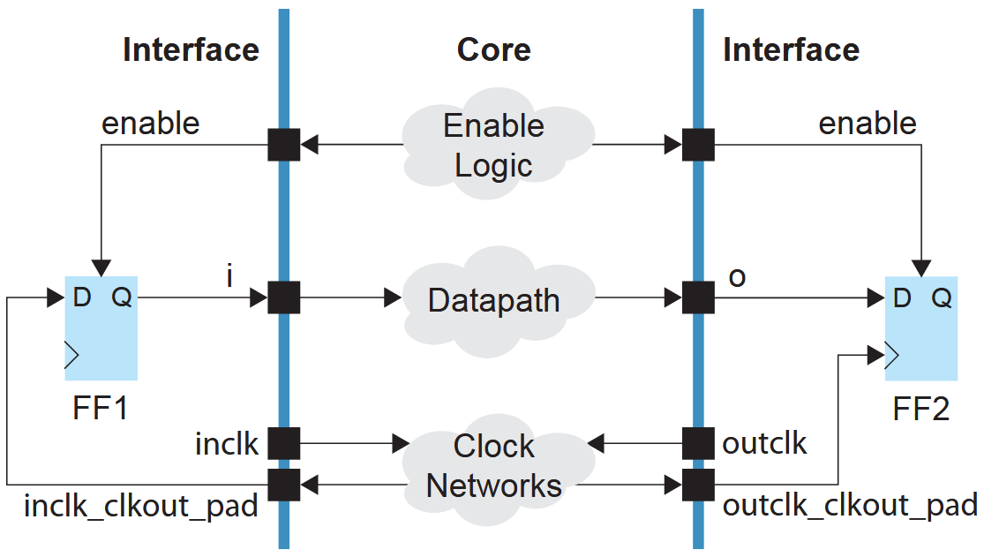

The constraints that represent this example are:

```sdc
create_clock -period <inclk period> -name inclk [get_ports inclk]
create_clock -period <outclk period> -name outclk [get_ports outclk]
set_input_delay -max <input max delay> -clock inclk -reference_pin <inclk_clk_out_pad>
set_input_delay -min <input min delay> -clock inclk -reference_pin <inclk_clkout_pad> 
set_output_delay -max <output max delay> -clock outclk -reference_pin <outclk_clkout_pad> 
set_output_delay -min <output min delay> -clock outclk -reference_pin <outclk_clkout_pad>
set_max_delay -from i to o <max delay>
set_min_delay -from i to o <min delay>
```

Notice that the clock out pads are reference pins for the `set_input_delay` and  `set_output_delay` commands. The `set_max_delay` and `set_min_delay`  commands override the default clock-to-clock constraints calculated by the system. The clock path latency and clock uncertainty are considered for synchronous ports.

#### Mixed Asynchronous and Synchronous Paths

The Efinity software issues a warning and ignores the `set_max_delay` and `set_min_delay` SDC commands if one of the *-to/-from* ports is synchronous and the other is asynchronous. The following example only has a clock associated with the *-from* port:

```sdc
create_clock -name inclk -period 10.00 [get_ports inclk]
set_input_delay -clock inclk 0.1 [get_ports i]
set_max_delay 10 -from [get_ports i] to [get_ports o]
```

The software gives the following warning and ignores the `set_max_delay` command.

```sdc
Ignore the set_max_delay (<sdc_fele>:<line#>) constraint due to unconstrained port in -to
```

The following example only has a clock associated with the *to* port:

```sdc
create clock -name outlck -period 10.00 [get_ports outclk]
set_output_delay -clock outclk 0.2 [get_ports o]
set_max_delay 10 -from [get_ports i] -to [get__ports o]
```

The software gives the following warning and ignores the `set_max_delay` command.

```sdc
Ignore the set_max_delay (<sdc_file>:<line#>) constraint due to unconstrained port in -from
```

## Understanding Multicycle Constraints

In a default single-cycle clock relationship, the two clocks are in phase and toggle together. The default setup and hold represent a one clock cycle *capture window* and is the same as setting a constraint of setup = 1 and hold = 0. The hold is checking one clock cycle before the capture clock edge. When you use the `set_multicycle_path` constraint, you are adjusting the capture window by shifting it, widening it, or both.

If you do not use a multicycle constraint, the software assumes you want the default, single-cycle relationship.

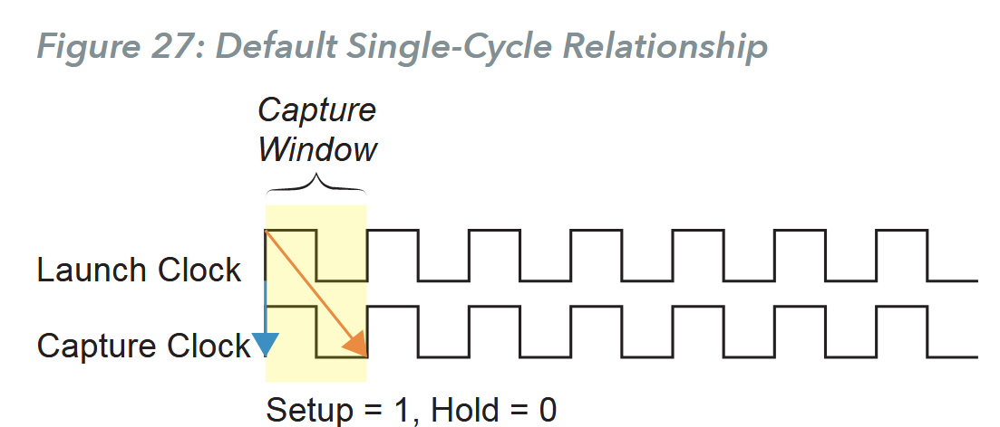

The constraints that represent the default are:

```sdc
set_multicycle_path -setup -from a -to b 1
set_multicycle_path -hold -frmo a -to b 0
```

### Shifted Capture Window

To shift the capture window you use a constraint for the clock setup. The hold is still one clock cycle before the capture clock edge; the software assumes the hold is 0. Therefore, the window is still one clock cycle.

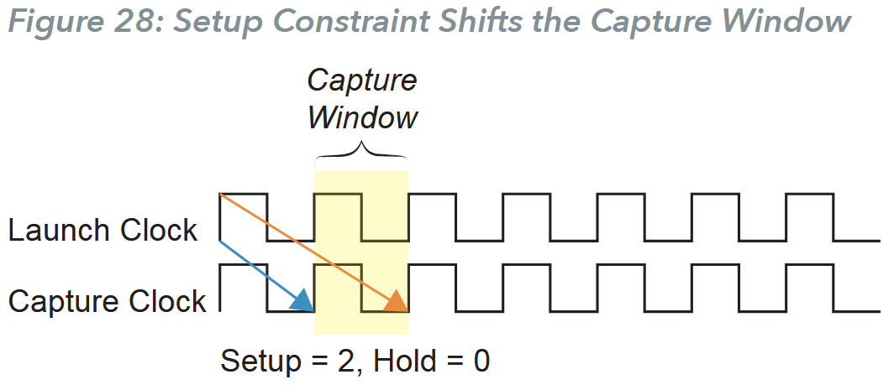

The constraints that represent this example are:

```sdc
set_multicycle_path -setup -from a -to b 2
set_multicycle_path -hold -frmo a -t0 b 0
```

### Shifted and Widened Window

To shift and widen the capture window you constrain the hold time as well as the setup time. A wider window allows multiple clock cycles to capture data. In the following example, the capture window is two clock cycles.

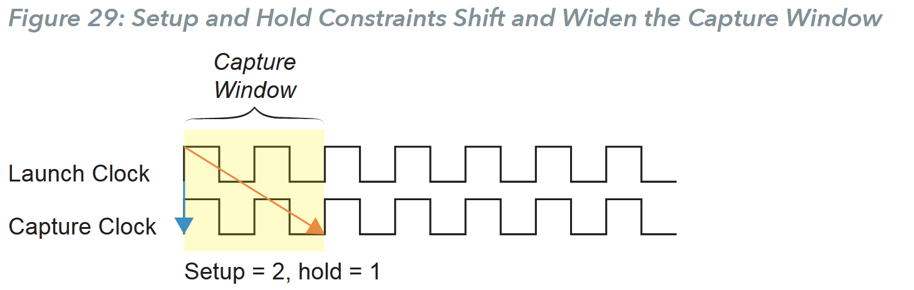

The constraints that represent this example are:

```sdc
set_multicycle_path -setup -from a -to b 2
set_multicycle_path -hold -from a -to b 1
```

To shift the window by *n* cycles with a window *m* cycles wide, use the equations:

* setup = n
* hold = m - 1

For example:

* n = 4, m = 3
* setup = 4
* hold = 3 -1 = 2

These values give you a window that is shifted by 4 clock cycles and id 3 clock cycles wide.

```sdc
set_multicycle_path -setup -from a -to b 4
set_multicycle_path -hold -from a -to b 2
```

If *n* is equal to *m*, then the constraint would simply be:

```sdc
set_multicycle_path -setup -from a -to b n 
set_multicycle_path -hold -from a -to b n-1
```

### Constraints between Fast and Slow Clocks

When the launch and capture clocks have the same frequency and phase, it does not matter which clock waveform you use tu calculate the setup and hold; the result will be the same. However when the clock frequencies are different, you need to specify which clock waveform you want to use for the setup and hold calculation using the *-start* and *-end* modifiers. You cannot use both *-start* and *-end* at the same time.

* *-start* uses the launch clock for the calculation.
* *-end* uses the capture clock for the calculation.

For setup, *-start* moves the launch edge backwards and *-end* moves the capture edge forward. The default is *-end*. For hold, *-start* moves the launch edge forward and *-end* moves the capture edge backward. The default is *-start*.

---

**Explanation:**

这一小节关于多周期约束的使用方法和使用场景，efinity手册讲的不清楚。可参考如下blog:

[Multicycle Path怎么设？看这篇就够了 - 极术社区 - 连接开发者与智能计算生态](https://aijishu.com/a/1060000000206169)

---

When the launch clock is faster than the capture clock, you need to ensure that the *set_multicycle_path* constraint is applied to the launch clock. For the setup constraint, you need to include *-start*. For hold, *-start* is the default so you do not need to include it.

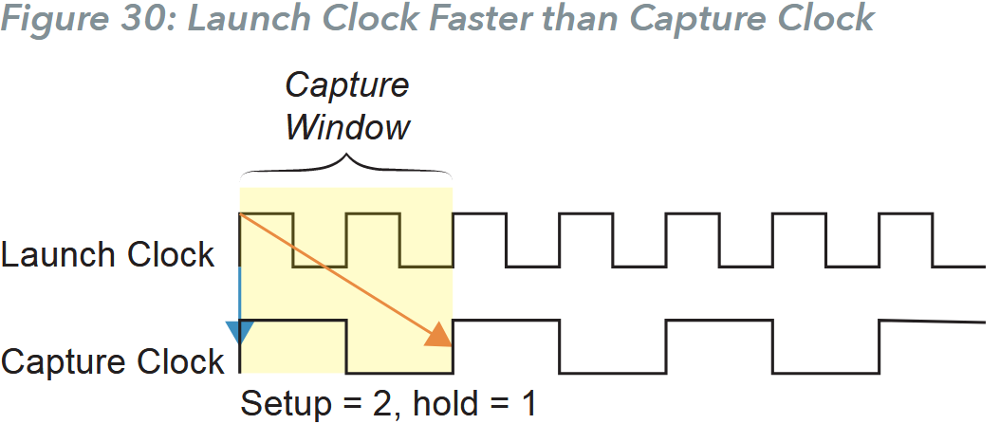

The Constraints that represent this example are:

```sdc
set_multicycle_path -setup -start -from a -to b 2
set_multicycle_path -hold -from a -to b 1
```

When the launch clock is slower than the capture clock, you need to ensure that `set_multicycle_path` constraint is applied to the capture clock. For the setup constraint, you need *-end*, which is the default, so you do not need to include it. For hold, include *-end*.

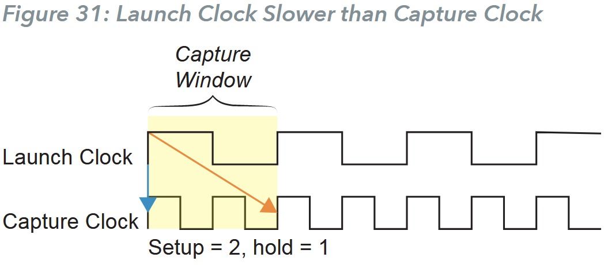

The constraints that represent this example are:

```sdc
set_multicycle_path -setup -from a -to b 2
set_multicycle_path -hold -end -from a -to b 1
```

