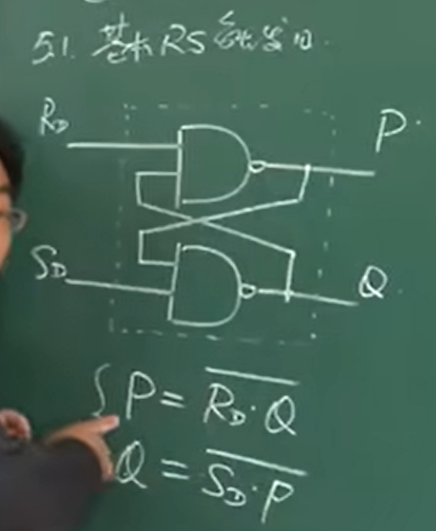
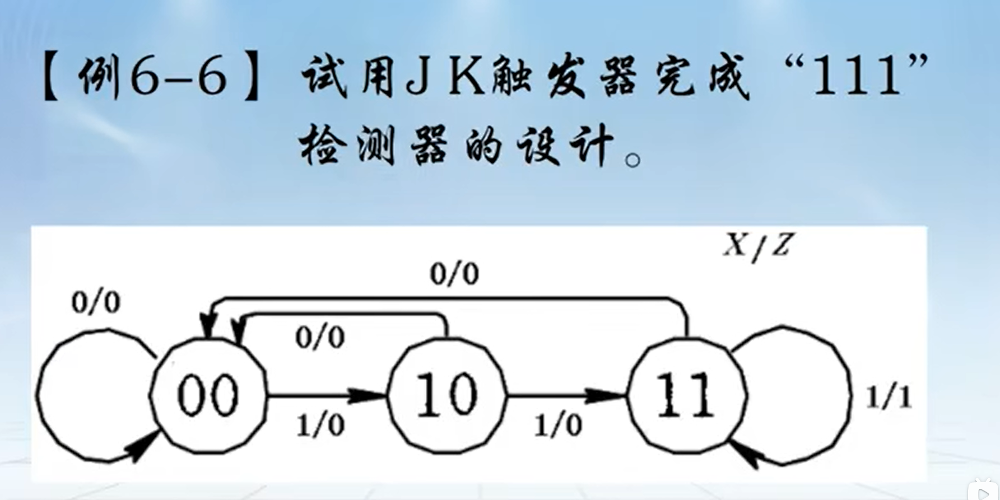

**进制转换**

R进制转十进制：展开即可

十进制转R进制：

* 整数部分除R取余
* 小数部分乘R取整

**编码**

* BCD码
  * 8421码
  * 余3码
* 格雷码：常用，好处是相邻值之间只有一位不同。
* 奇偶校验码：对需要进行奇偶校验的数据按位异或即可

# 2.逻辑代数基础

## 2.1三种基本运算

与(AND) 或(OR) 非(NOT)

## 2.2逻辑代数的基本定律和规则

**使用与（或）运算可以通过外部的控制信号是0/1来控制输出是0（A）还是A（1）。**

反演律可以通过非门将与运算和或运算的互换

## 2.3复合逻辑

与非：先与再非

或非：先或再非

异或(exclusive or)（独有的 或，不同点相加）：不同为1，相同为0

同或（异或非）：相同为1，不同为0

**同或是异或的反函数，所以同或又叫异或非**

**同或和异或即互补，又对偶，是一对特殊函数**

**使用异或（同或）运算可以通过外部的控制信号是0/1来控制输出是A还是A的反变量。**

## 补充内容（工作掌握最小项即可）

与项，最小项（标准项）；与或表达式，标准与或表达式，最简与或表达式……

最小项表达式——标准与或式

使输出为1的最小项相或

最大项表达式

使输出为0的最大项相与

**逻辑代数化简需要对逻辑代数的规律非常熟练，实际工程中更多采用卡诺图的方法化简**

## 2.6逻辑函数的卡诺图化简

**卡诺图采用相邻项逻辑相邻（只有一项不同，其余项相同）的属性对逻辑表达式进行化简（格雷码也是利用这个属性）**

缺点：卡诺图的输入变量大于4个时，卡诺图过于复杂。

* 画图
* 填图
* 读图

任何一个逻辑函数既可以等于其卡诺图（真值表）上填1的那些最小项之和，也可以等于其卡诺图上填0的那些最大项之积。

合并填0的相邻项写成“或项”时，当变量取值为0时写原变量，取值为1时写反变量。

与或表达式 <-------> 或与表达式 可以通过两次反变换（对偶变换）

**卡诺图（真值表）是所有的表达形式变换之间的桥梁**

## 2.7非完全描述逻辑函数的化简

含有无关项的问题就是非完全描述逻辑问题

# 3.组合逻辑电路

## 3.1组合逻辑电路的分析

* 根据给定的逻辑电路，从输入端开始，逐级推导出输出端的逻辑函数表达式。
* 根据输出表达式列出真值表。
* 用文字概括出电路的逻辑功能。

## 3.2组合逻辑电路的设计

* 所用的逻辑器件数最少，器件的种类最少，且器件之间的连线最简单。这样的电路称“最小化”电路。
* 满足速度要求，应使级数最少，以减少门电路的延迟。
* 功耗小，工作稳定可靠。

**关键是从语言描述的功能里面抽象出输入输出**

如同C语言编程中的算法

三角形已知三边求面积

**这种从具象到抽象的建模能力是需要积累和经验的**

## 3.3中规模组合逻辑器件的应用

编码器：如8-3编码器

译码器：如3-8译码器

译码器的常用场景是在：计算机的内存地址（如0xF324）到内存条中物理存储单元（寄存器）使能端的映射。

多路选择器：每次在地址输入的控制下，从多路输入数据中选择一路输出，其功能类似于一个单刀多掷开关。

多路选择器的应用：

1. 作数据选择，以实现多路信号的分时传送。
2. 在数据传输时实现并 -> 串转换
3. 产生序列信号

## 3.4组合逻辑电路中的竞争和冒险

竞争：在组合电路中，某一变量经不同途径传输后，到达电路中某一汇合点的时间有先有后。

冒险：由于竞争使电路输出发生瞬时错误的现象称为冒险。

冒险导致的毛刺很小：持续时间宽度为信号的延迟。

**注意：竞争是经常发生的，但不一定都会产生毛刺。**

实践中，常用实验法示波器去判断是否有毛刺。常用滤波电路去消除毛刺。

# 4.触发器

## 4.1基本RS触发器

规定：基本RS触发器的输出要互斥

Q为主状态的真值表

状态转移真值表：将触发器的次态$Q^{n+1}$与现态$Q^{n}$、输入信号之间的逻辑关系用表格形式表示出来，这种表格就称为状态转移真值表，简称状态表。

特征方程(状态方程)：描述触发器逻辑功能的函数表达式称为特征方程或状态方程。

状态转移图：用图形方式来描述触发器的状态转移规律，圆圈表示触发器的稳定状态，箭头表示在输入信号作用下状态转移的方向，箭头旁的标注表示转移条件。

波形图（时序图）：它反映了触发器的输出状态随时间和输入信号变化的规律，是实验中可观察到的波形。

## 4.2时钟控制的触发器

**时序电路就是为了保证组合逻辑那部分的工作的安全。**

钟控RS触发器

**思考：若R·S=0恒成立，则钟控的RS触发器将没有限制条件，方便使用。**基于此，钟控D触发器由此诞生。

D(Delay)触发器结构：

代入钟控的RS触发器的状态转移方程得到钟控D触发器的状态转移方程。

由于D触发器的特性，所以D触发器又叫寄存器。

基于**若R·S=0恒成立，则钟控的RS触发器将没有限制条件，方便使用。**的思考，换不同的方式使R·S=0恒成立，则可以创建出各种触发器。

T(Toggle)触发器的结构如下：

T触发器的输入结构可拆分为：

T触发器的输入特征方程如图所示：

另外一种结构构成的钟控JK触发器如下图所示：

**D触发器、T触发器、JK触发器特征方程总结**

## 4.3集成触发器

### 4.3.2边沿触发器

钟控触发器的触发时机（采样时机）是CP信号为高电平时。

而边沿触发器的触发实际（采样时机）是时钟信号的上跳沿或下降沿。

同时具备以下条件的触发器称为边沿触发方式触发器(简称边沿触发器):

1. 触发器仅在CP某一约定跳变到来时，才接收输入信号;

2. 在CP-0或CP-1期间，输入信号变化不会引起触发器输出状态变化。

边沿触发器不仅克服了空翻现象，而且大大提高了抗干扰能力，工作更为可靠。

边沿D触发器逻辑符号：

## 4.4触发器的逻辑符号及时序图

逻辑符号和时序图很熟悉了，所以略过。

**三个触发器特征方程总结：**

# 5.时序逻辑电路与设计

## 5.1时序电路概述

与组合逻辑相比，时序逻辑电路有两个特点：

* 时序逻辑电路包含组合逻辑电路和存储电路两部分，存储电路具有记忆功能，通常由触发器组成。
* 存储电路的状态反馈到组合逻辑电路的输入端，与外部输入信号共同决定组合逻辑电路的输出。

时序电路根据时钟源的不同可以分成同步时序电路和异步时序电路。

**时序电路根据输出分类可以分成米里(Mealy)型和摩尔(Moore)型。**

**米里(Mealy)型：**

**摩尔(Moore)型：**

**Q：如何将Mealy型时序电路变换成Moore型时序电路？**

A：最粗暴的方式是直接在输出端加一个寄存器再输出。但是这样会让输出延迟一个时钟周期。原始输出端的变化不能全部反映到寄存器输出端。

Mealy型同步时序电路如图所示：

按上述方法更改成Moore型同步时序电路如图所示：

### 5.1.2时序电路的功能描述

1. 逻辑方程式

2. 状态转移表及状态转移图

Mealy型

Moore型

## 5.2同步时序电路的分析

**分析步骤**

可自启动电路
时序电路中的所有无效状态经过数个CP脉冲后都能进入有效状态环，称电路为可自启动电路。

以下两图为例，可以做能否自启动分析。

能自启动电路

不能自启动电路

### 5.2.2典型同步时序电路分析

寄存器(Register)：单拍N位数据寄存器可用N个D触发器实现

移位寄存器(shift-Register)：单拍N位移位寄存器可用N个D触发器实现。

计数器(counter)：计数器的主要功能是累计输入时钟脉冲的个数。它的应用是不仅可以用来计数、分频，还可以对系统进行定时、顺序控制等，是数字系统中应用最广泛的时序逻辑部件之一。

## 5.3同步时序电路的设计

[38-时序逻辑电路与设计（7）_哔哩哔哩_bilibili](https://www.bilibili.com/video/BV1NE411r7dr/?spm_id_from=333.788.videopod.episodes&vd_source=0c6e9aa27976c7e534f51b25bcdd53f0&p=38)

**设计步骤**

### 5.3.1建立原始状态图和状态表

根据设计命题要求初步画出状态图和状态表，称为**原始状态图和原始状态表**，它们可能包含多余状态。从文字描述的命题到原始状态图的建立往往没有明显的规律可循，因此，在时序电路设计中这是较关键的一步。

画原始状态图、列原始状态表一般按下列步骤进行：

* 分析题意，确定输入、输出变量。
* 设置状态。首先确定有多少种信息需要记忆，然后对每一种需要记忆的信息设置一个状态并用字母表示。
* 确定状态之间的转移关系，画出原始状态图，列出原始状态表。

例：“111“序列检测状态转移图（Moore型与Mealy型）

**个人体会：**

**Moore型状态机设计时**

**1.关注输入变化对应的状态变化**

**2.关注变化后的状态应对应什么输出**

**Mealy型状态机设计时**

**1.关注输入变化对应的状态变化与对应的输出**

**结论：由于Mealy型状态机在已知输入时无需跳转状态即可确定输出，而Moore型状态机在已知输入时需要跳转到下一状态后才能确定输出。故*Moore型电路的输出将比Mealy型电路的输出晚一个时钟周期***

例2：余3码检测器状态转移图（Mealy型）

余3码检测器状态转移图（Moore型）

**个人结论：Moore型状态机的状态往往比Mealy型状态机的状态多或至少相等**

### 5.3.2状态化简

在状态表中判断两个状态是否等价的具体条件如下：

* 在相同的输入条件下都有相同的输出
* 在相同的输入条件下次态也等价

次态等价有三种情况：（利用状态转移表进行比较）

* 次态相同
* 次态交错
* 次态互为隐含条件（可用隐含表进行判断）

隐含表举例：

**若多个状态等价则可合并成一个状态，可用一个状态代替。**

### 5.3.3状态分配

### 5.3.4选择触发器设计电路

思路1：（使用状态转移图的常见思路）

解：1.得到状态转移表

2.利用状态转移表得到输出方程和状态方程

3.利用状态方程和触发器的特征方程得到触发器的输入

思路2：直接使用移位寄存器设计。（容易想到，但是使用的寄存器多，一个状态一个寄存器）

# 6.常用时序逻辑器件及应用

## 6.1集成计数器

74LS160（十进制计数器）、74LS161（四位二进制计数器）

## 6.2集成寄存器和移位寄存器

## 6.3序列信号发生器

## 6.4以MSI为核心的同步时序电路的分析与设计