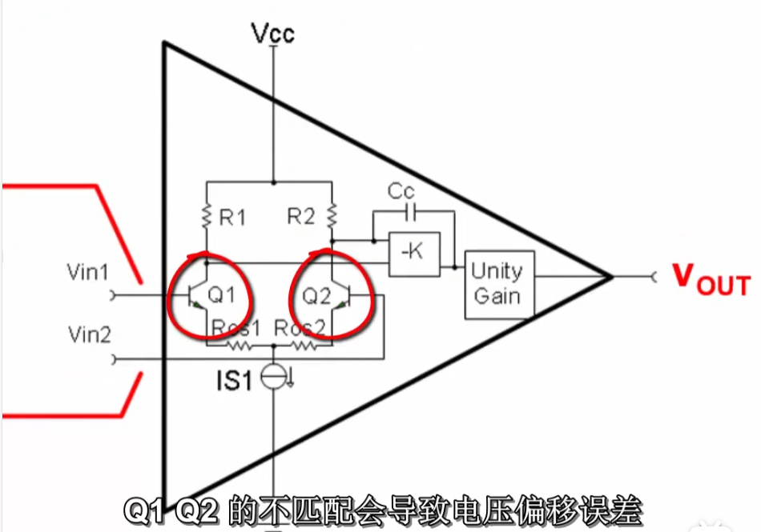
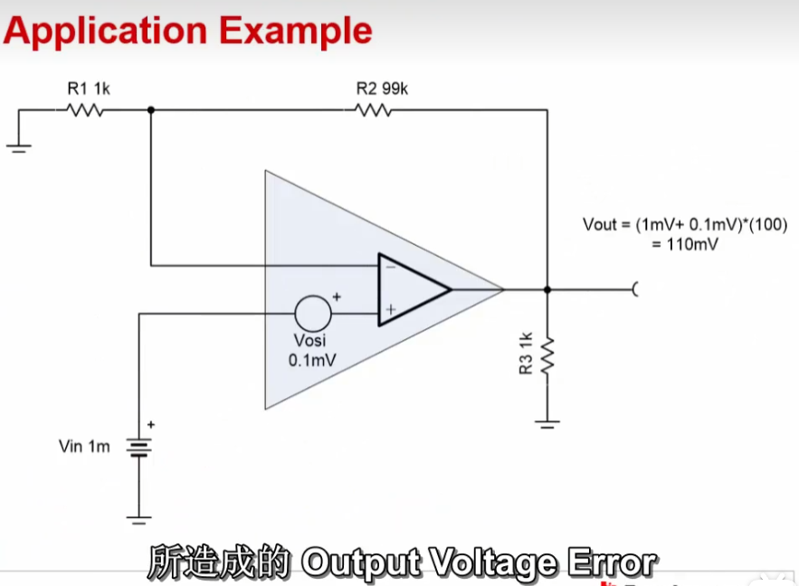
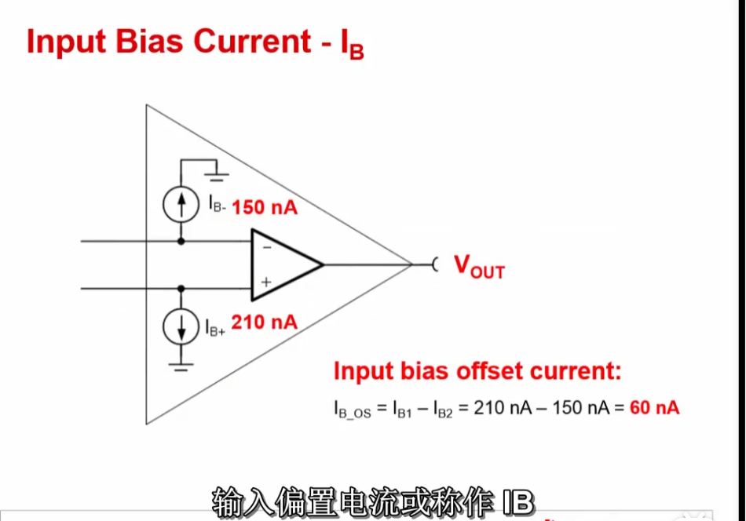
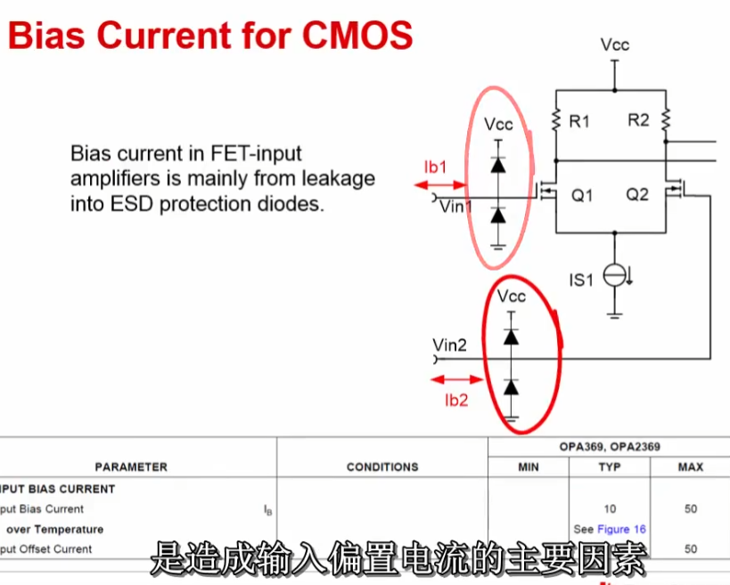
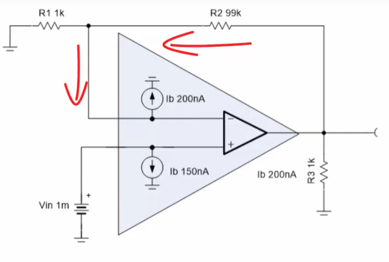
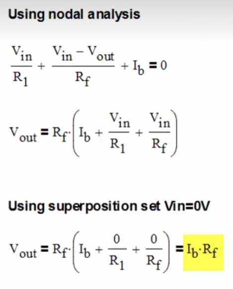
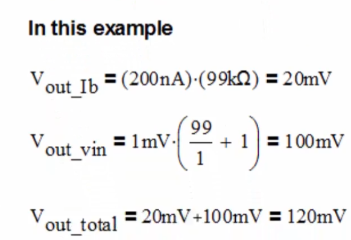

# 运放参数说明

## 输入失调电压(Input Offset Voltage) $V_{OS}$

输入失调电压的定义：强迫让运放输出电压为0V时，所施加在差动输入端的电压值（即正向输入端 — 反向输入端）。输入失调电压的电压范围一般是在$mV$~$uV$级。

输入失调电压可以被建模至运放内部。相当于一个理想电压源连接至理想运放输入端。

改变Power Supply Voltage 电源供应电压和Common mode voltage 共模电压将会影响输入失调电压。 

运放内部的主要原理是模电中的差分放大电路。两个三极管Q1和Q2的不匹配会导致输入失调电压的产生。

### 输入失调电压造成的输出电压误差

## 输入偏置电流(Input Bias Current) $I_B$

输入偏置电流定义：流入运放输入端的电流。如图所示，这个电流可以被建模成一个理想电流源。

## 输入偏差(失调)电流(Input (bias) offset current)

输入偏差(失调)电流定义：如上图所示，运放正向输入端和反向输入端的两个输入偏置电流的差值。如果输入偏差电流很低，那它可以跟各个输入端的输入阻抗匹配，进而消除输入偏置电流所造成的电压偏压误差。

在BJT放大器里面，输入偏置电流是指分别流入BJT输入对的基极电流。一般而言，BJT放大器的偏置电流会大于MOSFET和JFET放大器，Typical(典型)值在几百个$nA$这个范围。在一些精准BJT放大器里，使用一种方法称为Bias Current Consolation，抵消偏置电流来达到偏置电流最小化。这个方法是做在运放芯片内部，不需要额外的外部器件。使用这个方法的运放可以使原本有数百个$nA$的偏置电流，降至数个$nA$。

## 输入偏置电流和输入偏差电流的总结

在MOSFET或JFET的运算放大器里面，ESD保护二极体的漏电流是造成输入偏置电流的主要因素。MOSFET栅极输入端拥有相当低的漏电流，所以它并不会产生很大的偏置电流。

虽然MOSFET和JFET的运放的输入偏置电流的25℃下一班在几十个$pA$的量级。但在MOSFET的运放下，没升高10℃，输入偏置电流会变为原来的两倍。

### 输入偏置电流造成的输出电压误差

## 输入输出限制(Input & Output Limitations)

使用一个运放组成的电压跟随器，常见这样的现象：

术语定义：

* 共模电压(Common Mode Voltage) $V_{CM}$：放大器两个输入端的平局电压。对于运放来说，它的两个输入端电平几乎是一样的，两者只相差一个很小的 Offset 输入失调电压值。所以在每一个输入端上都能看到这个共模信号。

  

* 共模输入电压范围(Input Voltage Swing)：又称输入电压摆幅。它定义了运放正常线性工作所需的输入共模电压范围。共模输入电压范围通常是相对于正电源和负电源而定义的。如果超过这个共模输入范围，输出信号会变成非线性。

* 输出电压摆幅(Output Voltage Swing)：是指输出信号线性工作时的输出电压范围。输出摆幅同样也是相对于供电电源而定义的。如果超过运放的输出电压摆幅参数指标，输出信号将会失真或者出现非线性。

  

  相对于电源定义的解释，如下图。

  

常见的**轨对轨运放指的是**共模输入电压范围可以达到供电电源的两个轨，并且输出电压接近供电电源轨的放大器。

### $V_{CM}$ TWO Examples

如下图所示，左侧为反相比例放大器，右侧为同相比例放大器。两者考虑输入共模电压这个参数时是不同的。

左侧的反相比例放大电路的同相端接地，为0V。则反相输入端的电压也约等于0V。所以这个电路的共模输入电压即为0V。并且不论输入信号如何变化，共模输入电压都是保持在0V不变的。

右侧的同相比例放大器输入信号接到同相输入端，这样一来共模信号就会收到输入信号钳制。换句话说，如果输入信号变化，共模信号也会随之变化使用这种配置时，一定要注意避免超过运放的共模电压限制。

## Input $V_{CM}$ or Output Voltage Probelm?

### Example One

这个一个运算放大器搭建的Buffer缓冲器，正常情况下，我们会看到输出是0V，或者是一个很小的输出误差信号，这个信号是和输入失调电压$V_{OS}$相关的。但是如果我们做DC仿真，会发现输出端的电压值接近200mV，然而最大的失调电压值才是120uV。

根据共模输入电压范围和输出电压摆幅两个参数分别计算得到$-0.1V<V_{IN}<1.5V$，$0.2V<V_{OUT}<4.8V$。

由于我们的输入电压是0V，运放的输出端也将跟随到0V，但是这已经低于输入电压范围的最小值。因此这时输出电压只能达到接近0.2V的一个最小值，即仿真中得到的171mV。

### Example Two

## 带宽(BandWidth)

[5.1 带宽 1_哔哩哔哩_bilibili](https://www.bilibili.com/video/BV19Y4y1r7zg?spm_id_from=333.788.videopod.episodes&vd_source=0c6e9aa27976c7e534f51b25bcdd53f0&p=10)

* 认识增益(gain)

* 如何用线性或者是分贝来表示增益

* 零点(zeros)和极点(pulse)

  

* 波特图(Bode plots)

* 截止频率(Cutoff frequency)和带宽(BandWidth)的定义

[5.2 带宽 2_哔哩哔哩_bilibili](https://www.bilibili.com/video/BV19Y4y1r7zg?spm_id_from=333.788.videopod.episodes&vd_source=0c6e9aa27976c7e534f51b25bcdd53f0&p=11)

* 开环回路增益(open loop gain)

  

  $A_{cl}=Closed Loop Gain=\frac{A_{ol}}{1+A_{ol}\beta}=\frac{V_{out}}{V_{in}+V_{out}\beta}$

  方框中的最后一行的$A_{cl}$是常见的同相放大器闭环回路增益公式。需要注意的是，**这个公式仅适用于开环增益非常高时。**

  然而在现实世界中，运放的开环回路增益具有低频的主极点(dominnant pole)。如图所示可以被看作是一个RC filter滤波器。此仿真描绘了真实世界运放的开环回路增益。在直流或低频，$A_{ol}$是非常大的。在这种情况下它是120dB或100万V/V。随着频率的增加，$A_{ol}$以-20dB/dec的速率降低。在图中，我们看到在10MHz时，开环回路增益为0dB或1V/V。

  

* 闭环回路增益(closed loop gain)

  开环回路增益对闭环回路增益的影响：闭环回路增益在低频时为$1/\beta$，在高频时为$A_{ol}$。我们定义电路的带宽为$1/\beta$和$A_{ol}$曲线相交的斜率。

  

  然而，请注意X轴是对数的，因此以图形方式选定的带宽可能不够精确。

* 增益带宽积(gain bandwidth product)

  增益带宽积时线性增益和带宽的乘积，因此给定两个变数中的一个可以得到另外一个的解。计算过程可如下图左侧红色方框中的内容所示。（由此计算过程我认为增益带宽积时开环回路增益与带宽的乘积，须在开环回路增益满足-20dB/dec的下降区域内有效）请注意，计算出的带宽需当$A_{ol}$局限于-20dB/dec的速率下降才是有效的，虽然大部分的运算放大器都符合，但也有些特定的增益带宽积是有限的范围。

  

  此外，考虑到数据表有增益带宽积和$A_{ol}$曲线的典型值，通常可以预期该值在室温下的变异数高达$\pm30\%$。在规定的温度范围外，可能有附加$\pm30\%$误差的变化。因此，当考虑到放大器的放大带宽时，应在设计时保留设计裕度。

* 静态电流(Quiescent Current)与带宽(BandWidth)的关系

  在一般的情况下，较宽的带宽运算放大器需要较多的静态电流。原理如下图所示。观察双极型晶体管和MOSFET的转导(Transductions)(又叫电流增益)。可以看出基极(collector)和漏极(drain)电流的直接关系。转导取倒数可得阻抗或$r_{gm}$，$r_{gm}$是运放内部第一级的动态输出阻抗，此输出阻抗驱动米勒电容$C_c$，$r_{gm}$和$C_c$的串联组合形成一个低通滤波器。该低通滤波器的主机点产生放大器内部的带宽。图中第四个公式显示增加电流消耗直接增加双极型运算放大器的带宽。但是如果是MOSFET，带宽将依漏极电流平方根的比例增加。

  

* 仿真电路带宽并验证计算结果

[5.3 带宽 3_哔哩哔哩_bilibili](https://www.bilibili.com/video/BV19Y4y1r7zg?spm_id_from=333.788.player.switch&vd_source=0c6e9aa27976c7e534f51b25bcdd53f0&p=12)

* 主极点(低频极点)

  主极点是在$A_{ol}$图中当$A_{ol}$开始随频率下降的点。于发展macro model时，此参数非常重要。