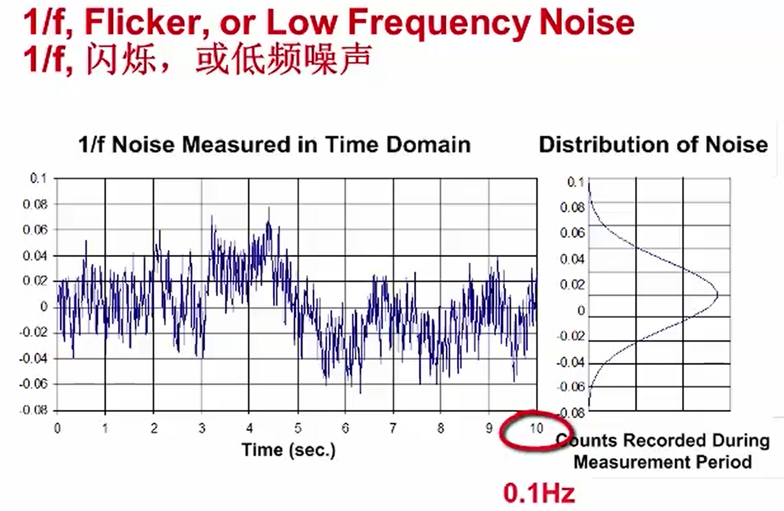
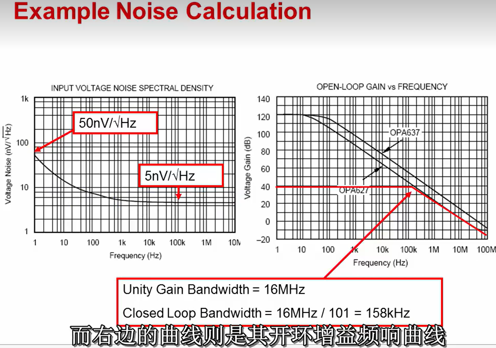
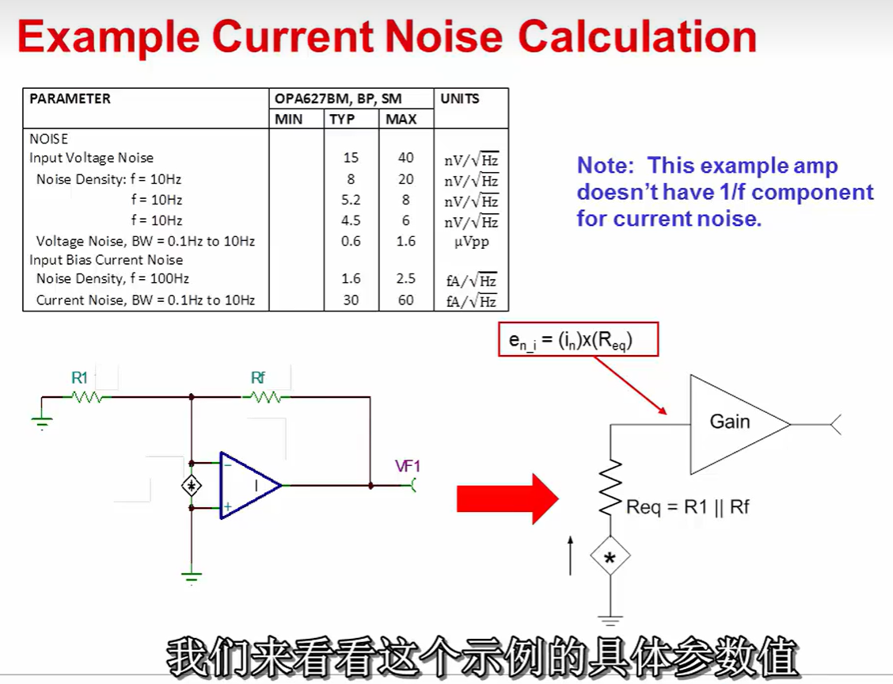
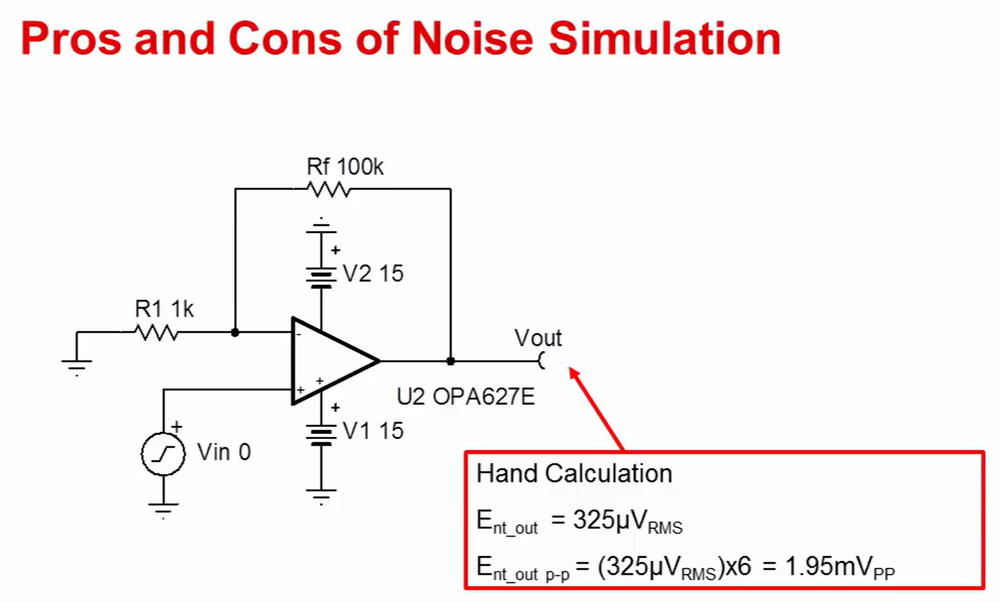
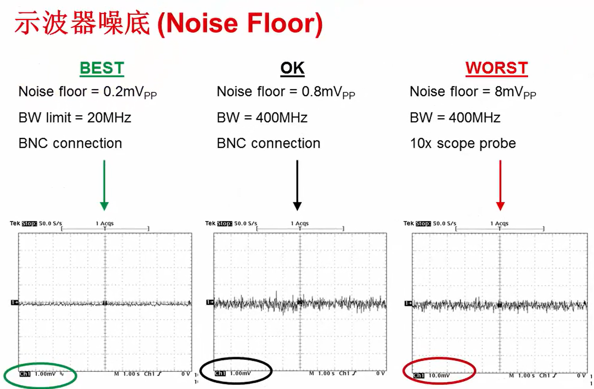
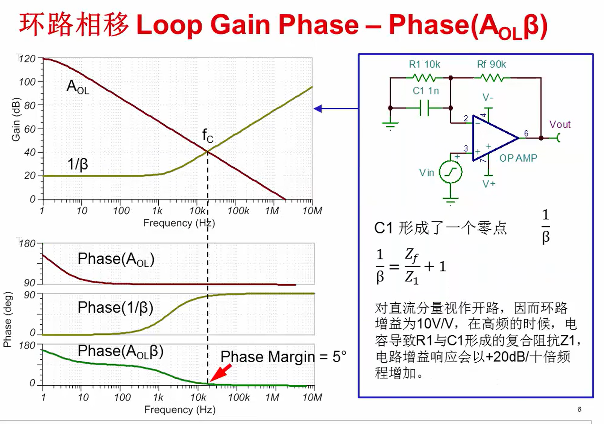
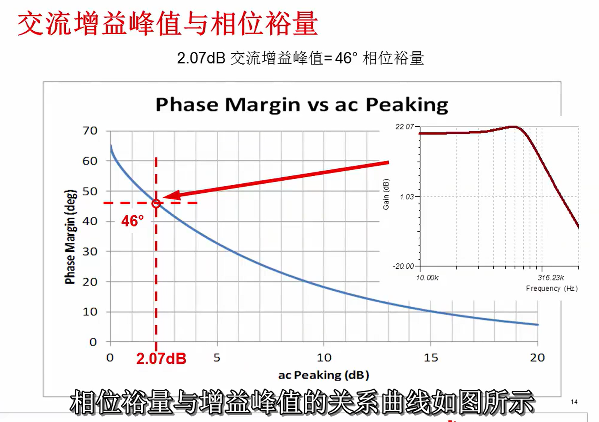
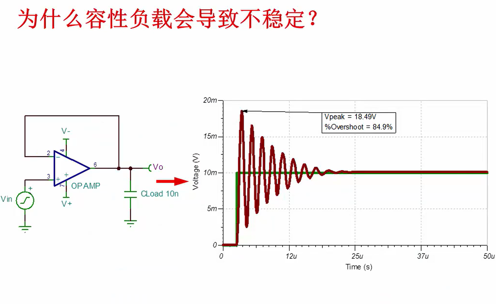
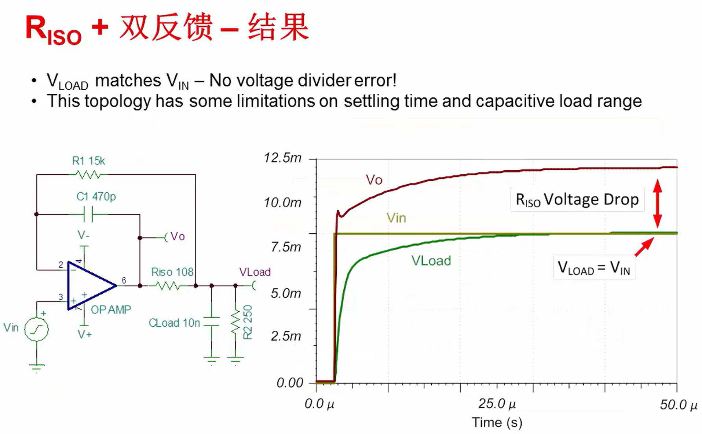

# 输入失调电压(Input Offset Voltage) $V_{OS}$

输入失调电压的定义：强迫让运放输出电压为0V时，所施加在差动输入端的电压值（即正向输入端 — 反向输入端）。输入失调电压的电压范围一般是在$mV$~$uV$级。

输入失调电压可以被建模至运放内部。相当于一个理想电压源连接至理想运放输入端。

改变Power Supply Voltage 电源供应电压和Common mode voltage 共模电压将会影响输入失调电压。 

运放内部的主要原理是模电中的差分放大电路。两个三极管Q1和Q2的不匹配会导致输入失调电压的产生。

## 输入失调电压造成的输出电压误差

# 输入偏置电流(Input Bias Current) $I_B$

输入偏置电流定义：流入运放输入端的电流。如图所示，这个电流可以被建模成一个理想电流源。

# 输入偏差(失调)电流(Input (bias) offset current)

输入偏差(失调)电流定义：如上图所示，运放正向输入端和反向输入端的两个输入偏置电流的差值。如果输入偏差电流很低，那它可以跟各个输入端的输入阻抗匹配，进而消除输入偏置电流所造成的电压偏压误差。

在BJT放大器里面，输入偏置电流是指分别流入BJT输入对的基极电流。一般而言，BJT放大器的偏置电流会大于MOSFET和JFET放大器，Typical(典型)值在几百个$nA$这个范围。在一些精准BJT放大器里，使用一种方法称为Bias Current Consolation，抵消偏置电流来达到偏置电流最小化。这个方法是做在运放芯片内部，不需要额外的外部器件。使用这个方法的运放可以使原本有数百个$nA$的偏置电流，降至数个$nA$。

# 输入偏置电流和输入偏差电流的总结

在MOSFET或JFET的运算放大器里面，ESD保护二极体的漏电流是造成输入偏置电流的主要因素。MOSFET栅极输入端拥有相当低的漏电流，所以它并不会产生很大的偏置电流。

虽然MOSFET和JFET的运放的输入偏置电流的25℃下一班在几十个$pA$的量级。但在MOSFET的运放下，没升高10℃，输入偏置电流会变为原来的两倍。

## 输入偏置电流造成的输出电压误差

# 输入输出限制(Input & Output Limitations)

使用一个运放组成的电压跟随器，常见这样的现象：

术语定义：

* 共模电压(Common Mode Voltage) $V_{CM}$：放大器两个输入端的平局电压。对于运放来说，它的两个输入端电平几乎是一样的，两者只相差一个很小的 Offset 输入失调电压值。所以在每一个输入端上都能看到这个共模信号。

  

* 共模输入电压范围(Input Voltage Swing)：又称输入电压摆幅。它定义了运放正常线性工作所需的输入共模电压范围。共模输入电压范围通常是相对于正电源和负电源而定义的。如果超过这个共模输入范围，输出信号会变成非线性。

* 输出电压摆幅(Output Voltage Swing)：是指输出信号线性工作时的输出电压范围。输出摆幅同样也是相对于供电电源而定义的。如果超过运放的输出电压摆幅参数指标，输出信号将会失真或者出现非线性。

  

  相对于电源定义的解释，如下图。

  

常见的**轨对轨运放指的是**共模输入电压范围可以达到供电电源的两个轨，并且输出电压接近供电电源轨的放大器。

## $V_{CM}$ TWO Examples

如下图所示，左侧为反相比例放大器，右侧为同相比例放大器。两者考虑输入共模电压这个参数时是不同的。

左侧的反相比例放大电路的同相端接地，为0V。则反相输入端的电压也约等于0V。所以这个电路的共模输入电压即为0V。并且不论输入信号如何变化，共模输入电压都是保持在0V不变的。

右侧的同相比例放大器输入信号接到同相输入端，这样一来共模信号就会收到输入信号钳制。换句话说，如果输入信号变化，共模信号也会随之变化使用这种配置时，一定要注意避免超过运放的共模电压限制。

# Input $V_{CM}$ or Output Voltage Problem?

## Example One

这个一个运算放大器搭建的Buffer缓冲器，正常情况下，我们会看到输出是0V，或者是一个很小的输出误差信号，这个信号是和输入失调电压$V_{OS}$相关的。但是如果我们做DC仿真，会发现输出端的电压值接近200mV，然而最大的失调电压值才是120uV。

根据共模输入电压范围和输出电压摆幅两个参数分别计算得到$-0.1V<V_{IN}<1.5V$，$0.2V<V_{OUT}<4.8V$。

由于我们的输入电压是0V，运放的输出端也将跟随到0V，但是这已经低于输入电压范围的最小值。因此这时输出电压只能达到接近0.2V的一个最小值，即仿真中得到的171mV。

## Example Two

# 带宽(BandWidth)

## [5.1 带宽 1_哔哩哔哩_bilibili](https://www.bilibili.com/video/BV19Y4y1r7zg?spm_id_from=333.788.videopod.episodes&vd_source=0c6e9aa27976c7e534f51b25bcdd53f0&p=10)

* 认识增益(gain)

* 如何用线性或者是分贝来表示增益

* 零点(zeros)和极点(pulse)

  

* 波特图(Bode plots)

* 截止频率(Cutoff frequency)和带宽(BandWidth)的定义

## [5.2 带宽 2_哔哩哔哩_bilibili](https://www.bilibili.com/video/BV19Y4y1r7zg?spm_id_from=333.788.videopod.episodes&vd_source=0c6e9aa27976c7e534f51b25bcdd53f0&p=11)

* 开环回路增益(open loop gain)

  

  方框中的最后一行的$A_{cl}$是常见的同相放大器闭环回路增益公式。需要注意的是，**这个公式仅适用于开环增益非常高时。**

  然而在现实世界中，运放的开环回路增益具有低频的主极点(dominnant pole)。如图所示可以被看作是一个RC filter滤波器。此仿真描绘了真实世界运放的开环回路增益。在直流或低频，$A_{ol}$是非常大的。在这种情况下它是120dB或100万V/V。随着频率的增加，$A_{ol}$以-20dB/dec的速率降低。在图中，我们看到在10MHz时，开环回路增益为0dB或1V/V。

  

* 闭环回路增益(closed loop gain)

  开环回路增益对闭环回路增益的影响：闭环回路增益在低频时为$1/\beta$，在高频时为$A_{ol}$。**我们定义电路的带宽为$1/\beta$和$A_{ol}$曲线相交的频率。**

  

  然而，请注意X轴是对数的，因此以图形方式选定的带宽可能不够精确。

* 增益带宽积(gain bandwidth product)

  增益带宽积时线性增益和带宽的乘积，因此给定两个变数中的一个可以得到另外一个的解。计算过程可如下图左侧红色方框中的内容所示。（由此计算过程我认为增益带宽积是开环回路增益与带宽的乘积，须在开环回路增益满足-20dB/dec的下降区域内有效）请注意，计算出的带宽需当$A_{ol}$局限于-20dB/dec的速率下降才是有效的，虽然大部分的运算放大器都符合，但也有些特定的增益带宽积是有限的范围。

  

  此外，考虑到数据表有增益带宽积和$A_{ol}$曲线的典型值，通常可以预期该值在室温下的变异数高达$\pm30\%$。在规定的温度范围外，可能有附加$\pm30\%$误差的变化。因此，当考虑到放大器的放大带宽时，应在设计时保留设计裕度。

* 静态电流(Quiescent Current)与带宽(BandWidth)的关系

  在一般的情况下，较宽的带宽运算放大器需要较多的静态电流。原理如下图所示。观察双极型晶体管和MOSFET的转导(Transductions)(又叫电流增益)。可以看出基极(collector)和漏极(drain)电流的直接关系。转导取倒数可得阻抗或$r_{gm}$，$r_{gm}$是运放内部第一级的动态输出阻抗，此输出阻抗驱动米勒电容$C_c$，$r_{gm}$和$C_c$的串联组合形成一个低通滤波器。该低通滤波器的主机点产生放大器内部的带宽。图中第四个公式显示增加电流消耗直接增加双极型运算放大器的带宽。但是如果是MOSFET，带宽将依漏极电流平方根的比例增加。

  

* 仿真电路带宽并验证计算结果

## [5.3 带宽 3_哔哩哔哩_bilibili](https://www.bilibili.com/video/BV19Y4y1r7zg?spm_id_from=333.788.player.switch&vd_source=0c6e9aa27976c7e534f51b25bcdd53f0&p=12)

* 主极点(低频极点)

  主极点是在$A_{ol}$图中当$A_{ol}$开始随频率下降的点。于发展macro模型时，此参数非常重要。极点频率可以从$A_{ol}$曲线来估计，但更准确的方法是使用增益带宽积及开环回路增益$A_{vol}$来计算。计算过程详见下图左下方框。需要说明的是，这个计算的思路是利用增益带宽积的定义计算开环回路增益最大时对应的频率，即可得到主极点的频率。
  
  
  
* 可变的增益带宽积

  

  需要注意的时当开环回路增益小于50时，增益带宽积不再为常数。当开环回路增益小于12时，相位裕度(Phase margin)小于-180°，系统不稳定，理论上会产生自激振荡。

* 使用同相增益(none inverting gain)来计算带宽

  如图所示，无论是同相比例放大电路还是反向比例放大电路。在计算带宽时所使用的增益的均定义为$gain=1+\frac{R_f}{R_1}$，这个增益$gain$是同相组态的增益，即同相增益，通常被称噪声增益(Noise gain) 。图中右上图显示了手算理论结果和仿真结果的吻合。**即计算运放的带宽时，应使用噪声增益$1+\frac{R_f}{R_1}$计算运放带宽。**

  **个人理解：使用增益带宽积计算带宽是利用增益带宽积为常数寻找$1/\beta$与$A_{ol}$曲线的交点即为带宽。完全是按照带宽的定义计算的。**

  

* **为何使用同相增益(none inverting gain)来计算带宽**

  根据同相组态和反向组态的控制框图可知对应的系统传递函数在时域的表达形式。可计算出同行组态和反向组态的增益如下图二所示。二者除前馈因子$\alpha$外形式相同，且$\alpha$为常数。故二者的增益表达式除$\alpha$外形式相同，均与变量$\beta$有关。由于$\frac{1}{\beta}=\frac{R_f}{R_1}+1$为同相增益。所以反相组态和同相组态的带宽均由同相增益来决定。

  

* 高频极点的位置对带宽的二次效应

  将之前的仿真的运放进行更换。之前的仿真中是使用的是简化的单极点运算放大器模型，而本次仿真更换为实际的OPA827运放。Bandwidth的计算与之前相同，计算出反向放大器的带宽为11MHz，用于缓冲器的同行放大器带宽为22MHz。而当仿真电路时，带宽分别为18MHz和34.7MHz。原因是现实世界中的运算放大器和强大的仿真模型有多个极点。在他们的开环回路增益或$A_{ol}$曲线，我们已经讨论了一个低频极点的存在或主极点，其他极点通常被设计在元件的单位增益带宽之外，然而其他极点仍然会影响带宽。

  

  此页的左侧描述了$A_{ol}$和一个简化的仿真相位曲线。请注意，只有主极点出现在$A_{ol}$曲线。我们看到对应的相位图中，由于主极点产生了相应90°的相移。在更高的频率范围内，很明显的是没有额外的极点，因为相位曲线保持不变。相位只于极点频率的是被聘之前那开始改变。

  此页右侧我们看到$A_{ol}$和相位曲线更全面的双极点仿真模型。在此，我们看到在低频的主极点存在。着眼于相位曲线，我们看到一个相位于高频移动，这表示一个高频极点存在。请注意，即使极点的位置超出单位增益带宽，但它仍能影响元件的相位。

  

  在$A_{ol}$曲线的第二个极点，会影响运算放大器闭环回路相应的幅值和相位。实际上，有两个或多个极点的$A_{ol}$曲线放大器的闭环回路响应是由下图右下角的传递函数来求得的。其中$s=j\omega$，$\omega$是自然频率，$\zeta$是阻尼因数。使用对数图绘制二阶系统的幅值在不同$\zeta$下的增益与频率的关系，以dB为单位。请注意，当第二个极点的频率高于unit frequency，此时$\zeta$的值较大，并没有gain peaking 的影响。然而如果第二极点的频率接近unit gain frequency，此时$\zeta$的值小，并受gain peaking 的影响很大。gain peaking发生在现实世界中的运算放大器，并建立在大多数运算放大器模型中。当频率接近natural frequency，gain peaking将导致误差并会影响带宽。

  

  **闭环回路的带宽会随着第二极点频率的降低而增加。当第二极点接近单位增益带宽，闭环回路带宽停止变化，我们会看到显著的gain peaking。**值得一提的是 peaking effect只会发生于低增益。现在应注意的是运放第二极点的位置关系到可能出现gain peaking。此外这种影响通常是包含在SPICE运算放大器的macro-model中，该峰值的大小一般在几分贝，并且对带宽变化的影响应小于2倍。

  

  

## [5.4 带宽 4_哔哩哔哩_bilibili](https://www.bilibili.com/video/BV19Y4y1r7zg?spm_id_from=333.788.videopod.episodes&vd_source=0c6e9aa27976c7e534f51b25bcdd53f0&p=13)

* $A_{ol}$曲线的斜率如何影响增益带宽

  * 增益带宽在不同闭环回路增益有些偏差是不常见的，而该偏差量将取决于放大器而异
  * 寻找一个零点或极点，相位曲线是关键。所以除了检查开环回路增益曲线，也要检查相位曲线。
  * 不要指望在数据表中列出带宽性能的确切性。应为典型带宽规格在不同的制程约有$\pm30\%$和不同温度下$\pm30\%$的变异。因此强烈建议在设计时对带宽要留显著的裕度。

  

* 为何运放的输入电容能够限制带宽

  所有运算放大器有差模和共模输入电容和阻抗，这种寄生电容是由于输入极晶体管的半导体界面造成的。差模电容之间连接到两个输入端，共模电容被连接在各输入相对于交流接地。表格中通常会显示输入电容。

  如下图所示的例子中，差模电容是1.6pF，共模电容是6.4pF。输入电容都比较小，所以这种情况下是不可能看到带宽的限制的，除非输入信号源具有大的串联电阻。在这个例子中，信号源电阻是比较大的1MΩ，原电阻和共模输入电容组成低通滤波器。对应的截止频率为24.87kHz。请注意，差模电容和反相输入端的共模电容未包括在带宽计算内。这是因为运算放大器的回授消除了这些电容。

  

  输入电容是TI的运算放大器模型的一部分，所以可以通过仿真得到结果。

  

* 如何计算放大器电路的实际增益和带宽

  计算方法

  

  **结论**：随着频率的增加，当接近截止频率时，闭回路增益减少。**所以如果需要设计一个在高频精确的增益，截至频率应相对增加。**

* 如何运用feedback capcitor来限制电路的带宽

  feedback capcitor回授电容在低频时可视为开路，在高频时可视为短路，从而限制运放带宽。此时运放带宽如下图红色方框所示。

  

* 了解slew rate即压摆率它是如何影响不同带宽的响应的

  运放的slew rate时输出信号的最大变化率。(**最大输出电压与频率的图表**)压摆率可以影响在不同频率下运算放大器的行为，此作用可以被误解为带宽限制。事实上最大输出电压与频率取决于slew rate。通常被称为全功率带宽。

  

# 压摆率

压摆率被定义为运放输出电压可以达到的最大摆动速率它以V/us为单位。测量压摆率时可以在运放的输入端加入一个较大的阶跃信号，比如1V幅值，然后测量输出端的电压摆动，即测量输出电平从最终输出量的10%增加到90%时的时间间隔。有些运放的数据手册中会专门给出压摆率指标，有些则用大信号的阶跃响应来代替。大信号的阶跃响应的压摆率计算方式如下图所示。

压摆率主要描述了与放在大信号输入时的响应指标，而在$\pm100mV$以下的小信号，我们应该使用小信号带宽这一指标。二者是不同的。

压摆率产生原因如下图所示

运放的全功率带宽描述了最大输出电压和频率的关系，下图显示了无压摆率失真时，在不同频率正弦波输入下的最大输出电压。

# 噪声

## [8.1 噪声 1_哔哩哔哩_bilibili](https://www.bilibili.com/video/BV19Y4y1r7zg?spm_id_from=333.788.videopod.episodes&vd_source=0c6e9aa27976c7e534f51b25bcdd53f0&p=21)

外部噪声：由于外部电路或自然因素导致的噪声。

固有噪声：由电路元器件引起的，比如电阻和半导体器件都可以产生噪声。

电路设计时的固有噪声可以建模如下：

其中内带星号的圆圈表示电压噪声源，内带型号的菱形表示电流噪声源。在运放的数据手册中已给出噪声源的幅值，电阻所对应的噪声可根据电阻的大小计算得到。我们很快就会学习如何综合这些噪声源来计算得到总的输出噪声。不过首先我们先学习一下噪声的常见分类。

### 噪声的常见分类：

1. White Noise (Broadband Noise)：白噪声（宽带噪声）。一般来说，宽带噪声是指从中频到高频的范围即大于1kHz的频率。之后我们会涉及低频噪声源。下图显示的是时域波形和统计分布图。下图中的右图显示的是一个统计分布图，这是一个高斯分布，平均值为$0V$，最大最小值约为$\pm40mV$。这个分不表示测量噪声接近$0V$的概率很高，而接近两边极值的概率相对比较低。之后我们会学习如何用这个分布来估计Peak to Peak Noise 峰峰值噪声。

   

2. Flicker Noise, 1/f Noise, Low Frequency Noise：闪烁噪声，1/f噪声，低频噪声。一般来说，1/f噪声是指处于低频范围，即频率小于1kHz的噪声。

   

3. Burst Noise (Popcorn Noise)：突发噪声（爆米花噪声）。爆米花噪声表现为电压或者电流的跳变。显然它不是高斯分布。实际上它是两个或者多个分布的叠加。示例中的分布是三个高斯曲线的相互叠加。爆米花噪声出现在低频，通常在0.1Hz~1kHz的范围内。之所以叫这个名字，是因为当用扬声器播放它的时候，听起来就像是爆米花在跳动。爆米花噪声是由于半导体材料中的细微缺陷导致的。但是我们无法用数学方法估计得到这个噪声。

   

一类噪声可以用很多同义词。下面列举部分同义词如下图。

### **大多数噪声遵循高斯分布。我们可以用概率分布函数计算峰峰值噪声。** 

根据概率分布函数我们可以知道，噪声出现在$\pm\sigma$之间内的概率为$68.3\%$，而在$\pm3\sigma$之间的概率为$99.7\%$。我们在估计峰峰值噪声时通常用$6\sigma$或$6.6\sigma$。

如果对噪声分析比较熟悉，可能会见到有些地方将标准差和RMS值（有效值）交替使用。那么这两个值真的是相等的吗？

答案是这两个值并不一定总是相等。实际上只有在没有DC成分的情况下才是相等的。对于大部分的噪声而言，这两个值是相等的。

幸运的是，运放噪声和电阻噪声都不含DC成分。所以这种情况下，我们认为RMS和标准差是相等的。一些外部噪声，例如数字转换噪声可能不是对称的，即会包含一个DC成分。值得注意的是，一些仪器或测试设备在显示RMS噪声时会包含DC成分，而另一些设备显示的RMS则不包含DC成分只有AC成分。

**噪声的叠加方式要采用类似向量叠加的方式**。这种计算方式只适用于不相关的随机噪声信号。如果噪声源是相关的，要使用另一种计算方式。

### 噪声频谱密度曲线

正如白光是由各种频率的光混合得到的一样，白噪声也是由各种频率的噪声组成的。如图中所示，如果将几个不频率的信号在时域上叠加在一起。可以得到一个随机信号。在频域中，每一个信号看起来就像是一个脉冲信号。将无数个这样不同频率的信号叠加在一起，就可以得到Nosie spectral density curve 噪声频谱密度曲线。

对于不太熟悉噪声分析的工程师来说，Voltage noise spectral density 电压噪声频谱密度常常是一个比较令人困惑的参数。频谱密度的单位是$nV/\sqrt{Hz}$。如右上角的方程式所示，将频谱密度和每平方根噪声带宽相乘，便可以得到RMS噪声。你可以看到平方根赫兹是如何相消的。对于运放的噪声来说，频谱密度曲线是一个主要的参数。在之后我们会讲解如何使用频谱密度曲线计算噪声。

### 电阻热噪声计算

如何计算电阻内部电荷的随机游动引起的噪声？

#### 理论基础

电阻热噪声（约翰逊-奈奎斯特噪声）由电子热运动产生，其**电压噪声功率谱密度**（单边谱）为：
$
S_v(f) = 4k_B T R \quad \text{(单位: } \mathrm{V^2/Hz)}
$
其中：

- \(k_B\)：玻尔兹曼常数（\(1.380649 \times 10^{-23}  \mathrm{J/K}\)）
- \(T\)：绝对温度（单位：开尔文，K）
- \(R\)：电阻值（单位：欧姆，Ω）

对应的**电压噪声频谱密度**（幅度谱）为：
$
e_n = \sqrt{S_v(f)} = \sqrt{4k_B T R} \quad \text{(单位: } \mathrm{V/\sqrt{Hz})}
$

---

#### 示例计算
**假设条件**：
- 电阻 \(R = 1  \mathrm{k\Omega} = 1000  \Omega\)
- 温度 \(T = 300  \mathrm{K}\)（室温 27°C）

##### 步骤 1：计算电压噪声功率谱密度 \(S_v(f)\)
$
S_v(f) = 4 \times (1.380649 \times 10^{-23}) \times 300 \times 1000
$

**结果**：
$
\boxed{S_v(f) \approx 1.66 \times 10^{-17}  \mathrm{V^2/Hz}}
$

##### 步骤 2：计算电压噪声频谱密度 \(e_n\)
$
e_n = \sqrt{S_v(f)} = \sqrt{1.66 \times 10^{-17}}
$

**结果**：
$
\boxed{e_n \approx 4.07  \mathrm{nV}/\sqrt{\mathrm{Hz}}}
$

**实际噪声电压计算**：
若系统带宽为 \(B\)（单位：Hz），总噪声电压（RMS）为：
$
v_{n,\mathrm{rms}} = e_n \times \sqrt{B} = \sqrt{4k_B T R B}
$
**示例**：当 $B = 1\mathrm{MHz}= 10^6\mathrm{Hz}$ 时：
$
v_{n,\mathrm{rms}} = 4.07 \times 10^{-9} \times \sqrt{10^6} = 4.07  \mathrm{\mu V}
$

### 比较运放和电阻的电压噪声频谱密度

通常，运放的噪声参数一般是以频谱密度的方式给出的。计算一个电阻的噪声频谱密度很重要。

有了它就很容易比较电阻产生的噪声和由运放产生的噪声。低噪声的运算放大器，它的固有噪声可以低到$1nV/\sqrt{Hz}$。如果将其与这里的图比较，$1nV/\sqrt{Hz}$对应的电阻值大约是$70\Omega$，因此在这个例子中，应该使用等于或小于$70\Omega$的电阻，为了得到更好的性能，我们一般建议放大器产生的噪声要比电阻产生的噪声大。

### 运放噪声模型

## [8.2 噪声 2_哔哩哔哩_bilibili](https://www.bilibili.com/video/BV19Y4y1r7zg?spm_id_from=333.788.player.switch&vd_source=0c6e9aa27976c7e534f51b25bcdd53f0&p=22)

### 如何将噪声频谱密度转换成RMS噪声

噪声的分析需要考虑运放的电压噪声源、电流噪声源、电阻噪声源。运放的增益和带宽限制也会影响总噪声计算的结果。

### 电压噪声源的噪声增益 Noise gain

噪声增益是指运放电路对于总的输入端噪声的增益，输入端噪声源模型被放置在运放的同相输入端，噪声增益在某些情况下并不等于信号增益。比如下图的例子，相对于信号源来说，这个电路是反相输入的配置，而相对于噪声电压源来说，这是一个同相输入运放。

### 将电压频谱密度转换成RMS电压再进一步转换成峰峰值的一般过程

### 对功率频谱积分而不是对电压频谱积分

频谱密度曲线有两个区域：1/f区域和宽带区域。1/f噪声发生在低频区域，对于其电压和电流频谱密度来说，其斜率都是$1/\sqrt{f}$。由于功率频谱密度是电压频谱密度的平方，所以功率频谱密度的斜率即为$1/f$。这也是我们把这个区域叫做1/f区域的原因。宽带噪声则有一个平坦的频谱密度。

计算总噪声需要将两个区域的噪声平方加和开根号。

由于电路自带的带宽限制，现实生活中系统的噪声带宽都有一个低通滤波响应。图中上图的绿色部分所显示的就是低通响应。我们将其等效为一个长方形的低通滤波器，并加到频带响应即蓝色区域，这个长方形的区域我们称其为brick wall filter 矩形滤波器。其面积和上面绿色区域所代表的低通滤波器是相等的。它能使所有低于截至频率的信号无损通过，同时所有高于截至频率的信号则被无限衰减。从而在幅频特性曲线上呈现矩形，因此得名矩形滤波器。通过这样一个等效，我们可以很容易的进行积分。注意到右边计算噪声带宽的式子中包含积分。一般来说这个式子只需要用一次。根据它，我们可以计算不同阶数的过滤器所对应的修正常数。通过这个式子，计算得到，一阶过滤器对应的修正系数是1.57。

其他阶数的过滤器对应的噪声带宽如下图所示。将-3dB带宽乘以修正系数$K_n$，便可以得到噪声带宽。注意到，随着极点个数的增加，修正系数越来越接近1。原因是高阶滤波器曲线下降的速度更快。同时还要注意的是增益峰值也会影响噪声带宽，所以实际电路中真实的噪声带宽还会不一样。

### 运放噪声频谱密度到RMS噪声的转换计算

#### 宽带噪声RMS值计算

#### 1/f噪声RMS值计算

## [8.3 噪声 3_哔哩哔哩_bilibili](https://www.bilibili.com/video/BV19Y4y1r7zg?spm_id_from=333.788.videopod.episodes&vd_source=0c6e9aa27976c7e534f51b25bcdd53f0&p=23)

高静态电流往往伴随着低电压噪声指标。同样静态电流下，Bipolar结构的运放电压噪声往往都会比CMOS结构的要低一些。即使CMOS运放的静态电流高一些，Bipolar运放仍然具有更低一些的电压噪声性能。对于电流噪声，则和电压噪声有所不同，它与静态电流无关。CMOS运放的电流噪声一般都比Bipolar的要低。一般来说，bias current 偏置电流比较低的运放总是具有较低的电流噪声。从这个表格中，我们也可以看到不同运放的噪声水平。

### 噪声计算示例

#### 电压噪声源噪声计算

#### 电流噪声源计算

#### 电阻噪声源计算公式

#### 电压、电流、电阻噪声和的计算

**我们将总的RMS噪声乘以6或6.6就可以估计得到峰峰值噪声。**

## [8.4 噪声 4_哔哩哔哩_bilibili](https://www.bilibili.com/video/BV19Y4y1r7zg?spm_id_from=333.788.videopod.episodes&vd_source=0c6e9aa27976c7e534f51b25bcdd53f0&p=24)

简化噪声分析的经验方法，判断噪声的主要来源。

1. 比较不同噪声源的大小。RMS值3倍的为很大的，需要改善。而1/3以下则往往被忽略

2. 使电阻噪声比运放固有噪声低很多。降低电阻值唯一的顾虑是它会导致功耗增加，设计一个低噪声同时又低功耗的方案是很大的挑战。

3. 确定哪个是主要噪声源。电压噪声源 or 电流噪声源。

   大多是情况下，对于CMOS和JFET运放来说，电流噪声都不明显。多数CMOS运放电流噪声在$fA/\sqrt{Hz}$级别，Bipolar运放电流噪声则在$pA/\sqrt{Hz}$级别。**当输入电阻或反馈回路的元器件非常大(100kohm以上)时，电流噪声则需要重点考虑。**采用100kohm以上的大电阻时，可能需要使用CMOS或JFET运放。**另一方面，如果电阻值非常小(1kohm以下)，电流噪声常常都是可以忽略的。**比如对于小于1kohm的电阻来说，即使使用的时bipolar运放，电流噪声一般也可以忽略。

4. 系统带宽比1/f噪声的拐点频率大10倍以上，1/f噪声便可以忽略不计。对于大多数精密运放，噪声拐点频率在1Hz到1kHz之间，因此对于带宽大于10kHz的系统，几乎可以不考虑1/f噪声的影响。

   

5. 第一级常常是主导的噪声源。第一级采用最高的增益，使用昂贵的高精密运放。

## [8.5 噪声 5_哔哩哔哩_bilibili](https://www.bilibili.com/video/BV19Y4y1r7zg?spm_id_from=333.788.videopod.episodes&vd_source=0c6e9aa27976c7e534f51b25bcdd53f0&p=25)

在本节中我们将介绍如何采用TINA-TI进行噪声的仿真。用仿真的方法来解答同样的问题比手工计算要简单的多。自然而然地许多工程师就直接跳过了手工计算步骤而直接依靠仿真手段。千万不要调入这样的陷阱。**手工计算对于发现主要噪声是非常有帮助的。这点可以极大地帮我们降低总噪声。**此外，仿真的同时也可能产生不正确的结果。而另一方面，如果手工计算与仿真结果一致，这将让您更加确信您的结果是正确的。

### 验证仿真电路

**在开始噪声仿真前，您需要确认下电路的连接是否正确。**这点非常重要。因为对于一些电路连接错误，SPICE模型不一定会提示错误或者警告。错误的电路连接常常只会造成不正确的噪声仿真结果。这样您就会被假象欺骗。以为您的系统噪声性能真的很好。**最简单的验证电路连接是否正确的方法就是运行AC传递特性仿真。简单的手工计算一下增益和带宽，就可以确认您的仿真电路是否如预期的那样工作。**

**另外一点非常重要的是，您需要在仿真前检查下采用的SPICE模型是否具有噪声特性。**双击TINA-TI里的模型，然后选择Enter Macro，就会打开一个网表。网表的上面部分是关于模型包括的功能的描述。需要确认有没有INPUT VOLTAGE NOISE VS FREQUENCE和INPUT CURRENT NOISE VS FREQUENCY这两个关键选项。（我自行确认了OPA843的网表描述，发现描述并不相同。OPA843的网表描述如下：This macromodel predicts room temperature performance (T = 27 deg C) for: DC, small-signal AC, noise, and transient simulations）

在下一节中，我们将介绍一种更加全面的方法来确认噪声模型的准确度。

**很重要的是您应该知道并非所有SPICE都会有噪声模型功能。实际上，其他的参数模型也是一样，因此我们常常需要了解下采用的模型支持什么功能。对比一下仿真和手工计算的结果。**

### 运行噪声仿真

在TINA里，要运行噪声分析仿真，可以选择菜单Analysis，然后点击Noise Analysis。在弹出的窗口中输入起始和截至频率。**一般来说，截止频率最好选择为电路带宽的10倍或20倍以上。**这样我们就可以积分整个低通滤波器响应区域内的噪声了。**而起始频率一般都选择0.1Hz或100mHz。**这样闪烁噪声就包括进来了。默认的采样点数为100，这对于大多数的计算来说已经足够。然后选择Output Noise和Total Noise图形。Output Noise输出噪声是仿真仪表或测试点的噪声频谱密度。如果仿真电路中有多个仪表，那么每个都会出现一条曲线。Total Noise总噪声是根据之前介绍过的方法积分得到的RMS噪声。

### 仿真结果

下图是示例的仿真结果。

左图是噪声频谱密度，也就是TINA-TI仿真出来的输出噪声曲线。我们可以清晰的看到闪烁噪声、宽带噪声和低通滤波器区域。因为我们没有设置任何的滤波器电路。所以这里的滤波衰减区域主要是由于运放的固有带宽限制引起的。

右图显示的是积分后的RMS噪声，也就是TINA-TI仿真出来的总噪声。它同样是根据之前介绍过的手工计算的公式得到的。就是将电压噪声频谱密度平方后，再在整个频段内积分，最后对其开平凡根，我们就得到了这个结果。这个总噪声图形显示一直积到了Brick wall filter（矩形滤波器）的某个给定频率的积分。比如从图中可以看出0.1Hz-100kHz的噪声积分是152uVrms。从本质上说，我们从总噪声图形可以获得非常重要的信息。那就是总噪声是整个电路带宽内的噪声。这里可以看到整个带宽内的噪声是303uVrms。我们注意到积分噪声最后收敛到一个最终的值。这表明运放的低通特性限制了总噪声值。**一般来说您将会观察到像示例这样的积分曲线收敛结果。如果还没有看到收敛至一个值，就意味着您的仿真还需要增加截至频率值。**

现在我们来比较下仿真结果和8.3节的手工计算结果怎么样。总噪声的手工计算结果是324uVrms，而仿真结果是303uVrms。两个结果非常的一致。一般来说计算和仿真都会很一致。但是也可能因为模型的间接效果，导致一些差异。**如果计算结果和模型差异超过20%，此时您应该再次检查下仿真模型以及计算过程，从而找出其中差异的地方。**

### 并联一个反馈电容Cf可以牺牲带宽来降低噪声（尤其适用于的高增益电路）

对于下图示例的高增益电路，滤波器噪声降低系数达到了8.5。

## 对于低增益电路，并联反馈电容Cf的效果一般

在下图的示例中，闭环增益只有2V/V或者说6dB。同样滤波器起作用了，只是其有效的衰减只有6dB。增加滤波器后，噪声减低系数为1.7。**故Cf滤波器对低增益电路不是那么有效。**

### 外部滤波器针对低增益电路，有效降低噪声

唯一不足的是使用外部滤波器电路后，输出阻抗相对于运放输出阻抗要高一些。如果下一级输入阻抗比较高的话，是可以接受的。然而对于那些低阻抗的负载，这样做可能造成比较明显的误差。

## [8.6 噪声 6_哔哩哔哩_bilibili](https://www.bilibili.com/video/BV19Y4y1r7zg?spm_id_from=333.788.player.switch&vd_source=0c6e9aa27976c7e534f51b25bcdd53f0&p=26)

此节，我们将介绍一种用于验证噪声模型是否准确的更全面的方法。此外，我们也会介绍，如果没有一个准确的模型，我们该如何创建自己的模型。

### 电压、电流噪声频谱密度测试电路

下图是用于确认放大器的噪声模型的标准测试电路。放大器配置为一个电压跟随器。输入电压噪声经过缓冲电路输出。以便可以用输出探头Vn来测量。电流表与同相输入端串联，以测量放大器的电流噪声。

将如上图所示的电路连接好后，开始噪声分析。在噪声分析的功能框中，输入与放大器数据手册中的范围相匹配的开始和结束的频率。**注意要勾选输出噪声，以生成噪声频谱密度曲线**

### 电压、电流噪声频谱密度测试电路仿真结果

确保您从多个点来比较数据表的电压和电流噪声曲线与仿真的结果。一般来说，新的德州仪器放大器模型能精确的建模噪声，因此仿真结果应该匹配数据表的曲线。然而，一些老款或停产的设备可能没有正确的噪声模型。如果没有噪声模型或模型不存在，我们可以建立自己的模型。

### 建立自己的模型

详见8.6节的B站视频

## [8.7 噪声 7_哔哩哔哩_bilibili](https://www.bilibili.com/video/BV19Y4y1r7zg?spm_id_from=333.788.videopod.episodes&vd_source=0c6e9aa27976c7e534f51b25bcdd53f0&p=27)

本节我们将介绍噪声的测量方法。噪声的测量通常有两种常用的测试仪器，示波器和频谱分析仪。在本节，我们将讨论这些仪器的工作原理。并给出一些技巧来优化他们的性能。

### 示波器测量噪声的注意事项

* 不要使用10x的探针，这种探针上有一个10倍衰减的衰减器，它会使噪底Noise floor衰减10倍。所以在测量中不要采用这种类型的探针。而应该采用1x的，即无衰减器的探针，将信号直接连接至示波器，就可以得到更优10倍的噪底。
* 在噪声测量之前，检查测量仪器的噪底。对于示波器来说，通常将BNC短接帽(BNC shorting cap)接在示波器的输入端来检查其噪底。
* 使用示波器的带宽限制功能。大部分示波器的带宽会比所需测量系统的带宽大很多。比如说，您可能会用一个400MHz带宽的示波器去观测一个100kHz的运放的噪声，这么做所带来的问题是示波器本身的噪底中包含了很多与本测量无关的高频噪声。大部分示波器带有带宽限制功能。它会显著的缩小带宽，从而降低示波器本身的噪底。
* 测量1/f噪声时，通常测量0.1Hz-10Hz的带宽范围。这么做需要将示波器设置为直流耦合。同时将其时间轴设置的非常大，典型值是1s/格。在1/f噪声测量中，确保示波器是设置为直流耦合的，这一点非常重要。因为通常示波器内部的交流耦合的电路采用60Hz的高通滤波器，它会将闪烁噪声(1/f噪声)过滤掉。
* 对于宽带噪声的测量，可以采用交流耦合。交流耦合还可以消除直流偏置，从而实现最好的测量范围。

### 示波器噪底展示

下图展示了在三种不同的设置下，测量的数字示波器的噪底。右边的配置是最差的，其噪底是8mVpp。这个配置采用了10倍放大的探针。示波器的带宽也被设置成全带宽400MHz。中间的配置将10倍放大的探针替换成BNC直接连接或1倍放大的探针，噪底有显著的改善。这一替换能有效的降低噪底10倍。噪底最优的配置如左边所示，此配置采用BNC连接，并且开启带宽限制到20MHz。这使得噪底从0.8mV降到0.2mV。

### 示波器噪声测量额外技巧

这里展示了一些额外技巧，帮助您提高示波器测量的性能。

首先，避免使用探针的地线，它会作为环形天线接收到外部的噪声。这会在测量中引入额外的误差。如果可能的话，去掉示波器的探针帽，采用直接的接地连接如右上角所示。这里需要说明的是，示波器的内部铁杆是接地了的。

其次，测量示波器的噪底也是非常重要的。一种方法是采用如右下图所示的短接帽。另一种方法是在示波器的探针或测量线的末端短接。但是如前文所述，测量线或示波器探针会作为天线，采用短接帽会知道示波器本身的噪底，而不包含任何在线缆上引入的噪声。可以采用上述的两种方法去测量噪声。这对判断您的线缆上是否引入了噪声非常有用。

当正确地配置了示波器后，噪声的测量可以通过调整时间尺度去匹配电路的带宽。稍后我们将展示一个测量的实例。其中的电路是我们先前计算和仿真过的。

### 频谱分析仪

频谱分析仪是一种非常有用的噪声测量工具。因为它可以给我们noise spectral density curve，噪声频谱密度曲线。而示波器并不会给出噪声的频率分量。使用频谱分析仪非常有利于检测那些意想不到的外部噪声。例如：您可能会看到在50Hz上有个尖峰，这表明引入了交流电源线的噪声。从概念上讲，频谱分析仪的工作原理是用一个带通滤波器在一定频率范围内扫频，并绘出滤波器的输出。带通滤波器的带宽被称为测量带宽。频谱分析仪还通过平均的方式来提高仪器的测量精度。接下来我们将讨论测量带宽和平均之间的权衡。

### 改变频谱分析仪的测量带宽

下图展示了频谱分析仪被用来测量67kHz和72kHz的信号。这两种频谱分析仪的测量结果，分别对应于150Hz的测量带宽和1200Hz的测量带宽。使用较窄的测量带宽150Hz进行测量，有利于更好地分析离散信号。此外，较窄的测量带宽降低了噪底。因为较窄的带宽使带通滤波器内部引进的噪声总量减小了。使用较宽的测量带宽1200Hz进行测量则丢失了每个信号的信息。因为带通滤波器较宽的带宽使其同时捕获到这两个信号。因此在进行噪声测量的时候注意选择测量带宽，以得到较好的的分辨度。注意到，降低测量带宽会增加扫频时间，本质上是用更多的测试时间去换取更高的精度。在一些超高精度的测量中，测试时间会可能长达几个小时。因此使用非常窄的测量带宽不总是切合实际的。

### 改变平均化

提高测量精度的另一个方法是采用平均化。它结合了多次噪声扫描的结果。为了得到准确的测量结果，被测量的设备的状态需要保持不变。平均化并不合适于瞬变信号的测量。但它确实适合测量频谱密度。平均化的权衡与测量带宽的权衡类似。增加平均次数能得到更高的精度，但也会导致测量时间的增加。在下图示例中，左图是不带平均的测试结果，右图是带49次平均的测试结果。带平均与不带平均的频谱密度测试结果有明显的变化。平均化后，得到了更为精确的整体平均值。

### 将dBm转换成nv/√Hz

进行噪声分析时，将测试结果显示为以nv√Hz的电压谱密度时非常有用的。然而频谱分析仪通常显示的测试结果单位为分贝毫瓦(dBm)。下图的公式说明了如何将dBm转化为nv/√Hz。详细的数学计算过程不在这里讨论。但是我们通过公式，将输入到仪器的50ohm输入阻抗的的噪声功率转换成的噪声频谱密度。在一些情况下，如果有一个校准后的噪声源，会非常有利于确认是否精确的完成了从dBm到频谱密度的转换。

### 一般测量注意事项

除了正确配置示波器和频谱分析仪以外，测量设置的其他方面还可能对噪声测量的质量有很大的影响。首先采用一个良好屏蔽和接地的环境，确保屏蔽接地，并减小屏蔽的任何间隙。铜和钢是屏蔽材料的选择。我们通常使用修改后的钢板油漆罐，作为噪声测试电路的屏蔽罩。如前文所述，如果可能的话，所有电路均采用BNC线缆直接连接。采用电池或线性电源以提供最低噪声的电源。测量噪底的时候，BNC短接帽是非常有用的。不要留下任何未接端或是悬空的输入，这些会引入外部的噪声。请记住试验的目的是测量运放固有噪声，所以这些预防措施都集中于消除外部噪声源。

### OPA627示波器示例

该电路通过BNC线缆，直接连接到示波器中。如先前提到的直接的BNC线缆连接，比10倍放大的探针更好，因为其噪底会低10倍。测得的输入噪声电压是400uVrms，而先前视频中的计算结果是325uVrms。计算结果与测试结果有点差异，这个差异通常都会出现在示波器的测量中。这个差异来源于芯片制造工艺的偏差，以及测试设备的测量精度限制。**在一般情况下，噪声的计算结果测试结果和计算结果之间的偏差应该在±20%的量级。**如果结果的差异很大，首先要确认该电路设备已正确连接，并能正常工作。接下来确保测试仪器被正确的配置了，一定要确认测量系统的噪声足够低，以得到准确的测量结果。假设没有任何功能或测试仪器的问题，接下来要考虑的就是外部噪声，可以尝试改善屏蔽的条件。如果在彻底排查电路后仍然看到大的差异，您应该尝试采用频谱分析仪进行噪声测量，从而更深入了解系统的噪声特性。比如说，您可能会发现在某一个特定频率的开关噪声对输出噪声有着显著的影响。

### OPA627频谱分析仪示例

在这个示例中，我们将尝试重现在OPA627数据表中给出的曲线。电路连接如下图所示。首先请注意R1和R2的并联后的阻值是比较小的，以便最大限度的减少热噪声。还要注意的是采用了一个大容值的陶瓷电容器C1，用于交流耦合信号输入至频谱分析仪。**示波器的输入阻抗和耦合电容形成了一个具有非常低截至频率的高通滤波器，只有0.008Hz。这对于1/f噪声的特性测量是非常重要的。**电容耦合是必不可少的。因为相对于噪声来说，直流偏置非常大，因此直流偏置会使频谱分析仪的输入饱和。**注意到频谱分析仪本身也会有交流耦合模式，然而它的截至频率通常太高了，以至于不能满足1/f噪声测量的要求。**

下图给出了基于上一张图片中电路的频谱密度曲线测试结果。注意到该数据在多个范围内收集。对于每一个频率范围内，我们调节了频谱分析仪的测量带宽以优化精度。例如测量带宽在低频很窄，而在高频会比较宽，这使我们在合理的测试时间内获得良好的测试精度。还要注意的是我们测量了系统的噪底。**无论使用哪种测试仪器，检测其噪底都是非常重要的。**请记住，如果噪底比你试图测量的信号还大，您是无法得到有效的测试结果的。

收集数据之后，您将需要做一些调整以获得频谱密度曲线。首先，将单独频率范围组合成一条曲线。其次，您会发现去现在低频有一个奇怪的尾巴，这是使用频谱分析仪中常见的异常现象，我们将在下一张图片中进行更详细的讨论。现在只要知道这个数据应该被去除。此外，您可能会在频谱密度曲线中看到一些外部噪声，在这个示例中您可以看到所引入的60Hz噪声及其谐波，在理想情况下，60Hz的噪声可以通过适当的屏蔽消除掉。但这并不总是可能的。最后您需要将测量结果除以电路的噪声增益，从而得到等效到放大器输入端的噪声。

这里进一步解释低频段奇怪尾巴的产生原因。首先请记住频谱密度曲线是对数轴上。所以相对于高频来说，测量带宽在低频区域相对于低频频率本身来说较宽。因此在低频区域内，带通滤波器的测量带宽会捕获到一些不需要的直流分量，以及超出测量频率的1/f噪声，从而推高了频谱密度，并产生了低频的尾巴，如前所述，这个结果应当被去除。一个好的做法是将测量频率设置在您所需要频率的10倍频以下。然后在测量结果中丢掉低频结果。

下图将最终组合后的频谱密度测试结果和数据表中的结果进行比较，可以发现1/f噪声转角与数据表中的并不一致。这其实并不意外。1/f噪声转角随着工艺的偏差而变化。数据表中的曲线仅仅展示其典型值。还需要注意的是测量结果与数据表中的结果相比宽带噪声频谱密度是相吻合的，测得的噪声曲线可以通过平均和屏蔽进一步的改善。但总体来看，很好的描述了设备的噪声频谱密度。

## [8.8 噪声 8_哔哩哔哩_bilibili](https://www.bilibili.com/video/BV19Y4y1r7zg?spm_id_from=333.788.videopod.episodes&vd_source=0c6e9aa27976c7e534f51b25bcdd53f0&p=28)

本节中，我们将深入谈论1/f噪声的话题。具体的说，我们将讨论大多数运放数据表中所示的0.1Hz到10Hz的噪声图。我们将介绍这些图是如何生成的，并解释它们的含义。我们还将讨论标准运放和零漂移运放在长期噪声测量中的差异。

详见8.8节B站视频，暂未学习。

# 稳定性分析

## [10.1 运算放大器：稳定性分析 1_哔哩哔哩_bilibili](https://www.bilibili.com/video/BV19Y4y1r7zg?spm_id_from=333.788.videopod.episodes&vd_source=0c6e9aa27976c7e534f51b25bcdd53f0&p=34)

### 运放稳定性问题现象

在量产之前没有评估电路稳定性将会产生的问题可如下图所示

**一个不稳定的运放电路，将会得到失真的瞬态响应，输出波形不是预期的结果。当输入或者负载变化时，这就会引起输出较大的过冲和失调，甚至导致持续的振荡波形。**

**通常稳定性问题产生源于在运放输出或反相输入端连接了电容。**

上图的分压缓冲电路用于将2.5V直流作为参考电压输出，但是不稳定的设计使得直流参考信号变成了一个正弦波。虽然此电路原本工作于直流输入和输出，但在输入电源输出的一个扰动，都会使运放电路产生振荡。

**因此不论电路工作的频率如何，都应该对电路进行稳定性分析。**

运放电路的不稳定源于输出到反馈的延时过大。简单来说，反馈产生的延时使得Vopa端得到一个错误的电压，结果Vfb持续向上升。输入的电压向上增加，导致Vopa也向相反的方向增长，依据延迟的程度，输出会建立起持续的振荡。

事实上，延迟环节广泛的存在于实际的电路中

**由任何一个原因导致的延迟，如果不采取必要的措施，都可能导致稳定性的问题**

以下是常见的有稳定性问题的电路，这些电路的共同点都是输出到反馈端形成了不需要的延迟。

根据对运放环路造成的问题，这些延迟可分为两种。

第一种，在运放输出端有容性负载或因寄生电容的负载影响运放的开环增益。这种类型的电路包括：参考电压缓冲电路，线缆驱动电路，MOSFET栅极驱动电路等。

第二种，在输入端通过运放输入电容和大反馈电阻的作用下，影响反馈网络。这种类型的电路包括：跨阻放大器，低功耗电路，在输入端引入瞬态抑制元件的电路等。

### 两种容易重现振荡的例子

1. 尝试在反相端接滤波
2. 直接在输入端节点加电容

这两种例子会直接导致稳定性问题。这种设计经常会表现得像一个振荡器，而不是它们原先应有的功能。如果见到这两种电路，在量产之前，确保他们经过稳定性分析。并且没有问题。

### 稳定性实验室分析

* 必备工具
  * 示波器
  * 信号发生器
* 其它工具
  * 频谱分析仪
  * 网络分析仪

下图展示了通过示波器看到的不稳定电路的输出信号

一个处理直流信号的电流，用示波器观察时看似稳定，但一旦环路中输出了一个小的阶跃或者方波信号，不稳定的输出会反复反馈到输入信号，直到输出建立稳定的振荡。**过冲的幅度和持续性与输出振荡信号有关。**有较小稳定性问题的电路，会输出少量的振荡和过冲；更严重的稳定性问题，会导致过冲与输入信号相当，或者比输入信号更大，从而出现如上图所示的显著的振荡现象；最严重的稳定性问题会导致尽管没有输入信号，仍然会输出持续的振荡信号。电路的不稳定输出不一定表现为我们所期望的正弦波，有可能会输出一些看似很奇怪的信号。不稳定的直流输出，或者出乎意料的失真也会是稳定性问题的一种表现。

除了示波器外，以也可以用频谱分析仪来诊断不稳定性问题。下图所示，将电路仿真的幅频相频响应结果与实际电路的测试结果进行对比。**增益的峰值、相移的剧烈变化，或者出乎意料的增益都是不稳定性问题的标志。**当尝试测量一个不稳定电路的幅频或相移时，常见的测量响应是跳动或者不清楚的，且在全频率范围内难以测量。这些微笑的信号同样是不稳定的标志。

### 解决运放稳定性问题的方法不止一种

解决运放稳定性问题的方法不止一种。如下图所示，电压缓冲电路可以通过多种方法来进行补偿。补偿方法应根据不同的应用而确定。如下面举的两个例子，第一种补偿技术使用了一个隔离电阻Riso，由于在Riso上有压降，因而是通过牺牲直流的精确度来实现的补偿；第二种技术在反馈回路中引入Riso，它不会在Riso上造成压降的问题，但是牺牲了电路的建立时间。

## [10.2 运算放大器：稳定性分析 2_哔哩哔哩_bilibili](https://www.bilibili.com/video/BV19Y4y1r7zg?spm_id_from=333.788.player.switch&vd_source=0c6e9aa27976c7e534f51b25bcdd53f0&p=35)

本节将结合相位裕度和闭合速率分析回顾波特图和基本的稳定性理论。

### 极点知识点回顾

### 零点知识点回顾

### 运放的开环模型

运放的开环模型如下图所示。需要注意的是，运放的开环输出阻抗$Z_o$是指开环情况下从运放的输出端测试所得。$Z_o$与运放工作在闭环模式下的输出阻抗$Z_{out}$不能混淆。$Z_{out}$是由$Z_o$、$A_{ol}$以及电路的设计决定的。在本节中，为了集中讨论稳定性的相关问题，$Z_o$在全频段内看做成纯阻性。实际上对于部分新的轨至轨运放。$Z_o$会随着频率的变化而变化，从而使得稳定性的分析变得更加复杂。在深入理解针对纯阻性的$Z_o$的稳定性分析之后，对于更复杂的$Z_o$，在本章的最后会加以探讨。

### 运放的闭环模型

### 运放何时不稳定

### 环路增益-$A_{OL}\beta$分析方式

### 分析$A_{OL}\beta$的相移曲线

要得知相位裕量，我们需要环路增益的相移曲线，即$A_{OL}\beta$对频率的相移。使用之前的结论，可以通过$A_{OL}-\frac{1}{\beta}$得到。

关于上图右半部分的案例，$\frac{1}{\beta}$的零点并不单由R1和C1决定，而是由R1、Rf、C1共同决定。$\beta$的传递函数可由下图分析得到。由于下图中R1 = 1kohm，R2 = 1kohm，C1 = 1uF。故$\beta$的传递函数的极点为$\frac{R_1+R_2}{2\pi R_1 R_2 C_1}$。计算出结果约为318.3Hz，与仿真得到的316.85Hz吻合。由$\beta$的传递函数可知，上图右半部分的案例中，$\frac{1}{\beta}$曲线的零点频率约为1kHz-2kHz之间，与实际计算出的17.68kHz不符，与按上右图仿真得到的17.77kHz也不符，故而猜测左图为示意图，并不是完全对应右图的Bode图。

### 相位裕量

为保证相位裕量，我们认定相位裕量在45°或以上为稳定度最佳化

相位裕度小于45°被认为临界稳定，这种情况常伴随明显的过冲和振荡。

我们不必直接测量每个电路的相位裕量来判断其是否稳定，我们另外有一种更加简单的办法可以判断，并且这种方法会告诉我们更多信息，这种方法被称为**闭合速率分析法**。

### 闭合速率分析法

使用这种方法时，我们只需要考察$A_{OL}$和$\frac{1}{\beta}$。由于传递函数中的零极点曲线会有很规律的斜率，通过分析$A_{OL}$与$\frac{1}{\beta}$相交的速率，我们可以快速的判断电路是否稳定。

判断法则为：闭合速率=20dB被认为是稳定的。

### 闭合速率(ROC)与相位裕量的关系

## [10.3 运算放大器：稳定性分析 3_哔哩哔哩_bilibili](https://www.bilibili.com/video/BV19Y4y1r7zg?spm_id_from=333.788.videopod.episodes&vd_source=0c6e9aa27976c7e534f51b25bcdd53f0&p=36)

### 仿真开环电路

但由于上图没有直流偏置会导致电路错误

为了在SPICE中建立正确的仿真，得到正确的开环曲线。电路必须要对直流建立反馈，但对交流是开路的。

### 标准的开环SPICE设置

### 开环SPCIE电路举例

**注意：为了得到正确的稳定性分析结论，运放输出端所接的负载必须直接体现在电路中，而不应该放置在电感的另外一端，否则就体现出不同的负载效应**

### 检查直流偏置点

点击分析(Analysis) -> 直流分析(DC Analysis) ->计算节点电压(Calculate Nodal Voltages)

Vfb会显示输入失调电压Vos；输出电压Vo会显示Vos和闭环增益之积。 

### 生成开环曲线

使用分析交流传输特性的功能生成Bode图

使用Post-Processor功能添加所需要的曲线。

下图值得注意的是，在新函数命名New function name框中，开始是不能为数字或者特殊字符的，因而不允许填写诸如1/β，1β这样的命名。推荐使用beta1取而代之。

这就是上一步生成后未经整理的所有曲线图

生成所有曲线后，在显示中去除不必要的曲线。并设置坐标轴使其方便分析。

测量相位裕度

## [10.4 运算放大器：稳定性分析 4_哔哩哔哩_bilibili](https://www.bilibili.com/video/BV19Y4y1r7zg?spm_id_from=333.788.videopod.episodes&vd_source=0c6e9aa27976c7e534f51b25bcdd53f0&p=37)

### 相位裕量的间接测量

* 时域分析
  * 测试阶跃响应或者方波响应输出信号的过冲百分比。这样的测试可以通过信号发生器与示波器完成
* 频域分析
  * 测试增益曲线的峰值。需要使用示波器和一个增益/相位分析仪

### SPICE中相位裕量的间接测量

和SPCIE仿真所得的结果一样，过冲百分比的幅度，交流响应增益曲线的峰值和电路的相位裕量是互相关联的。

相位裕量小的电路与输入的阶跃信号相比，输出会出现欠阻尼过冲输出。

相位裕量小的电路在交流响应中有很明显的增益峰值。

### SPICE中相位裕量电路设置

在间接测量相位裕量前，电路需要简单的修正。

首先，简洁相位裕量测量需要在运放输出端测量，不能在任何输出滤波器之后。并且保证所有的负载都接在运放输出端，看其对稳定性的影响。输入滤波电路必须去掉，以保证输入的阶跃信号或者交流扫描信号是直接加在运放的同相端。在SPICE中，只需断开输入滤波器，将输入信号接到同相端即可。在实际测量时，也只需要在PCB上移除滤波电路。然后将信号直接接在同相输入端。

### 仿真过冲百分比

首先将输入信号源设置为单位阶跃，使得输出幅度只变化10-20mV。如果运放的输出是驱动一个容性负载，则大于10-20mV的信号会形成大信号响应，而掩盖小信号稳定性的问题。因此通过电路的增益来计算输入信号的幅度使得输出只变化在10-20mV。在阶跃开始前加一个小延时使得整个过程能够被观察到。

启动仿真

通过观察阶跃响应是否有过阻尼、临界阻尼或者欠阻尼就可以直接判断电路是否有稳定性问题

在测量过冲百分比前，先检查得到的输出阶跃信号的值。输出10mV，符合稳定性分析所需的小信号阶跃输出。

计算过冲百分比

根据下图所示的过冲百分比与相位裕量的关系曲线，通过上一步计算出的过冲百分比，计算相位裕量。

### 仿真交流增益峰值

信号源的直流值会对电路的工作状态产生影响，这也会影响到交流特性。但是阶跃信号或者正弦波输入信号则不会对这个仿真产生影响。

对于AC峰值的测试，在设置输入信号时，需要考虑使得输出信号在运放的线性范围内，从而在电路运行的频率范围内进行增益/相位的测试。

计算交流增益峰值

根据下图所示的增益峰值与相位裕量的关系曲线，通过上一步计算出的增益峰值，计算相位裕量。

**总结：本节讨论了使用过冲百分比法和交流增益峰值法来间接得到相位裕量的方法，这种方法可用于实验室测试。虽然间接方法可以识别出电路是否有稳定性问题，但是不能分析到导致稳定性问题的原因。因此，如果用间接法得出的结论为电路具有稳定性问题，则推荐使用断开环路法来分析产生问题的根源是由于输入有容性负载还是由于反馈环路引起的。**

## [10.5 运算放大器：稳定性分析 5_哔哩哔哩_bilibili](https://www.bilibili.com/video/BV19Y4y1r7zg?spm_id_from=333.788.videopod.episodes&vd_source=0c6e9aa27976c7e534f51b25bcdd53f0&p=38)

本节将会讨论为什么容性负载(capacitive loads)会导致稳定性问题，并且将会给出一种使用隔离电阻(isolation resistor)来补偿容性负载的方法。

### 为什么容性负载会导致不稳定

本章的第一节讨论到导致运放稳定性问题的最常见原因是输出端的电容。一些经常有大电容负载的电路包括：参考电压缓冲电路(voltage reference buffers)、线路/屏蔽层驱动电路(cable/shield drive circuits)、MOSFET驱动电路(MOSFET drive circuits)。在MOSFET驱动电路和线路/屏蔽层驱动电路上，容性负载不能马上看到，所以一定要检查运放输出端是否有连接任何的寄生电容。

### 仿真输出电容的影响

我们已经知道如何生成一个运放电路的开环曲线，现在可以仿真容性负载的影响，从而确定问题。

如下图结果所示，10nF的容性负载在Aol曲线上生成了一个极点，导致在$f_c$频率处的$A_{ol}\beta$曲线的相位降低到只有4°

### 容性负载稳定性理论

开环电路的简化图可以如下图所示

由于在运放输出端与地之间的电容Cload，运放的Aol曲线上就会有由Ro和Cload组成的RC分压器的负载

下图画出Ro和Cload的等效电路的AC传递函数。极点位置可通过传递函数计算

将原始运放的Aol曲线以及Aol负载曲线叠加起来结果就得到下图底部所示的负载Aol曲线。可以看到由Ro和Cload相互作用产生的Aol极点，导致Aol曲线变成-40dB/dec的斜率，并且减少了单位增益相位裕量 

### 补偿方法1  -  Riso方法

在理解了容性负载如何导致电路不稳定之后，我们开始介绍第一种补偿技术Riso方法。Riso方法通过加入一个零点去抵消由输出阻抗和容性负载产生的极点，从而补偿电路

改善结果如下图所示

改善方法的原理：使用检查带容性负载的电路的方法来检查开环Riso电路。

传递函数推导

零极点计算

由零点产生的正相移，抵消了由极点产生的负相移。

**Riso设计方法**

**如果零点频率比极点高大约1.5个十倍频，Riso的值应该增加以阻止环路总Aolβ的相位下降太多。如果Riso至少等于Ro/34，那么零点就会在极点的1.5个十倍频范围内。如果电路不要求提供大电流的输出，那么考虑增加Riso到等于或大于Ro，电路基本上会在所有容性负载下稳定**

个人认为下图的设计方法中的Aol_loaded曲线应值得是，未加入Riso时的Aol曲线。

**Riso方法的不足之处**

虽然Riso电路易于实施和设计，但是它在精密电路里有一个不足之处。Riso上的压降依赖于输出电流和输出负载，并且与所需信号相比可能十分显著。如下图给出的由于250ohm的输出负载，一个10mV的信号会有超过3mV，即30%的误差

## [10.6 运算放大器：稳定性分析 6_哔哩哔哩_bilibili](https://www.bilibili.com/video/BV19Y4y1r7zg?spm_id_from=333.788.videopod.episodes&vd_source=0c6e9aa27976c7e534f51b25bcdd53f0&p=39)

本节介绍双反馈Riso稳定性补偿方法(Riso with dual feedback stability compensation method)。在上一节中，我们讨论了第一种使用隔离电阻(isolation resistor)来补偿容性负载的方法。虽然Riso的电路设计和使用都比较简单，但它在精密电路里有一个大的缺点。Riso上的压降与输出电流或输出负载有关，并且Riso造成的压降可能影响输出信号的准确度。

**为了解决Riso产生的压降问题，我们可以使用下图所展示的Riso+双反馈的电路。**

### 电路模型

### 设计简易分析

在DC时，反馈电容CF是开路的，并且RF闭合了包含Riso的反馈环路。所以现在Riso是在运放的反馈环路里面的，运放输出会增大来补偿Riso的压降，所以负载电压Vload会等于Vin。

在AC频率时，CF是短路的，当这个发生时，RF可以被认为是开路，因为CF的阻抗远小于RF的阻抗。因此在AC时这个电路看起来会和标准的Riso电路一样。

### 设计步骤

1. 使用方法1，选取Riso的值
2. 选取RF，$R_F \geq (R_{iso} * 100)$
3. 选取CF，$\frac{6*R_{iso}*C_{load}}{C_F}\leq C_F \leq\frac{10*R_{iso}*C_{load}}{C_F}$，更小的CF值会有更小的建立时间setting time，但是以一定负载范围内的过冲为代价

注：使用这个范围内的值，可以保证两个反馈路径RF和CF永远不会产生谐振而导致不稳定。

### 结果展示

从结果可见，运放输出和负载电压达到稳定值，而没有过大的过冲和振铃，说明这是一个稳定的系统。为克服Riso压降而增大的Vo，在这里也可以清楚的看到。

### 不足之处

当Riso+双反馈的电路解决了Riso电路中DC精度问题的同时，它也带来一些缺点。如下图所示，一个Riso电路在合理的大范围容性负载的瞬态响应变化下通常会保持稳定；而Riso+双反馈电路对输出电容的变化容忍度没有那么大，电路容易收到容性负载的变化而变得不稳定。因此Riso+双反馈电路适用于输出电容确定并且不会显著变化的场合。Riso+双反馈的方法通常会导致建立时间比Riso电路更慢

### 对反馈开环仿真

在进行开环仿真时，推荐在运放的反相输入端断开环路。在这个位置断开环路也就同时断开了两条反馈环路。同时运放的输出阻抗可以与输入负载和反馈网络相互作用。然而通过在输入端断开环路，运放固有的输入电容不能再与反馈网络相互作用，因此在反馈探测点的另一端要求放置一个代表运放输入电容的CIN，以匹配运放的输入电容。

差分和共模的输入电容通常会在运放的手册中给出这个信息可用于设计一个运放输入电容的简单模型，如下图左下部分所示。在下图的例子中，同相输入端接地，所以正共模电容被短路，负共模电容与差分输入电容并联在一起，两个电容并联和是8pF，可以加在图中电路电感的上方。

由于是在输入端断开环路，所以我们需要不同的公式来获得开环结果，生成所需曲线的公式如下图所示，决定闭合速率和相位裕度的步骤和之前课程展示的一样。

